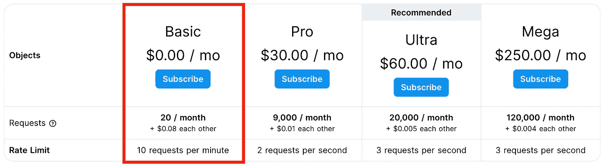
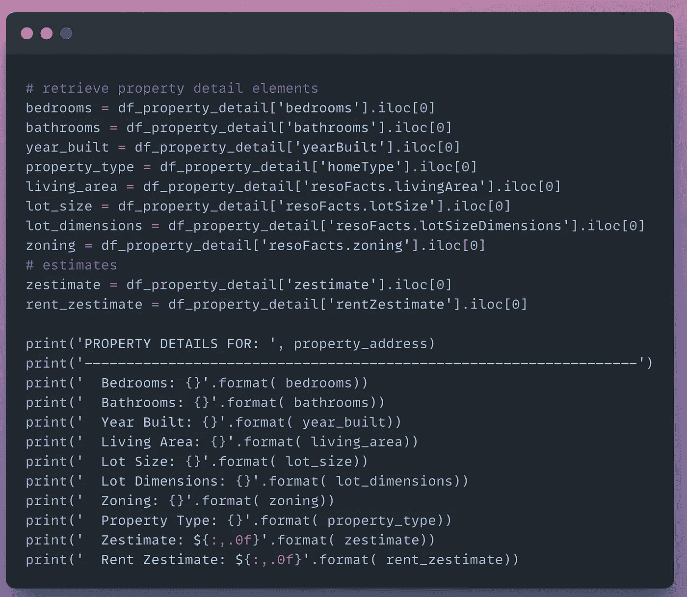
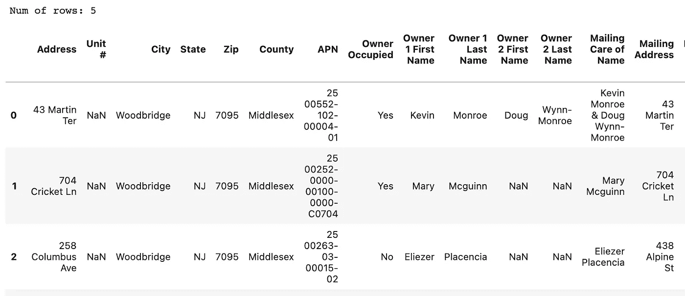

# 如何使用 Python 获取房产数据来分析你的市场

> 原文：<https://levelup.gitconnected.com/how-to-get-property-data-to-analyze-your-market-using-python-e9ef5336d141>

## Python 教程获取场内和场外交易的房地产数据

布莱克·惠勒在 [Unsplash](https://unsplash.com/photos/zBHU08hdzhY) 上拍摄的照片

***房产数据分析起来很牛逼。***

但我们如何在不做房产中介的情况下获取房产数据呢？

***我们需要使用 web 抓取从公共房地产网站检索家庭数据。***

我们能做得更好吗？网页抓取很繁琐！

是啊！我们可以使用已经面向公众的房地产网站的 API。我们可以查询和消费结构化数据。

我们能得到什么类型的数据？

在本文中，我们将获得一系列房产的 200 多个数据点，包括卧室数量、平方英尺、地段大小、Zestimate 等。

***本帖将使用 Python 获取待售(场内)和非待售(场外)房产的数据。***

[活动创建者](https://unsplash.com/@campaign_creators)在 [Unsplash](https://unsplash.com/photos/774sCXD0dDU) 上的照片

## 问题陈述

我们有一份房产地址的清单。我们需要为每个地址获取 ***属性细节*** 。

房产细节将包括房屋特征、出售历史、税收数据和房产估价。

这将使我们能够分析我们的房地产市场的财产。

我们可以在列表中添加房产信息吗？

是的，我们可以。

## 数据源

我们将使用 APIMaker 的[Zillow.com API 来获取属性细节。](http://Zillow.com API)

这个 API 已经为我们做了网页抓取。它通过几个端点提供属性信息。

*声明:我不是 API 的创建者，我只是一个消费者。*

## 结构

我们将遵循一个四步框架来收集物业信息。

作者在谷歌幻灯片中创建的图片

1.  上传包含酒店地址列表的文件
2.  找到相关的 Zillow 唯一 id (ZPID)
3.  搜索 ZPID 并从 API 获取属性细节
4.  将属性详细信息追加到原始文件中

## 先决条件

1.  [注册免费快速 API 账户](https://docs.rapidapi.com/docs/consumer-quick-start-guide)获取 API 密钥
2.  订阅[Zillow.com API](https://rapidapi.com/apimaker/api/zillow-com1/)以请求属性数据

[Zillow.com API](https://rapidapi.com/apimaker/api/zillow-com1/)提供了订阅 **20 个免费 API 信用/ mo** 的选项(一个 API 信用=一个 API 调用)。

作者图片(截图来自[快速 API 定价](https://rapidapi.com/apimaker/api/zillow-com1/pricing))

## 支持视频

跟随我的 Python 教程视频。

作者在 YouTube[上制作的视频](https://youtu.be/o8Dfa3hUHtc)

## Python 教程

如果您没有现有的 Python 环境，那么我强烈建议首先用**克隆笔记本**(在文章的底部)。

这将允许您在 Google Colab 中运行 Python 代码(免费！).它是一个基于云的环境，让您无需在本地安装 Python 就可以运行代码。

# 一.安装包

第一步是安装必要的软件包。

安装包的代码片段(作者使用 snappify.io 创建的图片)

# 二。导入库

接下来，导入所需的库。

导入的代码片段(作者使用 snappify.io 创建的图片)

# 三。局部变量和常量

注册一个免费的 [RapidAPI 账户](https://docs.rapidapi.com/docs/consumer-quick-start-guide)并订阅[Zillow.com API](https://rapidapi.com/apimaker/api/zillow-com1/)。

创建一个变量来保存我们的 API 键。

API 键的代码片段(作者使用 snappify.io 创建的图片)

# 四。数据

## 单一属性搜索

让我们从检索单个地址 的 ***属性数据开始。***

为了从 API 请求数据，我们需要提供地址的 *zpid* 。我们将通过复制谷歌搜索得到这个 ID。

步骤:

1.  获取 ZPID*(URL 中存储的每个属性的唯一标识符)*
2.  获取属性详细数据

图片作者(截图来自[Zillow.com](https://www.zillow.com/homedetails/11622-Pure-Pebble-Dr-Riverview-FL-33569/66718658_zpid/?))

让我们生成我们的属性搜索短语，以便输入到 google 搜索功能中。

我们在搜索字符串中添加“zillow home details ”,以便在我们的 URL 列表顶部获得 zillow 链接。

代码片段(作者使用 snappify.io 创建的图片)

代码输出(作者创建的截图)

在 google 搜索功能中输入查询字符串，并将 *stop* 值设置为“3 ”,以返回前三个搜索结果。

代码片段(作者使用 snappify.io 创建的图片)

选择搜索中最相关的第一个 URL。

这将返回我们属性的唯一 URL。ZPID 位于 URL 字符串的末尾。

代码输出(作者创建的截图)

让我们用一行代码分几步提取 ZPID:

1.  用“/”分割我们的 URL
2.  搜索字符串中带有“zpid”的对象
3.  用“_”分割对象以获得 ZPID

代码片段(作者使用 snappify.io 创建的图片)

这是我们传递给 API 的唯一 ID。

代码输出(作者创建的截图)

我们现在向 API 发出一个请求，获取我们的属性地址的数据。

代码片段(作者使用 snappify.io 创建的图片)

我们将我们的响应转换成 JSON 格式。

这会输出一组很长的数据。

代码输出(作者创建的截图)

***让我们把这个数据集转换成 pandas dataframe(行和列)。***

这将允许我们以表格的形式查看数据，以便以后下载。

代码片段(作者使用 snappify.io 创建的图片)

对于我们的单个财产地址，我们有 259 列数据！哇！

代码输出(作者创建的截图)

***让我们从数据集中选择几列进行查看。***

代码片段(作者使用 snappify.io 创建的图片)

我们有房屋特征的信息以及财产评估。

代码输出(作者创建的截图)

查看我在 ***上的帖子如何根据房产估价计算现金流*** 。

 [## 如何计算现金流并在 Python 中可视化

### 计算房地产现金流的 Python 教程

medium.com](https://medium.com/@analyticsariel/how-to-calculate-cash-flow-and-visualize-it-in-python-9305c4cb190f) 

## 属性列表

我们测试了我们的框架，以获取单个属性的数据。

***现在，是时候上传我们自己的属性列表并获取每一行的数据了。***

步骤:

1.  上传 CSV 文件—查看 [PropStream](https://trial.propstreampro.com/analyticsariel/) 了解场内和场外交易
2.  获取 ZPID *(存储在 URL 中的每个属性的唯一标识符)*
3.  获取属性详细数据

迈克尔·图辛斯基在 [Unsplash](https://unsplash.com/photos/2osRMlJLdbU) 上的照片

对于这个例子，我上传了欠税业主的财产地址文件。我从 [PropStream](https://trial.propstreampro.com/analyticsariel/) 下载了这些数据。

代码片段(作者使用 snappify.io 创建的图片)

在文件中，我们有一个属性列表。与房产地址相关的有四列— *地址、城市、州、*和*邮政编码*。

***让我们将属性地址列传递到我们的代码中！***

代码输出(作者创建的截图)

## 功能

我们需要重新创建与获取单个属性的数据相同的步骤。

***让我们设置一些函数来重复检索惟一 ID 和从 API 请求数据的过程。***

功能#1 —使用谷歌搜索获得 ZPID

代码片段(作者使用 snappify.io 创建的图片)

功能#2 —从 API 获取属性细节

代码片段(作者使用 snappify.io 创建的图片)

这里我们为循环 设置了一个 ***来执行电子表格中每一行的操作。***

步骤:

1.  将与地址相关的列映射到变量(*街道、城市、州、邮政编码*)
2.  调用函数#1 来获取 ZPID
3.  暂停脚本，以免淹没谷歌搜索请求
4.  调用函数#2 从 API 获取属性细节
5.  将 JSON 对象转换为数据帧，并将其附加到列表中

代码片段(作者使用 snappify.io 创建的图片)

在我们的 *df_list* 对象中有一个包含 5 个数据帧的列表。每个数据帧代表我们从属性细节 API 收到的响应。

***让我们将这些数据帧连接起来，创建一个单独的表。***

代码片段(作者使用 snappify.io 创建的图片)

这看起来棒极了！我们在一个表中有所有的属性详细信息，如 *Zestimate* 。

但是，我们如何将这个新表与原始数据集合并呢？

代码输出(作者创建的截图)

***让我们在唯一列 ZPID 上合并我们的原始和新数据框架。***

代码片段(作者使用 snappify.io 创建的图片)

这给了我们一个 300 多列的数据框架。

肯定不用户友好！

代码输出(作者创建的截图)

***让我们通过选择属性细节列*** 的子集来减少合并中的列数。

想象一下，对于我们的用例，我们只需要资产评估来计算像*现金流*这样的指标。

我们选择 3 列: *ZPID、Zestimate、*和 *rentZestimate* 。

代码片段(作者使用 snappify.io 创建的图片)

现在，我们已经将数据集缩减到 44 列。

我们可以看到我们的新列附加在数据帧的末尾— *Zestimate* 和 *rentZestimate* 。

代码输出(作者创建的截图)

# 动词 （verb 的缩写）设想

通过创建一个 [Plotly 盒图](https://plotly.com/python/box-plots/)，我们可以查看 [Zestimate](https://www.zillow.com/z/zestimate/) 值的分布。

代码片段(作者使用 snappify.io 创建的图片)

我们的数据集中的财产估计范围从 200K 到 560K。

这可以帮助我们锁定某些属性。

代码输出(作者创建的截图)

# 不及物动词自动化

查看我的 ***no code*** 解决方案，上传您的定制文件并获取酒店详情。

视频输出(作者在 [AnalyticsAriel YouTube](http://www.youtube.com/channel/UCKkUCaKNlfYBJAm-OGBRyYw) 频道上的视频)

# 结论

利用 API 是检索属性数据的好方法。

将房产数据集与人口普查的经济数据结合使用，可以洞察房地产市场的表现和未来趋势。

查看我的 [YouTube 频道——AnalyticsAriel](https://youtube.com/c/analyticsariel)以获得更多关于房地产数据源和数据分析的见解！

# 克隆笔记本

 [## projects/How _ to _ Get _ Zillow _ Property _ Data _ in python . ipynb at master analytic sariel/projects

### https://analyticsariel.com/.通过在 GitHub 上创建帐户，为 analyticsariel/projects 开发做出贡献。

bit.ly](https://bit.ly/3PBnBFp) 

# 来源

 [## RapidAPI 消费者快速入门指南

### 假设你还没有一个免费的 RapidAPI 帐户，你可以注册一个。需要一个帐户来…

docs.rapidapi.com](https://docs.rapidapi.com/docs/consumer-quick-start-guide)  [## 箱子

### 箱线图是变量在其四分位数上分布的统计表示。盒子的两端…

plotly.com](https://plotly.com/python/box-plots/)