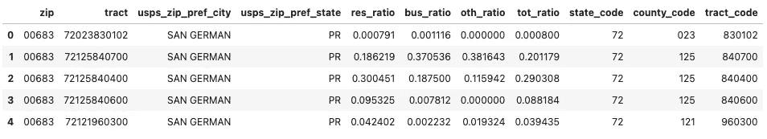
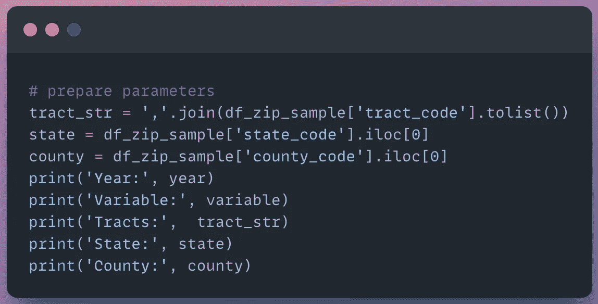
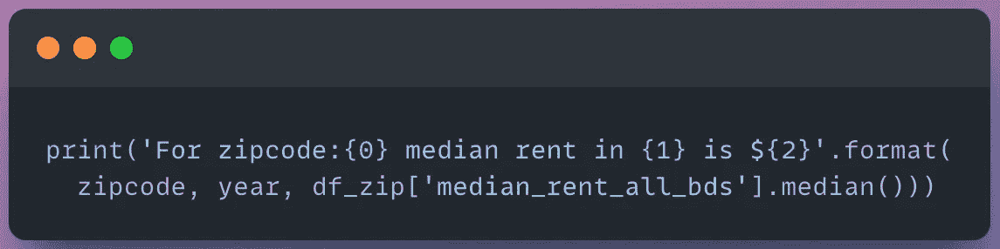

# 如何使用 Python 从 Census API 获取租金数据

> 原文：<https://levelup.gitconnected.com/how-to-get-rental-data-from-the-census-api-using-python-3058c914cb55>

## 从美国人口普查中获取邮政编码级别的经济数据的分步教程

约翰-马克·史密斯在 T2 的照片

***美国人口普查局提供美国各地区毛租金中值的历史数据。该数据可通过美国人口普查 API 免费获得。但是我们如何访问它呢？***

首先，我们来了解一下为什么要关心房租率？

***租金收入是房东盈利和维持稳定现金流的主要收入来源。***

> *“如果你的房租对你所在的区域和房产来说太低，你可能无法吸引到你理想的房客。如果你的租金太高，你可能很难找到租客——并且冒着失去月收入的风险。你作为房东的工作就是找到* [*公平市场租金*](https://www.mysmartmove.com/SmartMove/blog/how-determine-fair-market-rent.page) *甜蜜点:不要太高，但也不要太低。”——*[*MySmartMove*](https://www.mysmartmove.com/SmartMove/blog/how-much-charge-for-rent.page)

美国人口普查局提供了一个 API，以编程方式查询他们的数据库，获取基于卧室数量的租金。

然而，到目前为止，对于 Python 开发人员来说，文档是有限且令人困惑的！

***本帖将使用 Python 获得不同地理区域的总市场租金数据。***

乔治·贝克尔在[像素](https://www.pexels.com/photo/photography-of-orange-and-gray-building-129494/)上拍摄的照片

# 问题陈述

我们需要获得美国不同地理区域的 ***中值总租金*** 。数据必须来自可靠的政府来源。

租金数据将包括追溯到 2015 年的国家和邮政编码级别的 ***信息。***

这将有助于我们发现租金不断上涨的新兴市场。

# 数据源

我们将使用[美国社区调查 5 年数据](https://www.census.gov/data/developers/data-sets/acs-5year.html)来获得租金数据。

> 美国社区调查(ACS)是一项持续的调查，每年提供数据，为社区提供规划投资和服务所需的最新信息。ACS 涵盖了关于美国人口的社会、经济、人口和住房特征的广泛主题。—美国人口普查局

# 先决条件

[美国人口普查可用 API 截图](https://www.census.gov/data/developers/data-sets.html)

## 需要

1.  [请求普查 API 密钥](https://api.census.gov/data/key_signup.html)

## 可选(住房+经济数据)

1.  [注册免费的 RapidAPI 帐户](https://docs.rapidapi.com/docs/consumer-quick-start-guide)以获得 API 密钥([注册 Rapid API 的步骤](https://docs.rapidapi.com/docs/consumer-quick-start-guide))
2.  订阅[美国房市数据 API](http://www.bit.ly/3AHH7sY)

# 支持视频

*即将在*[*AnalyticsAriel YouTube 频道*](https://www.youtube.com/c/AnalyticsAriel/) 播出

# Python 教程

如果您没有现有的 Python 环境，那么我强烈建议首先用**克隆笔记本**(在文章的底部)。

这将允许您在 Google Colab 中运行 Python 代码(免费！).它是一个基于云的环境，让您无需在本地安装 Python 就可以运行代码。

# I .导入库

首先，导入所需的库。

导入的代码片段(作者使用 snappify.io 创建的图片)

# 二。局部变量和常量

报名参加[人口普查 API 密匙](https://api.census.gov/data/key_signup.html)。

【可选】注册一个免费的 [RapidAPI 账户](https://docs.rapidapi.com/docs/consumer-quick-start-guide)，订阅[美国房市数据](http://www.bit.ly/3AHH7sY)。

创建变量来保存我们的 API 键。

API 键的代码片段(作者使用 snappify.io 创建的图片)

# 三。数据

[美国人口普查 2020 ACS 详细表格变量](https://api.census.gov/data/2020/acs/acs5/variables.html)有一个您可以从人口普查 API 查询的所有属性的列表。

列表中的一个变量是**卧室毛租金中位数**。

[美国人口普查中值总租金 JSON 对象](https://api.census.gov/data/2020/acs/acs5/variables/B25031_001E.json)作者截图

为了查询 API，我们需要指定变量名。变量名在“名称”列下— B25031_001E。

在这里，我们指定变量名(B25031_001E)和我们想要查询的美国人口普查的年份(2020)。

代码片段(作者使用 snappify.io 创建的图片)

## 国家区域

现在，我们可以从国家层面开始按地区查询**总租金中位数**数据。

在 [2020 ACS 示例](https://api.census.gov/data/2020/acs/acs5/examples.html)中，我们可以查看不同地理区域的变量查询示例。

为了获得国家一级的数据，我们指定以下参数:

1.  **年** — 2020 年
2.  **变量** — B25031_001E(租金中位数)
3.  **地区** —美国:*(整个美国)
4.  **键** —普查 API 键

然后，我们将获取参数的 URL 作为请求传递给 API。

代码片段(作者使用 snappify.io 创建的图片)

我们的[响应的状态代码是 200](https://developer.mozilla.org/en-US/docs/Web/HTTP/Status/200) 。这意味着我们的请求成功了！

代码输出(作者创建的截图)

让我们来看看回复的内容。

代码片段(作者使用 snappify.io 创建的图片)

这将返回包含列名和数据的字符串。

这很难读。我们可以做得更好！

代码输出(作者创建的截图)

让我们将我们的响应转换成一个 [JSON 对象](https://www.w3schools.com/js/js_json_objects.asp)。

代码片段(作者使用 snappify.io 创建的图片)

我们的数据现在已经*组织好了*，我们可以查询其中的对象。

代码输出(作者创建的截图)

然而，我认为处理数据的最简单的方法是记住电子表格！

这就是为什么我们将 JSON 响应对象转换成一个[熊猫数据帧](https://www.w3schools.com/python/pandas/pandas_dataframes.asp#:~:text=What%20is%20a%20DataFrame%3F,table%20with%20rows%20and%20columns.)。

代码片段(作者使用 snappify.io 创建的图片)

我们现在有了一个包含行和列的表格对象。

我们的列代表三个字段:(1)地理区域，(2)所有卧室的总租金中值，以及(3)区域号。

代码输出(作者创建的截图)

让我们将租金中位数变量重新命名为一个我们容易识别的名称。

代码片段(作者使用 snappify.io 创建的图片)

太好了，现在我们有全国租金中位数了！

代码输出(作者创建的截图)

接下来，让我们获得更精细的数据。

## 邮政编码区域

为了获得邮政编码级别的数据，我们需要指定 ***人口普查区域*** *。*

> 人口普查区域是多边形，覆盖定义明确的地理区域。

***注:人口普查区域与邮政编码不是 1:1 的映射关系。***

这意味着一个人口普查区域可以在多个邮政编码之间重叠。同样，一个邮政编码可以有多个人口普查区域。

由[坦帕湾联邦信用合作社](https://www.tampabayfederal.com/Map_of_Field_of_Membership_182999.html)拍摄的人口普查区域图片

一个完美的解决方案是将人口普查区域按百分比与每个邮政编码相关联。然而，对于这个分析，为了简单起见，我们将坚持 1:1 的映射。

理论上，租金不会在几个街区内大幅变动。因此，人口普查区域和邮政编码稍有重叠就足够了。 ***我们将使用 HUD 数据集将区域映射到邮政编码*** 。

查看 UCF 对人口普查区域和邮政编码的详细评估分析。

 [## UCF 研究指南:统计，人口统计和人口普查:邮政编码>人口普查区

### 邮政编码列表区(ZCTAs)”是美国邮政服务(USPS)邮政编码服务的通用区域表示…

guides.ucf.edu](https://guides.ucf.edu/statistics/zip) 

## 平视显示器跟踪数据

为了获取邮政编码信息，我们使用 Pandas 从 Github 读取 HUD 数据集。

代码片段(作者使用 snappify.io 创建的图片)

HUD 数据集包含 8 列，包括邮政编码|区域|城市|州。

代码输出(作者创建的截图)

我们的邮政编码似乎有错误。我们的第一行显示邮政编码为 3 个字符——“683”。对于美国邮政编码，我们知道它们应该是 5 个字符——“00684”。

出现这个错误是因为 Pandas 自动为我们的数据解释类型*和*。在这个实例中，Pandas 将 ZIP 关联为一个整数。因为没有“00684”这样的数字，所以零会被自动删除。

让我们应用逻辑在我们的数据帧上执行 ***数据清理*** 。

首先，我们定义一个新的函数***zip _ code _ to _ str***来清理我们的 ZIP 列。

代码片段(作者使用 snappify.io 创建的图片)

接下来，我们修改 ZIP 和 TRACT 列。

这里我们可以看到我们的 TRACT 列是 10 个字符。这是不正确的 TRACT _ CODES 是 6 个字符。

我们的数据帧中的区域是州代码|县代码|区域代码的连接。

让我们将这个字段分成 3 个子字段，以获得正确的 TRACT_CODE。

代码片段(作者使用 snappify.io 创建的图片)

现在，在我们的输出中，我们已经清理了 ZIP 和 TRACT 字段。我们在末尾还有 3 个新列，包括 TRACT_CODE。

代码输出(作者创建的截图)

让我们查看一下针对单个邮政编码的清理后的数据集。我在这里输入佛罗里达州坦帕市海德公园的邮政编码。

代码片段(作者使用 snappify.io 创建的图片)

我们的输出由一个邮政编码的 7 个不同区域组成。

代码输出(作者创建的截图)

## 获取人口普查数据

我们现在将 ***获取我们的单个样本邮政编码 33606 内的每个人口普查区域*** 的总租金中值数据。

代码片段(作者使用 snappify.io 创建的图片)

我们将获得最新的美国人口普查 5 年 ACS 报告——2020 年的数据。

代码输出(作者创建的截图)

为了获得区域级别的数据，我们指定以下参数:

1.  **年份** — 2020 年
2.  **变量** — B25031_001E(租金中位数)
3.  **Tract Str** — 005500…004900(我们单一邮政编码的所有区域)
4.  **州** — 12(佛罗里达州)
5.  **县** — 057(希尔斯伯勒县)
6.  **键** —普查 API 键

代码片段(作者使用 snappify.io 创建的图片)

接下来，我们将我们的响应转换成数据帧。

代码片段(作者使用 snappify.io 创建的图片)

现在我们有了***median _ rent _ all _ BDS***per tract。

代码输出(作者创建的截图)

让我们计算所有区域的中值，得到 2020 年*的***median _ rent _ all _ BDS***。*

代码片段(作者使用 snappify.io 创建的图片)

2020 年的租金中位数为 1467 美元。

代码输出(作者创建的截图)

通过查看一段时间内的租金中值，可以增强这一信息。

# 四。历史数据(循环)

***创建年份列表，以查询美国人口普查 API 中的毛租金中值*** 。

我们需要的数据可以追溯到 2015 年 ACS 调查。

代码片段(作者使用 snappify.io 创建的图片)

## 人口普查数据 API

这里我们将为数据帧建立一个空列表。该列表将填写每年在邮政编码级别 ***的总租金中位数*** 。

我们每年向 API 发出 6 个单独的请求。每个响应被转换成数据帧并存储在对象 ***df_list*** 中。

代码片段(作者使用 snappify.io 创建的图片)

让我们结合数据框架列表，查看所有年份的租金中值。

代码片段(作者使用 snappify.io 创建的图片)

我们的输出包含 41 行。

代码输出(作者创建的截图)

让我们按年分组，以查看按年的毛租金中值。

代码片段(作者使用 snappify.io 创建的图片)

海德公园的租金逐年稳步上升。

代码输出(作者创建的截图)

如果我们想获得更多的经济数据呢？住房数据怎么样？

通过查询美国住房市场数据 API(可选)，我们可以 ***发出一个请求来检索多个住房数据字段*** 。

# 美国住房市场数据 API

我们向[美国住房市场数据](http://www.bit.ly/3AHH7sY)请求一个邮政编码— 33606。

代码片段(作者使用 snappify.io 创建的图片)

我们的数据集由 72 行经济和住房数据属性组成！哇，信息量真大！

***这包括按卧室划分的租金中位数的普查数据、普查的家庭收入中位数，以及 Redfin 提供的其他经济统计数据(即库存、销售额中位数、新上市房源等)。).***

代码输出(作者创建的截图)

# 动词 （verb 的缩写）形象化

在这里，我们使用 [Plotly Express 折线图](https://plotly.com/python/line-charts/)来可视化美国人口普查 API 和美国住房市场数据 API 中值总租金。

代码片段(作者使用 snappify.io 创建的图片)

我们的输出是一个交互式的折线图。这让我们可以直观地看到该地区总租金中值的增长或下降。

我们也可以在我们的网站上嵌入这个图形。

代码输出(作者创建的截图)

让我们根据美国住房市场数据 API 来绘制总租金中值。

***在我们对美国住房市场数据 API 的单一请求中，我们收到了按卧室类型和年份划分的租金中值。这简化了我们获取历史数据的过程。***

现在，我们可以选择我们关心的租金相关列。

代码片段(作者使用 snappify.io 创建的图片)

通过融合我们的数据框架，我们可以很容易地按卧室类型绘制租金数据。

代码输出(作者创建的截图)

在我们的 Plotly Express Line 函数中，我们将“num_bds”传递到 **color** 参数中，以根据卧室数量分割我们的数据。

代码片段(作者使用 snappify.io 创建的图片)

这里我们可以看到三居室的租金中位数是所有居室类型中最高的。这在直觉上是有意义的，因为更多的卧室通常意味着更大的空间(平方英尺)和更高的租金。

代码输出(作者创建的截图)

# 结论

查看我的 [YouTube 频道——AnalyticsAriel](https://youtube.com/c/analyticsariel)以获得更多关于房地产数据源和数据分析的见解！

# 克隆笔记本

 [## projects/us _ census _ rental _ zip code . ipynb at master analytics Ariel/projects

### https://analyticsariel.com/.通过在 GitHub 上创建帐户，为 analyticsariel/projects 开发做出贡献。

github.com](https://github.com/analyticsariel/projects/blob/master/rental_estimates/us_census_rental_zipcode.ipynb) 

# 来源

 [## 美国住房市场数据 API 文档(arielherrera) | RapidAPI

### 从 Redfin、Census 和美联储经济数据(FRED)中即时获取美国住房市场数据。

rapidapi.com](https://rapidapi.com/arielherrera/api/us-housing-market-data/) 

# 分级编码

感谢您成为我们社区的一员！在你离开之前:

*   👏为故事鼓掌，跟着作者走👉
*   📰查看[级编码出版物](https://levelup.gitconnected.com/?utm_source=pub&utm_medium=post)中的更多内容
*   🔔关注我们:[推特](https://twitter.com/gitconnected) | [LinkedIn](https://www.linkedin.com/company/gitconnected) | [时事通讯](https://newsletter.levelup.dev)

🚀👉 [**加入升级人才集体，找到一份惊艳的工作**](https://jobs.levelup.dev/talent/welcome?referral=true)