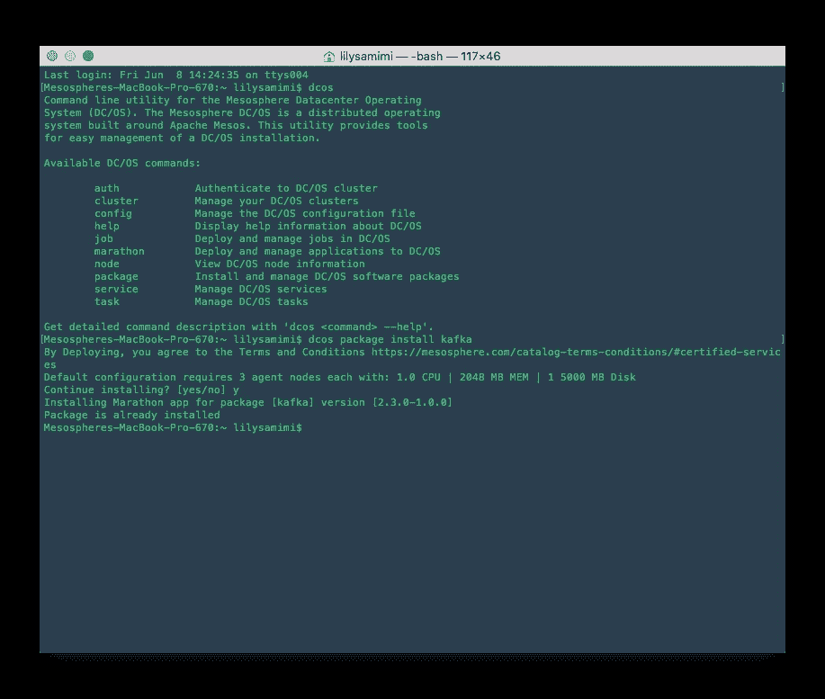

# 如何开始构建命令行界面(CLI)应用程序

> 原文：<https://levelup.gitconnected.com/how-to-get-started-building-command-line-interface-cli-applications-974e4b53c3df>

## 了解如何构建简单的命令行界面(CLI)应用程序



图片来自[莉莉·萨米米](https://medium.com/u/23e738267d33?source=post_page-----974e4b53c3df--------------------------------)

命令行界面可以追溯到图形用户界面出现之前。作为当今的软件开发人员，我们倾向于至少使用命令行界面。尤其是在使用提供易用 CLI 的现代技术时，我们大部分时间都倾向于使用 CLI。

作为软件开发人员，使用命令行界面是完全不可避免的。我们从安装包、下载框架文件等等开始使用它们

一些最常用的命令行界面(CLI)工具包括 ***Git，NPM***

## **命令行界面的重要性**

*   自动化重复性任务。那些不时会占用你部分时间的任务可以通过使用 CLIs 自动完成。
*   与图形用户界面相比，使用速度更快——CLI(命令行界面)执行速度更快，尤其是在您知道命令的情况下。
*   需要更少的内存——与图形用户界面相比，CLIs 需要更少的内存。
*   提供惊人的开发者体验——与其他界面相反，CLI 提供惊人的开发者体验。

另一方面，CLI 可能被视为令人兴奋和难以处理，特别是对于那些不熟悉该界面的人来说，但在使用和与它们交互时，它们更容易和有效地工作。

## **入门**

我们将看到如何用 NodeJS 和 JavaScript 构建一个简单的命令行界面(CLI)。

使用以下命令初始化一个新的 JavaScript npm 项目。

```
npm init
```

输入您的首选设置，并确认完成初始化。

在应用程序目录的根目录下，创建一个名为 bin 的文件夹。在 bin 文件夹中，创建一个文件夹，并将其命名为 index.js。

## **安装参数解析器**

处理来自用户的参数可能会令人望而生畏，尤其是当涉及大量参数时，在这个场景中，我们将使用一个称为 args 的参数解析器。

Arg 通过其独特的参数解析器技术使构建 CLI 应用程序变得轻而易举。

## **安装参数**

```
npm i args
```

## **构建我们的应用**

我们将看到如何获取用户输入的参数，并简单地将其记录回用户。有了这些信息，我们将能够配置我们的应用程序来做各种事情。

打开您的 ***package.json*** 文件，添加如下所示属性的 bin 对象。同样，将您的 main 文件更改为我们在 bin 文件中创建的目标文件。

现在，每当我们在命令行上运行 scaffold 时，我们的应用程序都会运行 index.js 文件的内容。我们添加这个是为了分离关注点并提高可读性。

## **我们简单的应用逻辑**

在我们的应用程序目录的根目录下，创建一个名为 ***src*** 的文件夹，并在其中创建一个名为 ***utils.js*** 的文件。

我们将在这个文件中编写与我们的应用程序相关的逻辑。

在 bin 目录下的 index.js 文件中，有如下所示的代码。我们将把我们的应用程序逻辑导入到 ***index.js*** 文件中。

测试我们的简单应用程序

为了测试这个应用程序，我们需要在我们的系统中全局安装它，这样我们就可以在我们系统的任何地方运行它，不管您在哪个目录下。

在项目目录中，打开开发人员终端并运行命令。

```
npm i -g
```

该命令将在系统上全局安装 CLI。要测试应用程序，请运行命令

```
scaffold new
```

这将在开发人员控制台上打印我们的参数。

这是用 Nodejs 和 JavaScript 构建命令行应用程序的简单介绍。要了解更多关于构建 CLI 的信息，请访问这个网站。

## **出发前**

感谢您的参与，我希望您对如何构建命令行界面有了背景了解。

## **更多阅读内容**

[](/how-to-build-restful-api-with-nodejs-and-express-475bfb6bedff) [## 如何用 NodeJS 和 Express 构建 RESTFul API

### 了解如何使用 Node 和 Express 构建 REST API

levelup.gitconnected.com](/how-to-build-restful-api-with-nodejs-and-express-475bfb6bedff) [](/how-to-add-dark-mode-to-your-nuxtjs-project-d8f016c2211f) [## 如何在你的 NuxtJS 项目中加入黑暗模式

### 如何用@nuxtjs/color-mode 和 tailwindCSS 给一个 Nuxt.js 网站添加黑暗模式

levelup.gitconnected.com](/how-to-add-dark-mode-to-your-nuxtjs-project-d8f016c2211f)