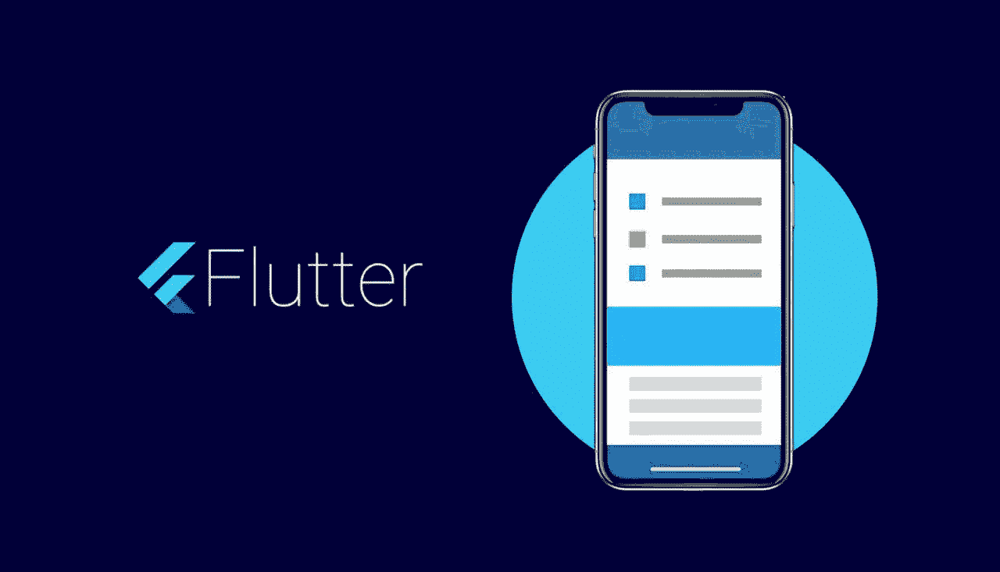

# 如何在 40 天内开始使用 Flutter:完全初学者指南

> 原文：<https://levelup.gitconnected.com/how-to-get-started-with-flutter-in-40-days-the-complete-beginners-guide-f6d69f7bb058>

## 如何成为一名 Flutter 开发者的每日指南。这篇文章详细介绍了能让你有效学习 Flutter 的技巧和项目。

据 [Statista](https://www.statista.com/statistics/793840/worldwide-developer-survey-most-used-frameworks/) 称，Flutter 被列为 2021 年十大领先框架，它是[最突出的跨平台框架](https://www.statista.com/statistics/869224/worldwide-software-developer-working-hours/#:~:text=Cross%2Dplatform%20mobile%20framworks%20used%20by%20developers%20worldwide%202019&text=According%20to%20the%20survey%2C%2042,mobile%20developers%20use%20native%20tools.)，其性能将在 2022 年变得更好。如今[我们的大部分](https://developers.googleblog.com/2021/03/announcing-flutter-2.html)移动产品都采用了 Flutter 技术。这就是为什么我们想出了一个 **40 天的颤振之旅**来帮助那些之前没有或很少有颤振经验的开发人员立即投入到项目中。

# 为什么要学 Flutter？

1.它是开源的，由 Google 支持。

2.通过利用 Flutter，开发人员可以从单一代码库中受益，这允许他们一次创建代码，并使其在 iOS 和 Android 上都能运行。它减少了生产的时间和费用。

3.Flutter 使用 Dart 编程语言，这种语言提供了许多优点，并且易于掌握和理解。

4.热重新加载功能是 Flutter 的主要卖点之一，它允许所有开发人员和设计人员查看更新。

5.由于 Dart 转换本机代码，Flutter 应用程序的行为类似于本机应用程序。

# 研究颤振的先决条件

要开始学习颤振，你需要熟悉基础知识。除非您不熟悉以下一些主题，否则建议您在继续您的颤振旅行之前学习它们:

*   如果你想创建真正精致和全面的应用程序，你需要知道如何设计原生 Android 应用程序。
*   先了解一下**省道编码**也是个不错的办法，简单。Dart 是 Google 开发的一种整体编程语言。例如， [Hackr.io](https://hackr.io/tutorials/learn-dart) 提供了一组类，可以帮助您高效、轻松地开始使用 Dart。
*   熟悉面向对象的编程概念也同样重要。由于 OOPS 概念在 C++和 Javascript 等语言中使用，所以很好地理解它们是至关重要的。看看这个很棒的[视频](https://www.youtube.com/watch?v=xoL6WvCARJY)，它用简单的术语解释了哎呀。
*   如果你懂 Javascript 或 C++，这是一个优势，尽管这不是必须的。

现在，让我们开始派对吧:

**第一天-第二天:**

开始熟悉 Dart。DartHub 是开始学习 Dart 的最佳场所——Dart 语言之旅。

设置和配置一个 IDE，创建一个项目，开始浏览和使用它。

**第 3 天-第 4 天:**

查看下面的两个代码实验室(一个由两部分组成的实验室): [编写你的第一个 Flutter 应用，第 1 部分](https://codelabs.developers.google.com/codelabs/first-flutter-app-pt1/index.html)
[编写你的第一个 Flutter 应用，第 2 部分](https://codelabs.developers.google.com/codelabs/first-flutter-app-pt2/index.html)

窥视 Flutter 中的 widgets 内部，尝试在你的项目中使用它们—[widgets 简介](https://flutter.dev/docs/development/ui/widgets-intro)。

**第 5 天-第 6 天:**

再来一次 CodeLab — [用 Flutter](https://codelabs.developers.google.com/codelabs/flutter/index.html) 构建漂亮的 ui。

**第七天:**

在 [Udacity](https://classroom.udacity.com/courses/ud905/lessons/92a39eec-0c04-4d98-b47f-c884b9cd5a3b/concepts/cee6fbbe-7225-47e7-aefc-fb5a6b695439) 上听听颤振创造者的第一堂课。

**第 8 天-第 9 天:**

查看这个小部件目录，尝试使用其中的一些— [Flutter 小部件索引](https://flutter.dev/docs/reference/widgets)。

别忘了观看“Widget Weekly”视频。

**第 10 天-第 11 天:**

请在 [Udacity](https://classroom.udacity.com/courses/ud905/lessons/34b4084a-8d2c-4096-a5fc-2bcf0721a7d4/concepts/cee6fbbe-7225-47e7-aefc-fb5a6b695439) 上查看颤振创作者的第二次讲座。

**第 12 - 16 天:**

[无聊的颤振发展秀——YouTube](https://www.youtube.com/playlist?list=PLOU2XLYxmsIK0r_D-zWcmJ1plIcDNnRkK)。

特别注意主题。

**第 17 天-第 18 天:**

深入测试颤振— [测试颤振应用](https://flutter.dev/docs/testing)。试着用测试覆盖你的代码的一些部分。

**第 19 天-第 20 天:**

尝试编写自己的插件— [编写定制的平台特定代码](https://flutter.dev/docs/development/platform-integration/platform-channels)。

只要你对插件在 Flutter 中的工作方式有了一个大致的了解，就去看看这个—[Flutter—Widget—State—Context—inherited Widget](https://www.didierboelens.com/2018/06/widget---state---context---inheritedwidget/)。

**第 21 - 23 天:**

建筑日，看看这些:

[使用 Flutter 构建反应式移动应用(Google I/O’18)](https://www.youtube.com/watch?v=RS36gBEp8OI)

[布里亚尼根/颤振 _ 建筑 _ 样本](https://github.com/brianegan/flutter_architecture_samples)

尝试开发你自己的小样本。注意作用域模型，Redux，BLoC。

**第 24 - 40 天**:

开始着手你的第一个 Flutter pet 项目，保持测试覆盖率至少在 30%的水平上，并且尽可能的 TDD。

我希望你现在已经准备好投入到的战斗中了。谢谢你花时间阅读这篇文章。这个过程已经为我们的团队工作了一段时间，但我们总是努力改进，使学习曲线更快。如果你花了超过 40 天的时间来完成这个颤振之旅，不要担心。这真的要看你有什么背景和整体经验。

欢迎对此次旅行提出意见和建议，我们将愉快地调整。如果您对跨平台解决方案感兴趣，请[联系 inVerita](https://inveritasoft.com/contact) ，我们将为您的项目提供一些有价值的建议！

该出版物于 2022 年 2 月 21 日更新。