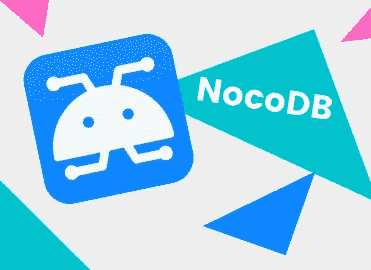
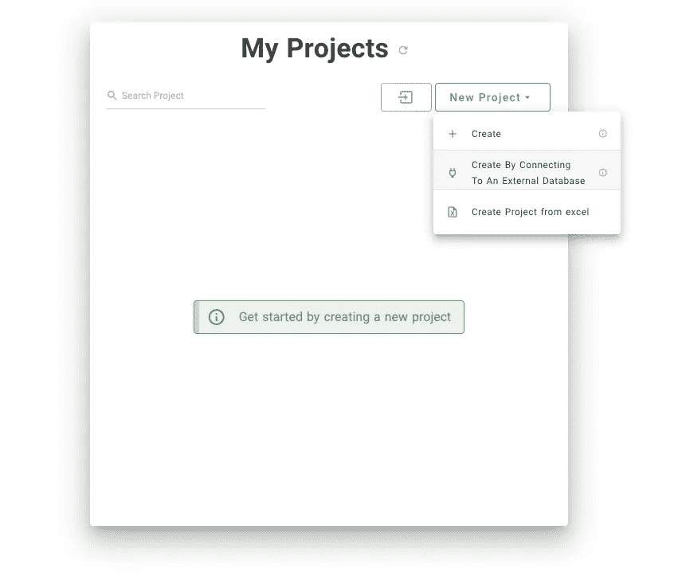
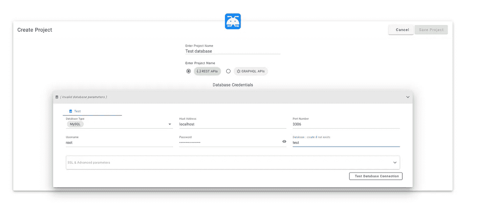
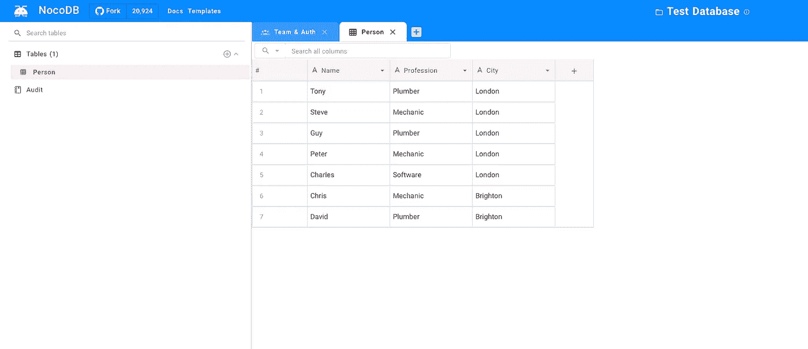
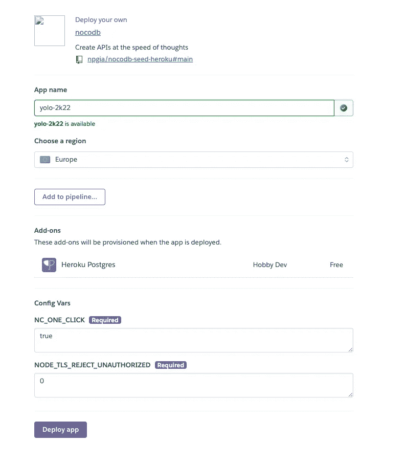

# 如何开始使用 NocoDB

> 原文：<https://levelup.gitconnected.com/how-to-get-started-with-nocodb-44da1d303874>

## 将您的数据库变成智能电子表格

# 什么是 NocoDB？

NocoDB 使您能够在线(和本地)与您的关系数据库进行交互——本质上就像一个电子表格。设置和部署后，您可以轻松地授予其他人访问权限并控制他们的权限。

# 为什么我想用它？

我的一个客户经常会问我类似的问题，比如“你能告诉我谁现在注册了我们的网站吗？”。实际上，我的客户想要查看我的“用户”表。过了一会儿，我开始觉得有点被利用了😿所以我想找到一个解决方案，让我的客户可以自己查看他们需要的数据。

# 如何在本地运行 NocoDB

注意:如果你已经在云中托管了你选择的数据库，并希望与其他人共享，我个人会跳过这一步(并跳到“如何在 Heroku 上部署 NocoDB”一节)。

本地运行 NocoDB 有多种方式——使用 docker、npx 或通过 git 克隆。我似乎在前两种方法上取得了有限的成功(可能只有我…)，所以我推荐通过 git 克隆。一旦克隆并运行，导航到[http://localhost:8080/dashboard](http://localhost:8080/dashboard)注册并查看您的仪表板。

# 连接到外部数据库

NocoDB 中的“我的项目”页面

要开始将您的数据库连接到 NocoDB，请在仪表板页面上单击“新建项目”,然后单击“通过连接到外部数据库创建”。然后会提示您填写凭据以连接到数据库。如果连接到本地数据库，请确保您的 SQL server 正在运行，并将“localhost”指定为主机地址。如果连接到远程数据库，使用其公共 IP 地址作为主机地址。您还可以在此页面上指定一个项目名称，否则系统会自动为您生成一个项目名称。

保存后，您将能够在左侧导航栏中查看您的表格，并通过单击表格与您的数据进行交互。

# 如何在 Heroku 上部署 NocoDB

使用 Heroku 部署 NocoDB 的实例非常简单。只需自定义你认为合适的变量，然后点击“部署”。

Heroku 应用程序创建页面

然后通过访问 https://APP-NAME.herokuapp.com/dashboard[导航至您的应用](https://APP-NAME.herokuapp.com/dashboard)

部署后，如果您希望与其他人共享您的数据库，请导航到“团队和授权”选项卡添加电子邮件和角色。

*最初发布于*[*https://www . madeleinesmith . uk*](https://www.madeleinesmith.uk/blog/get-started-nocodb/)*。*