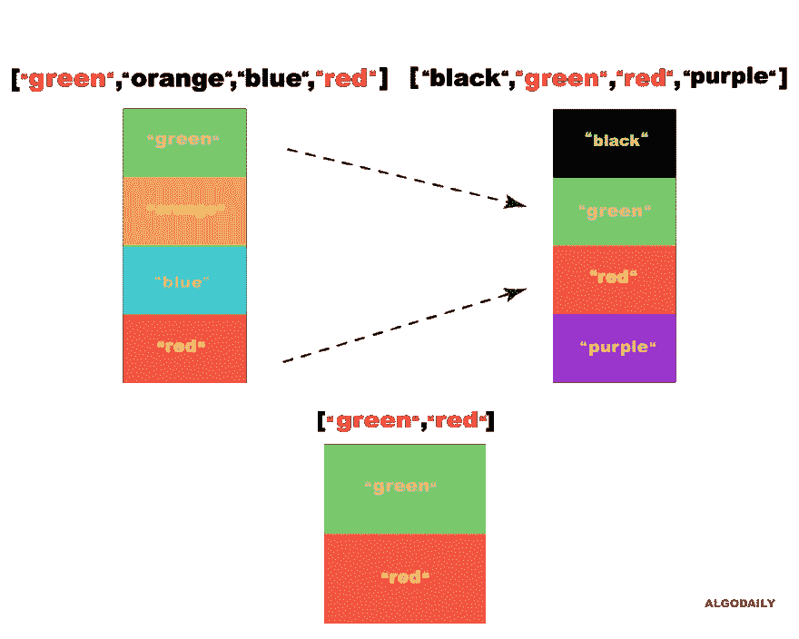
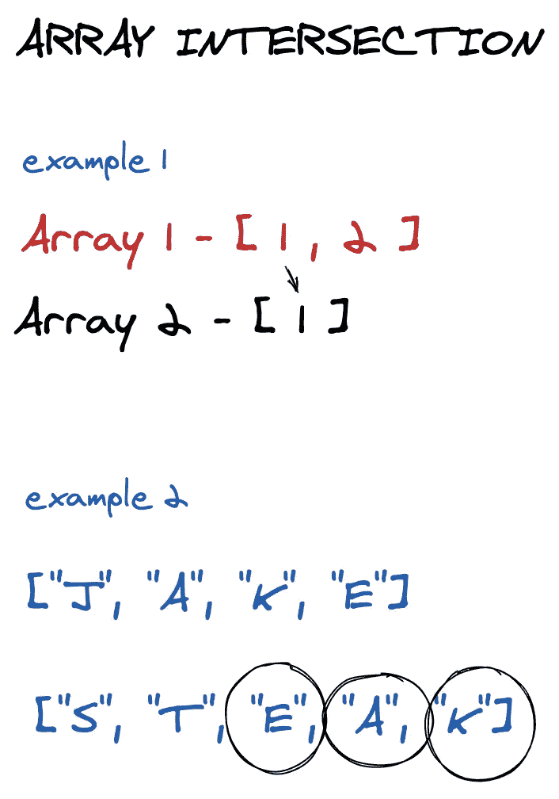

# 如何获得两个数组的交集

> 原文：<https://levelup.gitconnected.com/how-to-get-the-intersection-of-two-arrays-fed7e5138eea>

通常，面试官会在看似简单的事情上测试你。我们在[反转一串](https://algodaily.com/challenges/reverse-a-string)中看到了这一点，并将在未来的挑战中看到更多。但是有时你可能会在一个概念上被测试，虽然这个概念有点琐碎，但是在日常的软件工程中非常有用。

其中之一就是`array manipulation`，或者说基本上是按照`array`做事情，从而产生某种转变。

# 提示

你能写一个函数让**把两个数组作为输入**并返回给我们它们的交集吗？让我们以数组的形式返回交集。



注意，最终结果中的所有元素都应该是唯一的。这里有一个例子:

```
const nums1 = [1, 2, 2, 1];
const nums2 = [2, 2];intersection(nums1, nums2);
// [2]
```

这是另一个:

```
const nums1 = [4,9,5];
const nums2 = [9,4,9,8,4];intersection(nums1, nums2);
// [9, 4]
```

*这一课最初发表在 https://algodaily.com**的* [*上，我在那里开设了一门技术面试课程，并为雄心勃勃的开发人员撰写思考文章。*](https://algodaily.com/challenges/array-intersection)

# 蛮力

我们将慢慢开始，通过使用尽可能最小的样本输入来检查问题的构成。我们知道我们需要一个`result`数组来返回，所以记住这一点:

```
const results = [];
```

假设我们需要找到两个数组的交集:`[1]`和`[1]`。在这种情况下，我们知道输出也是`[1]`——这相当简单，因为我们只需要直接比较`1`和`1`。我们通过第一个`[1]`，看到`1`，并在第二个数组中定位它。因为它们是相同的，所以我们只返回一个匹配的`result`。

所以我们需要超越这一点。假设两个输入被修改为`[1]`和`[2]`。当我们比较这两个元素时，我们知道它们是不一样的。因此，我们不需要对`result`做任何事情。

当这种情况持续到一个数组元素之外时，我们可以继续检查第一个数组中的每个元素是否都存在于第二个数组中。



```
let intersection = firstArray.filter((el) => {
  return secondArray.includes(el);
};
```

交集的概念是来自集合论，所以这个问题如果只是用`Set` s 的话真的很简单！在数学中，两个集合 A 和 B 的交集是包含 A 中也属于 B 的所有元素的集合。

是大多数语言中的一种对象类型，允许你存储大多数原语的唯一值。

如果我们将输入数组转换成集合，我们可以利用`filter`方法，并将其应用于其中一个集合——过滤掉不在另一个集合中的任何东西。

```
function intersection(nums1, nums2) {
  const set = new Set(nums1);
  const fileredSet = new Set(nums2.filter((n) => set.has(n)));
  return [ ...fileredSet ];
}
```

这将有一个`O(n)`的时间复杂度。

另一种方法是不使用`Set`并保留数组来模拟输入。使用这种方法，我们还需要一个哈希`Object`来确保唯一性。这是因为对象键必须是唯一的。

我们可以通过执行`indexOf`检查来收集唯一的交集，然后以数组形式返回:

```
function intersection(nums1, nums2) {
  let intersection = {}; for (const num of nums1) if (nums2.indexOf(num) !== -1) intersection[num] = 1; return Object.keys(intersection).map((val) => parseInt(val));
}
```

尽管有两种方法，但如果你在面试中遇到类似的问题，使用`Set`可能会有所帮助。这是因为它展示了常用的`data structure`知识和数学背景。

查看 AlgoDaily.com 的[技术挑战的更多可视化教程，并尝试](https://algodaily.com/curriculum)[我们的每日编码问题简讯](https://algodaily.com/challenges/daily)！