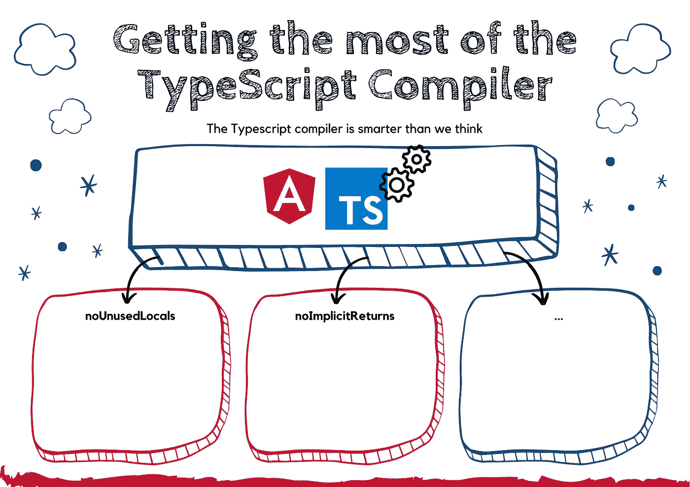

# 如何充分利用 TypeScript 编译器— Angular

> 原文：<https://levelup.gitconnected.com/how-to-get-the-most-from-the-typescript-compiler-angular-aae7fb53e0cf>

## 让 TypeScript 编译器为您服务

当谈到 Angular 应用程序中的 TypeScript 编译器时，有一个入口文件可以完成这项工作，如果您了解如何充分利用它，它甚至可以做得更多。

你可能已经猜到我在说什么了，没错就是`***tsconfig.json***`文件。该文件配置并包含使用 TypeScript 编译器编译应用程序所需的所有选项。

在这篇文章中，我将向您展示一些强大的选项，这些选项并不太出名，但有助于防止一些错误并保护您的神经，相信我。准备好充分利用 TypeScript 编译器了吗？我们走吧

# noUnusedLocals 选项

让我告诉你发现这个选项背后的故事。作为前端领导，我们经常会遇到一些奇怪的事情。有些事情是拉主代码，并发现有一些文件与未使用的进口或未使用的进口模块。﴾͡๏̯͡๏﴿为什么这么做？

想象一下，把你的车放进去，你的椅子，你的餐桌，你的表演，另一个你不需要的东西，但你仍然让你的车超载，这让你的车燃烧更多的燃料，从而花更多的钱。对于应用程序来说也是一样的！

有一天，我真的很生气，不能再继续这个问题了。当我搜索并发现这个奇妙的选项时，我就爱上了它。

我知道这主要是由于代码重构，或者代码没有得到很好的审查，因为开发人员尝试了不同的解决方案，但忘记了清理他添加的全部混乱，他不再使用。

相信我，这个选项是解决这个问题的最佳方案。应用程序中不再有未使用的函数、未使用的变量和未使用的导入。

下面是我们如何在 tsconfig.json 文件中激活该选项:

如果不遵守这些规则，代码就不会被编译，也就不会被推送到您的分支。

# noUnusedParameters 选项

顾名思义，这个选项的目的和之前的选项一样，删除未使用的东西，但是这次是针对带参数的函数。

那么，我为什么选择这个选项呢？要求更少的参数会让使用这个函数的人的生活更轻松，不是吗？另外，当你看到使用一个函数需要传递的参数列表时，你会想这是干什么用的，对吗？因为在专业领域，你不是自己开发应用程序，而是由一个团队开发。所以，你不知道整件事，也不知道为什么要这样编码。如果您开始分析为什么我们将这些参数传递给函数，并且发现这些参数不再需要，但是我们忘记删除它们，这将是浪费时间。太可惜了！

我经历过这个，谁都不想浪费时间。这个错误是人为的，所以为了防止这种情况，最好的解决方案是通过将这个选项添加到我们的 TypeScript 编译器来为我们完成这项工作，从而迫使开发人员在合并到主分支之前修复这个错误。少一些争论，少一些思考，多一些时间做其他的事情，保护最重要的神经！

和以前一样，我们可以这样使用这个选项:

# noImplicitReturns 选项

这一次，它是关于返回类型的函数。有时，我们有不同的返回值——基于某些条件，我们使用`***if***`语句或`***switch***`或其他语句，当没有应用任何条件时，我们会忘记默认情况。这实际上是一个可以用 TypeScript 编译器避免的错误。通过激活`***noImplicitReturns***`选项，您可以确保默认情况被考虑在内。

# 无插入选项

TypeScript 是一种类型化的语言，这意味着通常情况下你不必最终使用`***any***` ***。*** 由于某种原因，有时我们会忘记添加一个数组或者一个发出的事件的类型。我曾经这样做过，简单，容易，快速。但是，这里有一个问题，`**any**`吃掉你的应用性能。

编译器将`**any**`视为“请开始对这个东西进行类型检查”。键入是检查代码中错误的最便宜、最快速的方法。使用`**any**`很难看出哪里出了问题，而且在性能方面会让你付出很大代价。

我知道在某些情况下，很难放入除了`**any**` 之外的东西，比如当你在一个规范测试文件中模仿一个对象以避免创建整个对象时。所以，这取决于，你可以选择激活或停用这个选项。

无论如何，如果你决定激活它，这里是如何:

# strictNullChecks 选项

这个选项真的很有趣。下面是这个选项非常强大的情况:想象一下，您有一个以数字作为参数类型的函数。你每次都需要检查函数是否真的收到了什么，而不是一个未定义的，对吗？如果我们关注更重要和复杂的功能，而不是检查它是否为空，会怎么样？

激活此选项将确保您返回并传递正确的类型。这里有一个代码示例来阐明我的想法:

通过激活这个选项，你会看到编译器不会接受最后一行，因为我们说我们返回 Promise 或 article 是没有意义的，我们最终会在没有找到 article 的情况下返回一个 undefined。

正确的编码方式如下，我们需要添加未定义的返回类型，因为有可能找不到带有传递 id 的文章:

如果不激活这个选项，这个问题将不会从一开始就得到解决，并且可能会在将来导致一个 bug。也有一些情况下，我们需要返回一些有效的而不是未定义的东西，例如当激活一个路由时。在这些情况下，您需要确保返回一个值，这个选项将确保它完成，因此防止不一致的代码从它的创建。

以下是激活该选项的方法:

# 最后的想法

*   这些选项在你的编译器中是可用的，它们很有趣，并且防止将来的错误，从而防止浪费时间，防止在你发现由另一个开发者开发的代码时分析出了什么问题。
*   在我看来不使用它们真的很浪费。
*   它帮助新手学习最佳实践并编写一致的应用程序。
*   它真的，真的能保护你的神经，相信我。
*   最后，它有助于您有更多的时间关注重要的事情，如架构、概念、最佳实现方式等…

亲爱的读者朋友们，感谢你们的支持和宝贵时间。我希望这对你有用和有帮助。

**关注我上** [**中**](https://medium.com/@famzil/) **、**[**Linkedin**](https://www.linkedin.com/in/fatima-amzil-9031ba95/)**、**[**Twitter**](https://twitter.com/FatimaAMZIL9)**了解更多文章。**

不久后见(ﾉ◕ヮ◕)ﾉ*:･ﾟ✧)

**FAM**