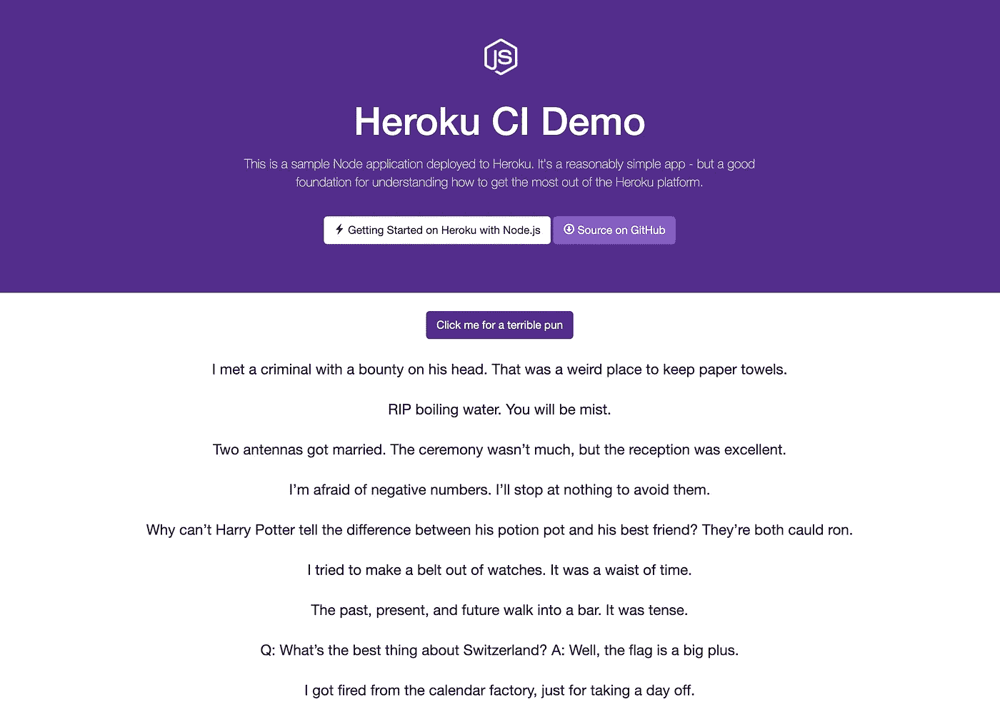

# 如何充分利用 Heroku CI

> 原文：<https://levelup.gitconnected.com/how-to-get-the-most-out-of-heroku-ci-66c12220517b>

## 并行测试运行，用 Cypress 进行浏览器测试，等等

迈克·本纳在 [Unsplash](https://unsplash.com?utm_source=medium&utm_medium=referral) 上的照片

持续集成和持续交付(CI/CD)是当今软件工程开发过程中的最佳实践。

**持续集成** (CI)允许开发人员在他们的项目中创建的每个拉请求上自动运行测试套件和其他工作。在将代码更改合并到主分支之前，这些作业必须通过。这建立了对代码主版本的信心，并确保一个开发人员不会破坏同一个代码库的其他开发人员的工作。

**持续部署** (CD)有助于在新代码被合并到主分支时，立即将变更部署到生产中。每季度、每月或每周只发布一次代码的日子已经一去不复返了。通过尽早和经常地发布代码，开发人员可以以更快的速度向他们的客户交付价值。这种策略还可以更容易地识别生产中的问题，并查明是哪个提交引入了这些问题。

有许多很棒的工具可以用来创建 CI/CD 管道。 [Travis CI](https://travis-ci.com/) 是一款流行的开源工具， [GitLab](https://docs.gitlab.com/ee/ci/) 甚至自带 CI/CD 特性。 [Heroku](https://www.heroku.com) 提供了一项名为 [Heroku CI](https://devcenter.heroku.com/articles/heroku-ci) 的服务，对于已经通过 Heroku 托管和部署代码的开发者来说，这是一个可行的选择。

在本文中，我们将介绍使用 Heroku CI 的基本设置，然后探索一些高级特性，如并行测试运行和自动化浏览器测试。

# 演示应用程序

对于本文，我创建了一个双关语生成器应用程序。各地的爸爸们，团结起来！这款应用程序非常简单:只需点击一个按钮，它就会在屏幕上输出一个爸爸的笑话。为了保持代码简单，我用普通的 HTML 和普通的 JS 创建了它。前端由 Node.js 和 Express 服务器提供服务。

双关语生成器应用程序

你可以在 GitHub 上找到所有的[代码。](https://github.com/thawkin3/heroku-ci-demo)

# 测试设置

为了帮助引导我的应用程序，我从 Heroku 的[入门指南](https://devcenter.heroku.com/articles/getting-started-with-nodejs)中克隆了示例 Node.js 应用程序。然后，我编写了一些 HTML 并添加了一些 JavaScript 来处理按钮点击和双关语的生成。我选择了 [Jest](https://jestjs.io/) 作为我的单元测试框架，我使用 Kent Dodds 的 [DOM 测试库](https://testing-library.com/docs/dom-testing-library/intro)编写了测试。我添加了一个 NPM 脚本，这样我就可以通过在终端输入命令`npm test`来运行我的测试。在本地运行我的测试会生成如下所示的输出:

测试输出

# 基本配置项设置

现在我有了一个可以在本地运行的测试套件，我想如果每次我有新代码要合并到我的主分支中时，我都可以运行它，那该多好。CI/CD 管道可以帮我实现自动化！Heroku CI 文档[更详细地解释了设置，因此我建议遵循那里的说明，但以下是我遵循的基本步骤:](https://devcenter.heroku.com/articles/heroku-ci#setup)

1.  把我的代码推到了 GitHub 的一个仓库里
2.  为这个回购创建了一个 Heroku 应用程序
3.  创建了一个 Heroku 管道
4.  将管道连接到我的 GitHub repo
5.  在管道设置中启用 Heroku CI(为了做到这一点，您必须提供一张信用卡，因为 Heroku CI 使用起来需要一些费用。)

相当容易！接下来，我在 repo 中创建了一个新分支，添加了一些新代码，将其推送到那个分支，然后打开一个 pull 请求，将新分支合并到主分支中。

这就是奇迹发生的地方。此时，我可以在 GitHub 的 pull 请求中看到一个显示需要通过的“检查”的部分。这些“检查”是在 CI 管道中运行的作业。在下面的截图中，您应该会注意到`continuous-integration/heroku`的工作。

GitHub pull 请求正在等待 Heroku CI 管道通过

当我跳到 Heroku pipeline 仪表板时，我可以在运行测试时查看作业的进度:

Heroku CI 作业正在进行中

作业完成后，我可以在 GitHub 中看到一个绿色的勾号，如下图所示:

Heroku CI 管道通过后的 GitHub 拉请求

现在，我可以放心地将我的分支合并到主分支中。正如我的 Heroku CI 渠道所证实的那样，所有测试都通过了。

# 要求检查通过 GitHub

顺便说一下，你应该注意到在我上面的 GitHub 截图中，需要通过`continuous-integration/heroku`检查。默认情况下，检查是*而不是*需要通过。因此，如果您想强制执行通过检查，您可以在特定回购的设置中进行设置。

合并前要求通过状态检查

# 并行测试运行

现在我们已经介绍了 Heroku CI 入门的基本设置，让我们来考虑一个更高级的场景:如果您有一个大型测试套件需要一段时间才能运行，该怎么办？对于拥有大量代码并长时间编写测试的组织来说，测试套件通常需要 5-10 分钟才能运行。有些测试套件需要一个多小时才能运行！等待反馈和合并代码需要很多时间。

CI 管道应该很快，这样运行起来就不会有痛苦。如果你有一个大的测试套件，Heroku CI 提供了在多个 dynos 上并行运行测试的能力。通过并行运行您的测试，您可以显著减少运行整个套件所需的时间。

要设置并行测试运行，您需要做的就是在您的`app.json`文件中指定您想要运行的 dynos 的`quantity`。我选择只用两个 dynos，但是你可以想用多少就用多少！您还可以指定您使用的 dynos 的`size`。默认情况下，您的测试在单个“performance-m”dyno 上运行，但是如果您试图控制成本，您可以增加或减少 dyno 的大小。在我的例子中，我选择了 Heroku CI 支持的最小的 dyno，即“标准-1x”尺寸。

现在，当我添加新代码并创建新的拉请求时，我可以看到我的 Heroku CI 作业在两个 dynos 上运行。对于我的只有三个单元测试的小测试套件来说，这绝对是大材小用。然而，这种设置对于一个更大的耗时的测试套件来说非常有用。需要注意的是[只有一些测试运行程序支持并行化](https://devcenter.heroku.com/articles/heroku-ci-parallel-test-runs#test-runners)，所以要确保你为你的应用选择的测试运行程序包含这种能力。

Heroku CI 作业期间使用了两个 dynos

# 使用 Cypress 进行自动化浏览器测试

除了运行单元测试，你可能还想在你的应用上运行集成测试和端到端测试。 [Selenium](https://www.selenium.dev/) 和 [Cypress](https://www.cypress.io/) 是流行的端到端测试框架，两者都是行业标准。对于前端开发人员来说，Cypress 的好处在于您可以用 JavaScript 编写测试，因此您不需要像学习 Selenium 那样学习 Java。

让我们看看如何配置 Cypress 在 pun generator 应用程序上运行一些端到端测试，然后将这些测试包含在我们的 Heroku CI 管道中。

首先，我通过运行`npm install --save-dev cypress cross-env start-server-and-test`安装了一些必要的依赖项。

第二，我在我的`package.json`文件中添加了更多的 NPM 脚本，使它看起来像这样:

第三，我编写了一个小的 Cypress 测试套件来测试我的应用程序中的按钮是否正常工作:

我现在可以在本地运行`npm run cypress:test`来验证我的 Cypress 设置是否工作正常，我的端到端测试是否通过。

最后，我修改了我的`app.json`文件，以包含一个新的测试脚本和适当的构建包，供 Heroku CI 使用。需要注意的是，对于 JavaScript 应用程序，Heroku CI 使用了`npm test`命令。如果您没有在`app.json`文件中指定测试脚本，那么 Heroku CI 将会使用您在`package.json`文件中指定的测试脚本。然而，我希望 Heroku CI 使用一个自定义脚本来运行 Jest 和 Cypress 作为测试的一部分，所以我在`app.json`中编写了一个覆盖测试脚本。

不幸的是，我在最后一步遇到了阻碍。经过几个小时的阅读、研究和故障排除，我发现 Heroku CI 目前与 Cypress 不兼容。关于浏览器测试的 Heroku 文档建议使用`--headless`选项，而不是不推荐的默认`Xvfb`选项。然而，当在 Heroku CI 管道内部运行 Cypress 时，它仍然试图使用`Xvfb`。使用以前版本的 Cypress 和更老的(已废弃的)Heroku 栈，如“cedar-14 ”,并没有产生更好的结果。

看来 Heroku 或 Cypress(或两者)有一些问题要解决！希望使用 Selenium 运行端到端测试的用户比我尝试使用 Cypress 时做得更好。

# 其他 Heroku CI 特征

现在我们已经讨论了两个主要特性，并行运行测试和运行浏览器测试，让我们简单地看看 Heroku CI 的其他一些特性。

## 动态数据库

如果您的应用程序依赖于数据库，那么您可能需要在测试期间使用该数据库。Heroku CI 提供了 [In-Dyno 数据库](https://devcenter.heroku.com/articles/heroku-ci-in-dyno-databases)，这是在 CI 管道测试期间在您的测试 Dyno 内部创建的数据库。这些数据库是短暂的。这意味着它们只在测试运行期间存在，并且它们比普通的生产就绪数据库快得多，因为数据库查询不通过网络传递。这两个好处有助于您的测试套件更快地完成，从而加快您的反馈循环并降低您的成本。

## 环境变量

如果您需要指定任何非机密的[环境变量](https://devcenter.heroku.com/articles/heroku-ci#setting-environment-variables-the-env-key)，您可以将它们添加到您的`app.json`文件中，如下所示:

您通常会将私有秘密放在一个`.env`文件中，让 Git 忽略它，这样就不会被签入到您的源代码控制中。这样，你就不会将这些价值存储在回购协议中。Heroku CI 遵循同样的原则，允许您将私有环境变量直接存储在 Heroku CI Pipeline 仪表板中，而不是在`app.json`文件中公开它们。

## 调试 CI 流程

如果您在设置 Heroku CI 管道时遇到问题，您可以直接在终端中使用`heroku ci:debug`命令，根据项目的最后一次本地提交创建一个测试运行。这允许您检查 CI 环境，并让您更深入地了解可能的测试设置问题。如果您知道您的测试在 Heroku CI 环境之外通过，但是在 Heroku CI 管道中运行时失败，那么这个命令特别有用。在这种情况下，问题可能出在 CI 设置本身。

# 限制

虽然 Heroku CI 有很多优点，但它也有一些局限性。首先，与 Travis CI 等其他与平台无关的 CI/CD 工具不同，为了使用 Heroku CI，您必须在 Heroku dynos 上托管您的应用程序并使用 Heroku 管道。如果你已经是 Heroku 的用户，这当然不是问题，而且实际上是一个很大的好处，因为用 Heroku CI 进行测试是你能为通过 Heroku 部署的应用程序建模的最接近的生产环境。然而，这确实意味着其他平台的用户如果不将他们的其他基础设施迁移到 Heroku，就不能考虑转换到 Heroku CI。

第二，正如我在浏览器测试实验中提到的，Heroku CI 目前似乎与 Cypress 不兼容。

第三， [Heroku CI 不支持用 Docker](https://devcenter.heroku.com/articles/heroku-ci#docker-deploys) 测试容器化的构建。

对于其他限制，你可以参考 [Heroku 的已知问题列表](https://devcenter.heroku.com/articles/heroku-ci#known-issues)。

# 结论

到目前为止，您应该已经熟悉了 Heroku CI 的基础知识，并且了解了一些高级功能。如有进一步的问题，你可以随时[查阅文件](https://devcenter.heroku.com/articles/heroku-ci)。

一旦您选择了您的测试工具并确保了它们与 Heroku CI 的兼容性，开始运行应该是轻而易举的事情。使用 Heroku CI，您可以创建一个软件开发系统，实现高度的信心和极高的生产力。

现在，事不宜迟，下面是我们应用程序中更多的双关语:

来自演示应用程序的双关语