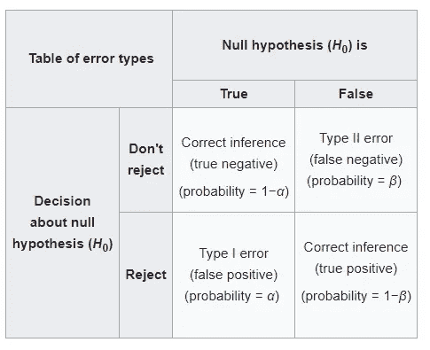

# 二项分布假设检验中检验功效的计算

> 原文：<https://levelup.gitconnected.com/how-to-get-the-power-of-test-in-hypothesis-testing-with-binomial-distribution-c70e7f1309c6>

## R 中二项分布的单边和双边假设检验中检验功效的计算实例


[维基百科](https://upload.wikimedia.org/wikipedia/commons/thumb/4/4f/ROC_curves.svg/2560px-ROC_curves.svg.png)

[](https://jorgepit-14189.medium.com/membership) [## 用我的推荐链接加入媒体-乔治皮皮斯

### 阅读乔治·皮皮斯(以及媒体上成千上万的其他作家)的每一个故事。您的会员费直接支持…

jorgepit-14189.medium.com](https://jorgepit-14189.medium.com/membership) 

在本教程中，我们将展示如何在应用二项分布假设检验时获得检验的功效。在提供示例之前，让我们回忆一下第一类和第二类错误。

**第一类错误**

这是拒绝零假设的概率，假设零假设为真。这是显著性水平α，在统计学中通常设定为 5%

**第二类错误**

这是接受零假设的概率，假设零假设是假的。在统计学中，第二类误差是 **β** ，通常在 20%左右。

**测试功率**

这是拒绝零假设的概率，假设零假设是假的。在统计学中，我们称之为γ的幂，它等于 1-β，通常取 80%左右的值。

下表总结了我们上面所说的内容:



# 检验的势

幂表示避免第二类错误的概率，可以写成:


功效分析可用于计算在假设检验中检测统计显著性所需的最小样本量。影响功率的因素有:

*   显著性水平α，称为 I 型误差。
*   假设检验中总体的观察值与理论值的差异。
*   样本量。

# 检验的功效:二项分布的单侧假设检验

**问题**:我们对 **24** 人进行了抽样调查，发现其中 **13** 人是吸烟者。我们能声称吸烟者在人口中的比例在 5%的显著性水平上至少是 35%吗？测试的力量是什么？

**解决方案**:

这个问题可以表述如下:


我们应该做的第一件事是找到临界值。对于每一个等于或大于临界值的值，我们都拒绝零假设。我们可以用不同的方法找到它。让我们通过使用`binom.test`函数的 for 循环找到临界值。

```
x<-13
n<-24
p_test<-0.35
alpha<-0.05critical<-NULL
for (i in c(0:n)) {if (binom.test(i, n, p=p_test, "greater")$p.value<alpha) {
    critical<-i
    break
  }

}
critical
```

**输出:**

```
[1] 13
```

**或者**，我们可以通过计算分位数函数来求解，分位数函数是 CDF 的逆函数，如下所示:

```
qbinom(0.95, 24, 0.35)
```

**输出:**

```
[1] 12
```

但是由于二项式分布的离散性，我们希望临界值大于反 CDF 的值。所以临界值是 **13** 。我们可以通过使用如下 PDF 对概率求和来确认它:

```
sum(dbinom(13:24, 24, 0.35))
```

**输出:**

```
[1] 0.04225307
```

注意`sum(dbinom(12:24, 24, 0.35))`是大于 0.05 的`0.09422976`。

## 计算检验的功效

既然我们已经找到了临界值 13，让我们试着计算一下检验γ的功效。所以我们想计算概率:


其中 **X** 遵循二项式分布， **c** 为临界值， **p=13/24** 为观察概率。我们可以很容易地计算 R 中的检验功效，如下所示:

```
1 - pbinom(critical-1, n, x/n)
```

**输出**:

```
[1] 0.5830354
```

**因此，测试的功效为 58.30%**

# 检验的功效:二项分布的双边假设检验

问题:我们抽取了 24 个人的样本，发现其中有 13 个人是吸烟者。我们能在 5%的显著性水平上声称吸烟者在人口中的比例是 35%吗？测试的力量是什么？

**解决方案**:

这个问题可以表述如下:


我们应该做的第一件事是找到临界值。由于测试是双边的，我们需要找到两个临界值。`critacal_minus`和`critical_plus`。同样，我们可以使用`binom.test`函数。我们将做两个单侧测试。一个“较大”和一个“较小”如下:

请注意，α为 0.05/2，因为我们正在进行双边测试。

```
# two sidedx<-13
n<-24
p_test<-0.35
alpha<-0.05critical_plus<-NULL
for (i in c(0:n)) {

  if (binom.test(i, n, p=p_test, "greater")$p.value<alpha/2) {
    critical_plus<-i
    break
  }

}
critical_pluscritical_minus<-NULL
for (i in c(n:0)) {

  if (binom.test(i, n, p=p_test, "less")$p.value<alpha/2) {
    critical_minus<-i
    break
  }

}
critical_minus
```

**和** `**critical_minus**` **和** `**critical_plus**` **分别得到值 3 和 14**。或者，我们可以使用如下的反向 PDF:

```
# critical minus
qbinom(0.025, 24, 0.35)-1
[1] 3# critical plus
qbinom(0.975, 24, 0.35)+1
[1] 14
```

您可以确认临界值是正确的，因为超过临界值的概率不超过 0.05:

```
sum(dbinom(0:critical_minus, n, p_test))+sum(dbinom(critical_plus:n, n, p_test))[1] 0.02968141
```

## 计算检验的功效

现在我们准备计算测试的功效。我们会计算这两个临界值，然后我们会把概率加起来。

**临界减**


使用 R，我们得到:

```
power_minus<-pbinom(critical_minus, n, x/n) 
power_minus 
[1] 2.773643e-05
```

**暴加**


使用 R，我们得到:

```
power_plus<-1-pbinom(critical_plus-1, n, x/n) 
power_plus [1] 
0.4213083
```

## 测试的功效

现在，通过将`power_minus`和`power_plus`相加，我们得到了二项分布双边检验的功效，即 **42.13%** :

```
power_minus+power_plus 
[1] 0.421336
```

*最初发表于*[*【https://predictivehacks.com】*](https://predictivehacks.com/how-to-get-the-power-of-test-in-hypothesis-testing-with-binomial-distribution/)*。*