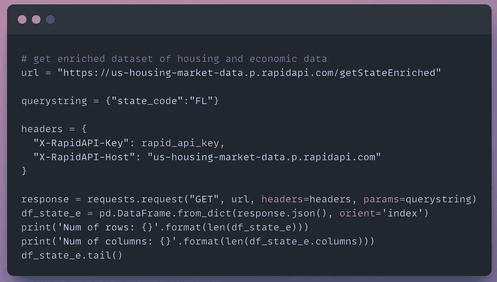
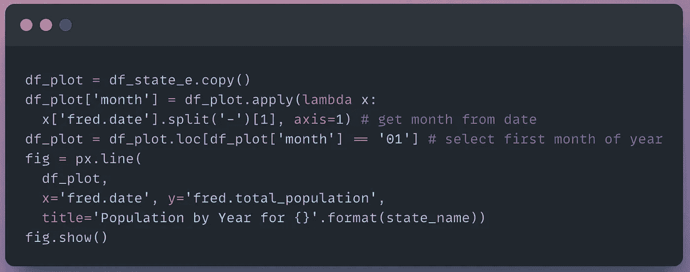

# 如何使用 Python 从 Census API 获取总人口

> 原文：<https://levelup.gitconnected.com/how-to-get-total-population-from-the-census-api-using-python-bbf23758bfa7>

## 从美国人口普查中获取不同地理区域的经济数据的分步教程

照片由[摩根莱恩](https://unsplash.com/@themorganlane)在 [Unsplash](https://unsplash.com/photos/BEF-7cpER3s) 拍摄

***美国人口普查局是获取美国人口信息和识别新兴市场趋势的绝佳数据源。***

为什么要关心人口趋势？

> 最成功的专业房地产投资者是那些能够关注某个地区，并准确预测某个城市的哪些部分可能会经历相对于该城市或其附近其他地区的最大增长的人。— [*街道目录*](https://www.streetdirectory.com/travel_guide/76763/real_estate/commercial_real_estate_the_importance_of_population_trends.html#:~:text=In%20turn%20companies%20looking%20to,it%20is%20time%20to%20sell.)

***高人口增长率是识别投资房地产升值的可行市场的领先指标之一。***

美国人口普查局提供了一个 API 来以编程方式查询数据库中的属性，如总人口。

然而，到目前为止，对于 Python 开发人员来说，文档是有限且令人困惑的！

***本帖将使用 Python 获取不同地理区域的总人口数据。***

美国宇航局在 [Unsplash](https://unsplash.com/photos/1lfI7wkGWZ4) 拍摄的照片

# 问题陈述

我们需要获得美国不同地理区域的 ***总估计人口数据*** 。数据必须来自可靠的政府来源。

总人口数据将包括国家、州、城市和县一级的信息。

这将使我们能够识别人口不断增长的新兴市场。

# 数据源

我们将使用[美国社区调查 5 年数据](https://www.census.gov/data/developers/data-sets/acs-5year.html)来获得总人口数据。

> 美国社区调查(ACS)是一项持续的调查，每年提供数据，为社区提供规划投资和服务所需的最新信息。ACS 涵盖了关于美国人口的社会、经济、人口和住房特征的广泛主题。— *美国人口普查局*

# 先决条件

[美国人口普查可用 API 截图](https://www.census.gov/data/developers/data-sets.html)

## 需要

1.  [请求普查 API 密钥](https://api.census.gov/data/key_signup.html)

## 可选(住房+经济数据)

1.  [注册免费的 Rapid API 账户](https://docs.rapidapi.com/docs/consumer-quick-start-guide)获取 API 密钥([步骤注册 RapidAPI](https://docs.rapidapi.com/docs/consumer-quick-start-guide)
2.  订阅[美国房市数据 API](http://www.bit.ly/3AHH7sY)

# 支持视频

*即将上线*[*AnalyticsAriel YouTube 频道*](https://www.youtube.com/c/AnalyticsAriel/)

# Python 教程

如果您没有现有的 Python 环境，那么我强烈建议首先**克隆笔记本**(在文章的底部)。

这将允许您在 Google Colab 中运行 Python 代码(免费！).它是一个基于云的环境，让您无需在本地安装 Python 就可以运行代码。

# I .导入库

首先，导入所需的库。

导入的代码片段(作者使用 snappify.io 创建的图片)

# 二。局部变量和常量

注册[普查 API 密匙](https://api.census.gov/data/key_signup.html)。

[可选]注册一个免费的 [RapidAPI 账户](https://docs.rapidapi.com/docs/consumer-quick-start-guide)，订阅[美国房地产市场数据](http://www.bit.ly/3AHH7sY)。

创建变量来保存我们的 API 键。

API 键的代码片段(作者使用 snappify.io 创建的图片)

# 三。数据

[美国人口普查 2020 ACS 详细表格变量](https://api.census.gov/data/2020/acs/acs5/variables.html)有一个您可以从人口普查 API 查询的所有属性的列表。

列表中的第一个变量是**总估计人口**。

[美国人口普查 2020 ACS 详细表格变量截图](https://api.census.gov/data/2020/acs/acs5/variables.html)

为了查询 API，我们需要指定变量名。变量名在“名称”列下— B01001_001E。

在这里，我们指定变量名(B01001_001E)和我们想要查询的美国人口普查的年份(2020)。

代码片段(作者使用 snappify.io 创建的图片)

## 国家区域

现在我们可以从国家层面开始按地区查询总人口数据。

在 [2020 ACS 示例](https://api.census.gov/data/2020/acs/acs5/examples.html)中，我们可以查看不同地理区域的查询变量示例。

为了获得国家一级的数据，我们指定以下参数:

1.  **年份** — 2020 年
2.  **变量** — B01001_001E(总人口)
3.  **地区** —美国:*(整个美国)
4.  **键** —普查 API 键

然后，我们将获取参数的 URL 作为请求传递给 API。

代码片段(作者使用 snappify.io 创建的图片)

我们的[响应的状态代码是 200](https://developer.mozilla.org/en-US/docs/Web/HTTP/Status/200) 。这意味着我们的请求成功了！

代码输出(作者创建的截图)

让我们来看看回复的内容。

代码片段(作者使用 snappify.io 创建的图片)

这将返回包含列名和数据的字符串。

这很难读。我们可以做得更好！

代码输出(作者创建的截图)

让我们将我们的响应转换成一个 [JSON 对象](https://www.w3schools.com/js/js_json_objects.asp)。

代码片段(作者使用 snappify.io 创建的图片)

我们的数据现在已经*组织好了*，我们可以查询其中的对象。

代码输出(作者创建的截图)

然而，我认为处理数据的最简单的方法是记住电子表格！

这就是为什么我们将 JSON 响应对象转换成一个 [Pandas 数据帧](https://www.w3schools.com/python/pandas/pandas_dataframes.asp#:~:text=What%20is%20a%20DataFrame%3F,table%20with%20rows%20and%20columns.)。

代码片段(作者使用 snappify.io 创建的图片)

我们现在有了一个包含行和列的表格对象。

我们的列表示三个字段:(1)地理区域，(2)总人口值，以及(3)区域号。

代码输出(作者创建的截图)

让我们将人口变量重命名为一个容易识别的名称。

代码片段(作者使用 snappify.io 创建的图片)

太好了，现在我们有了全国的总人口估计数！

代码输出(作者创建的截图)

接下来，让我们获得更精细的数据。

## 州区域

为了获得所有州的总估计人口数，我们将=state* 的**添加到我们的请求 URL 中。**

代码片段(作者使用 snappify.io 创建的图片)

一旦成功(状态代码= 200)，我们就可以将我们的响应转换成数据帧。

代码片段(作者使用 snappify.io 创建的图片)

我们的数据帧包含 52 行(每个州一行)。这代表了 [2020 年人口普查 ACS 调查](https://www.census.gov/data/developers/data-sets/acs-5year.html)中每个州的总估计人口。

代码输出(作者创建的截图)

## 大都市地区

当请求所有大都市的总估计人口时，我们的查询会扩展。

在变量 **url2** 中，我们将修改语句的**，以请求大城市和小城市的地理数据。**

代码片段(作者使用 snappify.io 创建的图片)

一旦成功(状态代码= 200)，我们就可以将我们的响应转换成数据帧。

代码片段(作者使用 snappify.io 创建的图片)

我们的数据帧包含 939 行(每个市区一行)。

代码输出(作者创建的截图)

## 县域

为了获得所有县的总估计人口数，我们将=county:* 的**添加到我们的请求 URL 中。**

代码片段(作者使用 snappify.io 创建的图片)

一旦成功(状态代码= 200)，我们就可以将我们的响应转换成数据帧。

代码片段(作者使用 snappify.io 创建的图片)

我们的输出返回大约 3.2K 行的总人口以及州代码和县代码。

代码输出(作者创建的截图)

我们的数据集仅限于 2020 年的 ACS 调查。可以得到往年的历史数据吗？是啊！

# 四。历史数据(循环)

创建年份列表，以查询美国人口普查 API 中的总人口。

我们需要的数据可以追溯到 2015 年 ACS 调查。

代码片段(作者使用 snappify.io 创建的图片)

## 人口普查数据 API

这里我们将为数据帧建立一个空列表。该列表将填写每年 州一级 ***总人口的答复。***

代码片段(作者使用 snappify.io 创建的图片)

一旦我们获得了列表中所有年份的数据，我们就可以将列表连接到 ***以返回一个数据帧*** 。

代码片段(作者使用 snappify.io 创建的图片)

我们的数据框架由 6 年间 52 个州的 312 行组成。

代码输出(作者创建的截图)

我们可以过滤单个州，按年份查看数据。

在这里，我将过滤我的家乡佛罗里达州！

代码片段(作者使用 snappify.io 创建的图片)

我们可以看到，佛罗里达州的总人口增长率逐年上升。

代码输出(作者创建的截图)

如果我们想获得更多的经济数据呢？住房数据怎么样？

通过查询美国住房市场数据 API(可选)，我们可以 ***发出一个请求来检索多个住房数据字段*** 。

## 美国住房市场数据 API

我们向[美国房地产市场数据](http://www.bit.ly/3AHH7sY)请求一个州——佛罗里达州(FL)。

代码片段(作者使用 snappify.io 创建的图片)

我们的数据集由 70 行经济和住房数据属性组成！哇，信息量真大！

也许是足够大的数据集来训练机器学习模型:)

代码输出(作者创建的截图)

# 动词 （verb 的缩写）形象化

这里我们使用 [Plotly Express 折线图](https://plotly.com/python/line-charts/)来可视化来自美国人口普查 API 和美国住房市场数据 API 的总人口。

来源[美国人口普查局估计总人口](https://api.census.gov/data/2020/acs/acs5/variables/B01001_001E.json)

代码片段(作者使用 snappify.io 创建的图片)

我们的输出是一个交互式的折线图。这使我们能够直观地看到该地区估计总人口的增长或下降。

我们也可以在我们的网站上嵌入这个图形。

代码输出(作者创建的截图)

让我们为我们从美国住房市场数据 API 创建的数据框架绘制相同的字段。

来源[弗雷德美国人口普查局常住人口(未经季节调整)](https://fred.stlouisfed.org/series/FLPOP)

代码片段(作者使用 snappify.io 创建的图片)

输出:

代码输出(作者创建的截图)

# 结论

利用美国人口普查 API 是从准确的数据源中检索经济统计数据的一种很好的方式。

想了解更多关于房地产数据分析的信息吗？注册获取我即将开始的课程信息！

查看我的 [YouTube 频道——analytics Ariel](https://youtube.com/c/analyticsariel),了解更多关于房地产数据源和数据分析的信息！

# 克隆笔记本

 [## projects/us _ census _ total _ population _ all _ regions . ipynb at master analytics Ariel/projects

### https://analyticsariel.com/.通过在 GitHub 上创建帐户，为 analyticsariel/projects 开发做出贡献。

github.com](https://github.com/analyticsariel/projects/blob/master/economic_data/us_census_total_population_all_regions.ipynb) 

# 来源

 [## 美国住房市场数据 API 文档(arielherrera) | RapidAPI

### 从 Redfin、Census 和美联储经济数据(FRED)中即时获取美国住房市场数据。

rapidapi.com](https://rapidapi.com/arielherrera/api/us-housing-market-data/)