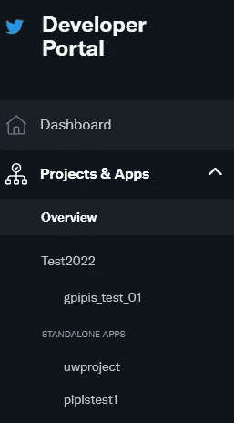
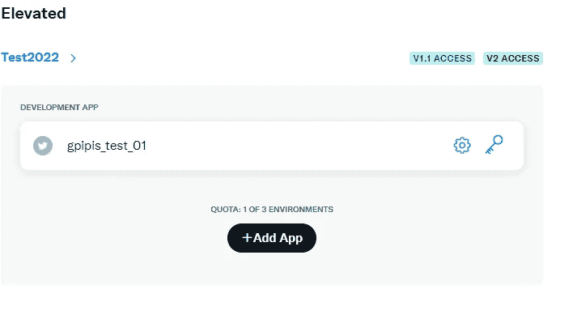
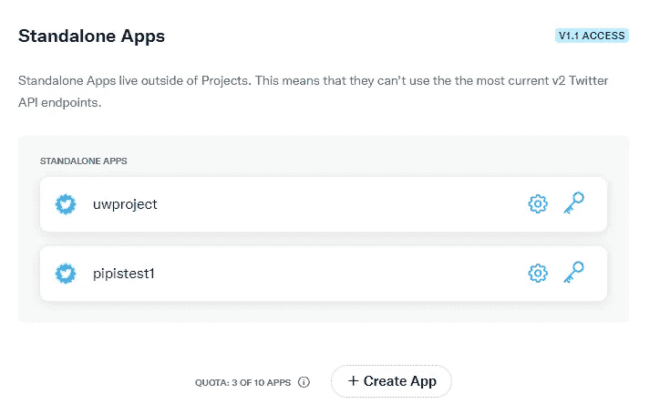
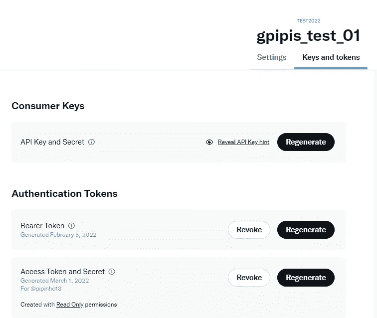
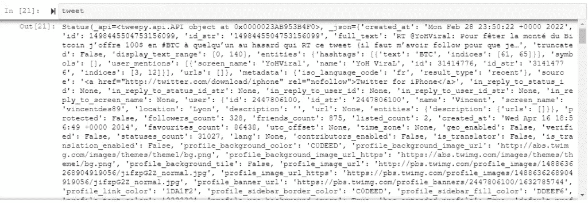
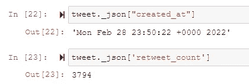
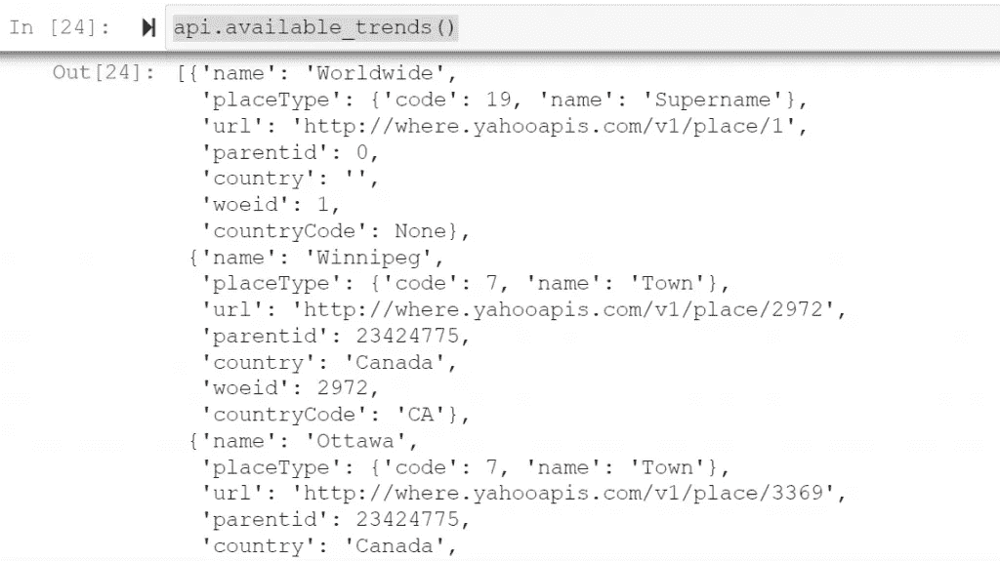

# 如何使用 Python 获取 Twitter 数据

> 原文：<https://levelup.gitconnected.com/how-to-get-twitter-data-using-python-39df0ea6bb39>

## tweepy 库的简单介绍，提供了如何获取用于 NLP/数据科学分析的 Twitter 数据的例子


照片由[布雷特·乔丹](https://unsplash.com/@brett_jordan?utm_source=medium&utm_medium=referral)在 [Unsplash](https://unsplash.com?utm_source=medium&utm_medium=referral) 拍摄

[](https://jorgepit-14189.medium.com/membership) [## 用我的推荐链接加入媒体-乔治皮皮斯

### 阅读乔治·皮皮斯(以及媒体上成千上万的其他作家)的每一个故事。您的会员费直接支持…

jorgepit-14189.medium.com](https://jorgepit-14189.medium.com/membership) 

本教程是对 [tweepy](https://docs.tweepy.org/en/stable/) 库的简单介绍。我们将向您展示如何使用 Python 获取 Tweets，您可以在以后使用它来完成许多其他任务，比如情绪分析、交易等等。

# 安装 tweepy 库

有许多 Python 库充当 Twitter API 的 Python 层，但是对于本教程，我们将使用`tweepy`库。我们可以按如下方式安装它:

`pip install tweepy`

或者

`conda install **-**c conda**-**forge tweepy`

# 访问 Twitter 的开发者平台

你需要有一个 Twitter 账户，并注册[开发者门户](https://developer.twitter.com/en)。然后你需要填写一些表格，解释你的应用程序的目的以及你打算如何使用 Twitter API。提交申请后，您将在 10 天内收到答复。请注意，如果他们拒绝你的申请，他们不会向你解释原因，你不能重新提交新的申请！我们希望他们会批准你的申请

# 获取访问和客户密钥

登录开发人员门户后，您可以创建新应用程序或独立应用程序。



您可以点击项目和应用程序，并创建一个新的应用程序或独立的应用程序。



一旦你创建了你的应用程序，你可以点击“关键”按钮来获得你的凭证。您将发现消费者和 API 访问令牌和秘密。



一旦生成了密钥，您就必须存储它们，因为您将无法再次检索它们。当然，你可以重新生成新的。

# tweepy 入门

现在我们准备开始与 tweepy 一起工作。我鼓励你在配置文件中存储凭证，就像我们在之前的文章中解释的那样。

```
import tweepy# your credentials
consumer_key = 'xxx'
consumer_secret = 'xxx'
access_token = 'xxx'
access_token_secret = 'xxx'# create the API objectauth = tweepy.OAuth1UserHandler(
   consumer_key, consumer_secret, access_token, access_token_secret
)# Setting wait_on_rate_limit to True when initializing API will initialize an
# instance, called api here, that will automatically wait, using time.sleep,
# for the appropriate amount of time when a rate limit is encounteredapi = tweepy.API(auth, wait_on_rate_limit=True)
```

## 基于关键字获取 Twitter 数据

假设我们想要获得所有包含标签 **#BTC** 的推文

```
# This will search for Tweets with the query "Twitter", returning up to the
# maximum of 100 Tweets per request to the Twitter API# Once the rate limit is reached, it will automatically wait / sleep before
# continuingfor tweet in tweepy.Cursor(api.search_tweets, q="#BTC", count=100, tweet_mode='extended', until = '2022-03-01').items():
    text = tweet._json["full_text"]
    print(text)
    print('\n\n')
```

我们得到了:

```
RT @Shido_samuraii: در حال حاضر بهترین انجمن مارکتینگ در  فضای رمزنگاری هستیم. 
♦️#RBXSamurai♦️ 
⚔️⚔️⚔️⚔️⚔️⚔️ 
🌐https://t.co/spTgOEOmdo 

#RBXS… 

RT @crypt_engineer: #Ukriane, ülkeye kripto para bağışında bulunan adreslere #Airdrop ile #token verileceğini duyurdu. 
#BTC #ETH #Binance #… 

RT @erdemmbozoglu: #HarmonyOne 
⚠️0.14 centte söyledim. 
⚠️0.125 centte tekrar söyledim. 
⚠️Projenin geleceğini, detayını youtube videosu çekt… 

RT @foxbit: ☀️Bom dia! 

#BTC R$ 225.534,35 (+0,42%)📈 
$ETH R$ 15.386,44 (+0,03%)📈 
$USDT R$ 5,11 (+0,17%)📈 
$SOL R$ 552,26 (+14,02%)📈 
$ADA R$… 

Are you ready to buy #btc and $alts or waiting for more pull back ? 
Which coins will you buy? 
🚨🚨🚨are you waiting for me to tell you when to buy lol ? 
I am trying to help you buy at the bottom to reduce your risk. 
It’s all about being patient. https://t.co/8S0GuM299R 

RT @Phemex_official: Spread the love 💖 with Phemex!  
Celebrate this lovely Valentine's Day - collect 1 BTC in trial funds and keep your ear… 

https://t.co/O7l7EcV8UR #Orijin #Polygon #IDO #BSC #Eth #BTC #Airdrop #DeFi #Launchpad https://t.co/6v9tmXRSph 

RT @goatcoiners: $GOAT Town Reveal 🚨 

We are building what will become the #Metaverse for legends. You can join the journey now that it’s s… 

Instead of a @TodayatEmbr tomorrow, there will be an #Embr Twitter spaces hosted. 17 march will be the next #TaE! 

Tune in at 4 PM ET/9 PM UTC @joinembr to chat about #embr and other #crypto or #DeFi news or topics. 

See you tomorrow 🔥 

#BNB #btc #cedefi #doxxed #amazingplans 

2022-03-02 @Trailblazers at @Suns 
picks: FG #RipCity +10.5  

#NBA #soccer #machinelearning #btc https://t.co/JeLBJ96teJ
```

请注意，我们从光标处获得的“tweets”是“Status”对象。

```
type(tweet)
tweepy.models.Status
```

它包含了大量的信息。



我们可以提取其他信息，如转发次数、创建日期等。

```
tweet._json["created_at"]
tweet._json['retweet_count']
tweet._json['favorite_count']
```



## 从用户时间线获取推文

我们可以获得特定用户时间线的推文。让我们来看看[预测黑客 Twitter](https://twitter.com/predictivehacks) 账户的推文。我们将得到最新的 10 个。

```
statuses = api.user_timeline(screen_name='predictivehacks', count=10, tweet_mode="extended")
for status in statuses:
    print(status._json['full_text'])
```

我们得到了:

```
Docker Tutorials from FREE 👇 - https://t.co/kIkJoa7vsc 

How to work with VS Code and Virtual Environments in Python  
#vscode #pythonprogramming #Python  
https://t.co/dTElIkzmBO 

How to Save and Load Scikit ML Models in Python 

#Python #MachineLearning #sklean #DataScience #tutorial   
https://t.co/6qiCr6r4C7 

Read my latest: “FinTech Tutorials from Predictive[Hacks]” https://t.co/BonjBfl0xc 

AWS Tutorials from FREE 👇 - https://t.co/HQRPxi28sl 

Read my latest: “Weekly newsletter of Predictive[Hacks] https://t.co/SFliNddi9c 

Google, rivals unite on smart tech https://t.co/Zxgu8W23Bn 

Weekly newsletter of Predictive[Hacks] - Issue #1 by @predictivehacks https://t.co/5gSZMQapyj via @revue 

I just published in @gitconnected Web Article NLP Analysis in Python https://t.co/Jvxgpe9QQ9  

#NLP #pythonlearning #DataScience 

I just published in @startitup_ A Tutorial About Market Basket Analysis in Python https://t.co/eoQKGDkoYl  

#Python #pythonlearning #dataScientist #DataScience
```

下面，你可以找到 user_timeline 的参数。请注意，它返回

因素

*   **用户 id** —指定用户的 id。当有效的用户 id 也是有效的屏幕名称时，有助于消除歧义。
*   **屏幕名称** —指定用户的屏幕名称。当有效的屏幕名称也是用户 id 时，有助于消除歧义。
*   **since_id** —仅返回 id 大于(即比)指定 ID 的状态。
*   **count** —每页尝试检索的结果数。
*   **max_id** —仅返回 id 小于(即早于)或等于指定 ID 的状态。
*   **trim_user** —一个布尔值，指示是否应该提供用户 id，而不是完整的用户对象。默认为 False。
*   **exclude_replies** —该参数将阻止回复出现在返回的时间线中。将`exclude_replies`与`count`参数一起使用将意味着您将收到最多条推文——这是因为`count`参数在过滤掉转发和回复之前检索了那么多推文。
*   **include_rts** —当设置为`false`时，时间线将去除任何本机转发(尽管它们仍将计入时间线的最大长度和 count 参数选择的切片)。注意:如果您将 trim_user 参数与 include_rts 一起使用，那么 retweets 将仍然包含一个完整的用户对象。

我们还可以使用`cursor`获取用户的推文，如下所示:

```
for tweet in tweepy.Cursor(api.user_timeline, screen_name='predictivehacks', tweet_mode="extended").items():
    text = tweet._json["full_text"]
    print(text)
    print('\n\n')
```

我们得到了:

```
Docker Tutorials from FREE 👇 - https://t.co/kIkJoa7vsc 

How to work with VS Code and Virtual Environments in Python  
#vscode #pythonprogramming #Python  
https://t.co/dTElIkzmBO 

How to Save and Load Scikit ML Models in Python 

#Python #MachineLearning #sklean #DataScience #tutorial   
https://t.co/6qiCr6r4C7 

Read my latest: “FinTech Tutorials from Predictive[Hacks]” https://t.co/BonjBfl0xc 

AWS Tutorials from FREE 👇 - https://t.co/HQRPxi28sl 

Read my latest: “Weekly newsletter of Predictive[Hacks] https://t.co/SFliNddi9c 

Google, rivals unite on smart tech https://t.co/Zxgu8W23Bn 

Weekly newsletter of Predictive[Hacks] - Issue #1 by @predictivehacks https://t.co/5gSZMQapyj via @revue 

I just published in @gitconnected Web Article NLP Analysis in Python https://t.co/Jvxgpe9QQ9  

#NLP #pythonlearning #DataScience 

I just published in @startitup_ A Tutorial About Market Basket Analysis in Python https://t.co/eoQKGDkoYl  

#Python #pythonlearning #dataScientist #DataScience 

Rename and Relevel Factors in R 
#RStats #rstudio #DataScience   
https://t.co/mGS09l2Suu 

How To Backtest your Crypto Trading Strategies in R  
https://t.co/QKzKhVVZ8K  

#cryptocurrency #trading #backtesting #RStats #rstudio #fintechs #DataScience 

Moving Average in PostgreSQL 

#SQL #Postgres #Tips #DataScience #dataengineering  
 https://t.co/UnN54orQ63 https://t.co/w1dxqgwg0K
```

## 了解趋势

我们还可以通过位置来了解趋势。首先，我们需要找到我们想要了解趋势的国家的 WOEID。假设我们想了解希腊的趋势。`api.available_trends()`返回字典列表，例如:



这意味着，为了检索希腊的 WOEID，我们需要从输出中提取它。例如:

```
output = api.available_trends()
for el in output:
    if el['country'] == 'Greece':
        print(el)
```

我们得到了:

```
{'name': 'Athens', 'placeType': {'code': 7, 'name': 'Town'}, 'url': 'http://where.yahooapis.com/v1/place/946738', 'parentid': 23424833, 'country': 'Greece', 'woeid': 946738, 'countryCode': 'GR'} 
{'name': 'Thessaloniki', 'placeType': {'code': 7, 'name': 'Town'}, 'url': 'http://where.yahooapis.com/v1/place/963291', 'parentid': 23424833, 'country': 'Greece', 'woeid': 963291, 'countryCode': 'GR'} 
{'name': 'Greece', 'placeType': {'code': 12, 'name': 'Country'}, 'url': 'http://where.yahooapis.com/v1/place/23424833', 'parentid': 1, 'country': 'Greece', 'woeid': 23424833, 'countryCode': 'GR'}
```

我们可以看到这个世界就是`23424833`。请注意，我们还可以获得特定城市的 WOEID。因此，我们可以通过运行以下命令来获得趋势:

```
greece_trends = api.get_place_trends(23424833)for trend in greece_trends[0]['trends']:
    print(trend['name'])
```

我们得到了:

```
#staralithies 
#γυναικοκτονια 
#shoppingstar 
#Πολεμος_στην_Ουκρανια 
#AEKPAOK 
Συλλυπητηρια 
Ζηνα 
πολυχρονος 
μαμαλακης 
hobi 
Μερα 18 
καλοταξιδο 
Κουστουριτσα 
μαθιο 
καλημερα μασια 
ο κοντιζας 
ευαγγελατο 
στελλας
```

# 最后的想法

tweepy 库非常强大，但是文档不是很好，并且缺少实际操作的例子。数据科学家可以通过在金融、政治、卫生、营销等许多领域的应用程序中运行多种类型的分析来利用 Twitter API。

最初由[预测黑客](https://predictivehacks.com/how-to-get-twitter-data-using-python/)发布