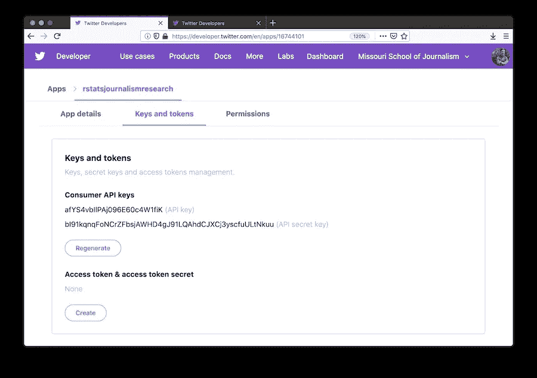
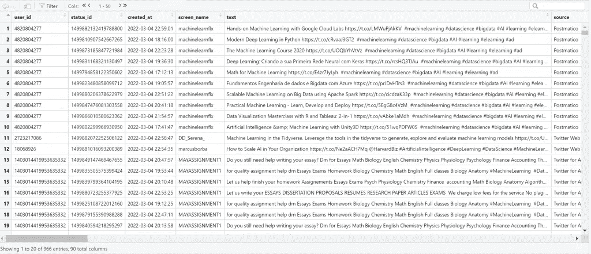
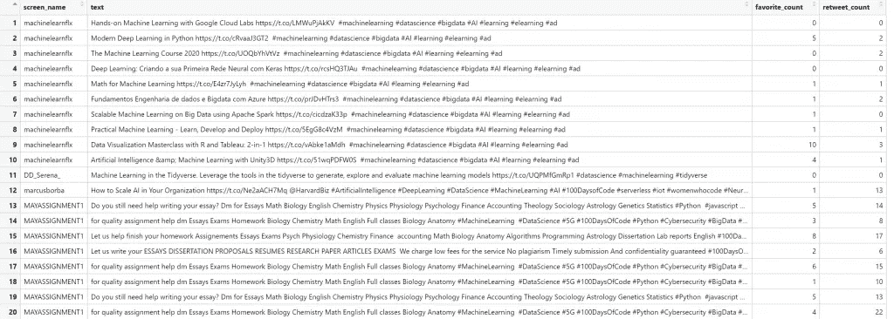
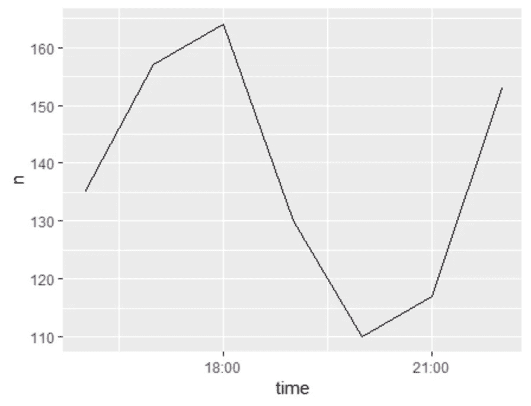
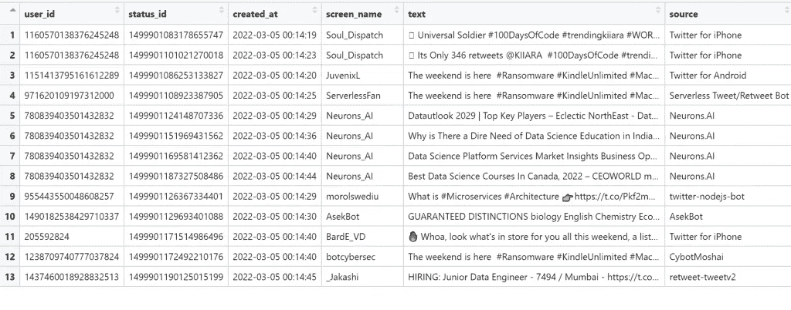
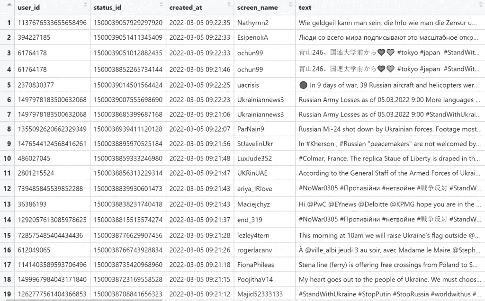
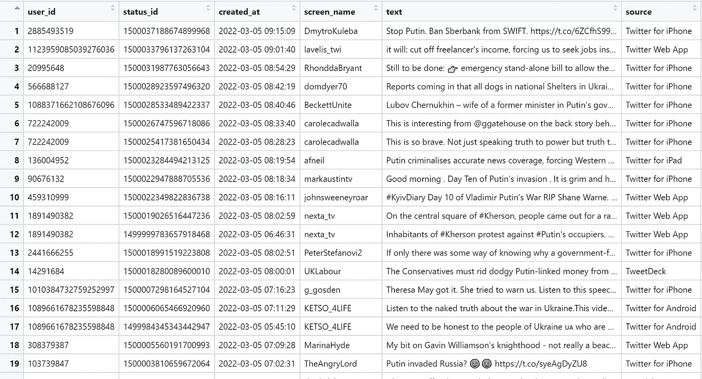
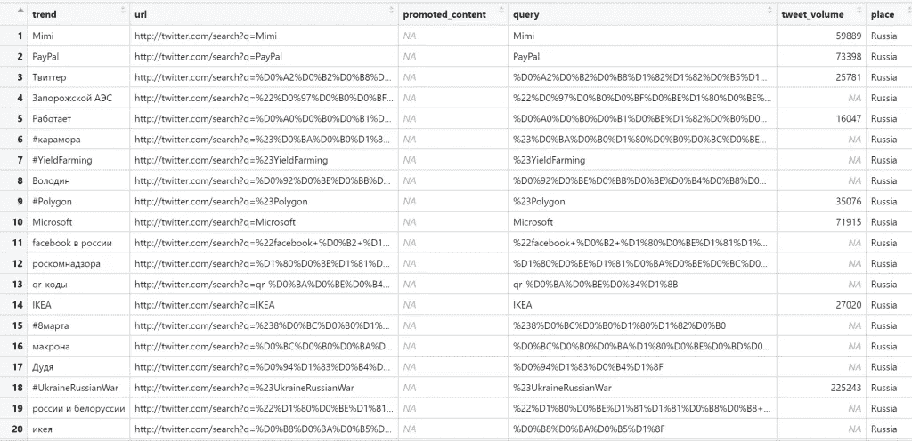
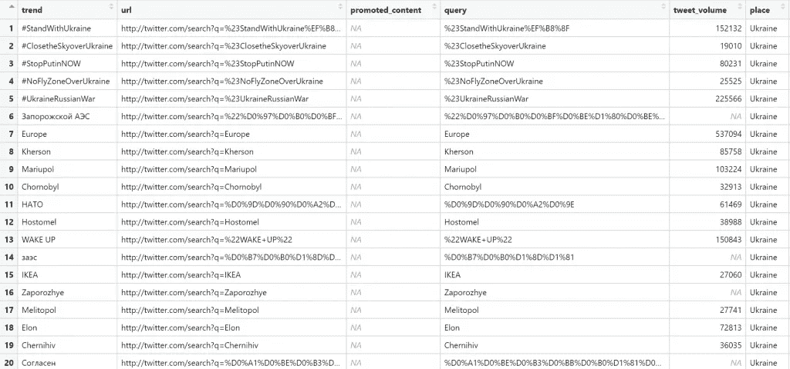

# 如何使用 R 获取 Twitter 数据

> 原文：<https://levelup.gitconnected.com/how-to-get-twitter-data-using-r-25247a89975e>

## rtweet 库简介


[自由股票](https://unsplash.com/@freestocks?utm_source=medium&utm_medium=referral)在 [Unsplash](https://unsplash.com?utm_source=medium&utm_medium=referral) 上的照片

[](https://jorgepit-14189.medium.com/membership) [## 用我的推荐链接加入媒体-乔治皮皮斯

### 阅读乔治·皮皮斯(以及媒体上成千上万的其他作家)的每一个故事。您的会员费直接支持…

jorgepit-14189.medium.com](https://jorgepit-14189.medium.com/membership) 

在之前的帖子中，我们向[展示了如何使用 Python](https://predictivehacks.com/) 获取 Twitter 数据。在本教程中，我们将向您展示如何使用 R 获取 Twitter 数据，尤其是使用 [rtweet](https://cran.r-project.org/web/packages/rtweet/rtweet.pdf) 库。正如我们在上一篇文章中解释的那样，您需要创建一个开发者帐户，并分别获得您的消费者密钥和访问密钥。

# 安装 rtweet 库和 API 授权

我们可以从 CRAN 或 GitHub 安装 rtweet 库，如下所示:

```
## install rtweet from CRAN
install.packages("rtweet")## OR
## install remotes package if it's not already
if (!requireNamespace("remotes", quietly = TRUE)) {
  install.packages("remotes")
}## install dev version of rtweet from github
remotes::install_github("ropensci/rtweet")
```

然后，我们准备加载库:

```
## load rtweet package
library(rtweet)
```

我们可以通过输入凭据来授权 API:



```
## load rtweet
library(rtweet)## load the tidyverse
library(tidyverse)## store api keys (these are fake example values; replace with your own keys)
api_key <- "afYS4vbIlPAj096E60c4W1fiK"
api_secret_key <- "bI91kqnqFoNCrZFbsjAWHD4gJ91LQAhdCJXCj3yscfuULtNkuu"## authenticate via web browser
token <- create_token(
  app = "rstatsjournalismresearch",
  consumer_key = api_key,
  consumer_secret = api_secret_key)get_token()
```

# 搜索推文

现在我们准备从 Twitter 获取第一批数据，从包含标签“ **#DataScience** ”的 1000 条推文开始，排除转发推文。请注意,“search_tweets”返回最近 6–9 天的数据。

```
rt <- search_tweets("#DataScience", n = 1000, include_rts = FALSE)
View(rt)
```



通常，我们希望获得屏幕名称、文本、喜欢数和转发数。

```
View(rt%>%select(screen_name, text, favorite_count, retweet_count))
```



rt 对象由 90 列组成，因此可以理解它包含了很多信息。请注意，每 15 分钟有 18000 条推文的限制。如果我们想得到更多，我们应该做到以下几点:

```
## search for 250,000 tweets containing the word datasciencert <- search_tweets(
  "datascience", n = 250000, retryonratelimit = TRUE
)
```

我们也可以绘制推文:

```
ts_plot(rt, "hour")
```



# 流推文

流推文返回所有推文直播流的大约 1%的随机样本，可以选择通过类似搜索的查询来过滤数据，或者输入特定的用户 id，或者定义推文的地理坐标。

```
## stream tweets containing the toke DataScience for 30 seconds
rt <- stream_tweets("DataScience", timeout = 30)
View(rt)
```



注意，rt 对象由 90 列组成。

# 过滤推文

当我们搜索推文时，我们也可以应用一些过滤器。例如，假设我们想要指定语言或排除转发等等。让我们通过排除转发、引用和回复来搜索包含“**与乌克兰站在一起**”文本的推文。

```
ukraine <- search_tweets("StandWithUkraine-filter:retweets -filter:quote -filter:replies", n = 100)
View(ukraine)
```



最后，让我们用英语搜索包含“普京”一词并且有超过 100 个赞和转发的推文。

```
putin<-search_tweets("Putin min_retweets:100 AND min_faves:100", lang='en')
View(putin)
```



# 获取时间线

get_imeline()函数返回发布到一个或多个指定 Twitter 用户日程表上的多达 3，200 个状态。让我们通过考虑每个人最近的 500 条推文，得到 R-bloggers 和 [Hadley Wickham](https://twitter.com/hadleywickham) 账户的时间轴。

```
rt<-get_timeline(user=c("Rbloggers", "hadleywickham"), n=500)
```

谁的推文更受欢迎？谁得到的赞和转发多？我们来回答这个问题。

```
rt%>%group_by(screen_name)%>%
     summarise(AvgLikes = mean(favorite_count, na.rm=TRUE), AvgRetweets = mean(retweet_count, na.rm=TRUE))
```

正如我们所看到的，与 R-blogger 相比，大师 Hadley Wickham 获得了更多的赞和转发。

```
# A tibble: 2 x 3
  screen_name   AvgLikes AvgRetweets
1 hadleywickham     31.6     110\.  
2 Rbloggers         17.8     6.17
```

# 获得用户的喜欢

我们可以获得用户最近喜欢的 n 条推文。看看哈德利喜欢什么！

```
hadley <- get_favorites("hadleywickham", n = 1000)
```

哪些是他最喜欢的账户？

```
hadley%>%group_by(screen_name)%>%count()%>%
         arrange(desc(n))%>%head(5)
```

我们得到了:

```
# A tibble: 5 x 2
# Groups:   screen_name [5]
  screen_name       n
1 djnavarro        17
2 ijeamaka_a       13
3 mjskay           12
4 sharlagelfand    12
5 vboykis          12
```

哪些是他最喜欢的标签？

```
hadley%>%unnest(hashtags)%>%group_by(tolower(hashtags))%>%count()%>%
      arrange(desc(n))%>%na.omit()%>%head(5)
```

我们得到了:

```
# A tibble: 5 x 2
# Groups:   tolower(hashtags) [5]
  `tolower(hashtags)`     n
1 rstats                 78
2 rtistry                22
3 genuary2022             9
4 genuary                 7
5 rayrender               6
```

# 搜索用户

我们可以搜索带有特定标签的用户。例如:

```
## search for up to 1000 users using the keyword rstats
rstats <- search_users(q = "rstats", n = 1000)## data frame where each observation (row) is a different user
rstats## tweets data also retrieved. can access it via tweets_data()
tweets_data(rstats)
```

# 获得朋友和关注者

我们可以获得特定帐户的朋友和追随者的用户 id。让我们得到[预测黑客](https://twitter.com/predictivehacks)账户的朋友和追随者。

```
get_followers("predictivehacks")
get_friends("predictivehacks")
```

我们可以使用以下函数提取关于用户 id 的更多信息:

```
lookup_users(users, parse = TRUE, token = NULL)
```

其中 users 是目标用户的用户 id 或屏幕名称。

# 获取趋势

我们可以了解特定城市或国家的趋势。例如:

```
## Retrieve available trends
trends <- trends_available()
trends## Store WOEID for Worldwide trends
worldwide <- trends$woeid[grep("world", trends$name, ignore.case = TRUE)[1]]## Retrieve worldwide trends datadata
ww_trends <- get_trends(worldwide)## Preview trends data
ww_trends## Retrieve trends data using latitude, longitude near New York City
nyc_trends <- get_trends_closest(lat = 40.7, lng = -74.0)## should be same result if lat/long supplied as first argument
nyc_trends <- get_trends_closest(c(40.7, -74.0))## Preview trends data
nyc_trends## Provide a city or location name using a regular expression string to
## have the function internals do the WOEID lookup/matching for you
(luk <- get_trends("london"))
```

让我们分别看看俄罗斯和乌克兰的趋势。

```
get_trends("Russia")
get_trends("Ukraine")
```



# 最后的想法

每个数据科学分析都从数据开始。在本教程中，我们展示了如何在 r 中获取 Twitter 数据。在接下来的帖子中，我们将向您展示如何通过应用[情感分析](https://predictivehacks.com/how-to-run-sentiment-analysis-in-python-using-vader/)、[主题建模](https://predictivehacks.com/topic-modelling-with-nmf-in-python/)、[网络分析等来分析这些数据。敬请期待！](https://predictivehacks.com/social-network-analysis-of-game-of-thrones/)

最初由[预测黑客发布](https://predictivehacks.com/how-to-get-twitter-data-using-r/)