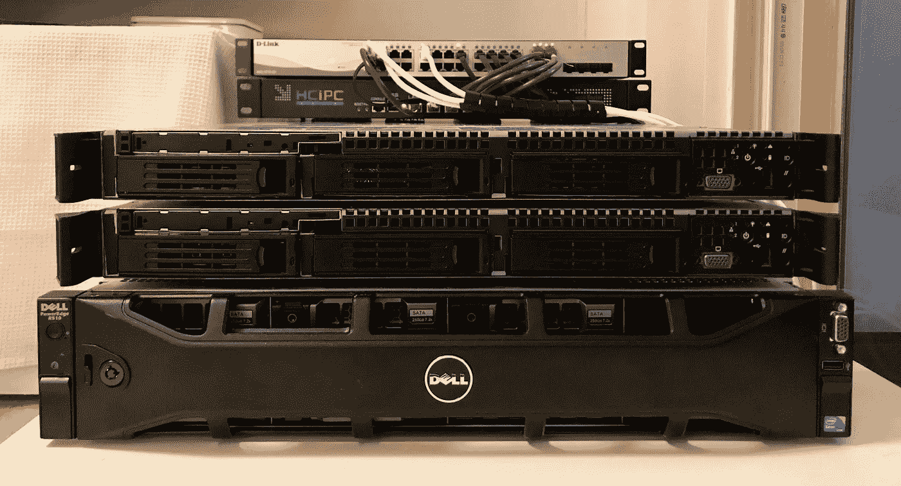
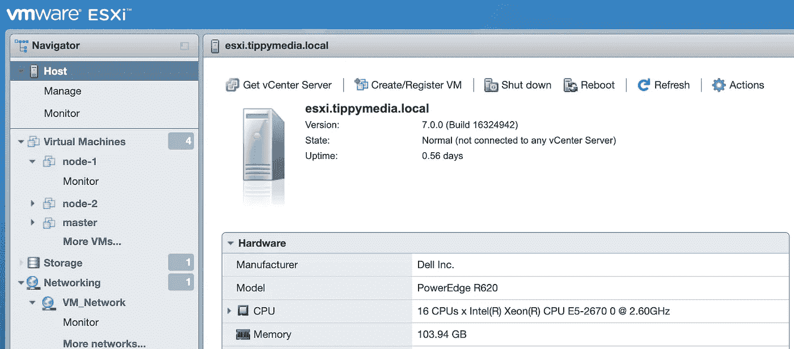
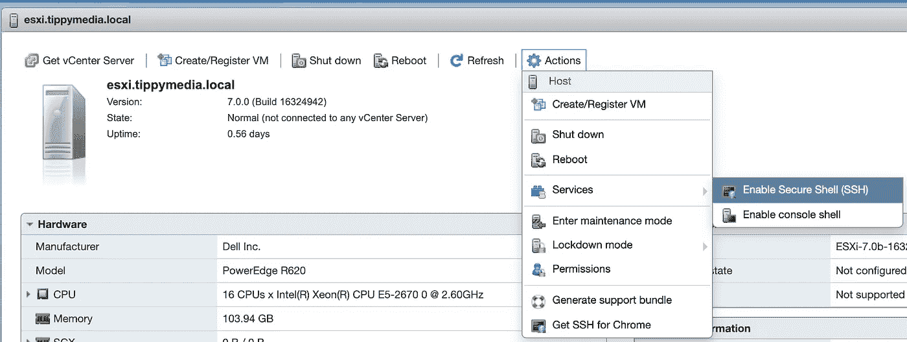

# 如何让您的防火墙规则适用于 ESXi v7

> 原文：<https://levelup.gitconnected.com/how-to-get-your-firewall-rules-to-stick-on-esxi-v7-961efcb58d8d>



来源:[戴夫·詹森](https://davejansen.com/homelab-re-organization-project-conclusions/)

为什么我要写一个关于这个的帖子。我无法告诉你，拥有一个看起来无所不能的漂亮网络界面是多么令人沮丧。奋斗不再是朋友，以下是如何在没有 vCenter 的 ESXi vSphere 7.0 主机上创建永久防火墙规则。

# 启用 SSH

第一步是在您的服务器中启用 SSH。在浏览器中导航到您的主机。然后从左上方的菜单中选择主机。



接下来，您将转到操作→服务→启用安全外壳(SSH)。关于这一点需要注意的是，除非您需要进行这样的更改，否则您应该禁用 SSH。



# SSH 进入主机

接下来，您需要通过 SSH 连接到您的 ESXi 主机。我不会讨论如何做到这一点，但对于 windows，你通常会使用 putty 或 WSL。对于其他人，打开一个终端并 SSH 进入。

```
ssh <username>@<host ip>
```

# 设置防火墙规则

这才是真正令人沮丧的事情。向/etc/vmware/firewall 添加新的防火墙 XML 文件将为您创建规则，但是这些文件不会在重新启动时保留。这就是为什么我们必须创建一个 shell 脚本，在每次启动时创建这些文件。为此，使用以下命令打开 local.sh shell 文件:

```
vi /etc/rc.local.d/local.sh
```

小注意:这是世界上最不适合初学者的友好文本编辑器，所以如果你是新手，这里是你需要知道的。按“I”键进入插入模式。这允许您在文档中键入内容。你打完字后，需要按“退出”键。现在您不再处于插入模式，但是您仍然在文件中。要退出文件，您需要按':'然后按' wq '来写入您的更改并退出文件，或者按':q '来退出而不保存您的更改。

现在让我们讨论这个文件的内容。在这里，我配置了两组不同的防火墙规则(第 14 行的 logging.xml 和第 43 行的 k8s.xml)。正如你所看到的，每一组都需要设置。标签<id>表示它将如何在网络界面中显示。每个规则都需要一个唯一的规则 id。不过，这些只需要在 ConfigRoot 标记中是唯一的(参见第 19 行和第 48 行具有相同的规则 id)。</id>

接下来，您需要指定 esxi 的入站/出站方向、协议(tcp/udp)、端口类型(目标或源(dst/src))以及端口开始/结束范围。最后，添加第 72 行，用新规则重启防火墙。

有点遗憾的是，我们不能仅仅从 GUI 中做到这一点，但是通过这些步骤，您可以在每次启动时可靠地正确设置您的网络规则。编辑完文件后，不要忘记“escape”then:wq。此外，仔细检查你的工作，因为在这里犯一个错误会锁定主机。如果发生这种情况，您将需要拔出一个显示器并连接，看看是什么问题。

# 包扎

完成这些步骤后，就该重启主机了。请记住，ESXi 需要几分钟才能启动，请耐心等待。我对我的主机运行了一个 ping 命令，然后在它重启的时候离开了。我认为它花了大约 5 分钟重新启动。当我回来时，我能够重新登录到 web 界面并关闭 ssh。就像这样，虽然我的防火墙规则启动并运行。

检查以确保与使用您打开的端口运行以下命令一样简单:

```
nmap -p <port> <ip>
```