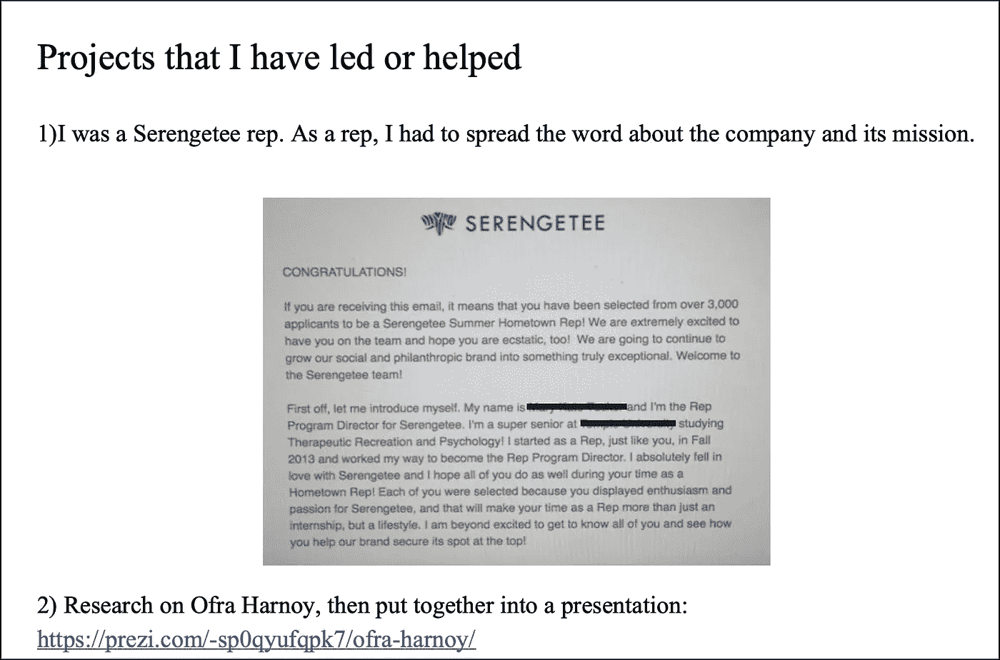
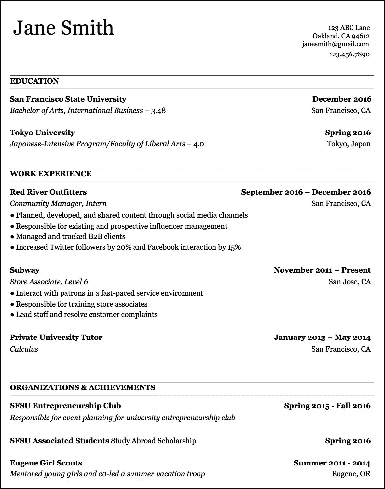
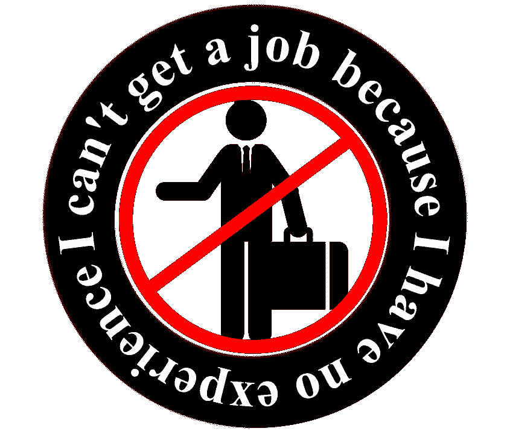
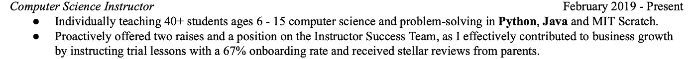

# 如何写一份不会被招聘者回收的简历

> 原文：<https://levelup.gitconnected.com/how-to-get-your-resume-into-faang-61bc1d2fdbfc>

我的第一份简历非常糟糕。每次我申请一份工作，我不是被鬼上身，就是收到一封以“很不幸”开头的电子邮件，我一次面试的机会都没有。**但是在 3 个月内，我能够完全改变这种情况。**在这篇文章中，我将分享我从视频、导师和简历研讨会中学到的技巧和诀窍，这些技巧和诀窍帮助我将简历从一个编号列表变成一份有价值的简历。

我第一份简历的截图。这是一份两页的编号清单。

## 第一步:格式化

根据行业和公司的不同，你可能会被淘汰出第一轮筛选。我哥哥在一家大型投资银行实习，他和一位总经理密切合作。当总经理筛选简历时，由于申请人数庞大，如果他看到鲜艳的颜色或有创意的格式，他会立即将简历扔进回收站。

简单而扎实的简历格式。

你不必总是为了简历而非黑即白，尽管那绝对是最安全的路线。如果你在考虑不同的业态，*了解你的行业，了解公司*。如果你想进入金融行业，坚持使用传统的黑白简历。如果你正在考虑 UI/UX 角色，可以随意添加一些反映你风格的图标和颜色。如果你正在申请 Spotify，并且真的想脱颖而出，你可以让你的简历看起来像一个 Spotify 播放列表。

以下是我对强有力的、不受行业限制的简历格式的建议:

*   坚持黑色和白色，但如果你想要一些颜色，就用深蓝色。
*   使用单列文本。这使得阅读你的简历不那么杂乱无章，因此，更快更容易。此外，您可以通过分隔两列或三列来使用您放弃的空间。
*   仅 1 页简历。
*   把你最相关的项目放在最上面。你有大约 6 秒的时间进行第一次筛选，所以你的筛选者不太可能得到你放在底部的项目。

## 第二步:体验

圣地亚哥·马塔莫罗斯-皮萨贝

不可回避的事实是，公司需要经验，所以获得你的第一份工作基本上变成了“先有鸡还是先有蛋”的困境。然而，要成为一个有竞争力的候选人，你需要在某些方面增加你的经验。幸运的是，它不必与你梦想的工作完全相关。

对我来说，这是我高中刚毕业时做的社交媒体工作，因为我没有真正的技能。一旦我在校园里，这也是参与俱乐部，担任领导职务，做个人项目。

我对科技职业感兴趣，所以我刚刚列出的事情并不是最相关的经历。在我最近的一轮招聘中([我收到了谷歌、脸书和微软](https://medium.com/swlh/i-got-offers-from-google-facebook-and-microsoft-heres-why-i-turned-them-all-down-6e4d7ae36596)的邀请)，我在这些软件工程实习中最相关的经历是兼职给年轻学生教授计算机科学。

所以，如果你发现很难在你的简历中填入相关的角色，那就走出去*在此期间做你能做的事情*。你可以做一些网络开发方面的项目，或者加入一个校园俱乐部。

如果你刚刚开始起草简历，这前两步会给你一个良好的基础。但是如果你已经迭代了一段时间，但运气不佳，**下一步会帮你通过你梦想中公司的简历筛选。**

## 第三步:成功脱颖而出的方法

转换组学

***量化。你的。影响。***

***很管用。***

一位亚马逊高管告诉我，我的简历比他们的一些同行更好，因为我“清楚地量化了我对简历的影响”。我看到那些客观上有着惊人经历的人很难得到我认为他们有资格参加的面试。这是因为他们的简历缺乏数字来显示他们实际上有多好。

我会进一步解释为什么量化你的工作对雇主来说如此有吸引力，然后用我现在的简历举个例子。

简历上最糟糕的事情就是列出你的职责，因为你在告诉我你应该做什么，但是你实际上做了什么？你是否完成了你的目标，达到和/或超过了预期，并产生了有意义的影响？告诉我你的责任并不能回答这些问题。并列最糟糕的是描述公司，因为你的简历是关于你的。另外，使用模糊的描述表明缺乏自信，或者更糟的是，撒谎。

另一方面是量化你的影响。你要告诉我你做了什么，到底做了多少。你在向我展示你在记录自己的数字进步。这些都是招聘人员想看到的。更不用说从视觉上看，数字会出现在一份充满文字的简历上。

一个真实的例子

这是我目前简历的截图。

在这篇文章的前面，我说过，我在 FAANG 和其他顶级公司寻求 SWE 实习的最相关的经历是“兼职教授年轻学生计算机科学”。这听起来并不十分令人信服。但是，通过使用清晰的描述、主动动词和度量标准，我能够充分展示我通过教学所产生的影响。

如何实现这一点:

*   首先，你必须记录你的数字，并且对你的数字保持诚实。
*   二、用星法(情境、任务、行动、结果)。你可以跳过这种情况和/或任务，这取决于你的角色和你在简历上留下的空间。重要的是如果可以的话，量化结果。
*   使用主动动词。“执行”、“开发”、“带头”、“建立”、“合作”都是可以包含在你的角色描述中的主动动词。

通过量化你的工作，你向招聘人员表明，无论你的角色是什么，你都会对公司产生统计上的重大影响。

## 步骤 4:额外提升

*   参加会议、招聘会和公司活动。看看你是否能在不参加活动的情况下把你的简历放入数据库。这个对我来说意义重大。
*   填写求职者资料，如 Handshake、LinkedIn、WayUp、JumpStart、Piazza(如果适用)等。有了好的简历，公司就会来找你。
*   推荐。我从来没有得到一个，但毫无疑问，他们有帮助。如果你没有关系网，不要害怕冷漠的外联。我给我短暂见过面的人或者在 LinkedIn 上礼貌或有创意地联系过的人推荐过。

## 承认我自己的特权

我必须承认这样一个事实，我会更容易找到工作，因为我上的是一所名牌大学。我也可能会有一段艰难的时间，因为我有一个非常明显的外国名字，但谁知道这种影响是否会抵消。不幸的是，这就是当今世界的运行方式。

然而，我真的相信并且知道，我在简历中包含的技巧和持续的努力可以极大地提高你找工作的成功率。你不一定要去名校才能有一份出众的简历，去名校也不意味着你会自动轻松通过招聘。我认为任何人都不应该在短期内沾沾自喜，我认为每个人都应该对长期的变化充满希望。

不管你从哪里开始，你的简历可能不是一个数字列表，所以你已经做得比我好了。:)