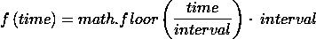
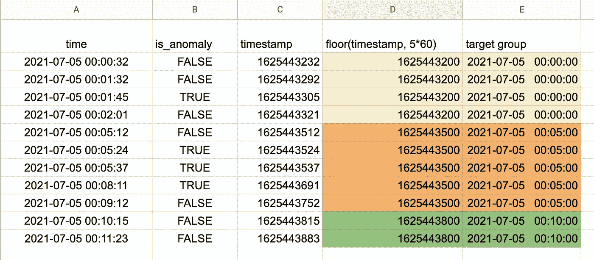

# 如何每 5 分钟对时间戳进行分组

> 原文：<https://levelup.gitconnected.com/how-to-group-timestamps-every-5-minute-de416a59695e>

假设我们有一个时间戳和标志的列表来指示记录是否异常(1 表示异常，0 表示正常)。

```
timestamp            is_anomaly
2021-07-05T00:00:32  False
2021-07-05T00:01:32  False
2021-07-05T00:01:45  True
2021-07-05T00:02:01  False
2021-07-05T00:05:12  False
2021-07-05T00:05:24  True
2021-07-05T00:05:37  True
2021-07-05T00:08:11  True
2021-07-05T00:09:12  False
2021-07-05T00:10:15  False
2021-07-05T00:11:23  False
```

我们希望将时间戳分组为 5 分钟间隔，并返回每个 5 分钟间隔内的异常总数。

在本帖中，我们将使用两种方法来解决这个问题:

*   方法 1:实践方法
*   方法二:用熊猫的`resample()`法

# 动手的方式

公式很简单



我们使用`floor`函数将时间戳除以时间间隔，然后乘以时间间隔。这将删除剩余部分，只给我们目标时间戳组。

我们用电子表格计算来解释一下。



列描述:

*   答:时间戳的字符串格式。
*   b:异常标志，只是一个简单的字段，带有时间戳。
*   c:从 Unix 纪元开始的时间戳
*   d:考虑到 5 分钟的间隔，我们使用`floor`函数将时间戳向下舍入到最接近的分钟。
*   e:我们将时间戳转换为目标组。

相当容易😃？让我们通过使用[熊猫](https://pandas.pydata.org/docs/user_guide/10min.html)包来探索一个更简单的解决方案。

# 熊猫的重采样功能

`resample`功能将按照指定的频率对数据进行分组。在这种情况下，我们将 5 分钟分组，然后使用`sum`函数获得每个 5 分钟间隔内的异常总数。

以下是完整的代码:

如果想了解重采样功能，可以参考下面的链接。

[](https://towardsdatascience.com/using-the-pandas-resample-function-a231144194c4) [## 使用熊猫的“重新取样”功能

### 仅次于改变过去的最好方法——聚合过去。熊猫重采样功能的技术介绍。

towardsdatascience.co](https://towardsdatascience.com/using-the-pandas-resample-function-a231144194c4) 

发现这篇文章很有用👏？看看我下面的其他文章吧！

[](https://medium.com/swlh/how-to-remember-all-these-classification-concepts-forever-761c065be33) [## 如何永远记住所有这些分类概念

### 混淆矩阵、准确度、精密度、灵敏度、特异性、F1 评分、Roc 曲线，让我们记住它们一次…

medium.com](https://medium.com/swlh/how-to-remember-all-these-classification-concepts-forever-761c065be33) [](https://medium.com/analytics-vidhya/understanding-calculation-of-tf-idf-by-example-8975304e7fc4) [## 通过实例理解 TF-IDF 的计算

### TF-IDF(术语频率-逆文档频率)是一种统计方法，用于评估一个单词与一个文档的相关程度

medium.com](https://medium.com/analytics-vidhya/understanding-calculation-of-tf-idf-by-example-8975304e7fc4)