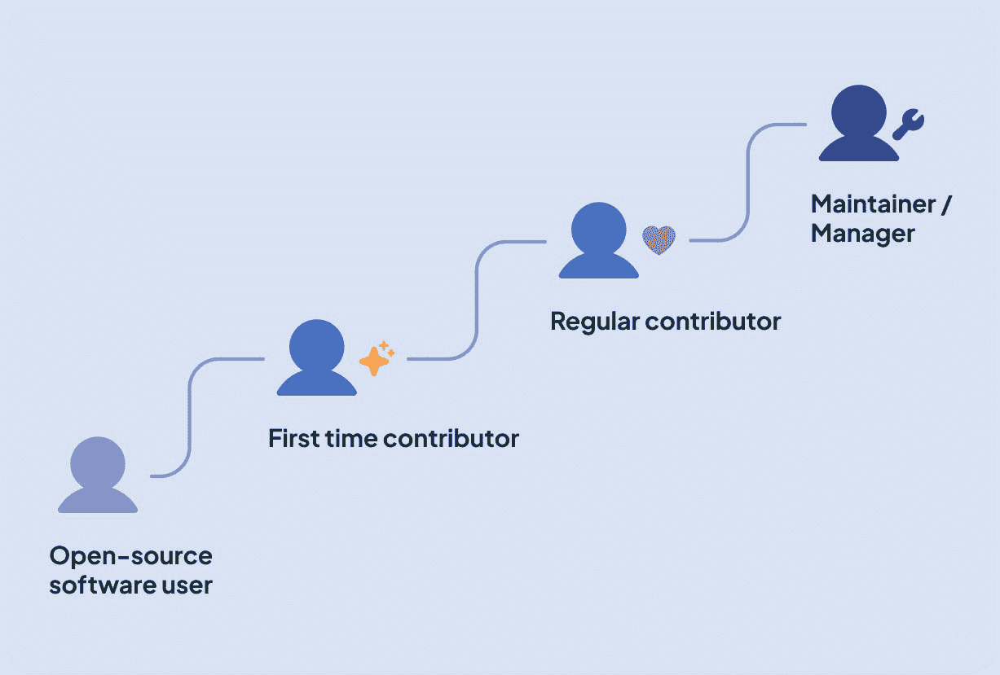

# 如何发展一个可持续的、包容性的开源社区

> 原文：<https://levelup.gitconnected.com/how-to-grow-a-sustainable-inclusive-open-source-community-ce156214cc9f>


你好！我是珍妮，是 [*众*](http://multitudes.co/) *的数据科学家。我想看看我们在大众中提供的见解是否对开源软件(OSS)社区有所帮助，这是我们在技术世界中所依赖的。我与 OSS 的贡献者交谈，阅读文献，并探索从 GitHub 挖掘的数据，以确定关键挑战&机会，这些挑战和机会不仅与 OSS 相关，而且与任何希望改善团队福利、协作和交付的软件团队相关。这是零件 1，下面是零件* [*2*](/how-does-pr-review-wait-time-affect-your-open-source-project-d79bd0af0ea3) *和*[*3*](/how-to-create-a-better-first-time-contributor-experience-for-your-open-source-project-27300d6085ad)*(+*[*一个给数据人的奖励*](/how-to-mine-github-data-in-2022-e9c70b3f61d3) *)。*

# 开源软件被每个人使用，但它是由一小部分人构建的

> “打开你的手机。你的社交媒体、你的新闻、你的医疗记录、你的银行:它们都在使用免费的公共代码。”
> — [道路和桥梁:我们数字基础设施背后看不见的劳动](https://www.fordfoundation.org/work/learning/research-reports/roads-and-bridges-the-unseen-labor-behind-our-digital-infrastructure/)，Nadia Asparouhova(前 Eghbal)

开源软件对我们的数字世界至关重要。有一个庞大的 OSS 工具、基础设施、库和应用的生态系统支撑着我们的数字生态系统，可以通过公开的代码库免费获得。这种数字基础设施本质上是一种必要的公共产品，应该保证足够的资金和投资( [Eghbal，2022](https://www.fordfoundation.org/work/learning/research-reports/roads-and-bridges-the-unseen-labor-behind-our-digital-infrastructure/) )。

然而，许多 OSS 项目是由志愿者团体或付费软件团队维持的，其中存在某些人口统计的过度代表性和其他人的代表性不足( [Wired，2017](https://www.wired.com/2017/06/diversity-open-source-even-worse-tech-overall/)；[罗伯斯等人，2016](https://link.springer.com/chapter/10.1007/978-3-319-39225-7_13) ， [Linux 基金会，2021](https://www.linuxfoundation.org/tools/the-2021-linux-foundation-report-on-diversity-equity-and-inclusion-in-open-source/) 。除了影响边缘化群体的通常的系统性不平等之外，认为开放源码软件必须由志愿者驱动(而不是付费)的观点强化了特权方面的现有障碍，因为它依赖于有时间做志愿者的人。更重要的是，对于那些确实依赖志愿者的项目来说，在业余时间维护广泛使用的软件的负担可能会导致倦怠和接连的困难( [Raman et al，2020](https://dl.acm.org/doi/abs/10.1145/3377816.3381732) )。

由于这些原因，一个健康的、可持续的组织文化对于一个 OSS 项目就像对于一个私人软件公司团队一样重要。这些重要的社区面临着许多挑战，通常需要努力来确定组织文化，再加上志愿者管理的细微差别。如何才能确保我们的科技行业有一个健康、多样和可持续的开源文化？

# 我们需要更多的人为开源做出贡献

> 如果我们让来自受滥用技术影响的文化和社区的人们参与到这个过程中，这就是如何预测和理解可以带来更好结果的影响。
> 
> — Coraline Ada Ehmke，伦理资源组织的创始人([via Linux Foundation Diversity Report 2021](https://www.linuxfoundation.org/wp-content/uploads/LFResearch_DEISurvey_Report_121321_6.pdf)

对于 OSS 项目，即使是那些资金充足的项目，一个由不同贡献者组成的广泛社区对于保持项目繁荣、带来解决复杂问题的观点和方法、减轻核心维护者的负担以及最小化孤岛化的风险是至关重要的。因此，加入并留住新的贡献者是 OSS 社区的核心目标。我们希望鼓励来自各种背景的人提升“贡献阶梯”:



🌱志愿开源带来了很多好处，但是你知道吗，并不是所有的开源贡献都是免费的？事实上，政府和私人公司已经能够、应该并且确实资助开源(只是还不够！).为什么不看看您的公司是否有志愿者政策，允许您将一些公司时间用于开源项目，或者询问他们是否愿意通过定期捐赠来支持他们已经在产品中使用的开源项目！

# 为新人做贡献有各种各样的障碍

## 质量文件的可用性📚

对于一个项目维护者来说，给定一个永无止境的待办事项列表，有时文档会半途而废( [Herbsleb et al，2001](https://ieeexplore.ieee.org/abstract/document/914732/) )。然而，这可能会给不知道从哪里开始或如何有效贡献的新人造成障碍( [Steinmacher，2015](https://www.sciencedirect.com/science/article/abs/pii/S0950584914002390) )。此外，包括贡献指南和行为准则在内的明确文件更受开放源码软件中代表性不足的群体的重视，如妇女(【2017 年开源调查)。

## 大多数类型的贡献得不到承认☕

> “有一种常见的误解，认为你需要成为一名开发人员才能参与开源。这本身就是一个障碍，也是一个机会，让我们可以通过瞄准更广泛的角色来扩大我们吸引人才的方式。”
> 
> —内莎·弗雷德里克斯，红帽开源项目办公室联盟顾问兼运营经理([via Linux Foundation Diversity Report 2021](https://www.linuxfoundation.org/wp-content/uploads/LFResearch_DEISurvey_Report_121321_6.pdf))

开源软件的成功不仅仅在于代码；很大程度上是关于社区中人们的文化。我交谈过的许多人将“非代码贡献”(或者，我们应该说，碰巧不是代码的贡献)称为任何强大社区的生命线。一个社区的文化很大程度上是由代码库之外发生的事情定义的——聚会、闲散小组、黑客马拉松、播客、stackoverflow、[问题分类](https://steveklabnik.com/writing/how-to-be-an-open-source-gardener)。组织和管理这些人的社区是一项重要的任务，不幸的是经常是吃力不讨好的任务，特别是因为贡献相对难以跟踪。缺乏激励意味着这些关键角色吸引的志愿者越来越少。一些开源社区已经开始实施他们自己的 kudos 系统，对各种贡献给予正式的、量化的认可(例如 [Drupal 的贡献积分](https://www.drupal.org/drupalorg/contribution-credit#:~:text=The%20Drupal%20Association%20pioneered%20the,contribution%20ecosystem%20that%20supports%20Drupal.))。

## 没有反馈或有害反馈🤬

就像在任何项目团队中一样，清晰的交流和富有成效的合作是高质量 OSS 软件的关键。一个人收到的公关反馈会给一个社区的新成员留下深刻的印象。任何人对任何社区的一个明显的反感是任何形式的毒害或欺凌( [Miller 等人，2022](https://www.cs.cmu.edu/afs/cs.cmu.edu/Web/People/ckaestne/pdf/icse22_toxicity.pdf)； [Gunawardena 等人，2022](https://research.google/pubs/pub51232/) 。以下是 2017 年[开源调查](https://opensourcesurvey.org/2017/)的一些有趣发现:

> "负面的相互作用很少发生，但是非常明显，会对项目活动产生影响."—[2017 年开源调查](https://opensourcesurvey.org/2017/)

21%经历或目睹负面行为的人表示，他们因此停止了对项目的贡献，8%的人开始更频繁地在私人渠道工作。从公平的角度来看，女性比男性更容易遇到让她们感到不受欢迎的语言或内容(25%比 15%)，以及陈规定型观念(12%比 2%)和主动的性挑逗(6%比 3%)。

无用或有害的反馈很难通过编程来检测，因为许多通用语言人工智能模型都是在社交媒体文本语料库上训练的。你在像 Reddit 和 Twitter 这样的域中看到的各种毒性，与在软件代码评审中看到的更微妙的分歧大相径庭。项目领导一致执行的良好的行为准则是减少这种行为的重要的第一步(更多信息请参见我们的参考资料部分)。这不仅使人们更容易保持良好的行为标准，而且也是来自边缘群体的人们关注的一个迹象，以检查他们在社区中更可能是安全的和受到公平对待的。

## PRs 等待时间长⏰

新人常常因为要等很长时间才能得到对他们的简历的反馈而气馁([李等人，2021](https://ieeexplore.ieee.org/abstract/document/9332267) )。[Mozilla](https://docs.google.com/presentation/d/1hsJLv1ieSqtXBzd5YZusY-mB8e1VJzaeOmh8Q4VeMio/edit#slide=id.g43d857af8_0177)的研究表明，维护者的响应能力是鼓励重复贡献的关键因素。尽管由于志愿者工作时间有限，开源社区并不总是有可能改善他们的等待时间，但是为了了解贡献者的体验，对其进行测量仍然是很重要的。

一个可能减少等待时间的流程变更是，通过明确“简单的首要任务”是什么(例如，使用拉式请求标签)，为新参与者的成功做准备。这样，新来者可以从事适合他们对代码库的熟悉程度的任务，并且他们的 PRs 将会更清晰和更快地被审查。

# 人和文化是一个成功的 OSS 项目的核心

> "首先关心人民，其次关心他们的贡献."简·莱纳特

面对上述挑战，为什么*人们会留下来为 OSS 社区做贡献呢？嗯，你可以在一个支持性的环境中学习新技能，与领域专家和鼓舞人心的领导者一起研究一些很酷的技术，成为一个远程友好的在线社区的一部分，并为全世界所重视和使用的东西做出贡献。所有这些好处都是由人推动的。作为一名高年级学生，你可以通过导师计划(例如 [Linux 基金会](https://lfx.linuxfoundation.org/tools/mentorship/)、 [Apache 软件基金会](https://community.apache.org/mentoringprogramme.html)、 [awesome-oss-mentors](https://github.com/lenadroid/awesome-oss-mentors) )分享你的技能，提升你的技术交流技能，并形成具有广泛影响的技术发展。*

虽然对开源做出贡献可以带来技能/职业机会，但协作软件开发的人文方面——组织文化和包容性——是吸引开源软件贡献者的核心，就像任何其他社区一样。正如我们从 [Ruth Cheesley 关于贡献者体验的演讲](https://speaking.ruthcheesley.co.uk/nsywk1/lets-make-this-the-year-of-the-contributor-experience#svlhGUR)中了解到的，潜在的贡献者正在问自己，他们在这个社区中是否感到安全、受欢迎和受重视。

🌱*下次你参加在线软件社区时(无论是 GitHub 上的公关，StackOverflow 上的回答帖，还是 Slack 讨论)，问问你自己你能做些什么让你与之互动的人感到安全、受欢迎和有价值！*

# 数据可以带来 OSS 社区如何合作的可见性

因为 OSS 社区很大程度上是由志愿者管理的，所以给维护者和贡献者设置时间限制是不现实的(如果你*不得不*在一定时间内审查 PRs，那会很有压力！).但是，关键指标的测量有助于:

1.  为贡献者设定期望值
2.  找到一个基准，并随着时间的推移不断改进
3.  在关键贡献者的痛点成为问题之前识别并解决它们(这也有助于维护者在培养新贡献者时将他们的时间集中在低挂的果实上)

在开源中存在围绕 DevOps 和社区健康指标的现有研究(看看 [CHAOSS](https://www.linuxfoundation.org/blog/chaoss-project-creates-tools-to-analyze-software-development-and-measure-open-source-community-health/) 、 [GrimoireLabs](https://chaoss.biterg.io/app/kibana#/dashboard/Overview?_g=h@44136fa&_a=h@9b19fb9) 和 [CNCF 项目速度](https://github.com/cncf/velocity))，以及分析开源对话中的反馈质量和毒性的迷人学术研究(见上面链接的论文)。

通过我在[multiple](http://multitudes.co/)的工作，我专门从人类的角度来看待度量标准。在接下来的几篇博客文章中，我将探索众所周知的 DevOps 指标在贡献者环境中的变化——因此，与其在回购或组织级别进行汇总，我将致力于说明贡献者体验的一部分。[第 2 部分在这里](https://medium.com/gitconnected/how-does-pr-review-wait-time-affect-your-open-source-project-d79bd0af0ea3)，在这里我看到了贡献者基础的不同部分的审查等待时间是如何不同的，而[第 3 部分](/how-to-create-a-better-first-time-contributor-experience-for-your-open-source-project-27300d6085ad)探讨了哪些因素可能导致人们留下来还是离开一个 OSS 社区。

# 结论

*   推动开源项目的社区的健康对我们的数字生态系统至关重要。
*   我们需要更多的人，更多样化的人，为开源做出贡献。然而，有各种各样的障碍让新来者尝试一下。
*   新员工被安全、支持性的组织文化所吸引。因此，作为开放源码软件的受益者，我们所有人都有责任在在线协作空间互动时做到包容和体贴。
*   数据有助于将新贡献者经历中的某些元素可视化。这可以帮助社区设定期望、基准和改进，并有效地投入时间来消除新贡献的最紧迫障碍。

```
🌱 This is our first time looking into open-source data. Was it useful? Send us your feedback, questions, and thoughts via [Twitter](https://twitter.com/MultitudesCo), [LinkedIn](https://www.linkedin.com/company/multitudesco/), or [hello@multitudes.co](mailto:hello@multitudes.co)👉 Interested in ethical team health metrics? [Apply to join our closed beta!](http://multitudes.co/)
```

# 资源

## 如何为第一次投稿

*   [如何通过开源指南为开源做出贡献](https://opensource.guide/how-to-contribute/)
*   [如何为 Kent C. Dodds 的 GitHub 开源项目](https://egghead.io/courses/how-to-contribute-to-an-open-source-project-on-github)做贡献(egghead.io 上的免费短期社区课程)

## 行为准则

*   [关于如何建立和执行行为准则的指南](https://opensource.guide/code-of-conduct/#:~:text=A%20code%20of%20conduct%20is,just%20your%20participants%2C%20but%20yourself.)
*   [项目包括撰写行为准则指南](https://projectinclude.org/writing_cocs)
*   [Otter 的技术行为准则执行培训研讨会](https://otter.technology/code-of-conduct-training/)
*   [Mozilla 的行为准则评估工具，用于审查您的行为准则](https://mozilla.github.io/diversity-coc-review.io/modules/about/start/)
*   [李等人的《Github 上开源软件项目对话行为准则](https://dl.acm.org/doi/abs/10.1145/3449093)。艾尔。(2021).

## 认可所有贡献

*   [Drupal 社区的“贡献积分”系统](https://www.drupal.org/drupalorg/contribution-credit#:~:text=The%20Drupal%20Association%20pioneered%20the,contribution%20ecosystem%20that%20supports%20Drupal.)

## 开源的状态

*   [道路和桥梁:数字基础设施背后看不见的劳动力](https://www.fordfoundation.org/work/learning/research-reports/roads-and-bridges-the-unseen-labor-behind-our-digital-infrastructure/)，Nadia Asparouhova(之前为 Eghbal)关于开源现状、挑战和解决方案建议的研究报告。
*   [2017 年开源调查](https://opensourcesurvey.org/2017/):对开源社区的状态以及文档、反馈、多样性&包容性和安全性等事物的影响的卓越、可操作的见解。
*   [开源的多样性、公平性和包容性，Linux 基金会的报告，2021 年](https://www.linuxfoundation.org/wp-content/uploads/LFResearch_DEISurvey_Report_121321_6.pdf)

## 给维护人员的提示

*   [开源指南为维护者提供的最佳实践](https://opensource.guide/best-practices/)
*   通过开源指南构建欢迎社区
*   帮助新人成为开放项目贡献者的十个简单规则。艾尔。(2019).
*   [可持续开源](https://writing.jan.io/2015/11/20/sustainable-open-source.html)Jan Lehnardt 的博客文章(2015 年)。
*   [Kent c . Dodds](https://kentcdodds.com/blog?q=open+source)([测试库](https://testing-library.com/)的创建者)、Angular、webpack 等核心团队的博文。)，就像[这个](https://kentcdodds.com/blog/first-timers-only)提倡使用“仅限首次使用”的标签。
*   [开源贡献者漏斗(或:为什么人们不为你的开源项目做贡献)](https://mikemcquaid.com/2018/08/14/the-open-source-contributor-funnel-why-people-dont-contribute-to-your-open-source-project/)Mike McQuaid 的博客文章(2018)

# 承认

我要感谢以下人员为这个项目付出的时间、提供的指导和见解:

*   Kelly Blincoe 博士，奥克兰大学电子、计算机和软件工程系高级讲师
*   [艾米丽·福克斯](https://www.linkedin.com/in/themoxiefox) ( [@TheMoxieFox](https://www.twitter.com/TheMoxieFox) )，苹果云服务工程师&云原生计算基金会(CNCF)安全特别兴趣小组(SIG)联合主席
*   Acquia 的 Mautic 开源项目负责人 Ruth Cheesley[(](https://www.ruthcheesley.co.uk/)[@ RCheesley](https://twitter.com/RCheesley))
*   Ruby sin Reich([@ Ruby](http://twitter.com/ruby))，网络开发人员，技术专家，战略家
*   [Javier Luraschi](https://www.linkedin.com/in/javierluraschi/)([@ Javier Luraschi](https://twitter.com/javierluraschi))，Hal9 创始人，RStudio 核心撰稿人，前微软

# 分级编码

感谢您成为我们社区的一员！在你离开之前:

*   👏为故事鼓掌，跟着作者走👉
*   📰查看[升级编码出版物](https://levelup.gitconnected.com/?utm_source=pub&utm_medium=post)中的更多内容
*   🔔关注我们:[Twitter](https://twitter.com/gitconnected)|[LinkedIn](https://www.linkedin.com/company/gitconnected)|[时事通讯](https://newsletter.levelup.dev)

🚀👉 [**加入升级达人集体，找到一份惊艳的工作**](https://jobs.levelup.dev/talent/welcome?referral=true)