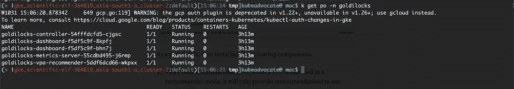
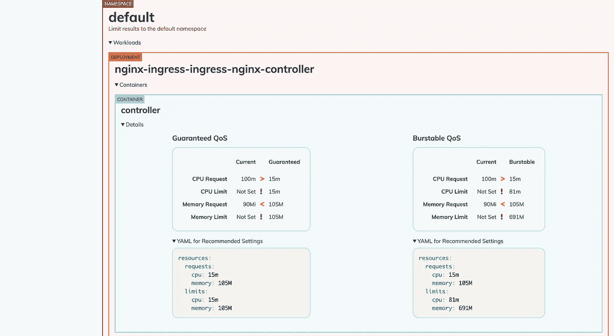
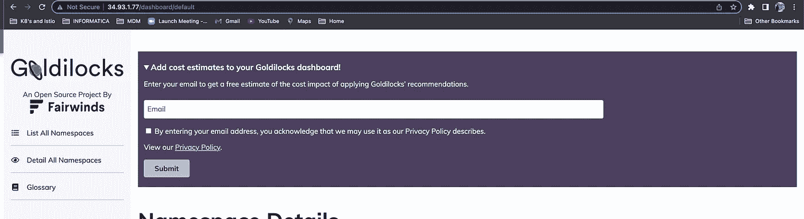
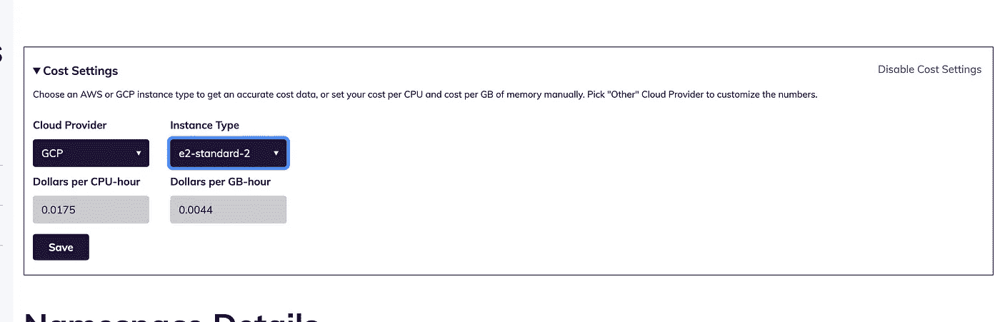
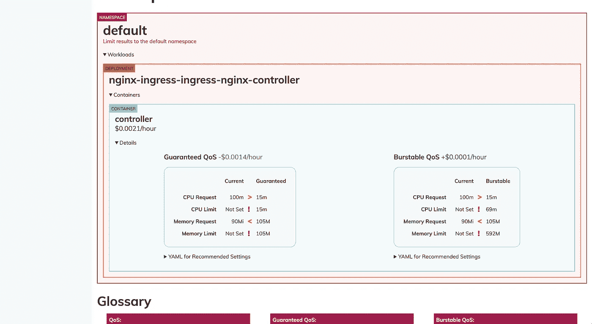

# 如何猜测 Kubernetes 豆荚的合适尺寸？

> 原文：<https://levelup.gitconnected.com/how-to-guess-the-right-size-for-your-kubernetes-pods-9c88686fec>

使用 Goldilocks 猜测 Kubernetes 资源和 FinOps 管理的正确规模

你有没有想过 Kubernetes 豆荚的合适尺寸是多少？或者，您是否经常过度使用 Pod 的资源，然后在月末惊讶地看到云成本？这是大多数 Kubernetes 资源最常见的情况。那么，为我们的工作负载找到资源的最佳方法是什么？这是否意味着我们将总是不得不过度使用资源，或者总是靠猜测？不，不总是。金发女孩是来帮忙的。Goldilocks 是一个实用程序，可以帮助您确定资源请求和限制的起点。通过在推荐模式下使用 Kubernetes[vertical-pod-autoscaler(打开新窗口)](https://github.com/kubernetes/autoscaler/tree/master/vertical-pod-autoscaler)，我们可以在每个应用上看到资源请求的建议。该工具为命名空间中的每个工作负载创建一个 VPA，然后查询它们的信息。


# 整个故事是关于什么的？(TLDR)

1.  为您的 Kubernetes 工作负载提供所需的资源。
2.  了解如何使用金凤花来确定 Kubernetes 豆荚的正确资源。

# 故事资源

1.  GitHub 链接:【https://github.com/pavan-kumar-99/medium-manifests 
2.  GitHub 分支:[金发女孩](https://github.com/pavan-kumar-99/medium-manifests/tree/goldilocks)

# 先决条件

1.  Kubernetes 集群(EKS、AKS、Kind 集群等)。

## 安装金发女孩

通过在推荐模式下使用 Kubernetes[vertical-pod-autoscaler(打开新窗口)](https://github.com/kubernetes/autoscaler/tree/master/vertical-pod-autoscaler)，我们可以在每个应用上看到资源请求的建议。该工具为命名空间中的每个工作负载创建一个 VPA，然后查询它们的信息。

一旦你的 VPA 就位，你会看到建议出现在 Goldilocks 仪表板上。金发姑娘可以通过舵表安装，数值可以在[这里](https://github.com/FairwindsOps/charts/blob/master/stable/vpa/values.yaml)找到。

这是我用来安装金发女孩的自定义头盔值文件。

作为其中的一部分，我正在安装以下组件。

1.  **VPA(仅推荐者)**:因此，当 VPA 以推荐者模式安装时，它将仅向我们的工作负载提供建议，而不对其进行任何更改。
2.  **metrics-server(Goldilocks metrics server)**:这是从 VPA pod 中提取 VPA 指标。
3.  **控制器(Goldilock controller )** :负责为命名空间中的资源创建 VPA。命名空间应该标有 goldilocks.fairwinds.com/enabled=true.的
4.  ****Dashboard(Goldilock Dashboard)**:可视化 Kubernetes 资源(Pods、Containers)的大小。**

```
$ helm repo add fairwinds-stable [https://charts.fairwinds.com/stable](https://charts.fairwinds.com/stable)$ git clone [https://github.com/pavan-kumar-99/medium-manifests.git](https://github.com/pavan-kumar-99/medium-manifests.git) \
-b goldilocks$ cd medium-manifests$ helm upgrade -i goldilocks -n goldilocks --create-namespace goldilocks fairwinds-stable/goldilocks -f [goldilocks-helm-values.yaml](https://github.com/pavan-kumar-99/medium-manifests/blob/goldilocks/goldilocks-helm-values.yaml)
```

****

**金发组件**

**我还公开了作为负载平衡器的仪表板。让我们现在尝试访问它。**

```
$ kubectl get svc -n goldilocks goldilocks-dashboard -o \ jsonpath='{.status.loadBalancer.ingress[0].ip}'
```

**您现在可以通过在浏览器中打开 http:// <ip>来访问 IP。现在仪表板应该是空的。</ip>**

## **获取数据**

**现在，让我们行动起来。现在，让我们通过使用舵图来安装入口控制器，从而直观地了解入口控制器所需的资源。**

```
$ helm repo add ingress-nginx [https://kubernetes.github.io/ingress-nginx](https://kubernetes.github.io/ingress-nginx)$ helm repo update$ helm install ingress ingress-nginx/ingress-nginx
```

**现在让我们标记这两个名称空间。default 和 goldilocks 来了解我们的 pod 所需的资源。现在，您应该在控制器 pod 日志中观察到，正在为名称空间中所有标有**goldilocks.fairwinds.com/enabled=true**的资源创建 VPA**

```
$ kubectl label ns default **goldilocks.fairwinds.com/enabled=true**$ kubectl label ns goldilocks **goldilocks.fairwinds.com/enabled=true**
```

****

**金发女孩仪表板**

**现在，您应该会发现一个非常漂亮的仪表板，让您大致了解该 pod 所需的请求/限制以及它们各自的 QoS。如果您想知道什么是 QoS，请参考此[文档](https://kubernetes.io/docs/tasks/configure-pod-container/quality-service-pod/)了解更多信息。**

**好吧，就这样？不，还有更多。如果您也能看到此 Pod 的配置成本，您会有什么想法？是的，有可能！！**

****

**您可以通过在此处添加电子邮件来添加成本估算。您应该从 Goldilocks 团队收到一个 api-key 来激活成本估算。**

**因此，我使用大小为 e2-standard-2 的 GKE 群集，我将通过从下拉列表中选择来选择相同的选项。**

****

**金发女孩成本设置**

**启用成本估算后，您应该会看到一个仪表板，其中显示了每个 pod/集装箱的成本估算及其各自的 QoS。**

****

**每个 pod 的成本。**

## **结束语**

**这就是开发人员、SRE 和 DevOps 团队如何利用 Goldilocks 来计算所有工作负载的正确估计值，同时也是从 FinOps 的角度来看。请随时分享您在集群中实施该工具的经验。**

**直到下一次…..**

# **被推荐的**

**[](/how-i-reduced-the-size-of-my-docker-image-by-95-520a05439300) [## 我如何将 Docker 图片的尺寸缩小 95%

### 使用多阶段构建缩小 Docker 映像的大小

levelup.gitconnected.com](/how-i-reduced-the-size-of-my-docker-image-by-95-520a05439300) [](https://medium.com/nerd-for-tech/policies-as-code-in-kubernetes-using-jspolicy-8d358d064bfd) [## 使用 jsPolicy 在 Kubernetes 中将策略作为代码

### 使用 jsPolicy 在 Kubernetes 中进行开发

medium.com](https://medium.com/nerd-for-tech/policies-as-code-in-kubernetes-using-jspolicy-8d358d064bfd) [](https://medium.com/nerd-for-tech/terraforming-the-gitops-way-9417cf4abf58) [## 地球化吉托普斯之路！！！

### 使用 Atlantis(拉式请求自动化)通过 GitOps 建立 Terraform。

medium.com](https://medium.com/nerd-for-tech/terraforming-the-gitops-way-9417cf4abf58) [](https://medium.com/nerd-for-tech/mlops-machine-learning-pipelines-using-kubeflow-fc06508a3f0d) [## MlOps:使用 kubeflow 的机器学习管道

### 使用 Kubeflow 对 Kubernetes 进行有效的 MLOps

medium.com](https://medium.com/nerd-for-tech/mlops-machine-learning-pipelines-using-kubeflow-fc06508a3f0d)**