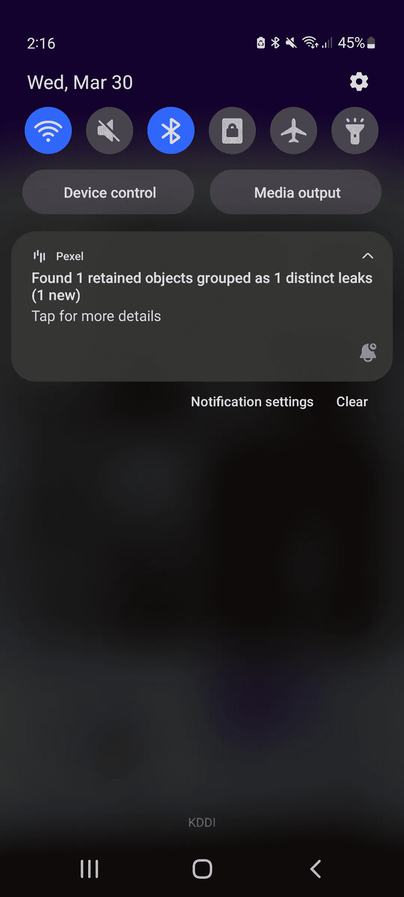
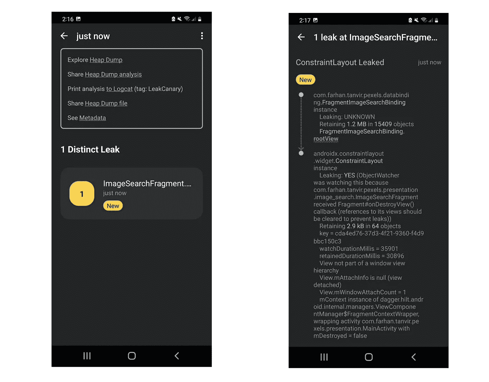

# 如何处理 Android 中的内存泄漏

> 原文：<https://levelup.gitconnected.com/how-to-handle-a-memory-leak-in-android-d6e7e1ea435b>

## 制作一个防撞应用程序


乔·兹洛梅克在 [Unsplash](https://unsplash.com?utm_source=medium&utm_medium=referral) 上的照片

> “一个小漏洞会使一艘大船沉没。” —本杰明·富兰克林

作为 Andriod 开发者，我们的主要座右铭是创建一个在任何情况下都不会崩溃并且运行良好的应用程序。为了实现这一点，我们需要关心内存泄漏。因为内存泄漏会导致`OutOfMemoryError`崩溃并降低应用程序的性能。

首先，我们将知道什么是内存泄漏。根据维基百科

> 在[计算机科学](https://en.wikipedia.org/wiki/Computer_science)中，**内存泄漏**是[资源泄漏](https://en.wikipedia.org/wiki/Resource_leak)的一种，当[计算机程序](https://en.wikipedia.org/wiki/Computer_program)错误地管理[内存分配](https://en.wikipedia.org/wiki/Memory_allocation)[【1】](https://en.wikipedia.org/wiki/Memory_leak#cite_note-1)而不释放不再需要的内存时就会发生。

最简单的一句话，有一段需要释放却没有释放的记忆。

# 如何发现内存泄漏

[**leak canary**](https://square.github.io/leakcanary/)**是 android 中最常用的查找内存泄漏的库。安装非常简单。我们只需要使用应用程序级别中的依赖关系`build.gradle`。**

```
debugImplementation 'com.squareup.leakcanary:leakcanary-android:2.8.1'
```

**我们使用`debugImplementation`,因为内存泄漏检查只能在调试版本中进行。现在，如果你运行应用程序，你会收到一个通知，如果你的应用程序有任何内存泄漏。**

# **LeakCanary 在行动**

**我用的是这个[**GitHub**](https://github.com/Farhandroid/Pexel)**库。请随意检查。安装 LeakCanary 后，当我构建应用程序时，我收到了一个通知。****

********

****它告诉我，我的应用程序存在内存泄漏。点击通知后，它显示了错误的原因。****

********

****基本上就是在告诉我`ImageSearchFragment`有内存泄漏。因为有一个视图应该被清除以防止内存泄漏。原因是，我使用了在`ImageSearchFragment`中引用了`ConstrainLayout`的`databindig`，但是没有删除导致内存泄漏的引用。****

******这个原因特别针对这个项目。这可能是项目中内存泄漏的另一个原因。******

# ****如何解决内存泄漏****

****现在我知道了我的应用程序内存泄漏的原因，我必须解决这个问题。所以我改装了`ImageSearchFragment`。****

****我所做的是创建一个引用`databinding`并在`onDestroyView`中删除它。所以我已经清除了需要清除的内存。如果我现在运行应用程序，那么将不会有来自 LeakCanary 的通知。所以现在这个 app 不存在内存泄露的问题。知道你的应用程序没有内存泄漏的感觉真好。不是吗？****

****今天到此为止。我希望你学到了新的有用的东西。****

****你的建议对我很重要。如果你有任何问题，请在评论中分享。直到我们再次见面…干杯！****

```
****Want to Connect?**If you want to, you can connect with me on [Twitter](https://twitter.com/FarhanT99598254) or [LinkedIn](https://www.linkedin.com/in/farhan-tanvir-b08520151/).**
```