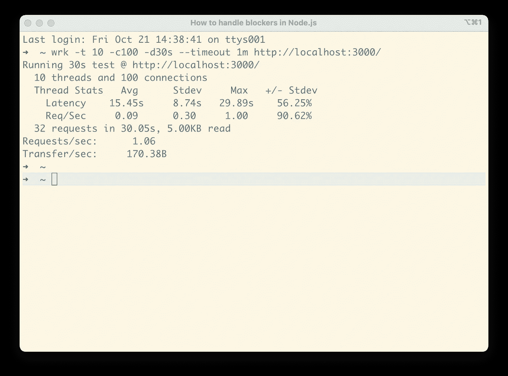
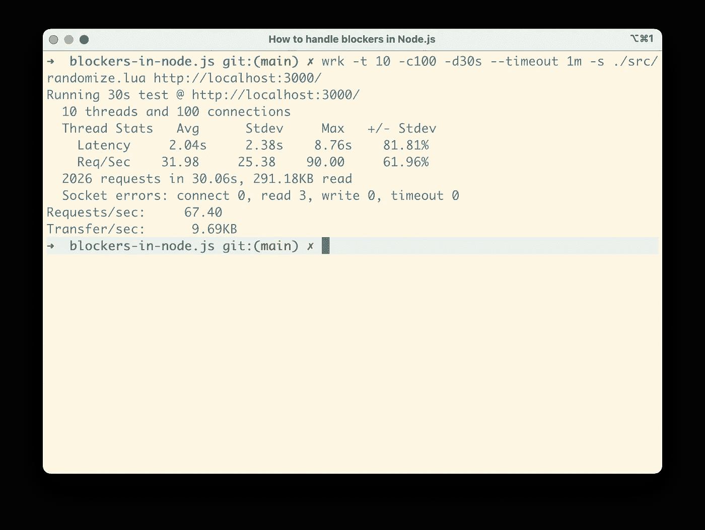
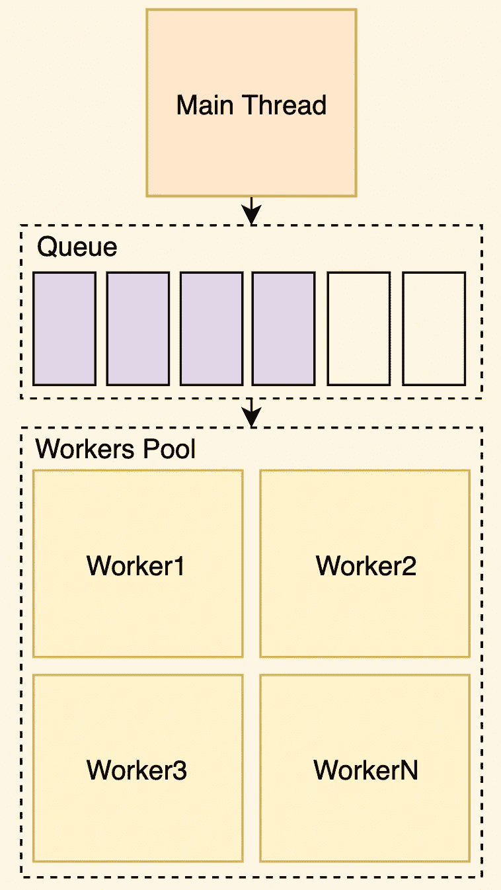
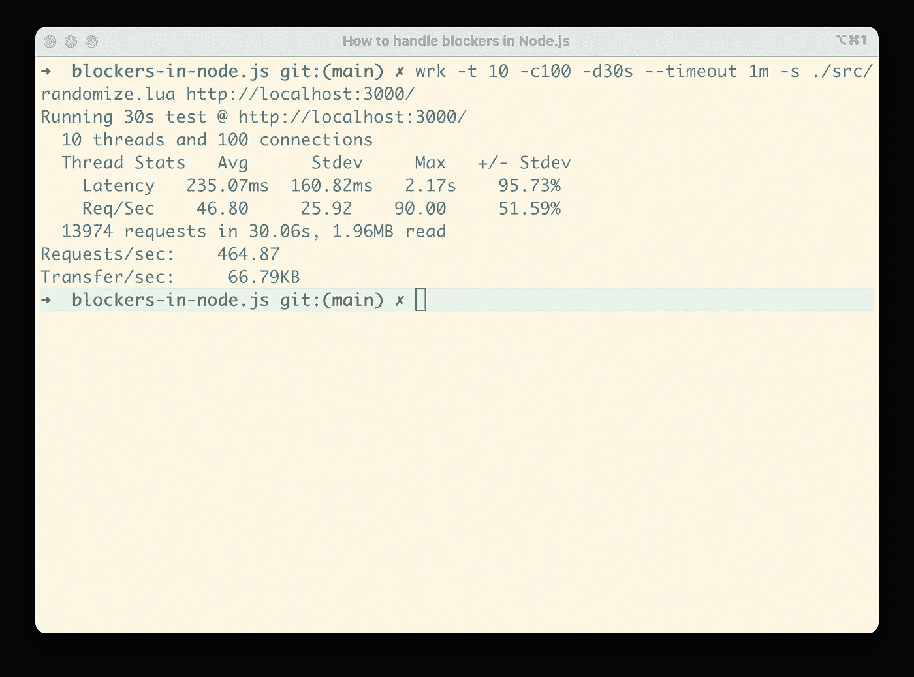
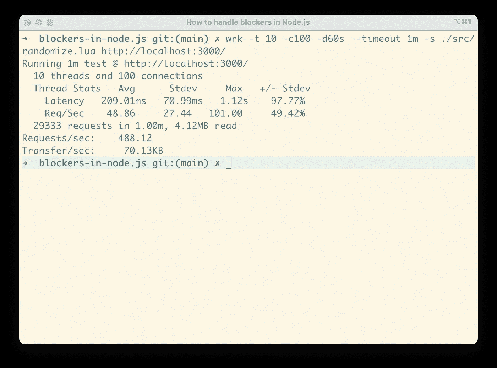

# 如何处理 Node.js 中的拦截器

> 原文：<https://levelup.gitconnected.com/how-to-handle-blockers-in-node-js-1966d0399703>

在[之前的文章](https://medium.com/@ayzrian/why-asynchronous-is-a-trend-c9892667e245)中，我们讨论了异步服务器中的阻塞，它们会降低应用程序的性能。现在是时候学习如何处理它们了。让我们开门见山吧。

## 什么是阻断器？

在我们谈论在你的代码中“处理”一个阻塞之前，我们首先需要识别它。**阻塞程序是一种 CPU 密集型操作，它会让您的主线程长时间处于忙碌状态。**

让我们构建一个例子，我将使用 [Node.js](https://nodejs.org/en/) 来实现。Node.js 本质上是异步的。我将启动一个简单的 HTTP 服务器并创建一个“拦截器”。假设我们将需要找到数字的总和达到 1000000000。在我的机器上，计算这个数字大约需要 1 秒钟。

现在让我们用 [WRK](https://github.com/wg/wrk) 来测量我们服务器的性能。

正如您所看到的，服务器只能处理 1 RPS(每秒请求数)，尽管我们使用 10 个线程将并发性设置为 100 个连接。发生这种情况是因为主线程正好被阻塞了一秒钟来处理阻塞程序。

但实际上，我们应该考虑这样一个事实，即大多数时候我们对服务器的请求不会包含“繁重”的代码，所以我实现了一个有两个端点的服务器。一个有阻断器，另一个没有。

为了测试它，我需要在这两个端点之间传播 HTTP 请求，所以我编写了一个简单的 [Lua](https://www.lua.org/) 脚本来定制测试的行为。

每第 100 个请求将发送到阻塞端点，而其余请求将发送到非阻塞端点。因此，我们 1%的请求会有一个阻塞，而其余的则没有。

现在让我们看看结果。

如您所见，在这样的负载模型下，我们的服务器可以处理 67 RPS。还不错，但是我们绝对可以改进。

## 分割

**异步代码背后的主要思想是尽可能快地处理小块代码**。因此，一种选择是将一个阻塞程序分成更小的工作块，这样可以在时间上“分散”工作，在这些小块之间，其他请求将由主线程处理。

现在让我们修改我们的代码来“一步一步”地计算结果，我们将需要一个方法来允许我们稍后“调度”我们的工作，在 Node.js 中我们可以使用两个函数`setTimeout`或`setImmediate`。本文就不说这两个函数的区别了。在我的实现中，我使用的是`setImmediate`

正如你现在所看到的，我们以 1000000 为单位来计算总数，每次我们做一部分工作，我们就把另一部分工作安排在以后。这样，我们就给了其他请求一些时间。

现在让我们用 WRK 再次测试这个解决方案。

如您现在所见，**RPS 的平均数量为 156.01，比之前的**提高了大约 250%。

## 卸下

除了分区，你也可以卸载你的拦截器到一个单独的线程。我将使用一个工人池模式来实现卸载，**在一个高层次上，这个想法是有一个任务队列和一个工人池，当他们可以的时候，他们处理每个单独的任务**。

这样，我们可以获得更好的结果，因为现在我们实际上是在扩展服务器，因为更多的 CPU 将处理我们的请求。

我们将使用[工人组](https://www.npmjs.com/package/workerpool) NPM 模块，因为它易于使用且可靠。如您所见，我们创建了一个池，并将最大工作线程数定义为等于 8，因为我的电脑有 8 个内核，定义超过 8 个内核将是低效的(您可以在我之前的[文章](/why-asynchronous-is-a-trend-c9892667e245)中了解原因)。

现在是时候再次测试服务器了。

这次我们的服务器**能够提供大约 464 个 RPS，比最初提高了大约 710%。由于我们将阻塞器卸载到了一个单独的线程上，主线程有了更多的时间来处理 I/O 密集型任务。**

虽然我们克服了异步服务器中单个线程的限制，但让我们看看是否可以将性能提升到一个新的水平。

## 好处:缓存+卸载

缓存就像是应用性能的伸缩带，**大约 80%的性能优化都是通过缓存实现的**。这个想法是保存我们正在进行的复杂计算的结果，以避免多次执行相同的工作。

为了展示这种方法，我将在我们的代码中添加一点随机性，以确保它需要计算不同的数字。这样，我们将模拟更多真实世界的情况。我们将为每个请求生成一个介于 100000000 和 1000001000 之间的随机 N，并计算其总和。

尽管在我们的代码中，为了简单起见，我们使用了内存缓存。在生产应用程序中，您应该使用分布式缓存(例如 [Redis](https://redis.io/) )，以便您的所有服务器都使用最新的缓存，并且不执行额外的工作。

现在让我们看看我们的结果。我将测试持续时间增加到了 60 秒，因为我们需要更多的时间来生成缓存。

正如你所看到的，现在我们能够达到平均 488 RPS，但这与之前的结果相比并没有显著的提高。随着时间的推移，缓存的结果是可见的，因为缓存有更多的现金命中。

## 摘要

与任何其他异步服务器一样，Node.js 在 I/O(输入/输出)方面表现出色，但在 CPU 密集型操作方面表现糟糕。您应该注意拦截器，因为它们会降低服务器的性能。

卸载比分区提供更好的性能。此外，有时很难将分区应用到您的计算中。除此之外，卸载提供了更好的扩展方式，因为您可能有单独的机器充当工人。

请记住，缓存几乎总是提高服务器性能的好办法。

另外，您可以在这个 [GitHub 资源库](https://github.com/Ayzrian/blockers-in-node.js)中找到用于本文的源代码。

**下一步是什么？**

在接下来的几篇文章中，我们将与您讨论:

*   [流以及它们如何适应 Node.js 的异步特性。](/streams-and-how-they-fit-into-node-js-async-nature-a08723055a67)
*   如何用 AWS SQS 建立一个可伸缩的工人池？