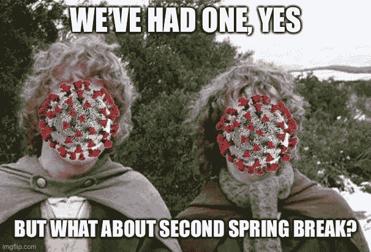

# 如何在家处理大学

> 原文：<https://levelup.gitconnected.com/how-to-handle-college-at-home-238bf77f1b99>

## 当你的学校因冠状病毒而在网上推课时如何应对

艾玛·马修斯数字内容制作于 [Unsplash](https://unsplash.com?utm_source=medium&utm_medium=referral) 发布

你是最近成千上万流离失所的大学生之一吗？许多人都在谈论、写作和阅读关于他们到*远程工作*的传输，但是关于*远程学习却没有说太多。许多相同的概念都适用，但也有许多不同之处！我实际上在家接受了 12 年的教育，包括一些在线课程和很多自我指导。在大学里，我已经上过一些网络课程。甚至我的工作已经远离很长一段时间了，现在(我想和你一样)我也被迫在网上完成整个学期。*

我并不十分担心这种转变，仅仅是因为它并没有太多地改变我的生活方式。仍然有一些调整，主要是回家和我的父母协调，其中之一也是 WFH(在家工作)在这个紧张的时间。被留在你自己的设备和被锁在你的房子里需要大量的自律，而且肯定会很快到达你。每个人都是不同的，但我知道有些事情可以帮助我在远程工作时尽可能地高效和健康。这里有一些建议，我希望能帮助你尽可能地成功。尽早养成良好的习惯，当在线考试即将来临的时候，你会感谢自己的，🥴

# 认清形势

毫无疑问，这个世界现在正受到伤害。你并不孤单。世界各地的人们都在颠倒他们的生活。请记住，世界不会终结，但我们正在采取的措施确实在阻止它终结。

我们都被拉下了毯子。你的教授和同行都和你同病相怜。我们没有注册这个(有些人注册了，但是如果你注册了在线课程，你可能会写这篇文章)。当你的老师努力为你提供你所支付的教育时，要对他们有耐心。对自己要有耐心——在全球经济危机的时候，你的生产力处于巅峰状态是很不寻常的。

# 为学校创造一个空间

当然，躺在床上听课和在沙发上学习很恶心(没有双关语的意思)，但这将导致毁灭性的生产力损失。有些人在哪里都能茁壮成长，但是随着我们在家里呆的时间越来越长，提醒你的大脑哪里有工作，哪里没有工作变得越来越重要。我在一个封闭的房间里工作得最好，那里有一张干净的桌子和一把漂亮的椅子。但这不可能在所有时候都适用于所有人。不是每个人都有桌子，我被贴在父母的餐桌上👌。尽你所能为你的教育贡献一些物质空间，因为这肯定会帮助你贡献一些精神空间。音乐和耳机是你孤立时的朋友，因为它会帮助你盖过分享你学校空间的其他人。

# 创造一个上学的时间

这不是“永远的春假”，尽管感觉上还是那样。除了必须的学习和家庭作业之外，每天花点时间去听“讲座”真的很重要，不管是什么形式的讲座。关掉你的手机，如果可以的话关上门！

把时间花在学校会帮助你在工作和生活中找到健康的平衡。在你做模拟考试的时候，没有让电视“在后台”开着这样的事情。如果你在答应自己要做的时间里把注意力放在学习上，你的空闲时间将完全属于你。

# 使用计划工具

跟踪在线课程是非常困难的。教授们可能会也可能不会提醒你该做的事情，让你有条理肯定不是他们的责任。把每件事都写下来，优先考虑你的每一天。很多人发现用数字方式做这件事最简单——我用 Todoist，[,我已经写了一篇关于它如何帮助我保持条理的文章。](https://medium.com/swlh/how-i-use-todoist-to-organize-my-life-as-a-student-8c95d5597a1d?source=friends_link&sk=5cdc006415567f1db52f83684016fe1a)

# 与家人沟通

如果你像我一样长期呆在家里，每个人都需要适应一下。要让他们明白，为了成功，你需要不受干扰的时间来投入到学习中。如果你经常被打扰，即使这些打扰很重要，你也很难完成深入的工作。如果你的注意力绝对需要在你的学校时间，帮助你的家人了解如何获得信息，同时仍然尊重你的空间。

# 穿衣服

整天穿着睡衣闲逛是很容易的，这完全没问题。然而，如果你起床并为这一天做好准备，就像你要出去走走一样，这有助于提醒你今天不是下雪天。卫生和生活习惯会对你的心理健康产生奇迹！

尽管有这些提示，远程工作给了你在需要时打破这些规则的自由。使用这款狂野的疫情，充分利用远程工作提供的自主性。谁知道呢，你可能会发现你最渴望的工作是远程工作的机会。

如果你喜欢这个，你可能会喜欢我的其他一些文章。我写了很多关于编程的东西，也写了一些关于生产率的东西。你可以在这里或在 twitter 上关注我。