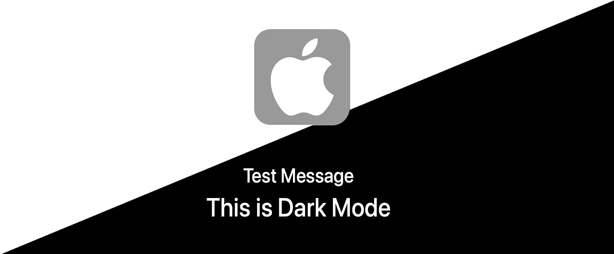

# 如何:处理 Apple Mail 客户端的黑暗模式

> 原文：<https://levelup.gitconnected.com/how-to-handle-dark-mode-for-apple-mail-client-e22a06f72eb7>

## 一个简单的方法，让您发送简讯电子邮件给客户，即使在黑暗中…

你曾经给你的客户发送过时事通讯邮件吗？如果有，你知道如何让你的设计在 macOS 上兼容原生黑暗模式吗？以下是如何…

# 工具

我用 **SendGrid** 作为例子，因为他们有一个非常用户友好的`code editor`并且可以实时预览。

[sendgrid.com](https://sendgrid.com/?ref=https://1998design.medium.com/)(免费——每天 100 封邮件)

SendGrid 的 UI 演示

# 苹果邮件客户端如何在黑暗模式下工作

首先，在邮件首选项>查看中，如果启用了“`Use dark backgrounds for messages`”选项，邮件应用程序将默认自动反转邮件的颜色。

## 样品

不正确与正确的方法

如果你只是在邮件中添加一个`[@media](http://twitter.com/media) (prefers-color-scheme: dark)`，显示将会不正确。看左边的。

那么，如何使邮件客户端我们的电子邮件使用我们的黑暗设计，而不是系统覆盖？诀窍是`**meta ‘color-scheme’**` **！**

如果你的 HTML 邮件模板支持自定义的深色主题，那么你应该使用第一个主题。

1.  `**<meta name="color-scheme" content="light dark">**`
2.  `<meta name=”color-scheme” content=”light”>`
3.  `<meta name=”color-scheme” content=”dark”>`

## 源代码

您可以随意使用我的代码进行测试:)

# 感谢阅读:)

关注我的 [**推特**](https://twitter.com/1998design)

 [## 明

twitter.com](https://twitter.com/1998design) 