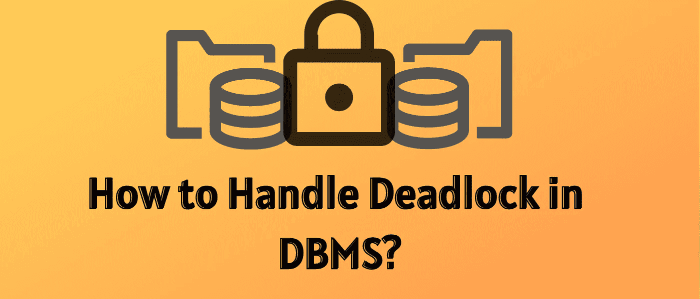
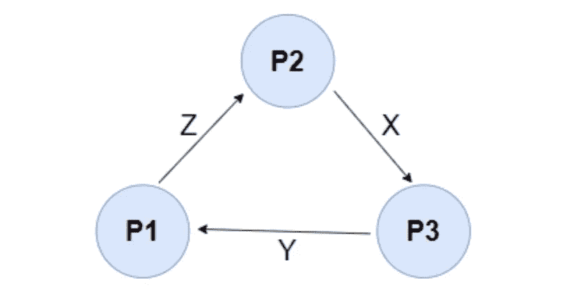
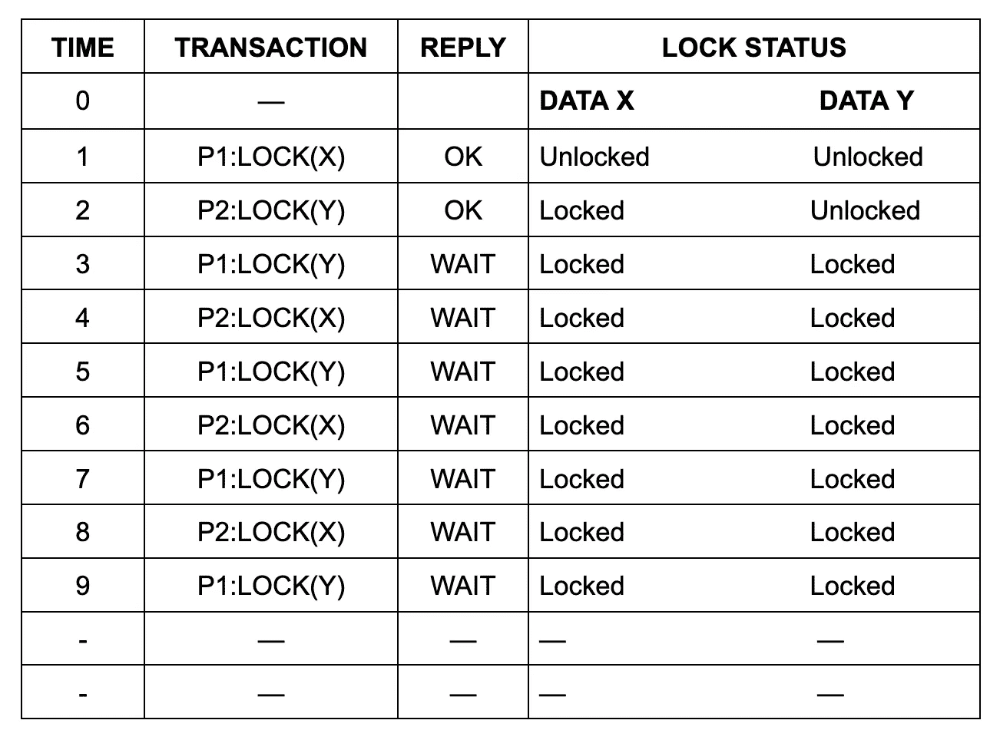
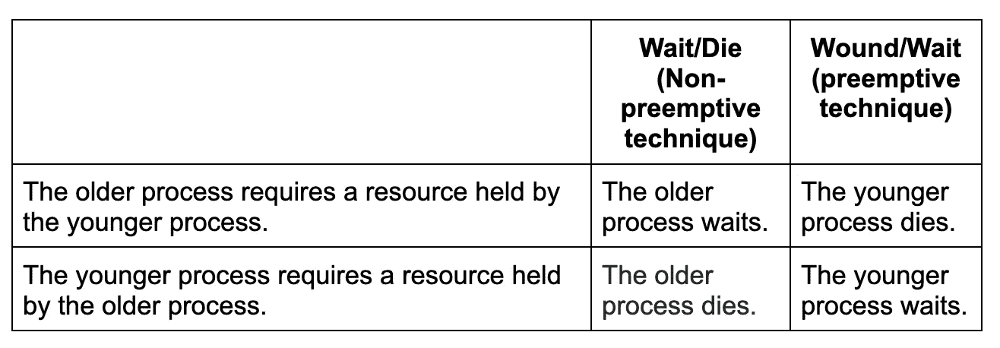

# 如何处理数据库管理系统中的死锁

> 原文：<https://levelup.gitconnected.com/how-to-handle-deadlock-in-dbms-e708f88edf2c>

当数据库系统中的两个或多个事务正在等待被另一个事务锁定的数据项时，就会发生死锁。等待图中的循环可以指示死锁。这是一个有向图，顶点表示事务，边表示对数据项的等待。

例如，在下面的[等待图](https://en.wikipedia.org/wiki/Wait-for_graph)中，事务 P1 正在等待数据项 X，该数据项被 P3 锁定。P3 在等被 P2 锁定的 Z，P2 在等被 P1 锁定的 Y。因此，会生成一个等待循环，并且没有一个事务可以执行。

进程处于死锁状态

# **什么是数据库管理系统中的死锁？**

[DBMS](https://www.ibm.com/docs/en/zos-basic-skills?topic=zos-what-is-database-management-system) 中的死锁是一种不希望出现的状态，当一个进程无限期等待另一个进程占用的资源时，就会出现这种状态。

为了更好地理解死锁的概念，假设事务 T1 锁定了表 Employee 中的几行，并且必须更改另一个表 Salary 中的某些行。

还有另一个事务 T2，它锁定了 Salary 表，需要更新 Employee 表中的几行，该表已经被事务 T1 持有。

在这种情况下，事务和进程都在等待对方释放锁，而进程也在等待对方释放资源。作为前面场景的结果，没有完成任何作业，这被称为死锁。

# **DBMS 中为什么会出现死锁？**

当两个事务无休止地等待对方解锁数据时，就会出现死锁。

当 P1 和 P2 两个事务以下列模式存在时，就会出现死锁:

P1 =访问数据项 X 和 Y

P2 =访问数据项 Y 和 X

如果 P1 没有解锁数据项 Y，P2 不能开始，如果 P2 没有解锁数据项 x，P1 不能继续

结果，P1 和 P2 都在等待对方解锁所需的数据项。这种类型的死锁也被描述为致命的拥抱。下表显示了在 DBMS 中死锁条件是如何发生的。

## **集中式系统中的死锁处理**

在 DBMS 中有三种处理死锁的传统方法:

*   死锁预防。
*   避免死锁。
*   死锁检测和消除。

所有这三种方法都可以在集中式和[分布式数据库系统](https://www.scaler.com/topics/dbms/distributed-database-in-dbms/)中用来处理死锁情况。

# **死锁预防**

死锁预防策略禁止任何事务获取会导致死锁的锁。根据约定，当多个事务请求锁定同一个数据项时，只有其中一个事务被授予锁定。

预先获取所有锁是最流行的死锁预防策略之一。在这种方法中，事务在开始执行之前获得所有锁，并在事务期间保持这些锁。

如果另一个事务需要任何以前获得的锁，它必须等待，直到所有需要的锁都可以访问。这种策略可以防止系统堵塞，因为没有等待的事务持有任何锁。

在 DBMS 中有两种避免死锁的算法。

*   **Wait/Die:** 当一个事务需要一个已经被另一个事务锁定的资源时，DBMS 会比较两个事务的时间戳，并强制较旧的事务等待，直到资源可以执行为止。
*   **wind/Wait:**当一个较老的事务需要一个已经被一个较年轻的事务锁定的资源(一个较晚启动的事务)时，较年轻的事务被迫终止/停止它的处理，并释放锁定的资源以供较老的事务自己执行。较新的事务在一分钟的延迟后重新启动，但是[时间戳](https://www.youtube.com/watch?v=27NtGV1vNoY)保持不变。如果一个较年轻的事务需要一个较老的事务持有的资源，则该较年轻的事务被迫等待，直到较老的事务释放该资源。

例如，假设有两个事务，T1 和 T2，其中 T1 试图锁定一个已经被 T2 锁定的数据项。算法如下:

*   ***等死****—*T1 如果比 T2 大，就允许等。如果 T1 比 T2 年轻，则该过程中止，然后重新开始。
*   ***伤口等待****—*如果 T1 比 T2 早，T2 被取消并重新启动。如果 T1 比 T2 年轻，则允许等待。

# **死锁避免**

当数据库被死锁时，避免死锁总是比重新启动或中止数据库更可取。这完全是浪费时间和资源。避免策略适用于较小的数据集，但预防方法更适用于较大的数据库。

死锁避免可以总结如下。

事务开始执行，并需要必须锁定的数据项。锁管理器确定锁是否可用。如果可用，锁管理将数据项分配给事务，事务获得锁。

如果该项被另一个处于不兼容模式的事务锁定，锁管理将执行一个算法来确定将事务保持在等待状态是否会导致死锁。因此，该算法确定事务是否可以等待，或者是否应该取消其中一个事务。

# **死锁检测和消除**

死锁检测和消除策略定期运行死锁检测算法，如果存在死锁，则消除死锁。当事务请求锁时，它不检查死锁，而锁管理器确定锁是否可用。如果可用，事务可以锁定数据项；否则，事务可能会等待。

由于在授予锁请求时没有采取任何措施，一些事务可能会被死锁。锁管理定期检查等待图的周期，以检测死锁。如果系统停滞，锁管理从每个周期选择一个牺牲事务。受害者被中止、回滚，然后重新启动。

当发现死锁时，使用以下方法解决它:

*   **终止死锁所涉及的进程:**终止死锁所涉及的所有进程或者逐个终止进程直到死锁被解决都是可行的方法，但是这两种方法都不好。终止所有进程的成本是相当大的，并且进程完成的部分工作会丢失。终止每个进程需要很长时间，因为每次进程被终止时，它都必须验证死锁是否已经解决。最佳策略是在死锁情况下终止进程，同时考虑它们的年龄和重要性。
*   **抢占资源:**另一种策略是抢占资源，并将它们分配给其他进程，直到死锁被解决。
*   **等待图表:**检测死锁的一种方法是使用等待图表。这种方法适用于较小的数据库。在这种策略中，基于事务及其对资源的锁定来构建图。如果构造的图包含一个闭环或循环，则存在死锁。

# 结论

*   死锁是一种不希望出现的状态，它会使整个系统停止，因为没有任务完成，并且无限期地处于等待状态。如果任何一个事务有可能导致死锁，它就永远不会完成。
*   死锁处理和避免是处理该问题的方法，而等待死亡和等待受伤方案是避免死锁的两种流行方法。