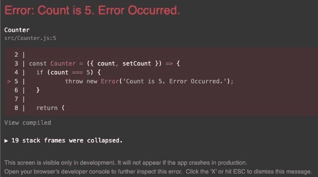
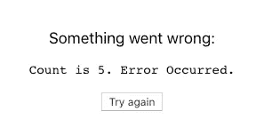

# 如何用 React 错误边界处理 React 中的错误

> 原文：<https://levelup.gitconnected.com/how-to-handle-errors-in-react-with-react-error-boundary-436cf423bdca>

## react-error-boundary 包介绍及示例


由[布雷特·乔丹](https://unsplash.com/@brett_jordan?utm_source=medium&utm_medium=referral)在 [Unsplash](https://unsplash.com?utm_source=medium&utm_medium=referral) 上拍摄的照片

错误是编程时每天都要处理的事情。有些可以简单解决，有些则需要几个小时才能搞清楚。

在本文中，我们将研究如何处理 React 应用程序中的错误。我们将从学习错误边界开始，然后我们将看到如何使用 react-error-boundary 包来处理它们。

# 什么是误差边界？

根据官方 React [文档](https://reactjs.org/docs/error-boundaries.html)，

> 错误边界是 React 组件，**捕捉子组件树中任何地方的 JavaScript 错误，记录这些错误，并显示回退 UI** 而不是崩溃的组件树。错误边界在渲染期间、在生命周期方法中以及在它们下面的整个树的构造函数中捕捉错误。”

基本上，在组件生命周期中发生的任何 JavaScript 错误都可以被错误边界捕获。然后，React 将为您显示一个后备 UI 组件，而不是让应用程序中断。

错误边界的概念仍然很新，因为它是在 React 16 中发布的。在这个版本之前，没有很好的方法来优雅地处理错误。

# 例子

让我们用一个简单的例子来演示一个错误。我们将创建一个带有递增和递减按钮的计数器组件。如果计数等于 5，我们将抛出一个错误。

我们将在我们的应用程序组件中显示这个计数器组件。在 App 组件中，我们将声明 count 的一个状态变量。

如果我们运行我们的应用程序，我们将有一个带有两个递增和递减按钮的计数器。如果我们的计数器等于 5，我们将得到我们在计数器组件中抛出的错误。



从图片底部的消息可以看到，*“这个屏幕只有在开发中可见。如果应用在生产中崩溃，它不会出现。”*如果我们关闭此屏幕，我们会看到一个空白屏幕。重置状态并重新呈现组件的唯一方法是完全刷新页面。

# 处理错误的类组件

官方文档建议使用类组件来创建错误边界。这可以使用`static getDerivedStateFromError()`或`componentDidCatch()`来完成。

这是他们举的一个简单的例子。

老实说，自从我开始学习 React 以来，我还没有编写过一个类组件。我确信这个解决方案非常有效，但是肯定还有其他方法。

# 反应误差边界

快速的谷歌搜索把我们带到了[反应错误边界](https://www.npmjs.com/package/react-error-boundary)包。npm 的每周下载量超过 600，000 次，目前 GitHub 的下载量为 2.3k 星。

这个包给了我们一个包装器组件，我们可以在任何想要处理错误的组件周围使用它。您可以使用它来包装单个组件或组件树。组件或其子组件中出现的任何错误都将由该包装器处理。你也可以用它来包装你的整个应用程序，并提供一个通用的错误信息。

要使用这个组件，您需要做的就是从库中导入它，并包装可能会引发错误的组件。

```
import { ErrorBoundary } from 'react-error-boundary';const errorComponent = (
  <ErrorBoundary FallbackComponent={ErrorFallback} onReset={() => {
// reset the state of the app
    }}
  >
    <Component that may cause an error />
  </ErrorBoundary>
);
```

`ErrorBoundary`组件带一个`FallbackComponent`道具。传递给此的组件将在出错时呈现。你也可以通过一个`onReset`回调函数。该函数将在`ErrorBoundary`组件重置其内部状态之前被调用。在这个函数中，你需要做一些事情来重置你的应用程序的状态，这样错误就不会再重复了。

现在，让我们回到我们的计数器组件示例，使用 react-error-boundary 包捕获这个错误。

我们将首先创建一个后备组件来呈现任何错误。将从错误边界组件向该组件传递一个`error`道具和一个`resetErrorBoundary`道具。我们将显示错误消息，并添加一个调用`resetErrorBoundary`的按钮。

```
const ErrorFallback = ({ *error*, *resetErrorBoundary* }) => {
  return (
    <div role="alert">
      <p>Something went wrong:</p>
      <pre>{error.message}</pre>
      <button onClick={resetErrorBoundary}>Try again</button>
    </div>
  );
};
```

接下来，我们将使用错误边界包装计数器组件，并传递一个`FallbackComponent`属性和`onReset`属性。在`onReset`中，我们将 count 变量的状态设置为 0。

```
const App = () => {
  const [count, setCount] = useState(0);

  return (
    <div className="App">
      <ErrorBoundary
        FallbackComponent={ErrorFallback}
        onReset={() => setCount(0)}
      >
        <Counter count={count} setCount={setCount} /
      </ErrorBoundary>
    </div>
  );
};
```

App 组件现在看起来将是这样的。

如果我们增加我们的计数，它等于 5，我们将看到与前面相同的错误屏幕。但是，如果我们关闭这个屏幕，我们现在将看到我们创建的`ErrorFallback`组件。



如果我们单击“重试”按钮，我们的计数状态将重置为 0，我们的应用程序将重新呈现。

# 结论

在任何应用程序中，处理错误都很重要。这里需要注意的一点是，这些错误边界只处理 JavaScript 错误。它们不捕捉事件处理程序、异步代码、服务器端呈现的错误，也不捕捉错误边界本身引发的错误。

感谢阅读！我希望您学会了一种在 React 应用程序中处理错误的方法。react-error-boundary 包非常有用，我发现它比使用文档推荐的类组件生命周期要干净得多。在你的下一次申请中试试吧！

如果您想了解更多关于其他有用的 React 包的信息，请查看下面的文章。

[](https://medium.com/dev-genius/the-easiest-way-to-deal-with-forms-in-react-ad6bc1250829) [## React 中处理表单的最简单方法

### 使用 React 钩子形式来提高应用程序的性能

medium.com](https://medium.com/dev-genius/the-easiest-way-to-deal-with-forms-in-react-ad6bc1250829)