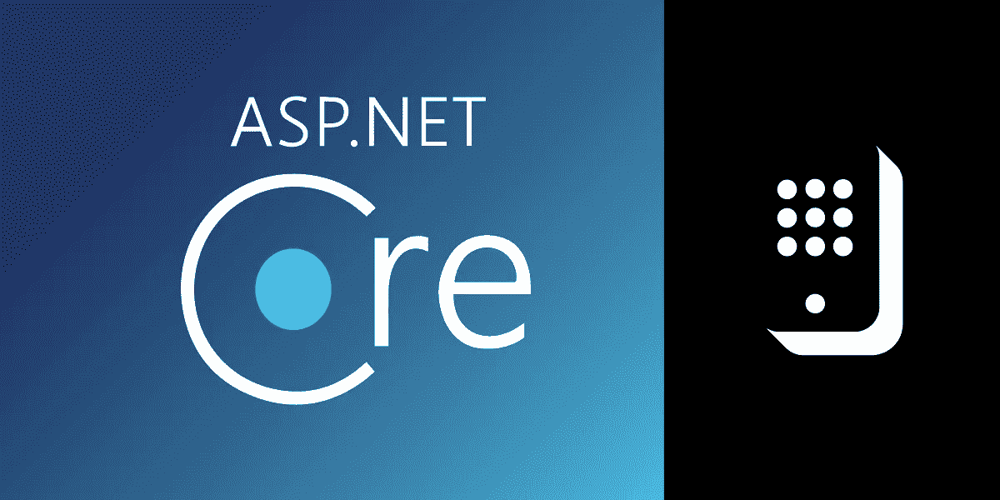
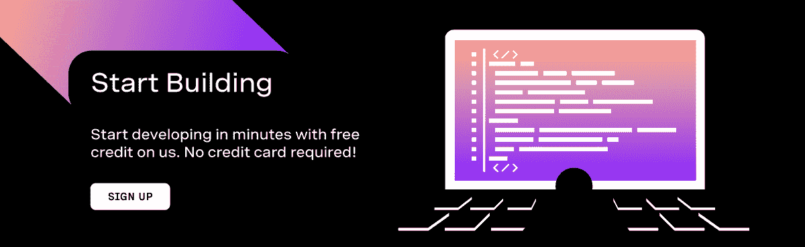
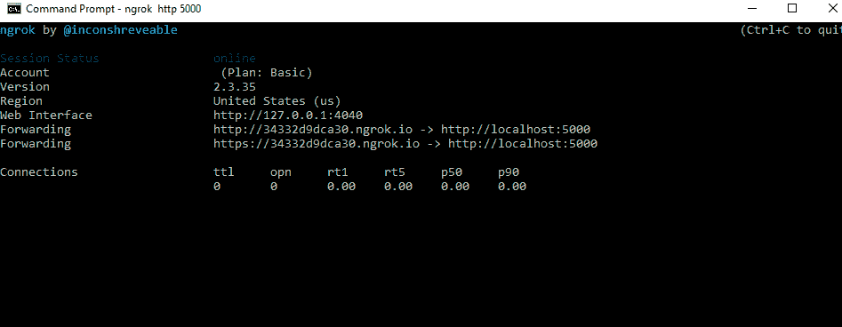

# 如何在 ASP.NET 核心网处理来自电话的手机输入(DTMF)

> 原文：<https://levelup.gitconnected.com/how-to-handle-handset-input-dtmf-from-a-phone-call-in-asp-net-core-417f7a8554e0>

任何交互式语音应答(IVR)系统的基本构件都是处理输入。通常有两种类型的输入可以通过编程从公共交换电话网(PSTN)获取，这两种类型都受 Vonage 支持:

1.  [双音多频(DTMF)](https://developer.nexmo.com/voice/voice-api/guides/dtmf)——这些是从用户手机上收集的输入事件。例如，“销售按 1，客户服务按 2”
2.  [自动语音识别(ASR)](https://developer.nexmo.com/voice/voice-api/guides/asr)-这些是语音识别事件，输入是用户的声音。

在本教程中，我们将使用 [Vonage 语音 API](https://developer.nexmo.com/voice/voice-api/overview) 来学习如何快速将前者(DTMF)整合到我们的 ASP.NET 核心应用中。通过 PSTN 呼叫从用户处收集 DTMF 将涉及以下内容:

1.  如果你还没有 Vonage API 账户的话，建立一个
2.  使用 [CLI](https://github.com/Nexmo/nexmo-cli) 创建 Vonage 应用程序
3.  写点 C#代码。
4.  将我们的应用程序连接到网络。

# 直接跳到代码

如果你想跳过本教程并引入一个工作示例，你可以在 [GitHub](https://github.com/nexmo-community/dtmf-dotnet) 中找到这个示例。

# 先决条件

*   nexmo CLI。如果没有，可以用`npm install nexmo-cli -g`安装
*   最新[。NET Core SDK](https://dotnet.microsoft.com/download)
*   Visual Studio 或 Visual Studio 代码。我将使用 Visual Studio 2019
*   用于测试的 ngrok 。你只需要自由层。

# Vonage API 帐户

要完成本教程，您需要一个 [Vonage API 帐户](http://developer.nexmo.com/ed?c=blog_text&ct=2020-10-20-how-to-handle-handset-input-dtmf-from-a-phone-call-in-asp-net-core)。如果你还没有，你可以今天[注册](http://developer.nexmo.com/ed?c=blog_text&ct=2020-10-20-how-to-handle-handset-input-dtmf-from-a-phone-call-in-asp-net-core)并开始用免费信用点数进行构建。一旦你有了一个帐户，你可以在 [Vonage API 仪表板](http://developer.nexmo.com/ed?c=blog_text&ct=2020-10-20-how-to-handle-handset-input-dtmf-from-a-phone-call-in-asp-net-core)的顶部找到你的 API 密钥和 API 秘密

# 旋转 ngrok

我们将使用 ngrok 向互联网公开我们本地运行的 ASP.NET 核心应用程序。在你安装了 ngrok 之后，这样做就像在你的控制台中运行命令`ngrok http 5000`一样简单。会产生类似这样的东西:

> 注意:本教程使用 [Kestral](https://docs.microsoft.com/en-us/aspnet/core/fundamentals/servers/kestrel?view=aspnetcore-3.1) 进行本地调试。如果你想使用 IIS Express，请查看我们的[解释器](https://developer.nexmo.com/tools/ngrok#configure-iis-express-for-the-correct-port)关于在 IIS Express 中使用 ngrok。

这里需要注意的关键是转发 URL——在我的例子中，这个 URL 是`http://34332d9dca30.ngrok.io`。当你在 Vonage 号码上收到一个呼叫时，Vonage 将向你的应用程序发送一个叫做 WebHook 的东西，这只是一个 HTTP GET 请求，要求一个叫做 Nexmo 呼叫控制对象(NCCO)的东西。我们的应用程序将监听`/webhooks/answer`，所以我需要的整个 URL 将是`[http://34332d9dca30.ngrok.io/webhooks/answer](http://34332d9dca30.ngrok.io/webhooks/answer.)` [。](http://34332d9dca30.ngrok.io/webhooks/answer.)

# 设置 CLI

如果您还没有设置 nexmo CLI，请通过运行命令`nexmo setup API_KEY API_SECRET`来设置，其中 API 密钥和密码是在您的[帐户的设置页面](https://dashboard.nexmo.com/settings)上找到的 API 密钥和密码

# 购买号码并创建应用程序

现在，您的 CLI 已设置好，我们将购买一个号码，创建一个 Vonage 应用程序，并将该号码链接到该应用程序，它将告诉 Vonage 转发到您的应用程序。

## 买一个号码

要购买号码，请使用以下命令(用您的国家 ID 代替`US`)

键入`confirm`完成操作；它将输出您购买的号码。

## 创建应用程序

接下来，我们将创建一个应用程序。create application 命令将接受两个 URL，一个是应答 URL——Vonage 将向其发送来电的号码，另一个是事件 URL，Vonage 将向其发送由您的一个号码产生的事件。记住用你的 ngrok URL 的随机散列替换`34332d9dca30`:

此操作将使用应用程序 ID 和私钥进行响应。保存这两个值。在本教程中，我们将只使用应用程序 ID，但是您使用私钥来授权您的应用程序请求。

## 链接应用程序

接下来，我们需要将新购买的号码链接到我们的应用程序。链接我们的号码将告诉 Vonage 将该号码上收到的任何呼叫发送到我们的应用程序的 webhook URL。为此，我们需要刚刚从创建应用程序请求中收到的应用程序 ID(看起来像`e7a25242-77a1-42cd-a32e-09febcb375f4`)和我们刚刚购买的电话号码，我们将运行如下所示的命令:

# 构建我们的应用

现在剩下要做的就是构建我们的应用程序！

## 创建应用程序

在控制台中，导航到通常放置代码的目录。我们将创建一个 ASP.NET 核心应用程序`Web API`。我们就不配置`https`，这样更容易测试。您可以使用以下 dotnet CLI 命令轻松实现这一点:

## 安装 Vonage SDK

运行 cd 命令进入`VonageDtmf`项目文件夹，并运行以下命令将 [Vonage Server SDK](https://github.com/vonage/vonage-dotnet-sdk) 添加到您的项目中。

## 创建语音控制器

导航到它创建的目录，并在您选择的 IDE 中打开 csproj 文件。在`Controllers`文件夹中，添加一个名为`VoiceController`的新的空 API 控制器。在`VoiceController`中，除了 ApiController 样板文件之外，我们还将添加用于`System.Threading.Tasks`、`Vonage.Utility`、`Vonage.Voice.EventWebhooks`和`Vonage.Voice.Nccos`的语句。之后，控制器应该是这样的。

## 处理回答

我们现在将为`/webhooks/answer`添加路线。这个路由将是一个 GET 请求，因为 Vonage 将从我们的服务器获得一个 NCCO。这个方法将使用两个动作(调用的指令)构造一个 NCCO。动作一将是一个讲话动作，它将告诉用户输入一个数字。那么第二个动作将是多输入动作。此操作将收集用户的输入。您可以指定是否通过此操作收集 DTMF 和/或语音输入。我们将通过向动作添加一个`DtmfSettings`对象并将其最大位数设置为`1`来选择 DTMF。我们将把事件 URL 传递给它——这将是我们在`/webhooks/dtmf`的服务器的基本 URL(我们将很快定义这个路由。)最后，我们将这些动作转换成 NCCO，并将来自该动作的 JSON 返回给 Vonage。

## 处理 DTMF 输入

当用户在手机上输入一个数字时，我们的应用程序将从 Vonage 接收另一个包含用户输入数字的 webhook。我们将从请求中去掉`MultiInput`结构。然后，我们将使用该结构中嵌入在`Dtmf`对象中的数字来创建一个新的 Talk 动作，告诉用户输入的内容。

# 测试应用程序

现在剩下要做的就是测试应用程序。要运行该应用程序，请使用以下命令:

> 注意:如果您选择使用 IIS Express，请务必阅读我们关于使用 ngrok 的 IIS Express 的文章[。确保在您的回答方法中使用 x-original-host 来形成主机名，而不是请求主机。](https://developer.nexmo.com/tools/ngrok#usage-with-iis-express)

现在我们的应用程序正在运行，您可以拨入您的 Vonage 号码，瞧！您可以接收用户的 DTMF 输入。

# 下一步是什么？

能够管理来自用户的 DTMF 输入并通过 PSTN 线路对其作出响应，使您能够与语音建立各种强大的集成。查看我们的[交互式语音应答(IVR)指南](https://developer.nexmo.com/use-cases/interactive-voice-response)。

你也可以看看我谈到的其他一些很酷的语音集成。净，包括:

*最初发布于*[*https://www . NEX mo . com/blog/2020/10/20/how-to-handle-handset-input-DTMF-from-a-phone-call-in-ASP-net-core*](https://www.nexmo.com/blog/2020/10/20/how-to-handle-handset-input-dtmf-from-a-phone-call-in-asp-net-core)