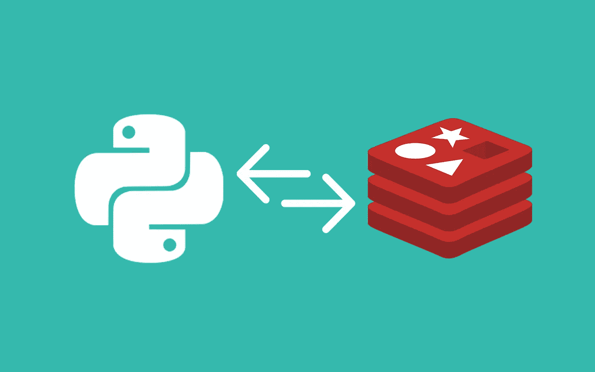

# 如何使用 Redis 队列在 Python 中处理长期运行的任务

> 原文：<https://levelup.gitconnected.com/how-to-handle-long-running-tasks-in-python-using-redis-queues-f6a78a4b7f87>

## 易于实现，没有太多开销



作者创作的图像

作为一名开发人员，您可能有处理长时间运行任务的经验，并且您希望这个耗时且阻塞的任务可以在后台运行，而主应用程序则服务于其他请求。我知道，有异步编程，但当我们有 CPU 绑定的操作时，它不会工作。

在 python 中，我们可以设置在后台工作的任务队列。我说的是 Redis 队列，在本文中，我们将看到如何从函数/方法创建一个任务，并在后台执行它。

# 先决条件

系统中必须安装 Redis ≥ 3.0.0 和 Python ≥ 3.5。

安装 Redis:[https://redis.io/download](https://redis.io/download)

安装 Python:【https://www.python.org/downloads/ 

# Python RQ 简介

[Python RQ](https://python-rq.org/) 是一个允许用户用函数创建后台作业的库。这些作业可以通过 RQ APIs 进行调度和管理。

图像

## RQ 的组成部分

1.  职位

一个[作业](https://python-rq.org/docs/jobs/)是一个要执行的任务。它有自己的 id、状态(运行、失败、完成)、提交时间、目标函数和目标函数的关键字参数。

2.长队

[队列](https://python-rq.org/docs/)，顾名思义，是一个用来排列工作并以先进先出的方式分派给工人的系统。

3.工人

可能是 RQ 最重要的部分，一个 [worker](https://python-rq.org/docs/workers/) 从一个队列中取出一个作业，在启动 worker 时指定，并使用传递的关键字参数执行目标函数。一个 worker 可以处理多个队列，多个 worker 可以处理同一个队列，增加了系统的吞吐量。

4.登记处

一个[注册表](https://python-rq.org/docs/job_registries/)作为作业的分类器。例如，所有失败的作业被移动到失败的作业注册表中，而完成的作业被移动到完成的作业注册表中。

## 工作

## 装置

使用 pip 安装:

```
pip install rq
```

或最新版本(可能包含错误)

```
pip install git+https://github.com/nvie/rq.git@master#egg=rq
```

# 使用 Python RQ

首先，从导入所需的类开始，并初始化 redis 队列对象。

接下来，为了将长时间运行的任务添加到队列中，我们将使用 *enqueue()* 方法*，*它将目标函数作为必需的参数。

一旦任务被排队，它将在队列中等待，直到它被一个工人拾取，并且在完成作业状态之后，结束时间和结果将被更新。

通过终端指定要服务的队列来启动一个工作进程。

```
rq worker long_task_queue
```

稍后，我们可以使用作业入队后获得的作业 id 来检查提交的任务结果。

# 结论

感谢您阅读本教程。我将推出更多关于 Python RQ 和自动化的教程，敬请关注！

# 分级编码

感谢您成为我们社区的一员！在你离开之前:

*   👏为故事鼓掌，跟着作者走👉
*   📰查看[级编码出版物](https://levelup.gitconnected.com/?utm_source=pub&utm_medium=post)中的更多内容
*   🔔关注我们:[推特](https://twitter.com/gitconnected) | [LinkedIn](https://www.linkedin.com/company/gitconnected) | [时事通讯](https://newsletter.levelup.dev)

🚀👉 [**软件工程师的顶级工作**](https://jobs.levelup.dev/jobs?utm_source=pub&utm_medium=post)