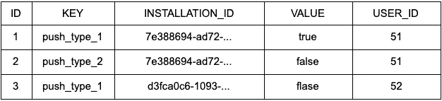

# 推送通知&你的业务逻辑:Firebase 没有告诉你什么

> 原文：<https://levelup.gitconnected.com/how-to-handle-push-notification-with-fcm-9973b086736b>

over app([https://www.overapp.com](https://www.overapp.com))的 iOS 开发者拉维尼娅·伯图齐

## **摘要**

Firebase Cloud Messasing 是 Google 推出的一款功能极其强大且易于使用的产品，用于发送消息和通知。它是一个巨大的集成工具生态系统的一部分，这个生态系统被称为 Firebase。它提供了一个强大的控制台，一个与其他工具如 [A/B 测试](https://firebase.google.com/docs/ab-testing)和[预测](https://firebase.google.com/docs/predictions)的现成集成。

对于共享同一设备并登录和注销该设备的用户的管理，以及对于同时想要接收自己的通知并决定通过它们接收什么类型的内容的用户，它不提供特定的功能。因此，开发人员必须考虑自己的解决方案。

## **我们文章的重点**

我们将与各种平台上的 Firebase 设置相关的所有细节留给网上的众多教程。相反，我们想讨论我们开发的使用 FCM 的产品所采用的解决方案。这迫使我们特别要处理一些问题:处理多个用户，他们可以使用同一个设备，或者在不同的设备上有不同的设置，他们可以接收不同类型的通知。

Firebase 没有提供处理这种场景的特定特性，阅读一些关于我们采用的解决方案的内容可能会对您有所帮助。

我们的产品使用定制的后端服务器，实现注册、激活、登录用户、返回任何内容的所有逻辑。

此外，还有一个计划工具，可以循环验证必须通知的用户，并确定哪些类型的内容将与推送通知一起发送。然后它与 FCM 接口进行交付。

## **数据库**

我们在数据库上创建了一些表:

*   包含用户个人信息的表格，如姓名、电话、地址等。
*   包含用户会话信息的表，其中存储了每个用户登录时生成的不记名令牌。
*   包含安装信息的表格。

## **代币和装置**

当用户安装并执行应用程序时，Firebase 会返回一个令牌。

该应用程序将其存储在应用程序沙箱中(在 iOS 上使用 UserDefaults 或在 Android 上使用 SharedPreferences ),以便在需要时和未来登录时使用。当用户第一次登录时，应用程序调用一个登录 API，该 API 接收:

*   用户的凭据；
*   名为 InstallationID 的空参数；
*   关于设备和操作系统版本的信息；

这个 API 执行所有检查来验证凭证，如果它们有效，它就创建一个会话并将一个不记名令牌保存到相应的表中。

最后，因为我们传递了一个空的安装 ID，所以它会生成一个 GUID，并将其与不记名令牌 ID 一起存储在 Installations 表中。

这个新的安装 ID 以与 Firebase 令牌相同的方式表示应用程序在设备上的当前安装。

登录 API 返回一个响应，其中包含有关用户会话和新安装 Id 的信息，并存储这些值(供用户进一步登录时使用)。

为了完成登录过程，我们需要执行 Assign API，将用户(不记名令牌)、firebase 令牌和安装 ID 配对。

此时，我们的后端可以轻松识别用户和正在使用的设备，并最终要求 FCM 发送通知。

如果用户注销，应用程序调用 Logout API，该 API 在 Sessions 表中搜索用户会话 id，将其标记为过期，然后在 installations 表中搜索相同的值，将其设置为 null。

负责请求 FCM 发送通知的计划工具只考虑在安装表中有记录的用户，该记录与安装 id、firebase 令牌和用户会话 Id 成对出现。

如果不同的用户使用自己的凭据登录应用程序，installationID 和 firebase 令牌仍然保持不变。在登录调用验证了用户的凭证之后，会生成另一个承载令牌来标识具有活动会话的用户。

这样，如果一个用户注销，另一个用户尝试登录(或者如果多个用户登录到您的应用程序)，我们就知道哪个用户有活动会话。

## **Firebase 令牌到期**

尽管在非常有限的情况下，firebase 令牌可能会过期。有关必要的详细信息，请参考官方文档。

如果 Firebase 令牌发生更改，则无法识别用户登录的设备。

因此，后端不再能够向 FCM 提供正确有效的令牌来标识用户的设备以向其发送通知

幸运的是，FCM SDK 设计得很好，它会自动管理新刷新令牌的接收，每次它发生变化时，我们都会将其存储为新令牌，并通过调用 Assign API 与后端进行通信。

## **推送通知瞄准**

在我们产品的需求中，也有用户选择通过通知接收的内容类型的可能性。例如，他必须能够接收提醒，并禁止发送不同类型的信息。顺便说一下，FCM 没有提供任何特性。

在这种情况下，我们采用了一种非常简单的解决方案。我们在数据库中添加了一个表，所有用户的首选项都以键/值对的形式存储在这个表中。

这里有一个例子:

通过这种方式，我们有可能以非常简单的方式访问单一设置，并且很容易添加将来可能变得必要的新设置。然后，我们将单个设置不仅链接到用户 id，还链接到安装 id。

通过这样做，在两个不同设备(例如智能手机和平板电脑)上共享帐户的用户可以选择在一个设备上接收某种类型的消息，而在另一个设备上不接收。

## **结论**

Firebase Cloud Messaging 是向运行您的网站或移动应用程序的用户发送消息的绝佳工具。

它没有提供处理目标通知或本文开头部分描述的其他主题的功能。如上所述，开发人员必须编写自己的解决方案。

我们希望这些概念可能对你有用！😄

over app(【https://www.overapp.com】)的 iOS 开发者拉维尼娅·伯图齐(Lavinia Bertuzzi)。感谢[大卫·芬](https://medium.com/@davide.fin)