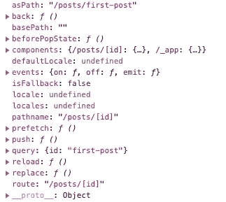

# 如何在你的 Next.js 应用中处理路由

> 原文：<https://levelup.gitconnected.com/how-to-handle-routing-in-your-next-js-app-6ba71280b922>

## 查看页面目录、动态路由、链接组件和用户外部挂钩


沃尔特“切托巴”德博弗在 [Unsplash](https://unsplash.com?utm_source=medium&utm_medium=referral) 上拍摄的照片

Next.js 是一个 React 框架，支持混合服务器端呈现和为 React 应用程序生成静态页面。与传统的 React 应用程序相比，使用 Next.js 有很多好处，包括更好的性能和 SEO。如果你是 Next.js 的新手，可以看看下面的文章来了解这个框架的概况。

[](https://medium.com/dev-genius/what-i-learned-from-the-create-a-next-js-app-tutorial-1f506b56173d) [## 我从 Create a Next.js 应用程序教程中学到了什么

### Next.js 路由、样式、预渲染和部署简介

medium.com](https://medium.com/dev-genius/what-i-learned-from-the-create-a-next-js-app-tutorial-1f506b56173d) 

在本文中，我们将了解 Next.js 应用程序中的路由。这将包括查看页面目录，如何处理动态路由，以及理解 Link 组件和 useRouter 挂钩。

# 页面目录中的简单路由

开始使用 Next.js 应用程序的最简单方法是运行以下命令。

```
npx create-next-app YOUR-APP-NAME
```

类似于使用 create-react-app，这将为您设置一个样板应用程序。在应用程序中，您将看到以下页面目录。


Next.js 有一个基于文件系统的路由器，建立在页面的概念上。pages 目录中的每个文件都与其文件名相关联。例如，如果您要创建一个名为 about.js 的文件，那么它将与`/about '路径相关联。如果您创建一个名为 contact.js 的文件，那么它将与`/contact '路由相关联。index.js 文件自动成为该目录的根目录，这意味着与`/'路径相关联。

还有一个名为 _app.js 的文件，这个 app 组件比较特殊，因为它在应用程序的所有页面中都是持久的。它可用于通过应用程序共享全局样式、布局或数据。

您可以使用嵌套文件夹结构创建嵌套路线。例如，您可以创建一个帖子文件夹，并在该文件夹中包含多个文件。


first-post.js 文件将与`/posts/first-post '路径相关联。second-post.js 文件将与`/posts/second-post '路径相关联。与我们的根目录一样，posts 文件夹中的 index.js 文件将与`/posts '路径相关联。

我们还没有谈到的最后一个文件夹是 api 文件夹。Next.js 允许您构建自己的 API。该文件夹中的任何文件都将被视为 API 端点，而不是页面。我们不会在本文中深入探讨这个主题，但只需知道使用 Next.js 这是可能的。

# 动态路线

要在 Next.js 中处理动态路由，可以在页面中添加括号。还记得我们有多个文件的帖子文件夹吗？我们可以用方括号把它变成一个动态文件。


现在，如果我们转到`/posts/first-post '或`/posts/second-post '路径，它将与[id]匹配。js 文件。我们仍然可以使用 posts 目录中的 index.js 文件来访问`/posts '路径。

您也可以通过在文件夹中添加方括号来包含嵌套的动态路由。在下面的例子中，你可以有一个路径，比如`/posts/first-post/main`。这个会被 posts-->[title]->[id]. js 抓住。


您可以嵌套任意多的文件夹，但通常情况下，您不需要超过 4 或 5 层。[标题]文件夹和[id]。js 文件可以被命名为任何名称，只要它们带有方括号。无论我们将它们命名为什么，它们都将被用作查询键，稍后当我们使用 useRouter 钩子时，我们将看到一个例子。

# 链接组件

Next.js 应用程序中的导航可以在客户端处理。这意味着路由是由页面上加载的 JavaScript 在内部处理的。当用户单击一个链接时，URL 会改变，但它不会向服务器发出请求。通过改变 URL，它改变了应用程序的状态，从而产生了不同的页面视图。

你可以通过使用[链接](https://nextjs.org/docs/api-reference/next/link)组件来实现。您首先需要像下面这样导入链接组件。

```
import Link from 'next/link';
```

然后，您需要做的就是用链接组件包装一个标签，并向链接添加一个“href”属性。每当我们点击 Home 标签，它就会把我们送到`/`路线。

```
<Link href="/">
  <a>Home</a>
</Link>
```

如果要链接到动态路径，可以使用插值法。

```
<Link href={`/posts/${id}`}>
  <a>First Post</a>
</Link>
```

# 用户外部挂钩

如果需要访问路由器对象，可以使用 [useRouter](https://nextjs.org/docs/api-reference/next/router#userouter) 钩子。通常，这将用于访问或控制路线。

您可以简单地导入 useRouter 钩子，并在功能组件内部使用它。

```
import { useRouter } from 'next/router';
```

useRouter 对象包含许多属性和方法。

在下图中，我们在`/ post/first-post '路径上。如果你看一下下面的查询对象，你会看到`query: {id: "first-post"}`。记住[id]。我们之前创建的用于添加动态路由的 js 文件？这是我们访问路线查询的方式。



# 包扎

在 Next.js 中路由很简单！它可能会与动态路线有点混淆，但一旦你掌握了它，你应该没有问题。当谈到路由时，有更多的高级特性，但我们将把它留到以后再说。您应该能够用我们在本文中学到的知识为应用程序设置路由。

我真的很喜欢它内置在 Next.js 中的方式，你不需要安装任何库，比如典型 react 应用程序中的 react-router。Next.js 的另一个好处是他们有一个 404 页面，你可以自定义。您需要做的就是在 pages 目录中创建一个“404.js”文件。

感谢阅读！最近，我真的很喜欢学习 Next.js 的特性，并用它来构建我的项目。如果你想了解更多关于路由的知识，可以看看他们下面的文档。

[](https://nextjs.org/docs/routing/introduction) [## 路由:简介| Next.js

### Next.js 有一个基于文件系统的路由器，建立在页面的概念上。当文件被添加到 pages 目录时，它…

nextjs.org](https://nextjs.org/docs/routing/introduction)