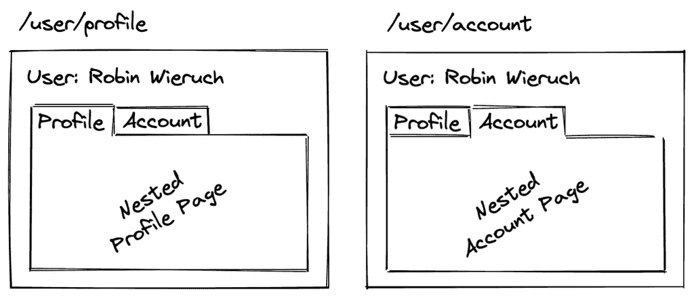

# 在 Vue 3 中如何用 Vue 路由器处理路由

> 原文：<https://levelup.gitconnected.com/how-to-handle-routing-with-vue-router-in-vue-3-59095af9c07a>

## 使用 Vue Router 4 进行路由:完整指南


照片由 Pexels 的 Mihis Alex 拍摄

Vuejs 3 捆绑了一些令人惊叹的新特性。这些特性包括但不限于:优化、改进的类型脚本支持、全局安装、迁移到新的 composition-API 等等。

在本文中，我们将探索 vue-router 4，它是处理 Vue.js 中路由的官方和最新库。路由使我们能够在应用程序之间来回导航。我们将在 Vue.js 应用中配置路由，并研究一些内置于 vue-router 4 中的优秀功能。

在本文中，我们将假设您有一个 Vue.js 3 应用程序的框架。如果你想搭建一个新的 Vue.js 应用程序，看看这个[指南](https://vuejs.org/guide/quick-start.html#with-build-tools)。

## 装置

根据您首选的软件包管理器，您可以通过在终端上运行以下命令来安装 vue-router 4。

**使用 NPM**

```
npm install vue-router@4
```

**使用纱线**

```
yarn add vue-router@4
```

成功安装后，我们现在将配置 vue-router，以便在我们的应用程序中处理路由。

## 配置路线

在文件的根目录下，创建一个文件夹，命名为 ***router*** 。在该文件夹中，创建一个名为 ***index.ts.*** 的文件。该文件将包含我们所有的应用程序路由/路径以及必要的配置。

在上面的代码片段中，我们已经从 Vue router 导入了***create web history***和 ***createRouter*** 。 **createWebHistory** 使我们能够实现不同的 web 路由模式。我们可以使用**哈希、HTML 5** 和**内存**模式。在我们这里的配置中，我们通过设置***` history:createWebHistory()`***来使用 HTML 5 模式

哈希模式在实际的 url 前使用 **(#)** ，可能会让你的 url 看起来有点凌乱，对 SEO 也有一些不好的影响。如果你想尝试哈希模式，从 vue-router 导入 **createWebHashHistory** 并设置**` history:createWebHashHistory()`。**

同样适用于内存模式，从 vue-router 导入 createMemoryHistory 并设置**` history:createMemoryHistory()`**。

**createRouter** 将使我们能够创建路由器的实例，并允许我们传入上面指定的路由。

找到 ***app.vue*** 文件，在模板的某个地方放置 ***router-view*** 。这是将呈现所有匹配路线的部分。

## 安装路由器

现在我们已经建立了简单的路由，但是我们仍然无法访问必要的路径。我们需要将整个路由器实例安装到应用程序条目文件中，这样我们的应用程序就可以知道我们提供的路由。

如果您在安装过程中选择了 TypeScript 并且具有以下内容，请打开您的 ***main.js*** 或 ***main.ts*** 文件。

在这里，我们导入路由器配置文件，并让整个应用程序注册路由器实例。现在，我们所有的路由配置都可以在整个应用程序上使用，我们可以通过`/home` `/about`和`/contact.`导航

如果您试图导航到未配置的路线，如`/users`，Vuejs 将抛出一个错误。在本文的后面，我们将看到如何处理和捕获我们的应用程序中没有配置的路由。

要链接我们设置的路线，您需要使用如下所示的`router-link`。使用这个标签是有益的，因为它不像`a`标签那样刷新页面，也使得 vue-router 更容易处理好这个功能。

```
// go to /contact page<router-link to="/contact">Contact</router-link>// go to /about page<router-link to="/about">About</router-link>
```

## 重新寄送

我们可以用 vue-router 无缝地处理重定向。假设您希望访问路径`/home`的用户被重定向到`/`，我们可以如下所示进行处理。

现在，当用户导航到`/home`时，他们将被重定向到`/`路线。当您希望某些路由只允许某些用户访问时，重定向也很有用。

## 惰性装载路线

惰性加载路由确保只加载需要的路由，其他路由在必要时按需加载。这提供了一些性能改进，尤其是当您有一个包含许多路由和组件的大型应用程序时。

要延迟加载路由，您只需将动态导入添加到您想要延迟加载的路由中。我们可以如下所示实现它。

## 嵌套路由

使用 vue-router，我们可以配置嵌套路由，即父路由到子路由。我们可以让组件分支成子组件，如下图所示。当从父路由嵌套子路由时，我们需要包含`/router-view`以便呈现匹配的子路由。



图片由 robinwieruch 提供。

我们可以如下所示设置嵌套路由。

## 路由元字段

路由元字段为我们提供了附加路由信息的能力，我们可以在以后操作这些信息。我们可以指定需要身份验证才能访问的路由或我们可能需要的其他相关信息。

这里我们已经为`/meta`字段属性提供了一些信息。在路由器实例中，我们可以检查用户是否通过了身份验证，我们是否授权了对特定路径的访问。我们还可以提供诸如`/title`的信息。

## 未找到路线

我们还可以捕获一些路由中没有配置的路由。我们可以返回专用的 404 未找到组件。为了捕捉未配置的路由，我们使用了`/catchall *`。

## 动态路由

动态布线确保将不同的布线映射到同一组件。假设你有不同的帖子，包含不同的`cid`，你想根据提供的`cid`参数渲染相同的组件。

您可以为动态路由配置路由，如下所示。您只需要在路径后面添加一个冒号，并提供参数的名称。在这里的例子中，我们有`cid`参数。

**访问路线参数**

在组件模板中，您可以访问如下所示的`cid`参数👇。

```
<template>{{ $route.param.cid }}</template>
```

## 在你走之前

我希望这篇文章对如何在 Vuejs 3 应用程序中使用 vue-router 4 处理路由有所帮助。

偶尔，我会发送一封独家电子邮件，其中包含我发现的有用的、与技术写作相关的技巧、文章、应用程序、书籍和想法。

[***加入像你一样想提高技术写作水平的人吧。***](https://artisanal-thinker-2556.ck.page/6e2ba71172)

## 更多阅读

[](/implement-good-commit-message-conventions-in-your-development-workflow-15dd78b7a86e) [## 在开发工作流中实现良好的提交消息约定

### 使用传统提交工作流编写更好的提交消息

levelup.gitconnected.com](/implement-good-commit-message-conventions-in-your-development-workflow-15dd78b7a86e) [](/5-advanced-and-in-depth-learning-resources-for-vue-js-fec1146ea41f) [## Vue.js 的高级和深入学习资源

### 帮助您学习 Vue.js 的高级概念并超越基础知识的资源

levelup.gitconnected.com](/5-advanced-and-in-depth-learning-resources-for-vue-js-fec1146ea41f) 

# 分级编码

感谢您成为我们社区的一员！在你离开之前:

*   👏为故事鼓掌，跟着作者走👉
*   📰查看[升级编码出版物](https://levelup.gitconnected.com/?utm_source=pub&utm_medium=post)中的更多内容
*   🔔关注我们:[Twitter](https://twitter.com/gitconnected)|[LinkedIn](https://www.linkedin.com/company/gitconnected)|[时事通讯](https://newsletter.levelup.dev)

🚀👉 [**加入升级人才集体，找到一份神奇的工作**](https://jobs.levelup.dev/talent/welcome?referral=true)