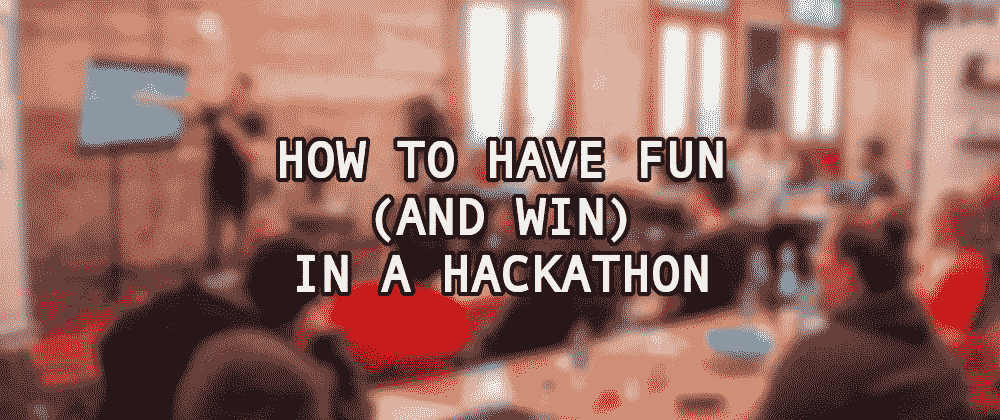
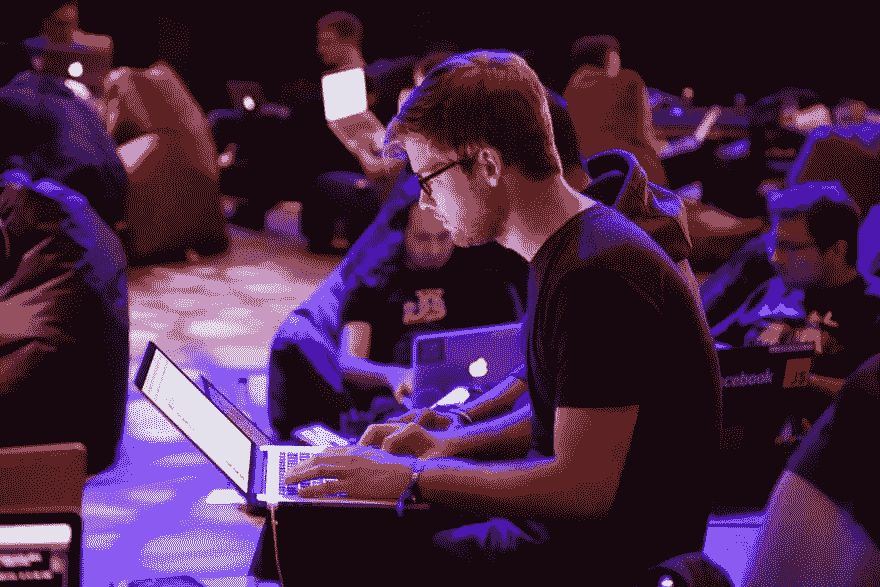

# 如何在黑客马拉松中获得乐趣(并获胜)

> 原文：<https://levelup.gitconnected.com/how-to-have-fun-and-win-in-a-hackathon-bbfc8267fe10>

## 本指南提供了享受和充分利用发展活动的技巧和诀窍

黑客马拉松是开发人员在有限的时间内(可能从几个小时到几天)聚在一起就一个项目进行协作的活动。

黑客马拉松有很多种类型:公司内部或对公众开放，独立或作为会议的一部分，有主题或无主题，限于一组技术，或对任何事物开放，等等。而且不都是比赛。有些是为了实现一个共同的目标而合作(这些和竞争一样有趣和令人满足。)

我参加过许多结果不同的黑客马拉松:有时我赢了，更多时候我输了，但在所有这些比赛中，我都很开心，喜欢编码和与不同的人交流。

在这篇文章中，我将描述我是如何对待黑客马拉松的(或者至少我是如何尝试去对待它们的)。)这是基于我自己的经验，在黑客马拉松比赛中，你可以挑选你的项目想法(即使是在一个特定的主题内。)

文章内容:

*   介绍
*   这个想法
*   发展
*   介绍会；展示会
*   结论
*   附件:杀手锏的例子

# 介绍

让我先说:赢得黑客马拉松不是一切。如果你赢了，但是你在一个你不喜欢的项目里，大多数时候你会觉得很痛苦。所以，黑客马拉松的第一条规则是:尽情享受！

拥抱活动:建立你的项目，但也要四处看看其他人在做什么(如果有机会)，提供帮助，与人聊天，建立关系网。其中一些联系可能会发展成新的项目、友谊或工作机会。

Alex Kotliarskyi 在 [Unsplash](https://unsplash.com/photos/ourQHRTE2IM) 上拍摄的一名男子使用电脑的照片

# 这个想法

我要说一些很多人不同意的话，但是从我的经验来看，这似乎是常态:**你的黑客马拉松想法会随着黑客马拉松**而消亡。大多数黑客马拉松项目随着竞争而诞生、成长和消亡。黑客马拉松的第二条规则:不要太依赖这个想法。

当然，也有例外，但通常都是非同寻常的项目。我可以用一只手的手指数出所有在黑客马拉松结束后完成并交付的项目。尤其是如果它是一个团队项目。

把你的兼职项目作为你的兼职项目，带着一些不同的和新鲜的东西去参加黑客马拉松。一个令人震惊的想法。

## 绝妙的主意

黑客马拉松获胜项目必须满足三个要求:

*   **原创**
*   **实际一点**
*   **有哇因子**

大多数黑客马拉松项目不勾选这三个框，但所有获胜者通常都会勾选。还有一件事不一定是必需的，但我强烈推荐:

*   **拟合时间范围**

满足这四点的黑客马拉松想法是一个杀手级的想法。它可能不会赢-有太多其他因素-但它肯定会在那里。所以，**黑客马拉松的第三条规则:找到一个杀手级的想法**。说起来容易做起来难。这将决定大部分后来的结果。

AbsolutVision 在 [Unsplash](https://unsplash.com/photos/82TpEld0_e4) 上拍摄的灯泡艺术品照片

让我们一个个看看。

## 保持原创

原创的概念有点模糊。对一个人来说是原创的东西对其他人来说不一定是原创的。例如，我曾见过相同的想法提交给两个不同的黑客马拉松，相差超过十年，两个项目都因其独创性而获胜(查看黑仔想法的例子以供参考)。)

正如他们在 imgur 中所说——主要是作为转贴内容的借口，但那是另一个故事——“如果我以前没看过，那就是原创。”如果大部分人(或者至少是评委)都没见过，这个创意算原创吗？答案是响亮的“是”在这种情况下，“原创”并不意味着“新”，它意味着“不寻常”或“不同”。

如果你不能提出一个原创的想法，一个通常有效的策略是构建一些混合了 API 和技术的东西。它往往会产生一些原创的项目，并带有令人惊叹的因素:将社交媒体与情感分析结合起来，使用标准的 Web APIs(人们不知道有多少 API，也不知道它们有多强大)，处理日常问题，用人工智能和图表公开数据…

## 实际一点

黑客马拉松的想法必须是切实可行的。它必须有功能或对某件事有用。再说一遍，实用性的概念可能因人而异。例如，一个视频游戏可能对一些人来说不实用，但许多人会想玩。在那方面它是有用的。

一个实际的想法需要在某些方面或形式上是有用的。但是相反的情况并不总是正确的:一个有用的想法可能并不实际。例如，构建一个连接人们(例如，慈善机构、非营利组织或俱乐部)的应用程序听起来是一个很好的实用想法，但实际上不是(至少对黑客马拉松来说不是)。)它将需要远远超出黑客马拉松时间的开发，除此之外，它还需要通常不可用的数据和关系(在某些情况下，出于法律目的，还需要个人和/或税务信息)，这可能需要时间、谈判和金钱来收集。现在看起来没那么实用了吧？

正如您可能已经从上一段中注意到的，即使看起来不像，这个需求也与时间范围密切相关。一个在黑客马拉松的时间框架内无法开发的实际想法可能是一个伟大的想法…只是不适合这种类型的事件。

## 有令人惊叹的因素

拥有“惊艳因素”并不等同于原创。这是令人印象深刻的事情，会让评委微笑，其他与会者惊讶不已，希望他们是你的团队成员。这将使你的想法与众不同。

它可以以多种方式呈现。有时是革命性的设计，不同外设的应用，或者*只是*一个意想不到的用例。这可能是最难完成的要求，但是当你做到了，那就太棒了。

惊讶的男孩，由本怀特在 [Unsplash](https://unsplash.com/photos/qDY9ahp0Mto)

要考虑的一个关键问题是，在非公司的黑客马拉松中，有一个令人惊叹的因素是有帮助的，但在公司的黑客马拉松中就没那么多了。比起项目的*魅力*，公司更关注创意的发展和实用性。这很不幸，但很有意义。

正如上面“保持原创”一节中提到的，使用不同的 API 或技术(和小工具)是实现这一点的好方法。用新技术建造一些“经典”的东西会引发怀旧情绪，也有助于制造惊喜。

## 符合时间范围

这个*要求*有两个方面:一个是关于时间管理和对事情有一个“现实的”方法，另一个是关于“诚实”

如果这个想法比你为黑客马拉松准备的想法需要更多的时间来实现，那么它就是一个附带项目，而不是一个黑客马拉松项目。范围超越了事件，导致开发仓促，设计拙劣，体验不佳等。，这既糟糕又可悲，因为这可能是一个伟大的想法，但这是一个错误的阶段。

为黑客马拉松挑选创意时，确保你能在活动的时间框架内开发它。不要仓促行事，也不要“欺骗”……这就引出了第二部分。(而这更多的是个人喜好。)

你经常去参加黑客马拉松演讲，看到那些制作和设计如此完美的项目，以至于你和所有的参与者都知道他们在活动期间没有这样做。主持人一直在做(大量)前期工作，这给每个人留下了不好的印象。

对自己和其他参与者诚实。不要害怕展示一些未经打磨或半生不熟的东西。你提交的不是一个赚几百万的想法。你参加黑客马拉松是为了开心(规则#1 ),记住，最有可能的是，这个项目会随之消亡(规则#2)。

黑客马拉松没有愚蠢的想法。一些人可能认为这个想法很可笑，而另一些人认为它很有创意，很古怪。事实上，愚蠢的想法比“超级严肃”的想法赢得更多的黑客马拉松。

黑客马拉松的第四条规则:没有愚蠢的想法，只有需要润色的想法。在活动前润色它们。我记录了“黑客马拉松想法”，根据活动的不同，我会看看是否可以使用现有的想法，而不是想出新的东西。

# 发展

这是大部分开发者珍惜的部分。但是在我看来，我知道很多人会不同意(再次):**开发是黑客马拉松最不重要的部分**。(这很大程度上取决于黑客马拉松的类型。)一个好主意的好展示会弥补糟糕的编程或缺乏特色。但是一个伟大的实现不会带来一个坏主意。

此外，黑客马拉松通常是短时间、快节奏的活动。开发人员通常会抛开最佳实践，以尽可能快的速度前进。虽然这对日常工作来说很糟糕，但从黑客马拉松的角度来看，这*是有意义的*。无论如何，在黑客马拉松之后，这个项目不会有太大的进展(基于上面描述的规则 2)。)

谈到开发，这里是黑客马拉松的第五条**规则:黑客马拉松不是学习新语言的好地方**。您可以学习新的功能、API、即将到来的语言特性等。但是抱着“使用我从未使用过的语言从头开始构建项目”的心态去参加黑客马拉松并不是一个好主意。你将无法完成这个项目，而且你很可能无法学习新的语言，或者至少无法正确使用它。

类似的规则也适用于其他技术:黑客马拉松不是一个重新发明轮子的地方(除非重新发明轮子是你的项目。)为了加快开发过程，不要犹豫拉模块、库或 API。

如果黑客马拉松是和团队一起进行的，试着建立一个有报酬的团队:如果每个人都是开发人员，你可能会完成项目，但是看起来不会很棒。如果有很多设计师，只有一个开发人员，开发部分就很吃力。确保一个人扮演 PM 的角色，跟踪进度，并有一个开发替身作为测试人员。

# 演示文稿

提交想法和开发项目后，是时候演示了。黑客马拉松的一个重要部分:**演示可以提升一个平庸的想法，让它变得有竞争力，或者提出一个伟大的想法，然后毁掉它**。这就是为什么令人惊讶的是，许多参与者似乎经常不太关注这一部分。

黑客马拉松的这一部分也非常适合练习[领导力和软技能](https://alvaromontoro.com/blog/67961/dont-just-code):公开演讲、沟通、自信、幽默感……这些是你职业成长过程中的重要技能。

Karri Saarinen 出席北欧设计，由 Teemu Paananen 在 [Unsplash](https://alvaromontoro.com/blog/67997/how-to-have-fun-and-win-a-hackathon)

准备演示时，了解你的观众是很重要的(黑客马拉松的第六条规则)。)你讲什么，怎么讲，应该根据听众的不同而变化。你不会向开发人员、业务经理或高管展示同样的东西。例如，我们最近提交了一个公司黑客马拉松的想法。开发领导对第一轮进行了评判，所以我们专注于解决方案的技术方面:我们使用了什么以及它将如何有用。但是，当我们进入最后一轮时，我们向高管们展示了我们的解决方案如何有用，以及它可以为公司节省多少资金。

根据可用时间的不同，演示会有很大不同，但一般来说，您应该始终尝试触及以下几点:

1.  团队介绍:保持简短。
2.  问题描述:“为什么？”
3.  解决方案的描述:“如何？”
4.  结果是什么:你的项目的好处。

如果时间允许，我喜欢在演示中加入一个小笑话。通常，评委们会看到几十个演示，其中许多可能会被认为是无聊的，他们很容易“走神”通过添加一个笑话(在 1 和 2 之间，或者 2 和 3 之间)，你重新获得了他们的注意力，然后你就可以呈现项目的主要部分了。另外，它会让你难忘。

# 结论

我有参加许多扮演不同角色的黑客马拉松的经验，但我不认为自己是专家。我有时会赢；大多数时候，我空手回家。但是我可以说，我在每一部电影中都获得了乐趣，学到了新的东西，这在我看来是一个巨大的胜利。我想说的是:对这个帖子半信半疑。

如果这篇文章有什么启示的话，那应该是:玩得开心。享受参与黑客马拉松的乐趣。对于开发人员来说，这是一次奇妙的活动，让每个人都可以进行互动、合作和交流。我迫不及待地想等疫情结束后再亲自去参加一些(而不是虚拟的。)

如果你想有更多的收获，请记住黑客马拉松的“经验法则”:

*   尽情享受吧。
*   不要太依赖这个项目。
*   找到一个杀手锏:原创、实用、有惊喜元素。
*   学习新事物。
*   了解你的受众。

# 杀手锏的例子

## CK·美国电话电报公司

如果我没记错的话，这是 2009 年或 2010 年的一次科技危机扰乱黑客马拉松。iPhone 几乎是 AT&T 的独家产品。无限制计划并不像现在这样受欢迎，这家服务提供商因掉线多(以及一些高额的呼叫连接费)而臭名昭著。)

一名开发人员提出了一个令人兴奋的项目:iPhone 有一个数据库，其中记录了所有通话、时长、状态和结束原因。如果他能证明许多掉线电话不是由于 iPhone 本身，而是由于美国电话电报公司糟糕的服务，他们可以对这家通信巨头提起集体诉讼。

在演示过程中，他展示了美国电话电报公司如何降低了高百分比的通话，他也对一些观众做了同样的事情。总的来说，美国电话电报公司向他们收取了一笔不多但可能意义重大的费用。

这个项目很棒:原创，有令人惊叹的因素，实用，很棒的演示…这个想法流行起来，赢得了黑客马拉松。据我所知，它死在了那里。它没有前进，没有产品发布，也没有诉讼——这是黑客马拉松的第二条规则。

## 视频游戏眼控制器

想象一下在没有游戏控制器的情况下控制你最喜欢的视频游戏。只是用你的眼睛。向上看可以跳跃，向下看可以躲避，向两边看可以左右移动。你甚至可以眨眼来完成一些动作，比如射击或者抓东西。

我在跨越三十年(2000 年、2010 年和 2020 年)的黑客马拉松中见过这个想法。)这是一个有趣的项目，因为它“打破了创意规则”，但尽管如此，它还是相当成功:每次我看到它时，这个想法都排名很高，或者赢得了一个奖项。正如他们在网上说的，“这是新的-和原创的-如果我以前没有见过它。”

技术在变，作为基础的视频游戏也在变(马里奥，Chrome 离线恐龙，一些更原创的东西)。在 2000 年代，Flash 是主要的开发驱动力，在 2010 年代和 2020 年代，是不同的技术但主要是 JavaScript 和不同的 API。

## JavaScript 中的舞蹈-舞蹈-革命

几年前，我和女儿因为这个项目赢得了一次黑客马拉松比赛(我负责所有的编码，她负责测试和质量控制)。这个想法本身并不是超级原创，但它有一个令人惊叹的因素(特别是在演示过程中。)

基本想法是将 Dance Dance Revolution (DDR) pad 连接到计算机，并能够随着任何歌曲跳舞，或者连接 USB 吉他英雄/摇滚乐队吉他或鼓，并演奏任何你想要的东西。甚至是那些永远不会出现在游戏中的歌曲。不受任何游戏或发行商的限制。

使用 Gamepad API 并将其与 Youtube 或任何其他视频/音乐服务相结合是可能的，而且实际上，[很容易开发](https://github.com/alvaromontoro/gamecontroller.js)。结果是一个有趣的，令人印象深刻的演示。您可以个性化音乐选择，以匹配黑客马拉松(或评委)，并获得一些印象分。

## 智能迎宾垫

这个项目是 API、硬件和社会工程的结合。这次展示是一次有趣的互动活动，展示了最终产品:一个连接到 Arduino 的欢迎垫，Arduino 连接到互联网，可以检测主人的情绪，并相应地问候这个人？听起来很有趣！

当有人踩在垫子上时，垫子会检测到(它有一个压力传感器)，然后它会检查主人的推特账户(使用推特 API)，读取最后几条推特，并通过情绪 API 来检测这个人的情绪。根据结果，垫子会用一个或另一个信息(垫子上有一个小扬声器)来欢迎这个人。)

独立于这个想法的实用性——这么多硬件在雨天不会是个问题吗？-，它有一个奇妙的惊喜因素。如果我没记错的话，这个创意没有获奖，但是是亚军之一。

## iPad 支架

现在是 2010 年，我们正在纽约市参加 Tech Crunch 黑客马拉松，苹果公司最近刚刚发布了 iPad，所以有很多人在谈论它(而且市场缺少很多苹果平板电脑的配件。)

一个年轻人拿着 iPad 走上舞台，展示了他的想法:他展示了他的 iPad，从口袋里拿出两片 velcro，把它们贴在平板电脑的背面。“现在我可以用一只手轻松观看我的 iPad，而不会掉落或倾斜。看哪，iPad 支架！”

这个项目因其独创性而获奖！这是一个很好的例子，说明你在黑客马拉松中需要做的事情并不一定都与软件有关，或者是一个伟大的项目。

*原载于 2022 年 2 月 23 日*[*【https://alvaromontoro.com】*](https://alvaromontoro.com/blog/67997/how-to-have-fun-and-win-a-hackathon)*。*