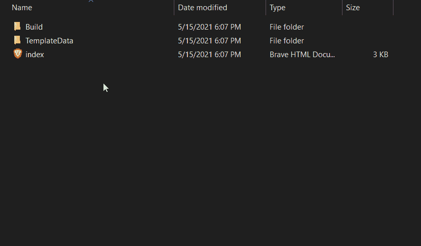

# 如何在网络上运行 Unity 游戏

> 原文：<https://levelup.gitconnected.com/how-to-host-unity-games-on-the-web-54cf7e8610ee>

在[上一篇文章](https://dennisse-pd.medium.com/how-to-build-and-test-your-unity-game-7ace02e03490)中，我讲述了如何使用 Unity Build 设置来创建一个可以直接在你的电脑上运行的游戏或应用程序的测试版本。现在，是时候学习如何在网上分享它了！

# 安装 WebGL

**目标:为你的游戏或应用制作一个可共享的版本。**

1.  如果您还没有 WebGL，请安装它。如果您已经安装了它，使用 WebGL **跳到[**部署。**](#0986)**

要安装，请转到**文件→构建设置→平台→ WebGL →使用 Unity Hub 安装**

2.确保选择了 WebGL 构建支持，然后单击“完成”。

3.一旦安装过程完成，您将会看到 WebGL 已经添加到您当前使用的 Unity 版本中。

# 使用 WebGL 部署

1.  将平台切换到 WebGL，并允许 Unity 重新编译。

> **注意:**如果 WebGL 出现卸载，重启 Unity。

2.一旦 Unity 完成了重新编译，您将需要按照警告的建议更改播放器设置。

3.完成所有需要的修改后，你现在可以构建你的游戏/应用的 WebGl 版本了！

现在，您应该有一个包含所有必要内容的文件夹。并且允许多种格式。

如果你有一个网站，这些文件夹可以上传到网站上，你可以在里面看到你的游戏。也可以上传到只允许 WebGLs 的[smelle . io](https://simmer.io/)或者在独立开发者中流行的 [Itchi.io](https://itch.io/)

在下一篇文章中，我将讲述如何为你的游戏或应用程序添加一个逃生功能！