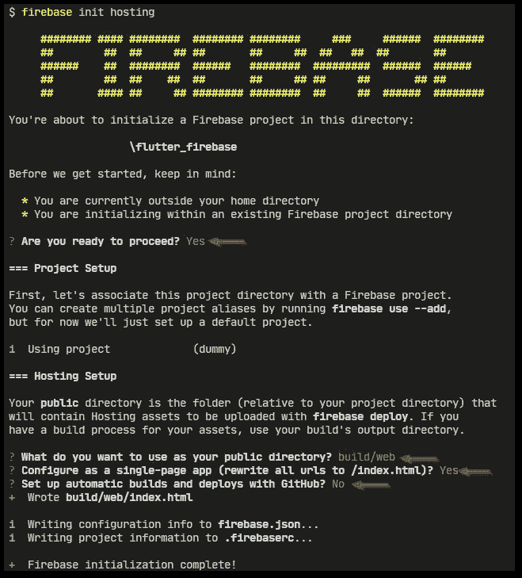
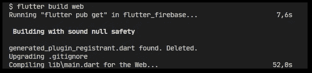
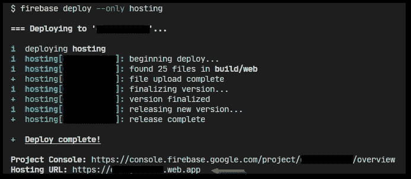
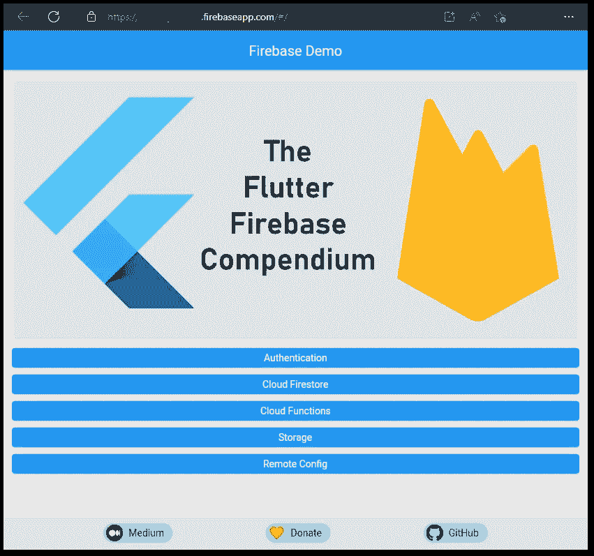
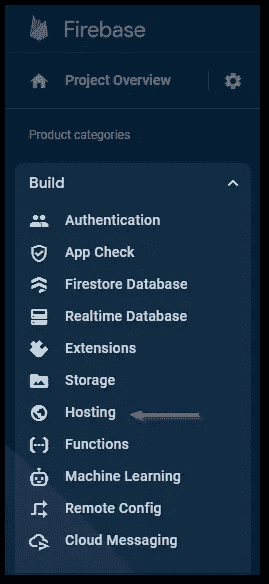
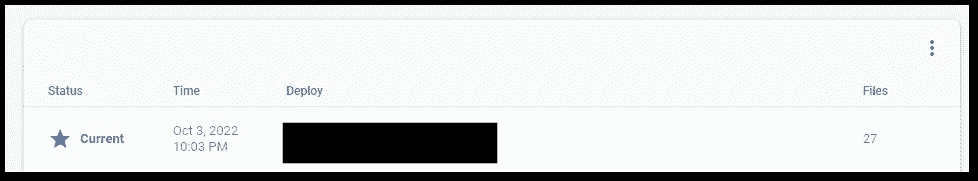

# 如何使用 Firebase 托管来托管您的 Flutter web 应用程序

> 原文：<https://levelup.gitconnected.com/how-to-host-your-flutter-web-app-with-firebase-hosting-67d3e4657002>

## 需要服务器吗？使用 Firebase！

## 用 Firebase 托管现有的 Flutter web 应用程序非常简单。本文将指导您完成所有需要的步骤。


Flutter 应用可用于各种平台，如 Android、iOS、桌面系统以及 web。有了 Firebase Hosting，就有一个简单的工具来部署你的 Flutter web 应用程序，并在浏览器中访问它。这是向测试人员分发应用程序或自动化新版本发布过程的简单方法。让我们来看看所需的步骤。

```
👉 Do you want all the details? Check out [**my ebook**](https://xeladu.gumroad.com/l/ffc) with in-depth guides about building Flutter apps with Firebase! Buy it on [**Gumroad**](https://xeladu.gumroad.com)now!
```

🔔你已经有一个 Firebase 项目了吗？如果没有，请按照我下面的文章详细介绍所有步骤！

[](/how-to-create-a-firebase-project-and-link-it-with-your-flutter-app-acd826be8356) [## 如何创建一个 Firebase 项目并将其与您的 Flutter 应用程序链接

### 在本文中，我将向您展示如何创建一个 Firebase 项目，以及如何将它与您的 Flutter 应用程序链接起来。

levelup.gitconnected.com](/how-to-create-a-firebase-project-and-link-it-with-your-flutter-app-acd826be8356) 

打开任何命令行工具(PowerShell、cmd、bash、Visual Studio 终端等)并导航到您的 Flutter 项目。然后，执行命令`firebase init hosting`。



作者初始化 Firebase 主机的截图

你会被问几个问题。像我一样回答上图中的问题，感受一下工作流程。将您的公共目录设置为`build/web`,因为这是 Flutter 框架放置 web 应用程序文件的位置。这将被部署到 Firebase 主机。



作者的 Flutter web 应用程序的构建过程截图

运行命令`flutter build web`创建 web 应用程序。



作者将 Flutter web 应用程序部署到 Firebase 主机的屏幕截图

然后，使用命令`firebase deploy --only hosting`将 web 应用发布到 Firebase 主机。



作者使用 Firebase 托管的已部署 Flutter web 应用程序的屏幕截图

命令行输出的`Hosting URL`指向 web 应用程序运行的位置。在浏览器中打开它，并验证一切正常。如果您使用提供的演示应用程序，您应该会看到类似上面的图像。

要管理您的版本，您可以使用 Firebase 托管仪表板。

在**构建**菜单中，转到**托管**。



作者提供的 Firebase 托管菜单截图

您可以在发布概述中看到已部署的版本。



作者在 Firebase 控制台中发布概述的屏幕截图

就是这样。您的 web 应用程序已经发布，可以使用 Firebase 托管进行管理！🔥

## 如何部署到预览频道？

遵循前面描述的步骤，但是在部署时，使用命令`firebase hosting:channel:deploy CHANNEL_NAME`将您的部署推到 Firebase。一个新的频道将出现在托管仪表板中。您可以通过单击日期按钮自定义其存储设置和到期时间。默认情况下，该频道将在 7 天后被删除，最多存储 10 个版本。


作者在 Firebase 托管的预览频道截图

## 如何删除以前的版本以释放存储空间？

在 **Firebase 控制台**，转到**托管**，在你的**发布历史**中寻找想要的部署。点击右边的三个点，选择**删除**。这将安排在 24 小时内删除已部署的内容。但是，该表条目将会保留。

您只能删除以前的版本，而不能删除活动版本。

## 如何更改 Firebase 主机设置？

您可以重新运行`firebase init hosting`命令或者手动编辑存储库中的`firebase.json`文件。在任何情况下，您都必须使用命令`firebase deploy --only hosting`来发布变更。

## 结论

在本文中，我们了解了使用 Firebase 托管部署 Flutter web 应用程序是多么容易。

你可以在我的 GitHub 页面上找到一个示例应用。将其部署到 Firebase 项目中进行测试。

[](https://github.com/xeladu/flutter_firebase) [## GitHub - xeladu/flutter_firebase:一个用于与各种 firebase 服务交互的 flutter 演示应用程序

### 这是附带代码示例的 Flutter Firebase 概要的配套应用程序。颤振燃烧基地纲要是一个…

github.com](https://github.com/xeladu/flutter_firebase) 

这篇文章是 Flutter Firebase 纲要的一部分，其中有许多教程和操作指南，介绍了 Firebase 与 Flutter 应用程序相结合的可能性。


[赛拉杜](https://xeladu.medium.com/?source=post_page-----67d3e4657002--------------------------------)

## 了解 Flutter 和 Firebase 的威力

[View list](https://xeladu.medium.com/list/learn-about-the-power-of-flutter-and-firebase-2ec07e25baba?source=post_page-----67d3e4657002--------------------------------)13 stories

用我的电子书为 Flutter 开发者充分利用 Firebase。

[](https://xeladu.gumroad.com/l/ffc) [## 颤振燃烧基础概要

### 这本电子书着重于让你能够在你的应用中集成 Firebase 云服务。当你想要的时候，它是一个跳跃的开始…

xeladu.gumroad.com](https://xeladu.gumroad.com/l/ffc) 

[***通过我的推荐链接加入成千上万的媒体会员，每月只需 5 美元就可以阅读你想阅读的文章！***](https://medium.com/@xeladu/membership)

[](https://medium.com/@xeladu/membership) [## 通过我的推荐链接加入 Medium-xela du

### 只需点击一下，就可以通过会员资格访问数千篇文章！您的会员资格只需 5 美元一张…

medium.com](https://medium.com/@xeladu/membership) 

点击 [**此处**](https://xeladu.medium.com/subscribe) 将我所有的新文章发送到你的邮箱🔔
浏览[我的口香糖商店](https://xeladu.gumroad.com/)寻找有趣的编程素材🏬


[赛拉杜](https://xeladu.medium.com/?source=post_page-----67d3e4657002--------------------------------)

## 适合初学者的颤振文章

[View list](https://xeladu.medium.com/list/flutter-articles-for-beginners-a040ea777956?source=post_page-----67d3e4657002--------------------------------)24 stories

[赛拉杜](https://xeladu.medium.com/?source=post_page-----67d3e4657002--------------------------------)

## 软件工程师的高级颤振文章

[View list](https://xeladu.medium.com/list/advanced-flutter-articles-for-software-engineers-f074879fdef3?source=post_page-----67d3e4657002--------------------------------)9 stories