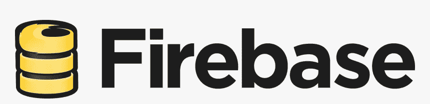
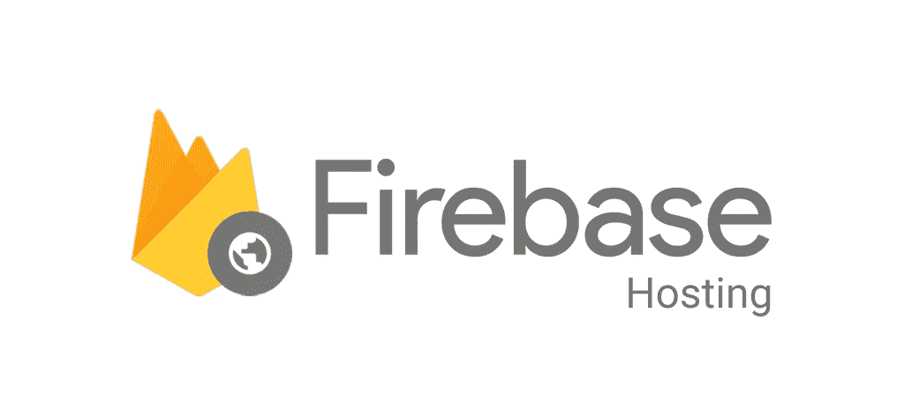
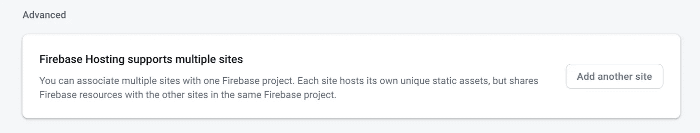

# 如何免费托管你的网站

> 原文：<https://levelup.gitconnected.com/how-to-host-your-site-for-free-596642b4305c>


对于前端开发人员来说，历史上最难做好的事情之一就是虚拟主机。找出部署代码的最佳方式、用 SSL 证书保护代码、意外部署 bug 以及许多其他问题。

幸运的是，在过去的几年里，托管解决方案出现了爆炸式的增长，这种解决方案将 web 托管的大部分工作都去掉了。今天我们将讨论 Firebase 托管。如果你们从未听说过 [Firebase](https://firebase.google.com) ，我强烈建议你们去看看。

# 一点历史



旧的 Firebase 标志

在我们进入杂草之前，我想指出一点历史来给你一些关于 Firebase 的背景。Firebase 由一家名为 Envolve 的初创公司发展而来，该公司为开发人员提供了一个 API 来构建实时聊天应用程序。虽然它是为了同步聊天应用程序，但他们开始注意到开发人员用它做了很多事情。开发人员意识到，他们可以轻松地在整个设备主机上同步游戏或其他应用程序的状态。发布后，他们添加了托管和认证。

Firebase 很快在 2014 年被谷歌收购，服务变得更大、更好、更便宜。今天，Firebase 是谷歌云平台的扩展，做了更多的事情。Firebase 的服务涵盖了虚拟主机、无服务器计算、无服务器 NoSQL 数据库(Firestore 和实时数据库)、机器学习，甚至分析。

# 为什么 Firebase 托管很棒



现在我们已经了解了 Firebase 平台的一些历史，让我们进入主题，托管。我个人已经使用 Firebase 主机多年，我还没有找到一个更好的解决方案。那么是什么让 Firebase 主机比它的竞争对手更好呢？

## 简易 CLI

Firebase 有一个非常容易使用的 CLI 工具用于部署。要安装 CLI，您只需在系统上运行`npm i -g firebase-tools`。安装完成后，你可以用`firebase login`登录你的谷歌账户，这将打开你的浏览器并使用谷歌 OAuth。一旦你登录，你可以用`firebase init`命令初始化你的项目。您选择您的 Firebase 项目，选择您想要设置的内容，并为您的托管环境选择几个选项(单页面设置与否)。

安装完成后，将在您为部署指定的路径中创建一个新文件夹。你所要做的就是运行`firebase deploy`命令，然后离开你的站点。一旦部署完成，您可以立即看到您的网站！完成所有这些步骤大约需要 10 分钟，然后托管就完成了。

## 免费 SSL 证书

今天，使用 SSL 保护您的网站变得越来越重要。然而，如果你想托管一个爱好网站，个人网站，或其他东西，SSL 可能有点贵。一个 Comodo SSL 可以让你在任何地方花费 60-100 美元，这取决于你是否需要一个外卡。一旦你有了 SSL 证书，设置它就有点麻烦了。更重要的是，如果你的网站没有 SSL 证书，谷歌宣布你的网站可能不会出现在搜索结果中。这是为了促进人们保护他们的网站。

Firebase 让您 100%摆脱麻烦和成本。所有托管在 Firebase 上的网站都可以获得免费的 SSL 证书。最棒的是它是自动发生的。没有设置或配置，你必须摆弄。老实说，SSL 证书是我作为自由 web 开发人员工作时遇到的最大的麻烦之一。自从上了 Firebase 平台，我就再也不用担心这个问题了。

## 自由定制域

马上，Firebase 给你两个不同的域名

1.  {我的项目名称}.web.app
2.  {我的项目名称}.firebaseapp.com

如果你正在制作一个网站，很可能你已经为它购买了一个域名。免费虚拟主机和免费 SSL 证书是很棒的，但我们也需要用我们的自定义域名来标记网站。别担心，Firebase 会保护你。你可以设置一个完全免费的自定义域名。您所要做的就是在域名提供商的 DNS 中添加一个条目，并给 Firebase 几个小时的时间来验证该条目是否已被添加。完成后，你的网站就可以使用你想要的自定义域名了。哦，还有一件事，你的自定义域名还获得一个免费的 SSL 证书。

## 一键回滚部署历史记录

Firebase 保存了托管环境中所有部署的历史记录。假设我们不小心部署了一个有 bug 的站点版本。试图找出错误在哪里以及如何修复它可能是一件非常头疼的事情。像大多数事情一样，Firebase 使这个问题很容易解决。您只需点击一下鼠标，即可查看部署历史并回滚到以前的版本。灾难避免了，我们不用紧急行动就能修复漏洞。

## 在一个项目中托管多个站点

有时，当我们创建一个项目时，我们需要托管多个站点。例如，假设我们有一个面向客户的应用程序和一个管理应用程序。我们可以启动一个新的 Firebase 项目来托管管理应用程序，但这听起来并不是一个很好的解决方案。幸运的是，2018 年 Firebase 创建了多站点托管。



当你点击主机选项卡，滚动到底部，你会看到上面的卡。最棒的是 Firebase CLI 允许您通过一个简单的命令轻松配置本地托管环境。

`firebase target:apply hosting <target-name> <resource-name>`

因此，如果我们有我们的客户应用程序和我们的管理应用程序，我们会这样做。

```
firebase target:apply hosting customer {MY PROJECT NAME}
firebase target:apply hosting admin admin-{MY PROJECT NAME}
```

这将自动更新您的本地主机配置，所以你不必担心它。然后，您可以同时部署两个站点，或者一次部署一个。

```
firebase deploy --only hosting // deploy all sitesfirebase deploy --only hosting:customer // deploy customer sitefirebase deploy --only hosting:admin // deploy admin site
```

就像魔术一样，你的两个网站都托管在同一个项目上，拥有自己的自定义域名和免费的 SSL 证书。

## 本地测试

我们喜欢测试我们的代码，Firebase 让它变得简单。一旦您的代码构建到部署目录中，您只需运行`firebase serve`或`firebase serve --only hosting`，firebase 将在本地为您的站点提供服务。这可以帮助您测试您构建的代码，并确保一旦托管在 Firebase 上，一切都将正常运行。

## 轻松集成 CI/CD

当我们在存储库上执行某些操作时，CI/CD 管道帮助我们毫不费力地测试和部署我们的代码。我们需要能够从我们的 CI/CD 管道中部署代码，像往常一样，Firebase 使这变得容易。我们可以使用`firebase login:ci`获取一个 Firebase CI 令牌，并通过相同的 Google OAuth 流程。然后，我们将在终端中获得一个令牌，我们可以将其复制并粘贴到我们的 CI/CD 平台中。由于`firebase-tools`包可以通过 npm 安装，我们可以很容易地将其作为开发依赖项安装到我们的项目中，以便在 CI/CD 管道中使用。

## 与其他 Firebase 服务轻松集成

Firebase 附带了大量有用的服务，我们可以用它们来制作一个完整的应用程序。这些服务之一是 Firebase 功能，它是无服务器功能。我们可以从这些函数中托管一个 API，看起来就像是`[https://us-central1-{MY PROJECT NAME}.cloudfunctions.net/](https://us-central1-dev-ocean-goal.cloudfunctions.net/AuthAPI)API`。如果我们想让这个 API 使用我们的自定义域名，这是完全可能的。Firebase 托管配置文件[为我们提供了一个重写数组](https://firebase.google.com/docs/hosting/full-config#direct_requests_to_a_function)

```
"hosting": {
  // ...

  // Add the "rewrites" attribute within "hosting"
  "rewrites": [ {
    "source": "/api",
    "function": "api"
  } ]
}
```

现在从`https://{MY CUSTOM DOMAIN NAME}.com/api`可以调用该功能。

Firebase 函数有一些限制，因为您只能使用 NodeJS、Python 或 Golang。然而，谷歌不久前宣布了最新的无服务器产品云运行。Cloud Run 毫不费力地管理你给它的任何 Docker 容器，这样你就可以部署你想要的任何代码。我们还可以利用重写为我们的云运行容器提供一个自定义的 URL。在这里，你可以做更多关于[的事情，但这些是我个人最喜欢的与其他 Firebase 产品的集成。](https://firebase.google.com/docs/hosting/full-config)

# 包扎

如果你正在寻找一种服务来托管你的网站，不用再找了。Firebase 已经能够添加这么多有用的功能，并使它们易于使用。简而言之，Firebase 抽象出了很多通常令人头疼的东西，让我们能够专注于真正重要的东西。在下一篇 Firebase 文章中，我将介绍另一个很棒的 Firebase 产品，身份验证。我希望你们受到启发，走出去，为你们的下一个项目尝试 Firebase hosting。

如果你喜欢这篇文章，我希望你[加入我的邮件列表](https://email.sam-redmond.com/)，在那里我会发送额外的提示&技巧！

如果你觉得这篇文章有帮助、有趣或娱乐性[请给我买杯咖啡](https://email.sam-redmond.com/products/throw-me-a-bit)来帮助我继续发布内容！