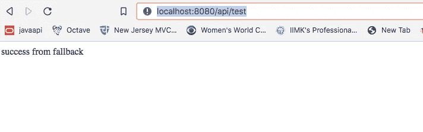

# 如何用阿里巴巴哨兵实现微服务中的断路器

> 原文：<https://levelup.gitconnected.com/how-to-implement-a-circuit-breaker-in-microservice-with-alibaba-sentinel-d645f69b20ef>


图片由[拍摄](https://pixabay.com/users/taken-336382/?utm_source=link-attribution&amp;utm_medium=referral&amp;utm_campaign=image&amp;utm_content=1098059)来自 [Pixabay](https://pixabay.com/?utm_source=link-attribution&amp;utm_medium=referral&amp;utm_campaign=image&amp;utm_content=1098059)

# 介绍

在构建微服务时，人们总是会想到创建一个有弹性的系统。尤其是当服务对 API 或数据源有外部依赖性，并且其在较低环境中的可用性值得怀疑时。

另一种情况是，如果外部系统抛出某种异常，我们希望采取不同的行动。

在微服务架构中，我们可以使用任何流行的实现方式来实现断路器设计。两个最受欢迎的实现是由网飞提供的网飞-海斯特里克斯和阿里巴巴提供的阿里巴巴-哨兵。

这两个实现都提供了调用回退方法所需的基本功能，以防原始方法出错，但我发现 sentinel 更有用，因为它提供了一些功能，使得调用回退方法更容易定制。

> 网飞-海斯特里克斯公司目前处于维护模式，而“哨兵”仍处于活动状态。
> 
> Hystrix 在 GitHub 中有 21.7k 颗星星，Sentinel 已经有 16.6k 颗星星，尽管与 Hystrix 相比，它是相当新的。

我们来看看断路器是如何用阿里巴巴哨兵实现的。就像网飞·海斯特里克斯一样，阿里哨兵也得到了 spring 项目的支持。

# 履行

首先，创建一个 SpringBoot 项目，并在 pom.xml 中添加以下依赖项

接下来，添加配置来定义*sentinelresourcespace*bean。

接下来，在您的服务类中，根据项目需求定义 sentinel 资源属性。

这里， *value* 定义资源名称， *fallback* 属性应该提到回退方法的名称， *defaultFallback* 属性应该提到当所有定义的方法失败时将被调用的方法的名称。

我们也可以利用像 *exceptionsToIgnore 这样的属性。*这将确保在抛出某个错误时不会调用回退。

在上面的 *TestService* 类中，如果 SentinelResource 被定义为-

```
 @SentinelResource(value = “getResponseFromFallback”, **exceptionsToIgnore= {RuntimeException.class}**,fallback = “fallbackTestMethod”, defaultFallback = “defaultFallback”)
```

则不会调用回退方法。

## 附加性能

一旦定义了资源，我们还可以为断路器设置各种动态规则。

阿里巴巴哨兵给出了两个选项来制定规则-

1.  通过 API
2.  通过外部数据源

我们可以重写我们的配置类，通过 API 来包含规则

以类似方式，我们可以根据我们的需求编写降级规则、系统规则和权限规则。

Sentinel project 有很好的维护和解释的 wiki，所以我们可以随时参考他们的 git 存储库来了解各种规则及其用法。

## 试验

你可以从 [**Github**](https://github.com/rubykv/code-examples) 查看上面解释的完整代码

一旦应用程序启动并运行，从任何浏览器点击 API。



回退方法的响应

如果你喜欢这篇文章，不要忘记启动 GitHub 项目。