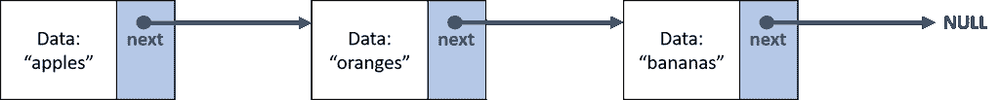
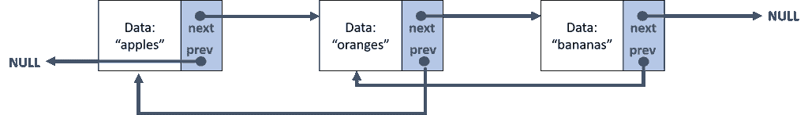
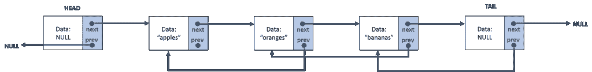

# 如何用 Java 从头开始实现一个链表

> 原文：<https://levelup.gitconnected.com/how-to-implement-a-linked-list-in-java-from-scratch-9a4f6f9e51ce>


格伦·卡斯滕斯-彼得斯在 [Unsplash](https://unsplash.com?utm_source=medium&utm_medium=referral) 上拍摄的照片

由于没有接受过计算机科学方面的正式培训，我总是试图弥补我可能存在的知识缺口。

其中之一肯定是对数据结构的深入了解。在参加了加州大学圣地亚哥分校在 Coursera 上提供的关于[数据结构和性能的课程后，我明白了解决这类问题的最好方法之一就是从头开始构建。](https://www.coursera.org/learn/data-structures-optimizing-performance)

这里我告诉你我是怎么做的，以及在这个过程中我学到了什么。

# 但是…数据结构到底是什么？

在开始变得更具体之前…什么是数据结构？

据[维基百科](https://en.wikipedia.org/wiki/Data_structure):

> *在* [*计算机科学*](https://en.wikipedia.org/wiki/Computer_science) *中，一种* ***数据结构*** *是一种数据组织、管理和存储格式，能够使*[](https://en.wikipedia.org/wiki/Algorithmic_efficiency)**高效的访问和修改。更准确地说，数据结构是* [*数据值*](https://en.wikipedia.org/wiki/Data) *以及它们之间的关系，以及可以应用于数据的函数或操作的集合。
> (…)
> 数据结构是* [*抽象数据类型*](https://en.wikipedia.org/wiki/Abstract_data_type) *(ADT)的基础。ADT 定义了数据类型的逻辑形式。数据结构实现了数据类型的物理形式。**

*好吧，什么？*

*我不知道是不是只有我这样，但是每当我读到像这样的“抽象”定义时，我往往会感到非常困惑。*

*因此，在我看来，外行人对此的解释可以是，数据结构是允许我们更好、更有效地使用数据的*东西。**

**

*苏珊·Q·尹在 [Unsplash](https://unsplash.com?utm_source=medium&utm_medium=referral) 上的照片*

*让我们在现实生活中想象一下。假设你有一堆**的书**(在这个类比中，就是**的数据**)。你可以把它们放在你的房间里，你仍然可以使用它们，但也许这不是最有效的方法。所以也许你可以想出**的东西**来帮你完成这个任务。也许你可以把它们作为**堆**放在你的桌子上，或者也许你可以把它们放在**架子**上，根据不同的标准排序。在我们的类比中，这些安排就是**数据结构**。*

# *什么是链表？*

*回到编程世界，一个**链表**当然是一个**数据结构**。*

*特别是，它是一个名为**列表**的**抽象数据类型**的实现。回到前面的解释，抽象数据类型类似于数据类型最终要做的事情的框架。*

*在这种情况下，一个**列表**只是一组项目的枚举。想象一个购物清单:*

**

*亚历山大·席默克在 [Unsplash](https://unsplash.com?utm_source=medium&utm_medium=referral) 上拍摄的照片*

*它只是一个你想买的杂货的枚举，你可以在这个列表上执行基本的操作，比如:插入新的商品，删除你不再感兴趣的商品，或者寻找一个特定的商品(例如，确定你下一步要选什么)。*

*然而，当我们编程时，我们可以**实现**这个列表和它的方法，这取决于我们想对它做什么。在这种情况下，**实现**意味着，即使每个列表都会有大致相同的**方法**(操作)，它们背后的**逻辑**也会不同。*

*在**链表**中，我们列表中的项目在内存中可能很稀疏，但是我们会通过**指针**或**引用**建立它们之间的关系，从而将它们一起保存在列表中。*

*这意味着我们可以将列表中的每一项都视为一个**节点**，其中至少包含两条信息:*

*   ***数据**(物品信息本身)。*
*   *一个**引用**到另一个节点。*

**

*作者图片*

*这将给出类似于上图的结果。我们称之为**单链表**，因为每个节点只有对另一个节点的引用(在这种情况下，是对下一个节点的引用)。对于最后一个节点，没有下一个，所以引用将指向一个空对象。*

**

*作者图片*

*如前图所示，如果我们创建对每个**下一个**和**上一个**节点的引用，那么我们将拥有一个**双向链表**。*

# *如何开始:构造函数和第一个方法*

*那么…我们需要什么来开始呢？*

*首先，我们需要考虑让所有这些运行起来所需的**类**。当然，我们需要一个类来保存链表，所以我们可以为此创建一个类。然而，不要**而不是**调用这个类 *LinkedList* ，因为这个实现已经在 Java 中存在了！(是的，我们学习是为了好玩)。*

*在这个例子中，我将实现一个**双向链表**，并且我将使用**前哨节点**。这些节点作为一种缓冲，确保我的列表中总是有两个节点，即使它是空的。这些节点是**头**(列表的第一个节点)和**尾**(列表的最后一个节点)，它们将始终为**空**。他们只会在帮助我们实现方面有用。*

**

*作者图片*

*所以我们的链表类需要:*

*   *一个**头**。*
*   *一条**尾巴**。*
*   ***尺寸**。*

*然后，我们可以开始写这样的东西:*

```
*// AbstractList is the abstract data type in this case
public class ImpLinkedList extends AbstractList {
// E means that we are using Generics
LLNode<E> head;
LLNode<E> tail;
public int size;public ImpLinkedList() {
    head = new LLNode<E>(null);
    tail = new LLNode<E>(null);
    size = 0;
// when the list is empty, we only have head and tail. 
// So they will keep referencing each other
    head.nextNode = tail;
    tail.prevNode = head;
}// methods
}*
```

*如果你注意第 4 行，两件有趣的事情正在发生:*

1.  *我正在使用一个 LLNode 对象，但是什么是 LLNode 对象呢？*
2.  *该 LLNode 似乎正在处理 **E** 类型的数据。这又是什么？*

*所以，关于第一点:正如我们之前看到的，一个链表是由**节点**组成的。所以是的，我们必须为此创建一个类，是的，我把它叫做 **LLNode** 。*

*关于第 2 点:我们**事先不知道**我们将用链表处理什么类型的数据(字符串、整数、另一个对象？).当然，为我们想要处理的每种数据类型实现一个新的列表是没有意义的。
在 Java 中，我们可以通过使用 [**泛型**](https://docs.oracle.com/javase/tutorial/java/generics/types.html) 来处理这个问题。通过指定一个大写字母(查看前面的链接以了解约定)，我们可以确保我们的解决方案将处理任何数据类型，而无需事先知道它。*

*现在我们知道了所有这些，是时候创建 **LLNode** 类了。它只需要具备:*

*   *数据。*
*   *对上一个节点的引用。*
*   *对下一个节点的引用。*

```
*public class LLNode {
// Generics again
E data;
LLNode<E> prevNode;
LLNode<E> nextNode; public LLNode(E e){
    this.data = e;
    this.prevNode = null;
    this.nextNode = null;
}
}*
```

*太好了！有了这个，我们就有了继续工作所需的所有基础。现在我们可以开始在我们的 **ImpLinkedList** 类中实现我们需要的方法。下面是我如何实现 **add** 方法的一个例子:*

```
*public class ImpLinkedList extends AbstractList {
// constructorspublic boolean add(E data) {
	if (data != null) {
		// create new node
		LLNode<E> newNode = new LLNode<E>(data);
		// change links
		//	newNode -> next (tail)
		//			-> prev (tail.prev)
		newNode.nextNode = tail;
		newNode.prevNode = tail.prevNode;
		//	prev	-> next (newNode)
		tail.prevNode.nextNode = newNode;
		//	tail	-> prev (newNode)	
		tail.prevNode = newNode;

		// increase size
		size += 1;

		return true;
	}
	return false;
}
// other methods
}*
```

*您还可以实现其他典型方法，例如:*

*   *get →给定一个(整数)索引，它从相应的节点返回数据。*
*   *添加→到特定位置。提供数据和索引，将元素添加到列表中的特定位置。*
*   *remove →给定一个索引，删除相应的节点。*
*   *size →返回列表的大小。*
*   *set →给定一个索引，更新(修改)相应节点的数据。*

# *我学到了什么*

*那么…如果已经有了链表的 Java 实现，为什么还要做这些呢？*

*虽然在实际情况下，我更喜欢 Java 的内置解决方案，而不是我的，但我喜欢做这个练习，因为我可以学到很多东西:*

*   *我没有受过非常正规的计算机科学教育，所以我学到了很多关于数据结构和它们应该做什么的知识。*
*   *我学会了抽象思考。我习惯于只处理相当实际的问题，所以暂时用更通用或抽象的方式思考是一个很好的练习。*
*   *我了解了仿制药。是的，我承认这个概念以前在我脑海里只是一个模糊的词。*
*   *我提高了我的测试技能。我学到了很多关于我应该在我的代码中测试什么，什么时候测试等等。*

# *链接和参考*

*   *[数据结构和性能—加州大学圣地亚哥分校 Coursera 的课程](https://www.coursera.org/learn/data-structures-optimizing-performance)*
*   *[维基百科上的数据结构](https://en.wikipedia.org/wiki/Data_structure)*
*   *[Oracle 泛型的 Java 文档](https://docs.oracle.com/javase/tutorial/java/generics/types.html)*