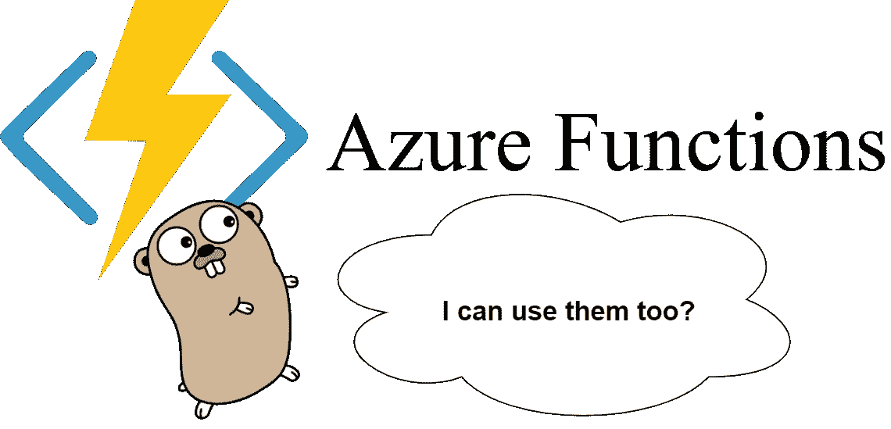
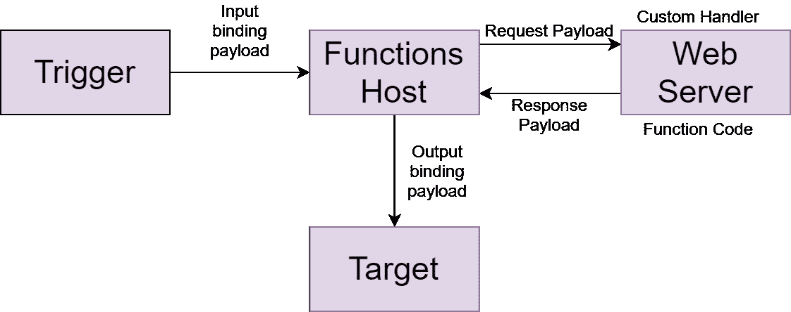
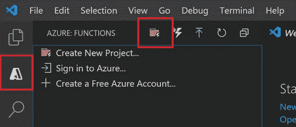
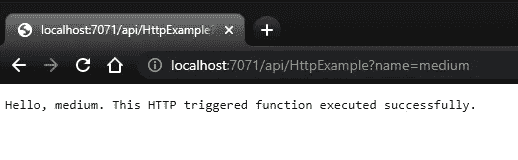
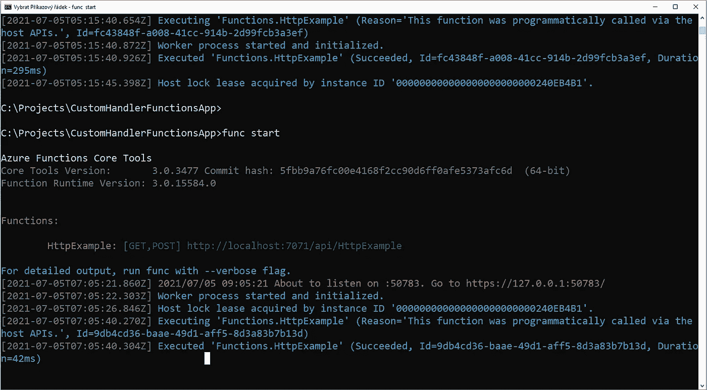

# 如何用自定义处理程序在任何语言中实现 Azure 函数

> 原文：<https://levelup.gitconnected.com/how-to-implement-azure-functions-in-any-language-with-custom-handlers-78e627264ccb>

## 蔚蓝的

## 使用 Go 语言演示自定义处理程序。



使用 Go 语言的 Azure 函数

# 介绍

每个 Azure 函数都有自己的处理程序。Azure Functions 支持许多不同语言的处理程序实现，但它们可能不会提供您最喜欢的语言的原生实现。这就是自定义处理程序的用武之地。

您选择的语言必须支持 HTTP 通信，因为自定义处理程序是一个 web 服务器，它接收来自函数 Host 的事件，这些函数被修改成带有 JSON 有效负载的 HTTP 请求。



通信图

**Functions Host** 是一堆 JSON 配置文件，在这里你将定义你想要使用的触发器和绑定，当然还有可执行文件的路径，这是我们的**定制处理程序** (Web 服务器)。

一旦**触发器**被事件激活，功能主机向网络服务器发送请求有效载荷。有效负载可以保存触发器和输入绑定数据。

**Web 服务器**调用该函数，并可能返回一个响应有效载荷。响应负载可用于输出绑定。

# 演示

源代码可以在我的 [GitHub](https://github.com/DannyRusnok/CustomHandlerFunctionsApp) 上找到。

## 你需要的东西

*   [Visual Studio 代码](https://code.visualstudio.com/)和 [Azure 函数扩展](https://marketplace.visualstudio.com/items?itemName=ms-azuretools.vscode-azurefunctions)。
*   [Azure 功能核心工具](https://docs.microsoft.com/en-us/azure/azure-functions/functions-run-local#v2)。
*   [去](https://golang.org/doc/install)。

## 创建项目



“创建新项目”按钮的位置

1.  单击图像中突出显示的按钮，创建一个新项目。
2.  您将被要求选择基本设置。选择**自定义**语言、 **HTTP 触发器**、 **HttpExample** 作为函数名、**匿名**授权级别定义函数宿主。

## 创建处理程序

1.  在根文件夹中创建一个文件，并另存为`handler.go.`
2.  将此代码复制/粘贴到文件中。

函数`helloHandler`打印一条简单的消息作为 HTTP 响应。消息的形式取决于 HTTP 请求中`name`参数的值。

如果设置了值`name`，响应将是:

```
Hello, {name}. This HTTP triggered function executed successfully.
```

如果值`name`是**而不是**设置的，响应将如下所示:

```
This HTTP triggered function executed successfully. Pass a name in the query string for a personalized response.
```

3.打开命令行或 PowerShell，使用以下命令将自定义处理程序编译成名为`handler.exe`的可执行文件(已安装 Go):

```
go build handler.go
```

## 修改主机. json

现在你需要为 host.json 中的`customHandler:defaulteExecutablePath`属性指定文件路径，如果你在根文件夹中创建了`*.exe`文件，你可以将值设置为`handler`。

还需要将`customHandler:eneableForwardingHttpRequest`的值设置为`true`。

## 运行该功能

1.  再次打开命令行或 PowerShell，并在根文件夹中运行此命令(已安装 Azure Function Core Tools):

```
func start
```

2.导航到以下 URL 以执行该功能:

`[http://localhost:7071/api/HttpExample?name=medium](http://localhost:7071/api/HttpExample?name=medium)`



如果你得到和我相似的回应，你就成功了。

3.您还可以查看控制台，看看您的功能是否被执行。



# 摘要

我们发现了 Azure 函数的自定义处理程序是什么，它们是如何工作的，以及我们如何用 Go 语言轻松实现它们。作为下一步，我建议你尝试将函数发布到 Azure 中。

如果你喜欢这篇文章，给它几个掌声。谢谢你的时间。

# 来源

*   [微软文档](https://docs.microsoft.com/en-us/azure/azure-functions/functions-custom-handlers)。
*   Mark Heath 的 Pluralsight 课程— [微软 Azure 开发者:实现 Azure 功能。](https://app.pluralsight.com/library/courses/microsoft-azure-developer-implement-azure-functions)

# 进一步阅读

[](/how-to-create-a-free-azure-account-step-by-step-348d4991ae6e) [## 如何一步一步创建免费的 Azure 帐户

### 创建免费 Azure 帐户指南。有哪些可以免费使用的服务？什么是目录或订阅，什么是…

levelup.gitconnected.com](/how-to-create-a-free-azure-account-step-by-step-348d4991ae6e) [](/introduction-to-cloud-computing-235e530b9fe0) [## 云计算简介

### 云计算是软件利用、开发和托管的现在和未来。让我给你介绍一下它的…

levelup.gitconnected.com](/introduction-to-cloud-computing-235e530b9fe0) [](https://danielrusnok.medium.com/understanding-the-azure-resource-groups-and-azure-resources-d89ce92d25a6) [## 了解 Azure 资源组和 Azure 资源

### 还指导如何创建您的第一个 Azure 资源组，并添加您的 Azure 资源到其中。

danielrusnok.medium.com](https://danielrusnok.medium.com/understanding-the-azure-resource-groups-and-azure-resources-d89ce92d25a6) [](https://danielrusnok.medium.com/how-to-choose-the-azure-region-2a7bfd5ef864) [## 如何选择蔚蓝地区

### 选择 Azure Region 之前应该考虑什么？微软如何在地理上划分数据中心的位置…

danielrusnok.medium.com](https://danielrusnok.medium.com/how-to-choose-the-azure-region-2a7bfd5ef864) [](https://www.buymeacoffee.com/danielrusnok)[](https://itixo.com)