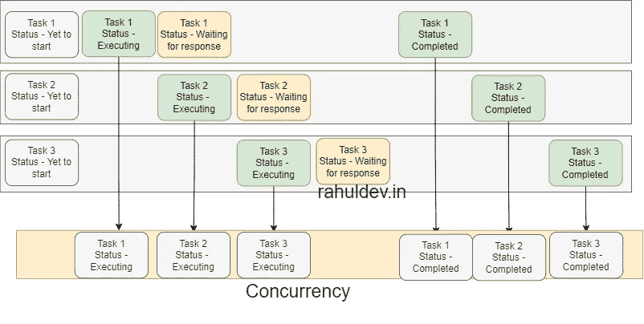
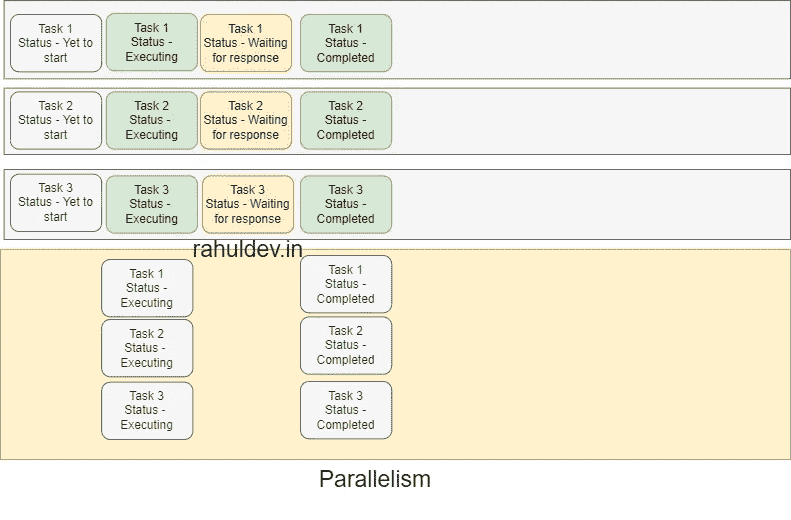

# 如何在 Go 中实现并发和并行

> 原文：<https://levelup.gitconnected.com/how-to-implement-concurrency-and-parallelism-in-go-83c9c453dd2>

# 介绍

在深入实际主题之前，熟悉以下术语非常重要。

# 什么是处理器？

核心或处理器是 CPU 中的复杂逻辑，它可以执行一组称为程序的指令。处理器是运行实际`Process`的硬件实体。

# 什么是过程？

实际上，我们不会直接在 CPU 内核上运行程序。这个责任就交给了操作系统。操作系统通过一个叫做`Process`的东西把你的程序指令写到内核或者处理器上。

一个`Process`是由操作系统管理的程序的逻辑实例。操作系统会根据程序的优先级调度成千上万个进程。不考虑内核或处理器数量，一个操作系统可以有任意数量的`logical processes`，但在任何时间点，每个处理器只能执行一条`process`指令。

# 什么是线程？

线程是进程中的执行路径。一个进程可以包含多个线程。所有程序都至少有一个线程是在程序启动时创建的，但是一个程序可以启动多个线程来并行执行工作。

# 什么是并发？

并发是一种通过有效利用可用资源同时处理多个任务的方法。尽管它同时处理多个任务，但在任何时候它只能执行一个非阻塞任务(执行状态)。剩余任务或者处于阻塞状态、尚未开始、已完成、保持或任何其他状态。

正如您在下面的快照中看到的，看起来我们正在同时执行多个任务，但事实是我们正在按等待时间或阻塞状态取消任务的优先级。这样程序就可以在同一时间执行其他重要的任务，并在得到响应后回到它离开的地方。这就是所谓的并发。

并发

假设您已经用您最喜欢的编程语言创建了一个支持并发的程序。以及这个程序有 3 个任意的任务。最初，所有任务都处于默认状态(尚未开始)。

假设这 3 个任务都涉及到一些预处理和网络调用，因此从外部系统获得响应需要花费任意的时间。

运行程序后，您会看到 task 1 处于执行状态，因为它涉及到一些预处理。我们还知道它涉及网络调用，所以它在等待(阻塞状态)来自外部系统的响应。同时，任务 2 开始执行其预处理层，并由于网络调用而再次进入等待状态。现在有 2 个任务处于阻塞状态，所以你的程序开始执行任务 3 和它的预处理层。现在，甚至任务 3 也进入了阻塞状态。一旦任何先前被阻塞的状态得到响应，那么它各自的任务就完成了。

出于某种原因，如果两个或更多处于阻塞状态的任务同时得到响应，那么你的程序会随机选择任务并一个接一个地完成它。

# 什么是并行？

并行就是在同一给定时间独立并行执行多个作业。与并发不同，它不关心任务状态，所以它同时并行执行所有任务。为了执行这些独立的动作，它消耗额外的资源。

正如您在下面的快照中看到的，所有 3 个任务同时开始执行、等待和完成各自的任务。但是总的来说，与并发相比，它花费的时间更少。就资源使用而言，当所有任务都处于空闲状态时，它仍然有带宽来容纳其他任务。借助并行技术，我们能够更快地完成工作，但却无法更好地利用资源。

平行

如果您有一个多核系统，那么您肯定可以利用并行性。

# 什么是 Goroutine？

goroutine 是由 Go 运行时管理的轻量级线程。由于计算强度较低，一个线程可能有数千个 goroutines。goroutine 和 thread 之间的主要区别是 Goroutine 没有本地存储，因此，go routine 的实现比 thread 便宜，所以 go routine 在启动时间方面要快得多。

如果你是 goroutines 的新手，那么点击下面的卡片以获得更深入的理解。

 [## 什么是 Goroutine？找到实现 goroutines 的正确方法

levelup.gitconnected.com](/what-is-a-goroutine-find-the-right-way-to-implement-goroutines-f6ef15d1c32b) 

# 在 Go 中实现并行

请参考下面的代码片段。

它有一个名为`threadProfile`的变量，用于跟踪运行时创建的线程数量。在 Go 中，线程是实现并行的方式。

`runtime.GOMAXPROCS(runtime.NumCPU())`用于设置您的应用程序可以使用的内核数量。如果默认情况下没有设置这个变量，它会使用所有可用的内核。通常，它是用`init`方法定义的。

`runtime.LockOSThread()`将调用此函数，通过锁定和解锁线程来防止 goroutines 重用现有线程。这是一个观察并行性的技巧，因为 Go scheduler 默认重用处于非阻塞状态的线程。

我们添加了`log statements`来查看执行前后的线程数。

您可以使用`go run parallelism.go`命令执行上面的代码片段。您将得到如下类似的输出。

并行度-输出

对于`count := 10`，我们可以看到大约有 10 个新线程被创建。它清楚地表明，这个程序是通过锁定线程并行执行的。出于演示目的，我们锁定了线程来强制实现这一点。

# 在 Go 中实现并发

请参考下面的代码片段。

它具有与上面定义的几乎相似的变量和功能。唯一的主要变化是我们移除了`lock`方法，因为我们希望看到 goroutines 的默认行为。

您可以使用`go run concurrency.go`命令执行上面的代码片段。如果您得到如下类似的输出，那么您已经成功地在并发模式下执行了程序。从输出中您可以理解，即使对于`count:=10`，所有 10 个 goroutines 都容纳在相同数量的可用线程中，甚至没有创建一个新线程。

并发输出 1

现在您已经看到了并发的实际应用，但是您知道 Go 会自动动态地创建所需数量的线程吗？。

让我们通过更新`count:=1000` (1000 个 goroutines)来看看并发性和并行性的作用。您将得到如下类似的输出。

并发性-并行性-输出

如果仔细观察输出，您会发现根据需求创建了一个新线程。

# 摘要

为了获得开箱即用的最佳性能，建议在您选择的任何语言中结合并发性和并行性。在 Go 中，它是在内部处理的，但在其他语言中，你需要显式地定义细节(node.js-clusters 和 async await，python-gunicorn 和 async await(FastAPI))。

如果你喜欢这篇文章，那么你肯定也会喜欢学习 Go 中的高级 Singleton 设计模式实现。更多详情请参考下面的卡片。

 [## 如何在 Go 中实现 Singleton 设计模式？🔥

### 介绍

medium.com](https://medium.com/@rahul-yr/how-to-implement-singleton-design-pattern-in-go-2ca060d478e5) 

可怕的🔥，您已经成功完成了本教程。我会💝听听你的反馈和意见，看看你能用它做些什么。如果你突然想到什么地方，请随意评论。我随时都有空。

如果你觉得这篇文章对其他人有帮助，那么请考虑点赞。

请在 [github](https://github.com/rahul-yr/learn-go-concepts.git) 找到完整的代码