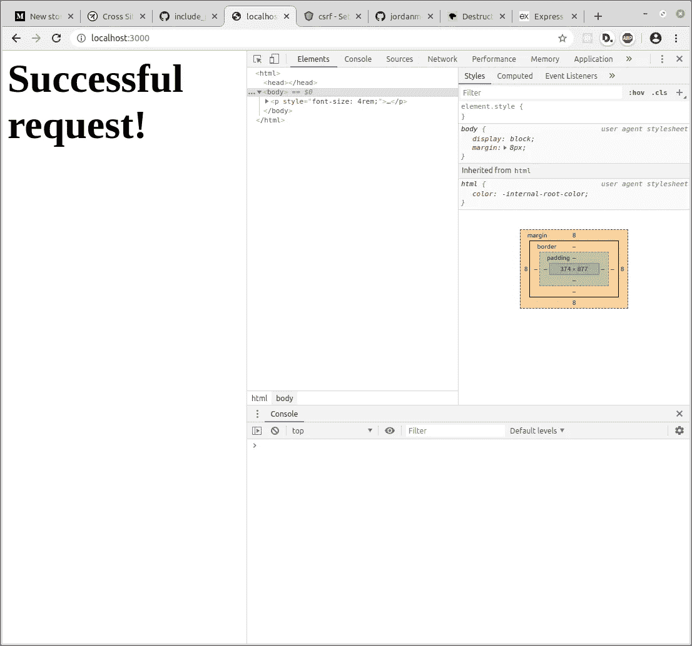

# 如何在 Express 中实现 CSRF 令牌

> 原文：<https://levelup.gitconnected.com/how-to-implement-csrf-tokens-in-express-f867c9e95af0>

## 用最少的麻烦和中间件保护 Express 应用程序免受跨站点请求伪造。

安全性是所有开发人员最关心的问题，尤其是对于使用像 *Express* 这样的非独立 web 框架的开发人员。

由于 *Express* 对创建应用程序的正确方法没有意见，它对保护应用程序的正确方法也没有意见。因此，保护应用程序是完全留给开发人员的任务。

幸运的是，保护一个 *Express* 应用程序免受网络上常见漏洞的攻击并不困难。

本文将重点讨论如何防止 **CSRF** ，它代表**跨站请求伪造**。

# CSRF 解释道

当在某个站点上经过身份验证的用户被迫向该站点发出不需要的请求时，就会发生跨站点请求伪造。该请求源自不同的来源，这就是为什么这是一个**跨来源请求伪造。**

以一个银行应用程序为例。用户通过浏览器中的 cookie 在银行网站上进行身份验证。

现在，用户访问一个不同的站点。该网站在其页面中包含以下 HTML:

``

当 HTML 加载到这个页面时，`img`标签实际上对其`src`属性中的链接发出了一个 **GET** 请求。由于 cookies 默认情况下是与请求一起发送的，所以即使请求是从银行网站以外的地方发送的，也要对其进行身份验证。

无论用户是否同意，都有许多其他方式来发起这些请求。

显然，这是一个巨大的安全隐患；然而，有一个小小的安全措施可以减轻 CSRF，这是一个 **CSRF 令牌**。

# 什么是 CSRF 代币？

CSRF 令牌是一段随机的、唯一的、附加在表单上的数据。通常，这些数据包含在一个隐藏的`input`标签中，数据存储在其`value`属性中。

这里有一个简单的例子来说明 CSRF 令牌在野外的样子:

CSRF 令牌是隐藏的——其安全优势并不超过美学优势。

带有`name`‘csrf _ token’的第一个`input`是实际的 csrf 令牌。

为了正常运行，CSRF 令牌必须由服务器生成，然后呈现在保存`form`的页面上。然后，来自该页面的所有请求都将包含带有`csrf_token`名称的`input`,而所有跨站点的请求都没有这个名称。

跨站点请求不包含 CSRF 令牌的原因是，服务器必须呈现保存`form`的实际页面，以便将 CSRF 令牌附加到发出所需请求的`form`。

当向相关路由发出请求时，表单中的 CSRF 令牌必须与服务器存储的 CSRF 令牌相匹配。如果 CSRF 令牌不存在或者与服务器上为该用户会话保留的 CSRF 令牌不匹配，则无法完成请求。

理论说够了；是时候在 *Express* 中实际实现这个了。

# 设置应用程序

人们可以通过这个 [GitHub](https://github.com/jordanmoore753/CSRF_Demo) 链接下载本文的项目，或者他们可以生成一个 *Express* 应用程序，如下所示:

`express --view=pug your_app_name`

> 别忘了跑`npm install`。

此外，安装以下 **npm** 包:

`npm install cookie-session`

cookie-session 包将用于创建一个可以存储、访问和销毁 CSRF 令牌的会话。

要使用 **cookie-session** ，请将`require`放在`./app.js`的顶部，将`use`放在`app.use(cookieParser())`之后。

安全的饼干是美味的饼干。

至于`cookieSession`参数中的具体属性，需要关注的是`sameSite`属性。值`lax`意味着`session` cookie 将**仅**与安全 HTTP 请求(GET、HEAD、OPTIONS)一起发送到具有相同来源**或**顶级域请求的站点。

`sameSite`属性有助于防止许多 CSRF 尝试，但是在所有状态改变请求中，尤其是表单中，要求 CSRF 令牌仍然是明智的。

# 创建 CSRF 令牌

导航至`./routes/index.js`。

> 出于本文的目的，将不使用`users.js`路线。

在`index.js`的顶部，需要`crypto`模块(这个不需要`npm install`，使用 [**析构赋值**](https://developer.mozilla.org/en-US/docs/Web/JavaScript/Reference/Operators/Destructuring_assignment) 将其赋值给`randomBytes`。

`randomBytes`函数将用于为 CSRF 令牌生成随机的唯一数据。

接下来，在 GET 函数中，实现将`req.session.csrf`赋值给`randomBytes`调用的返回值。仅当`csrf`属性为`undefined`时，才分配`csrf`。

为了确保`csrf`属性在`session`对象上，在 GET 函数体中使用`console.log(req.session)`。在本教程的这一点上，您应该会看到以下输出:

实际值在不同的计算机上会有所不同。

是时候在`index`视图上创建一个`form`了，这样 CSRF 令牌就可以接受测试了。

# 设置视图

打开文件`./views/index.pug`。

用方法`POST`和指向 URL `'/'`的动作创建一个`form`。包括用于`csrf`和`username`字段的`input`。

此外，隐藏`csrf`并将`username`设为`text`输入。

这绝对不光彩。

现在，当页面被渲染时，`form`元素应该看起来像下图中的样子:

CSRF 代币还没有价值。

注意，`csrf`输入没有`value`—`pug`文件中的`token`变量将用于将来自`req.session.csrf`的 CSRF 令牌附加到`form`上。

# 附加 CSRF 令牌

返回到`./routes/index.js`。

在`res.render('index', { title: 'Express' })`调用内部，将另一个属性`token`分配给对象(第二个参数)。在该属性上，指定`req.session.csrf`的值。

token 是由“索引”视图访问的变量的名称。

现在，当用户导航到`/`路线时，应该有一个`value`用于`csrf`输入。输出应该类似于下图:

对于不同的用户，该值应该不同。

太好了！CSRF 令牌已成功连接到`form`。现在，在`router`上创建`post`路由函数。该函数将处理对`'/’`的`post`请求，并且必须检查`csrf`输入是否已经包含**并且**是否与`req.session.csrf`值匹配。

如果值不匹配或`csrf`输入丢失，`send`一些数据表明请求失败。在一个成功的请求中，`send` 一些表明请求成功的数据。

回复中包含可选样式。

提交表单时，应出现以下屏幕:

CSRF 令牌存在，并且与会话令牌匹配。

为了测试出无效的请求，打开 **Postman** ，发送一些 POST 请求到:`[http://localhost:3000/](http://localhost:3000/.)`。

首先，测试一个只有包含`username`输入的请求。第二，测试一个包含`csrf`和`username`输入的请求，但是`csrf`值是虚构的。

第一个测试应该产生以下结果:

表单中未包含 CSRF 令牌，因此该请求无效。

第二个也是最后一个测试应该会产生以下结果:

CSRF 令牌与会话 cookie 中的令牌不匹配。

瞧啊。就这样，安全的、无 CSRF 的请求已经在 Express 中实现了。

# 结论

虽然这是一个用于减轻 CSRF 攻击的健壮而简单的解决方案，但是在考虑较大的应用程序时必须加以考虑。需要考虑的一些设计问题如下:

1.  CSRF 令牌应该存储在服务器端吗？
2.  当用户注销时，CSRF 令牌会被销毁吗？
3.  CSRF 代币应该有多大？

幸运的是，正如本文所示，减轻 CSRF 攻击的威胁并不是不必要的复杂；因此，重构本文中详细介绍的防御以满足应用程序的独特需求应该同样简单。

感谢你的时间和快乐的编码！