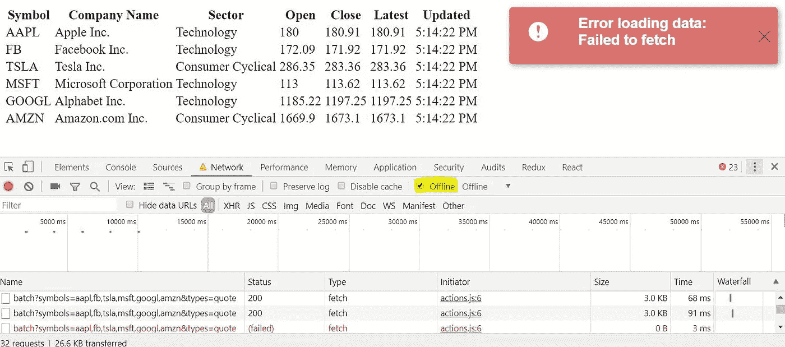

# 如何用 React、Redux 和 Thunk 实现数据轮询

> 原文：<https://levelup.gitconnected.com/how-to-implement-data-polling-with-react-redux-and-thunk-33cd1e47f89c>


照片由 [rawpixel](https://unsplash.com/@rawpixel?utm_source=medium&utm_medium=referral) 在 [Unsplash](https://unsplash.com?utm_source=medium&utm_medium=referral) 上拍摄

# 介绍

在我之前的文章[如何用 Redux-Thunk、Redux-Saga、suspension&Hooks](https://medium.freecodecamp.org/loading-data-in-react-redux-thunk-redux-saga-suspense-hooks-666b21da1569)加载数据中，我比较了从 API 加载数据的不同方式。在 web 应用程序中，数据经常需要更新，以便向用户显示相关信息。短轮询是实现这一点的方法之一。查看[这篇](https://codeburst.io/polling-vs-sse-vs-websocket-how-to-choose-the-right-one-1859e4e13bd9)文章，了解更多细节和备选方案。

简而言之，我们将每隔 **N** 毫秒请求一次新数据。然后，我们显示这个新数据，而不是以前加载的数据。本文给出了一个使用 React、Redux 和 Thunk 实现这一点的例子。

先定义一下问题。

***web 站点的很多组件从 API 中轮询数据(对于这个例子，我使用***[**iextrading.com**](https://iextrading.com/developer/docs/#getting-started)**的公共 API 来显示股票价格*)并将这些数据显示给用户。轮询逻辑应该与组件分离，并且应该是可重用的。如果调用失败，组件应该显示一个错误，如果调用成功，则隐藏以前显示的错误。***

本文假设您已经有了一些创建 React/Redux 应用程序的经验。

该示例的代码可在 [GitHub](https://github.com/ValeraT1982/react-data-polling-thunk) 上获得。

# 项目设置


照片由[马特·阿特兹](https://unsplash.com/@mattartz?utm_source=medium&utm_medium=referral)在 [Unsplash](https://unsplash.com?utm_source=medium&utm_medium=referral) 上拍摄

我假设您已经使用 [create-react-app](https://github.com/facebook/create-react-app) 创建了一个 React 项目，并配置了 Redux，可以使用了。如果你有任何困难，你可以检查一下[这个](https://facebook.github.io/create-react-app/)和/或[这个](https://medium.com/backticks-tildes/setting-up-a-redux-project-with-create-react-app-e363ab2329b8)。

[React-redux-toastr](https://github.com/diegoddox/react-redux-toastr) 用于显示带有错误的弹出窗口。

# 商店配置


照片由[德鲁·帕特里克·米勒](https://unsplash.com/@drewpatrickmiller?utm_source=medium&utm_medium=referral)在 [Unsplash](https://unsplash.com?utm_source=medium&utm_medium=referral) 上拍摄

使用 thunk 中间件减少存储配置。

*configureStore.js*

```
import { applyMiddleware, createStore, compose } from 'redux';
import thunk from 'redux-thunk';
import rootReducer from './rootReducer';export function configureStore(initialState) {
  return createStore(rootReducer, initialState, compose(applyMiddleware(thunk)));
}
```

# 根部减速器


[霍尔格连杆](https://unsplash.com/@photoholgic?utm_source=medium&utm_medium=referral)在 [Unsplash](https://unsplash.com?utm_source=medium&utm_medium=referral) 上拍照

在 ***rootReducer*** 中，我们将 Reducer 与应用数据(稍后创建)以及 [react-redux-toastr](https://github.com/diegoddox/react-redux-toastr) 中的***toastr***reducer 结合起来。

*rootReducer.js*

```
import {combineReducers} from 'redux';
import data from './reducer';
import {reducer as toastr} from 'react-redux-toastr'const rootReducer = combineReducers({
    data,
    toastr
});export default rootReducer;
```

# 行动


罗伯特·尼克森在 [Unsplash](https://unsplash.com?utm_source=medium&utm_medium=referral) 上拍摄的照片

我们只需要一个动作来加载股票价格。如果调用成功，则***LOAD _ DATA _ SUCCESS***动作被调度以更新全局状态并移除错误(如果先前的调用失败)，否则，显示错误。

*actions.js*

```
import {toastr} from "react-redux-toastr";export const LOAD_DATA_SUCCESS = "LOAD_DATA_SUCCESS";export const loadPrices = () => dispatch => {
    return fetch(
        '[https://api.iextrading.com/1.0/stock/market/batch?symbols=aapl,fb,tsla,msft,googl,amzn&types=quote'](https://api.iextrading.com/1.0/stock/market/batch?symbols=aapl,fb,tsla,msft,googl,amzn&types=quote'))
        .then(response => {
            if (response.ok) {
                return response.json();
            } throw new Error(response.statusText);
        })
        .then(
            data => {
                toastr.removeByType('error');
                dispatch({type: LOAD_DATA_SUCCESS, data});
            },
            error => {
                toastr.error(`Error loading data: ${error.message}`);
            })
};
```

# 应用还原剂


扎克·赖纳在 [Unsplash](https://unsplash.com?utm_source=medium&utm_medium=referral) 上拍摄的照片

Reducer 更新全局状态。

*reducer.js*

```
import {LOAD_DATA_SUCCESS} from "./actions";const initialState = {
    prices: []
};export default function reducer(state = initialState, action) {
    switch (action.type) {
        case LOAD_DATA_SUCCESS: {
            return {
                ...state,
                prices: action.data
            }
        }
        default: {
            return state;
        }
    }
}
```

# 用于查询数据的高阶组件(HOC)


杰克·斯洛普在 [Unsplash](https://unsplash.com?utm_source=medium&utm_medium=referral) 上拍摄的照片

这可能是最棘手的部分。像 Redux 中的 ***连接*** 一样，可以修饰另一个组件来添加一些附加功能。在这种情况下， ***withPolling*** 接收***polling action***和 ***duration*** 作为属性。在 ***上，componentdimount***组件调用***polling action***并调度每隔*毫秒调用相同的动作(默认为 2000)。在 ***组件上将卸载*** 组件停止轮询。更多关于 HOC [的细节在这里](https://reactjs.org/docs/higher-order-components.html)。*

**withPolling.js**

```
*import * as React from 'react';
import {connect} from 'react-redux';export const withPolling = (pollingAction, duration = 2000) => Component => {
    const Wrapper = () => (
        class extends React.Component {
            componentDidMount() {
                this.props.pollingAction();
                this.dataPolling = setInterval(
                    () => {
                        this.props.pollingAction();
                    },
                    duration);
            }componentWillUnmount() {
                clearInterval(this.dataPolling);
            }render() {
                return <Component {...this.props}/>;
            }
        });const mapStateToProps = () => ({});const mapDispatchToProps = {pollingAction};return connect(mapStateToProps, mapDispatchToProps)(Wrapper())
};*
```

# *用法示例(价格组件)*

**

*Bobby Rodriguezz 在 [Unsplash](https://unsplash.com?utm_source=medium&utm_medium=referral) 上的照片*

****价格组件*** 使用 ***withPolling*** ，将价格从状态映射到道具并显示数据。*

**PricesComponent.js**

```
*import * as React from 'react';
import {connect} from 'react-redux';
import {loadPrices} from "./actions";
import {withPolling} from "./withPolling";class PricesComponent extends React.Component {
    render() {
        return (
            <div>
                <table>
                    <thead>
                    <tr>
                        <th>Symbol</th>
                        <th>Company Name</th>
                        <th>Sector</th>
                        <th>Open</th>
                        <th>Close</th>
                        <th>Latest</th>
                        <th>Updated</th>
                    </tr>
                    </thead>
                    <tbody>
                    {Object.entries(this.props.prices).map(([key, value]) => (
                        <tr key={key}>
                            <td>{key}</td>
                            <td>{value.quote.companyName}</td>
                            <td>{value.quote.sector}</td>
                            <td>{value.quote.open}</td>
                            <td>{value.quote.close}</td>
                            <td>{value.quote.latestPrice}</td>
                            <td>{(new Date(Date(value.quote.latestUpdate))).toLocaleTimeString()}</td>
                        </tr>
                    ))}
                    </tbody>
                </table>
            </div>
        );
    }
}const mapStateToProps = state => ({
    prices: state.data.prices
});const mapDispatchToProps = {};export default withPolling(loadPrices)(
    connect(mapStateToProps, mapDispatchToProps)(PricesComponent));*
```

# *应用*

**

*照片由[杰伊·温宁顿](https://unsplash.com/@jaywennington?utm_source=medium&utm_medium=referral)在 [Unsplash](https://unsplash.com?utm_source=medium&utm_medium=referral) 上拍摄*

*该应用程序由**价格组件**和 ***ReduxToastr*** (显示错误的组件)组成*

**App.js**

```
***import** React, {Component} **from 'react'**;
**import** ReduxToastr **from 'react-redux-toastr'
import 'react-redux-toastr/lib/css/react-redux-toastr.min.css'
import** PricesComponent **from "./PricesComponent"**;

**class** App **extends** Component {
    render() {
        **return** (
            <**div**>
                <**PricesComponent text='My Text'**/>
                <**ReduxToastr
                    transitionIn="fadeIn"
                    transitionOut="fadeOut"
                    preventDuplicates=**{**true**}
                    **timeOut=**{99999}
                />
            </**div**>
        );
    }
}

**export default** App;*
```

*这个应用程序看起来是这样的，没有错误。*

**

*像这样有误差。仍显示先前加载的数据。*

**

# *带轮询随机测试*

**

*照片由[路易斯·里德](https://unsplash.com/@_louisreed?utm_source=medium&utm_medium=referral)在 [Unsplash](https://unsplash.com?utm_source=medium&utm_medium=referral) 上拍摄*

*[带有酶-接头-反应-16 的酶](https://github.com/airbnb/enzyme)用于测试。这里比较棘手的部分是使用 jest 的假计时器，创建***testAction****和****wrapper component****。****

***setupTests.js***

```
**import Enzyme from 'enzyme';
import Adapter from 'enzyme-adapter-react-16';// React 16 Enzyme adapter
Enzyme.configure({ adapter: new Adapter() });**
```

***withPolling.test.js***

```
**import * as React from 'react';
import {mount} from 'enzyme';
import {withPolling} from './withPolling';
import {configureStore} from "./configureStore";
import {Provider} from "react-redux";jest.useFakeTimers();describe('withPolling HOC Tests', () => {
    let store;
    let wrapper; const TestComponent = () => (
        <div id='test-component'>
            Test Component
        </div>
    ); beforeEach(() => {
        store = configureStore();
    }); afterEach(() => {
        wrapper.unmount();
    }); it('function is called on mount', () => {
        const mockFn = jest.fn();
        const testAction = () => () => {
            mockFn();
        }; const WrapperComponent = withPolling(testAction)(TestComponent); wrapper = mount(<Provider store={store}><WrapperComponent/></Provider>); expect(wrapper.find('#test-component')).toHaveLength(1);
        expect(mockFn.mock.calls.length).toBe(1);
    }); it('function is called second time after duration', () => {
        const mockFn = jest.fn();
        const testAction = () => () => {
            mockFn();
        }; const WrapperComponent = withPolling(testAction, 1000)(TestComponent); wrapper = mount(<Provider store={store}><WrapperComponent/></Provider>); expect(wrapper.find('#test-component')).toHaveLength(1);
        expect(mockFn.mock.calls.length).toBe(1); jest.runTimersToTime(1001); expect(mockFn.mock.calls.length).toBe(2);
    });
});**
```

# **结论**

**这个例子展示了如何使用 React、Redux 和 Thunk 实现数据轮询。**

**作为另一种解决方案，带轮询的**可以是一个类组件(例如轮询)。在这种情况下***<Polling/>***将需要添加到***price component***中。我认为本文提供的解决方案稍好一些，因为我们不需要向 JSX 添加假组件(不添加任何可见内容的组件)，而 HOC 是一种添加可重用组件逻辑的技术。****

****就是这样。喜欢这篇文章就欣赏鼓掌吧！****

********