# 如何在 Flutter Web 中实现 Google reCAPTCHA v3

> 原文：<https://levelup.gitconnected.com/how-to-implement-google-recaptcha-v3-in-flutter-web-38000139bbc0>

*开发者在 Flutter Web 中嵌入 Google reCAPTCHA v3 的基本指南。*

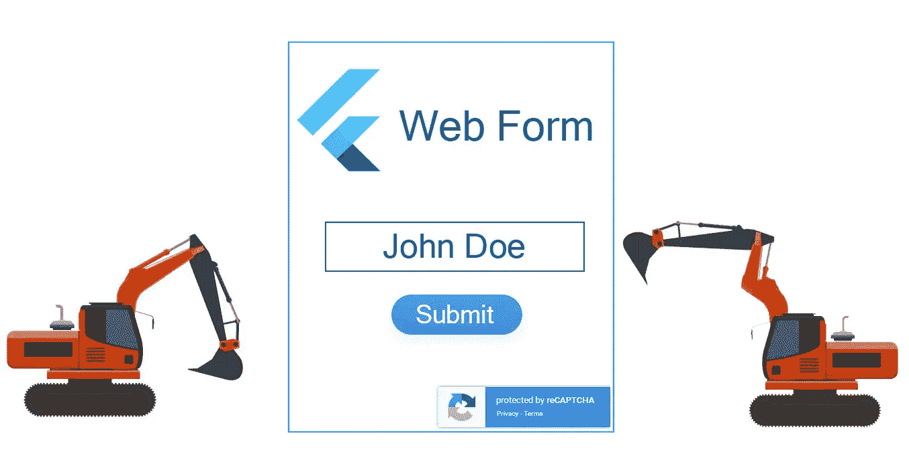

Web 表单上的 Bot 攻击描述。

# 对机器人的恐惧

作为一名开发人员，每当您创建表单从 web 上的用户那里获取数据时，您总是需要警惕垃圾数据。黑客可以注入脚本机器人，用恶意代码活动填充表单，并访问您网站的后端。

谷歌引入了`**reCAPTCHA**`的概念，这是一项免费而安全的服务，可以应对人们对机器人的恐惧。该网站称

> reCAPTCHA v3 可以帮助您在没有用户交互的情况下检测网站上的滥用流量。reCAPTCHA v3 不会显示验证码挑战，而是返回一个分数，以便您可以为您的网站选择最合适的操作。

# 客户端设置

在开始编码之前，你需要注册使用`**reCAPTCHA v3**`的站点。遵循以下步骤:

1.  访问[**Google reCAPTCHA**](https://www.google.com/recaptcha/about)**网站，点击**“v3 管理控制台”** &使用您的 Google 帐户登录。**

**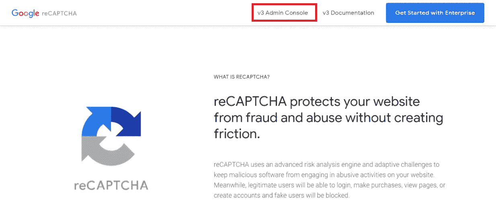**

*****谷歌 reCAPTCHA v3 管理控制台导航图。*****

**2.选择***“reCAPTCHA v3”***并键入***“localhost”***(如果您还没有准备好生产环境)，接受条款&点击 ***“提交”*** 按钮。**

**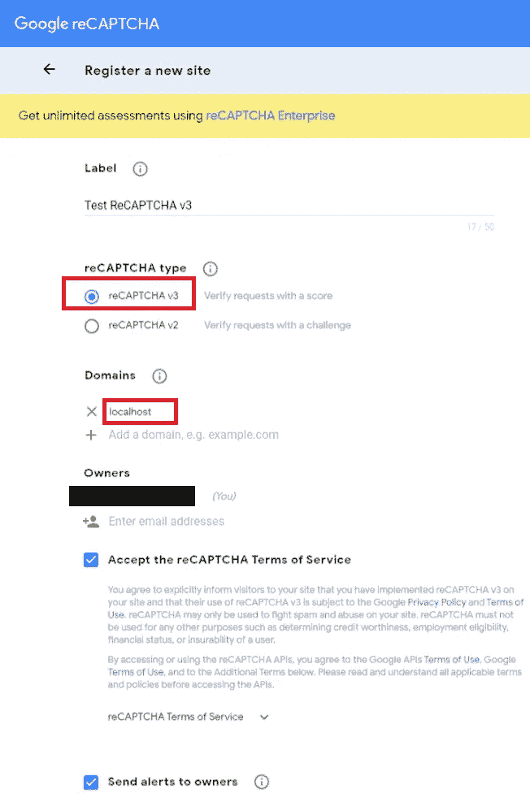**

*****Google reCAPTCHA v3 网站注册表单示意图。*****

**3.注册成功后，记下***reCAPTCHA*site*&secret******key***。**

**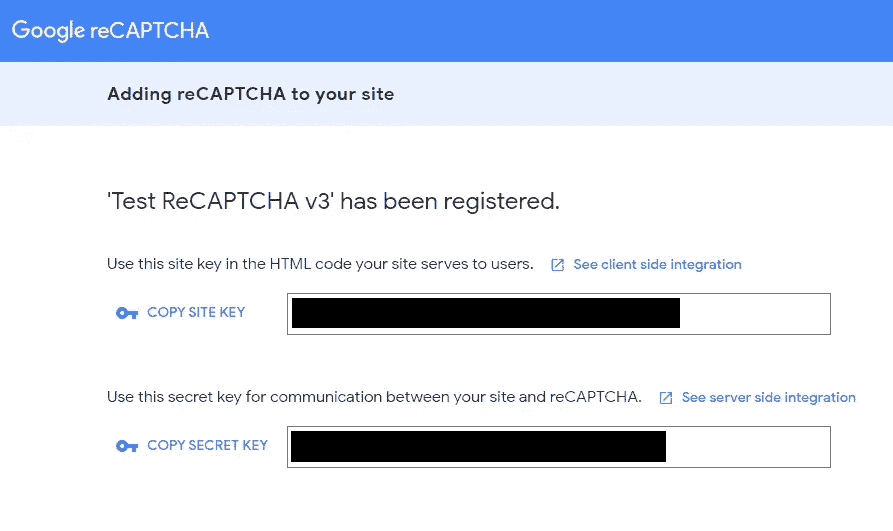**

*****Google reCAPTCHA v3 站点和密钥的图解。*****

# **必需的 PUBSPEC 包**

**在`**pubspec.yaml**`文件中，在`**dependencies**`下添加下面的包。**

****pub spec . YAML 文件中需要的包****

# **整体情况**

**为了简单起见，我们将创建一个`**MaterialApp**` ，它有一个熊骨`**Form**`小部件，带有一个**名字** `**TextFormField**` 和一个`**Submit**` 按钮，参见 ***图-I*** 的 app 小部件树结构。**

**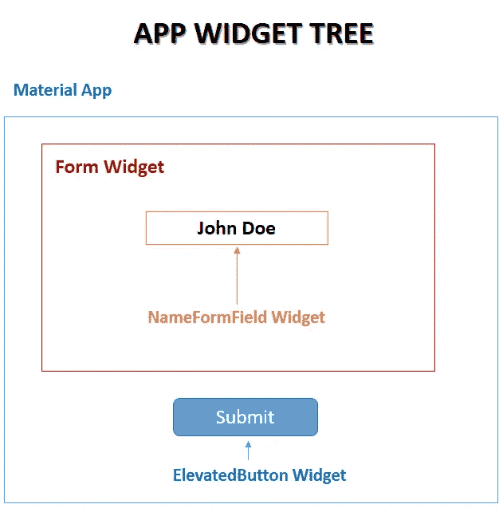**

****图一:应用程序小部件树示意图。****

**如 ***图二*** 所示，从客户端角度来看，我们需要:**

1.  **让`**main**`方法异步。**
2.  **在`**main**` *、* 内部调用`**runApp**`之前的`**GRecaptchaV3.ready²**` 方法。**
3.  **点击 ***提交*** ，调用`**GRecaptchaV3.execute²**` 方法。**
4.  **将生成的 ***【用户响应令牌】*** 保存在私有变量`**_token**`中。**

**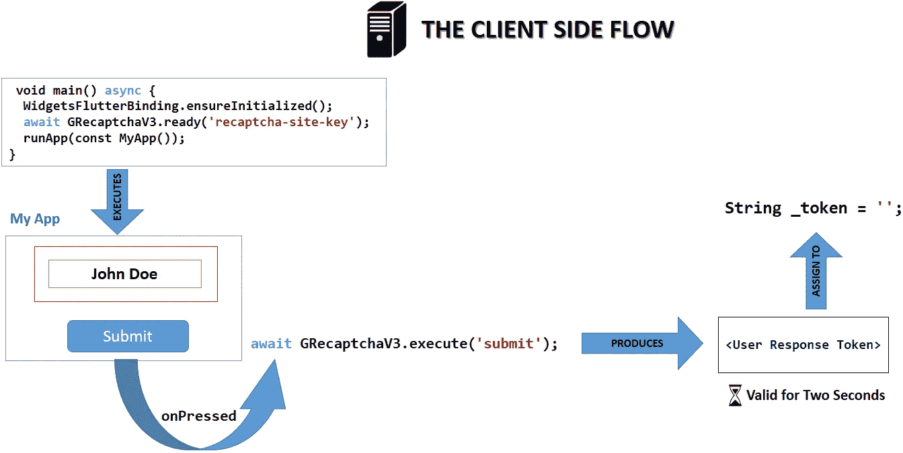**

****图二:客户端流程图。****

**客户端(我们的 app)会将带有`**recaptcha-secret-key**`的`**_token**`作为 ***HTTP POST 请求*** 发送给服务器，如图 ***图三*** 所示。**

**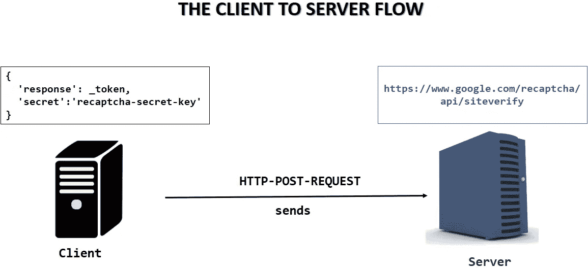**

**图三:客户端-服务器流程图。**

**在接收到 ***HTTP POST 请求****后，服务器验证客户端的请求，如 ***图四*** 所示。在该响应中，获得 0.0 到 1.0 之间的`**score**`，其中零表示没有发现人类交互。我们可以说**“很可能是个 bot！”**就外行而言**就外行而言**。***

***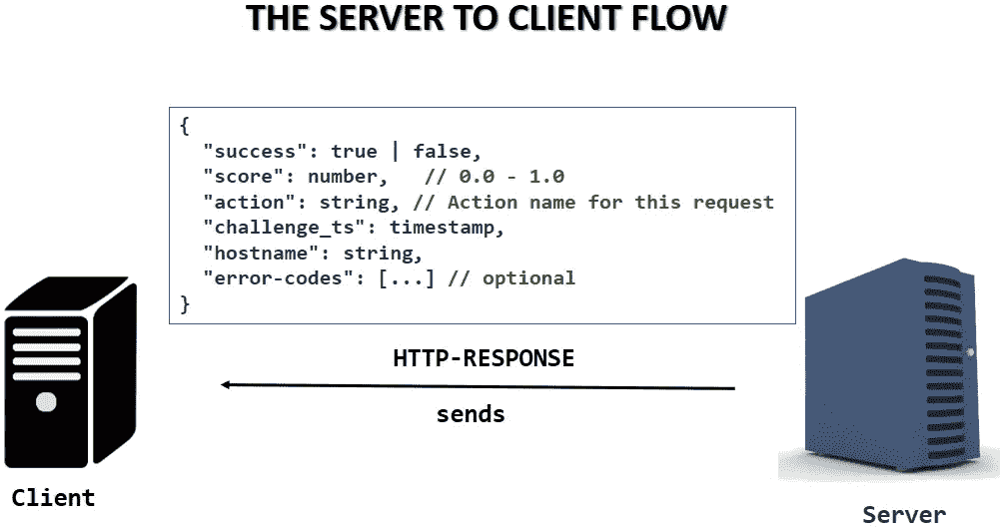***

***图四:服务器-客户端流程图。***

***根据站点的性质，我们将定义一个`**action**`和一个阈值来解释获得的`**score**`。有关 ***分数解释&动作*** 的更多信息，请参考 reCAPTCHA [文档](https://developers.google.com/recaptcha/docs/v3#interpreting_the_score) 。***

# ***处理颤振 WEB 中 CORS 的解决方法***

***因为我们会在整个项目中发出 HTTP 请求，你可能会在 Flutter Web 中遇到 ***CORS⁴*** 错误。下面是一个关于 ***堆栈溢出*** 的变通办法，可以帮助你在本地主机中发出请求。***

*** [## 如何只用 dart 代码解决 flutter web api cors 错误？

### CORS 错误似乎是网络领域的一个众所周知的问题。但是我第一次尝试了 flutter web，我…

stackoverflow.com](https://stackoverflow.com/a/66879350/4517075) 

# 开始编码吧！

***WROOM！呜！呜！抓紧你的按键，因为我们要开始编码了。下面的 ***图-V*** 显示了将在整个项目中维护的文件夹结构。***

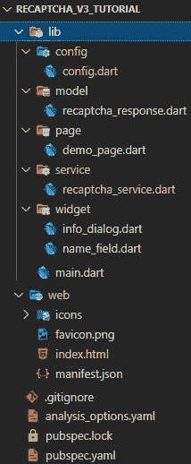

***图五:项目架构示意图。***

## 步骤 1 -将 reCAPTCHA 站点密钥放在 index.html 文件中。

导航到`**web**` 文件夹，打开`**index.html**`文件，将下面的脚本粘贴到`**<body>**` 标签内，如下图所示。

**在 index.html 放置 reCAPTCHA 站点密钥**

要检查`**Google reCAPTCHA v3**`在我们的站点上是否正常工作，调用`**main.dart**`中的`**GRecaptchaV3.ready**` 方法，如下面的代码片段所示。

**使用** `**main**` **测试 Google reCAPTCHA v3。镖**

运行上面的代码后，你会看到 ***【受 reCAPTCHA 保护】*** ，如下图***-VI***所示。

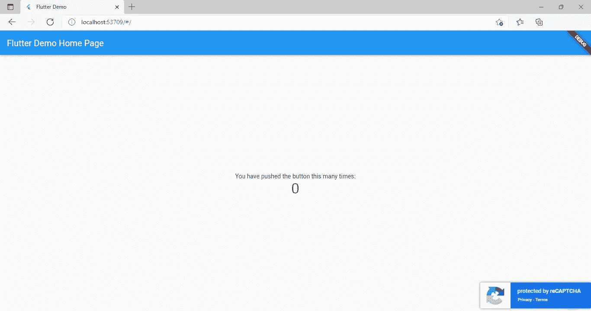

**图六:带有 Google reCAPTCHA 保护的计数器应用程序的图示。**

## 步骤 2 -保护机密信息。

为了保密密钥和站点密钥，在`**lib**` 文件夹下创建一个带有`**config.dart**`文件的`**config**`文件夹，如下面的代码片段所示。**注意:别忘了把这个添加到** `**.gitignore**` **文件中！**

**config . dart 的代码片段**

## 步骤 3 -创建一个 ReCAPTCHA 响应模型。

在`**lib**` 文件夹下用`**recaptcha_response.dart**`文件创建一个`**model**`文件夹，如下面的代码片段所示。这个类将保存作为`**dart**` 对象获得的 **HTTP 响应**。

**Recaptcha 反应模型。**

## 步骤 4 -创建 ReCAPTCHA 服务。

我们不是直接调用`**GRecaptchaV3**` 方法，而是创建一个服务层或包装类来保存所有的`**reCAPTCHA**`操作。

Recaptcha 服务。

让我们通过分解代码来理解它。

`**Replace GRecaptchV3.ready with RecaptchaService.initiate in main.dart**`

1.  ***recaptchaservice . initiate():****一个* `**GRecaptchaV3.ready**` 的包装器，将在运行我们的应用程序之前在`**main**`方法中使用。如`**reCAPTCHA**`文档中所述，在`**execute**`方法之前调用`**ready**`方法是很重要的，参见上面的代码片段。
2.  ***recaptchaservice . isnotabot():***在用户提交表单&提交通过所有验证后调用。这是一个简单的方法，它根据`**_score**`计算阈值并返回 true/false。
3.  ***再接再厉。_ getVerificationResponse():***一个私有方法，执行 ***HTTP POST*** 请求来验证客户端的响应令牌。`**GRecaptchaV3.execute**`方法返回一个两秒内有效的响应令牌。为了生成一个有效的 ***HTTP POST*** 请求，我们将检查是否首先接收到响应令牌，然后将它作为 ***POST*** 请求体参数与`**reCAPTCHA secret key**`一起传递。如果 ***HTTP POST*** 请求成功，我们将把 ***HTTP 响应*** 转换成`**RecaptchaResponse**`模型对象并返回它。

## 步骤 5 -提交表单后调用 ReCAPTCHA 服务。

**在提交按钮上使用 RecaptchaService.isNotABot 方法。**

在 ***提交*** 按钮的`**onPressed**`功能中，我们会:

1.  检查`**GlobalKey<FormState>**`当前状态是否有效。如果有效，则进入步骤 2，否则告诉用户正确填写`**NameFormField**` 。
2.  如果成功，调用`**RecaptchaService.isNotABot()**`并将其值赋给布尔标志`**_isNotABot**` 。
3.  根据`**_isNotABot**`的值，向用户显示一个对话框。

## 第 6 步-运行应用程序

运行 app 看结果如图 ***图七*** 所示。

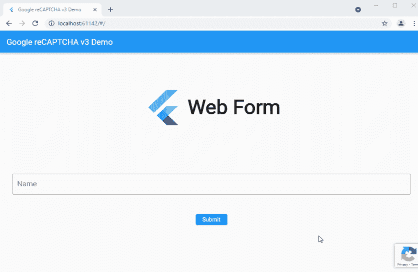

图七:Google reCAPTCHA v3 在 Flutter Web 中的演示。

访问[recaptcha _ v3 _ tutorial](https://github.com/Zujaj/recaptcha_v3_tutorial)⁵github 资源库，获取该项目的完整源代码。

***提示-键入*** `**1s**` ***如果您希望在类似*** `[https://github1s.com/Zujaj/recaptcha_v3_tutorial](https://github1s.com/Zujaj/recaptcha_v3_tutorial)` *的浏览器中查看 VSCode 中的回购。*

# Google reCAPTCHA 管理控制台

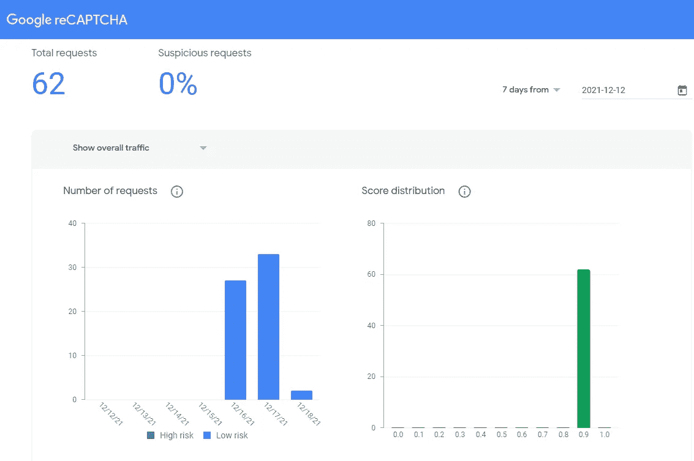

Google reCAPTCHA v3 管理控制台的图示。

访问***Google reCAPTCHA Admin******控制台*** 进行风险分析。请注意，本地主机的读数与实时托管站点的读数会有所不同。一旦您为生产做好准备，不要忘记通过管理控制台的⚙️设置图标*将您的域从***“localhost”***更改为。*

# 结论

我希望这篇文章在引导你在 Flutter web 中实现 Web 表单的安全性方面卓有成效。如果你喜欢这篇文章，请不要按任何按钮；按 50 次！

# 确认

感谢[*Level Up code*](https://levelup.gitconnected.com/)*平台为我提供了学习、探索和分享这些宝贵知识的空间。我也感谢[*Telic Solutions*](https://telicsolutions.com/)的[*Muzzammil-Khan*](https://github.com/muzzammil-khan)*指引我走向 Google reCAPTCHA v3 控制台。**

**特别感谢 [Bharathraj](https://github.com/bharathraj-e) 介绍[***g _ recaptcha _ v3***](https://pub.dev/packages/g_recaptcha_v3)包。**

# **参考**

*****【1】:关于谷歌 reCAPTCHA【https://www.google.com/recaptcha/about】***** 

*****【2】:g _ recaptcha _ v3 |扑包*** [https://pub.dev/packages/g_recaptcha_v3](https://pub.dev/packages/g_recaptcha_v3)**

*****【3】:解读分数| reCAPTCHA Docs*** [https://developers . Google . com/reCAPTCHA/Docs/v3 # Interpreting _ The _ Score](https://developers.google.com/recaptcha/docs/v3#interpreting_the_score)**

*****【4】:跨产地资源共享(mozilla.org)—HTTP | MDN()*** [https://developer.mozilla.org/en-US/docs/Web/HTTP/CORS](https://developer.mozilla.org/en-US/docs/Web/HTTP/CORS)**

*****【5】:reCAPTCHA v3 教程| GitHub 资源库*** [https://github.com/Zujaj/recaptcha_v3_tutorial](https://github1s.com/Zujaj/recaptcha_v3_tutorial)*****