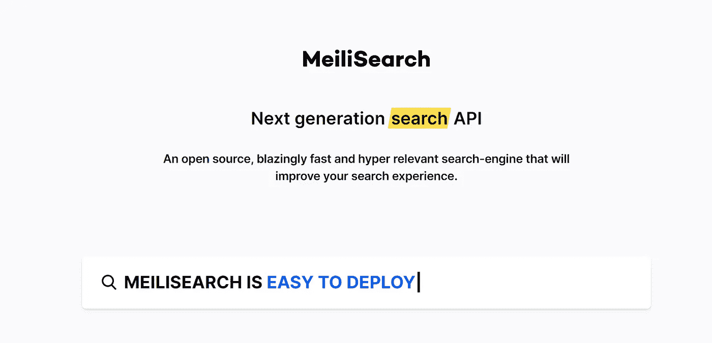
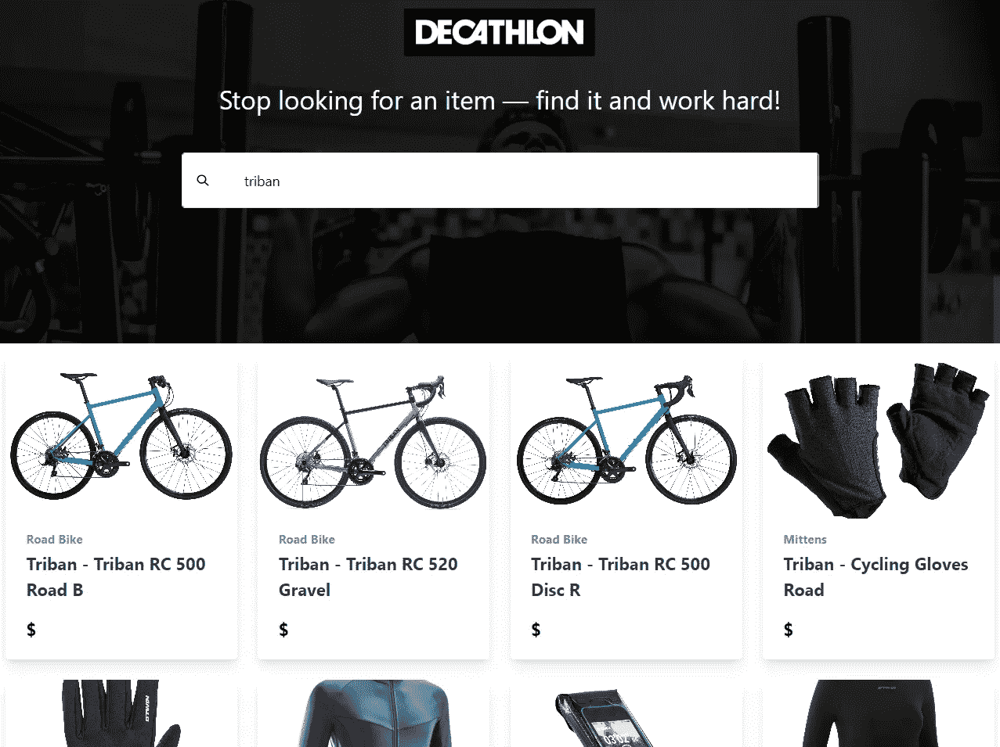

# 如何使用 MeiliSearch 在你的 React 应用中实现 5 分钟内的即时搜索

> 原文：<https://levelup.gitconnected.com/how-to-implement-instant-search-within-5-minutes-in-your-react-app-using-meilisearch-6cfa5818bcaf>

## 一个开源的、速度惊人的、高度相关的搜索引擎，它将改善你的搜索体验。



# 介绍

在这个快速教程中，你将学习如何借助 **MeiliSearch** 的强大功能，轻松创建具有即时可靠结果的搜索页面。

> [*MeiliSearch*](https://github.com/meilisearch/MeiliSearch/) *是一款开源、高相关性的搜索引擎，内置*[*Rust*](https://www.rust-lang.org/)*。*

我们将介绍运行搜索的基本步骤，并在最后讨论更高级的主题。

例如，让我们为一个运动品牌重新创建一个快速而漂亮的搜索体验。以下是您将要构建的内容的预览:

# 先决条件

开始之前，确保您的机器上已经安装了[节点](https://nodejs.org/en/)。

您将使用我们为您创建的定制项目为您的 React 应用程序创建样板代码:[https://github.com/Giorat/meili_react_demo](https://github.com/Giorat/meili_react_demo)

最后，本教程假设您已经熟悉 React。如果不是这样，您可以查看 [React 文档](https://reactjs.org/docs/)以了解更多信息。

# 入门指南

## 克隆存储库

```
git clone [https://github.com/Giorat/meili_react_demo.git](https://github.com/Giorat/meili_react_demo.git)
cd meili_react_demo
```

# 运行新的 Docker 映像

如果您克隆了存储库，要设置 MeiliSearch 实例，只需在主文件夹中执行:

```
npm run setup_meili
```

如果您没有克隆 repo，并且想要直接创建 Docker 实例，请执行以下命令:

```
docker run -p 7700:7700 -v $(pwd)/data.ms:/data.ms getmeili/meilisearch
```

您可以通过访问以下 URL 来检查 MeiliSearch 是否正在运行:[**http://localhost:7700/**](http://localhost:7700/)

## 在 MeiliSearch 中创建索引

索引是一种存储文档的实体，就像一个带有一些特定设置和唯一主键的对象数组。

您可以在[****MeiliSearch 文档****](https://docs.meilisearch.com/guides/main_concepts/indexes.html) **中了解更多关于索引的属性。**

**为了创建索引，您需要找出您的主键是什么。下面是一个添加到 MeiliSearch 的样本文档。**

```
{
  "id": 100013768717,
  "name": "Fitness Foldable Shoe Bag",
  "url": "https://www.decathlon.com/products/gym-foldable-shoe-bag",
  "vendor": "Domyos",
  "category": "Sport bag",
  "tags": [
    "Artistic Gymnastics",
    "Boy's",
    "CARDIO_FITNESS_ACCESSORIES",
    "CARDIO_FITNESS_BAGS",
    "CODE_R3: 11782"
  ],
  "images": "https://cdn.shopify.com/s/files/1/1330/6287/products/sac_20a_20chaussure_20kaki_20_7C_20001_20_7C_20PSHOT_20_490180e6-44e4-4340-8e3d-c29eb70c6ac8.jpg?v=1584683232",
  "creation_date": "2020-04-03T15:58:48-07:00",
  "price": "2.49"
}
```

**在本文档中，保存文档唯一值的字段是`id`字段。这个属性在 MeiliSearch 中被称为`primary key`。**

**您可以使用 Postman 之类的 REST 客户端轻松创建这个索引，但是在本教程中，您将使用 MeiliSearch Javascript SDK 直接从 node.js 创建这个索引。**

```
const MeiliSearch = require("meilisearch");

(async () => {
  try {
    const config = {
      host: 'http://127.0.0.1:7700'
    };

    const meili = new MeiliSearch(config);

    await meili.createIndex({ uid: "decathlon", primaryKey: "id" });

  } catch (e) {
    console.log("Meili error: ", e.message);
  }
})();
```

## **索引文档**

**MeiliSearch 接收 JSON 格式的文档并存储它们以供搜索。这些文档由可以保存任何类型数据的字段组成。**

**对于本教程，您可以下载这个充满运动装单品的数据集:**

*   **[**迪卡侬. JSON**](https://github.com/Giorat/meili_react_demo/blob/master/backend/decathlon.json)**

****要从这个 JSON 文件上传所有对象，请使用以下脚本:****

******记得在运行这个脚本之前更改 JSON 文件的路径！******

# ****准备 React 应用程序****

****您将使用一个标准的 React 应用程序，您可以使用 CRA 创建该应用程序，也可以通过克隆该存储库来创建该应用程序:****

```
**git clone [https://github.com/Giorat/meili_react_demo.git](https://github.com/Giorat/meili_react_demo.git)
cd meili_react_demo**
```

****如果你喜欢从一个空的应用程序开始，你可以使用下面的命令创建你自己的应用程序。您可以随意命名该应用程序。****

```
**npx create-react-app meili_react_demo cd meili_react_demo**
```

## ****包括顺风 CSS****

****要加快样式化过程，请将 Tailwind CSS 样式直接添加到 index.html:****

```
**<link href="https://unpkg.com/tailwindcss@^1.0/dist/tailwind.min.css" rel="stylesheet">**
```

## ****配置 App.js 状态****

****然后使用这段代码修改 App.js 文件，设置一个简单的搜索表单和一些状态变量来处理搜索的各个方面。****

****这段代码应该用一个搜索表单输出这个漂亮的标题。****

********

# ****React 中的搜索结果****

****使用 MeiliSearch Javascript SDK 从 React 连接到 MeiliSearch 是一个简单的操作，只需几个步骤就可以完成。****

## ****MeiliSearch 客户端****

****安装 MeiliSearch SDK:****

```
**// if you use npm
npm install meilisearch
// if you use yarn
yarn add meilisearch**
```

****使用服务器 URL 设置 MeiliSearch 客户端。在我们的例子中，它是本地主机 Docker 机器。最后，从后端加载正确的索引。****

****用下面的代码片段替换 App.js 中的注释:
**"// TODO 配置 MeiliSearch 客户端"******

```
**import MeiliSearch from "meilisearch";

const client = new MeiliSearch({
  host: "http://127.0.0.1:7700/",
});

const index = client.getIndex("decathlon");**
```

## ****发送搜索查询****

****使用“ **useEffect** ”在 MeiliSearch 中执行键入单词的搜索。所有命中的结果都将被设置为一个名为“resultsSearch”的简单状态变量。****

****用下面的代码片段替换 App.js 中的这个注释:
**“//TODO 添加函数将搜索到的 Word 发送到 MeiliSearch”******

## ****展示成果****

****在第二个“ **useEffect** ”中，您将搜索由 MeiliSearch 返回的 JSON 对象。它们将与上传的 JSON 对象具有相同的结构。****

****然后，是时候创建一个链接到产品页面的卡片列表了。****

****用下面的代码片段替换 App.js 中的这个注释:
**“//TODO 添加函数解析 JSON 对象”******

****你可以在这里看到完整的 [**App.js**](https://github.com/Giorat/meili_react_demo/blob/master/src/App.js) 代码:****

*   ****[https://github . com/Giorat/Meili _ react _ demo/blob/master/src/app . js](https://github.com/Giorat/meili_react_demo/blob/master/src/App.js)****

****可以在这里访问直播应用:【https://meili-react-demo.netlify.app/】****

************

# ******对搜索进行更多配置！******

******使用 MeiliSearch，您可以获得大量其他小选项，可以进行微调以改善您的搜索体验。对于高级探索，您将需要做一些额外的配置步骤。******

## ******搜索排名******

******首先改变搜索排名，或者更简单地说，改变 MeiliSearch 在您上传的文档中查找您的搜索词在 **rankingRules** 对象中的引用的方式。在这种情况下，设置以下等级:******

*   ****“错别字”****
*   ****“单词”****
*   ****“接近度”****
*   ****"属性"****
*   ****"词语位置"****
*   ****“精确”****
*   ****" desc(创建日期)"****

****除了最后一个字段是自定义规则“desc(创建日期)”之外，此配置是默认配置。如果所有以前的值都相同，则后者按项目的创建日期对项目进行排序。****

## ****可搜索属性****

****其次，您必须在一个 **searchableAttributes** 对象中指定 MeiliSearch 可以在每个文档中搜索的属性。这里，配置只搜索名称、供应商、类别和标签，而不搜索图片或 URL。****

## ****显示的属性****

****最后，您必须使用 **displayedAttributes** 对象指定 MeiliSearch 可以由前端应用程序返回给用户的属性。****

## ****将新设置上传到 MeiliSearch****

# ****结论****

****如果没有一个令人难以置信的团队夜以继日地为这个伟大的项目工作，这种快速搜索是不可能的！如果你喜欢为 **MeiliSearch** 大家庭做贡献，你可以加入这些知识库，带来一些帮助、问题或提示和技巧:****

*   ****[https://github.com/meilisearch/MeiliSearch](https://github.com/meilisearch/MeiliSearch)****
*   ****[https://github.com/meilisearch/meilisearch-js](https://github.com/meilisearch/meilisearch-js)****

****欢迎在论坛或聊天中进行一般性讨论:****

*   ****[https://github.com/meilisearch/MeiliSearch/discussions](https://github.com/meilisearch/MeiliSearch/discussions)****
*   ****[https://slack.meilisearch.com/](https://slack.meilisearch.com/)****

****而且还不忘在主项目上留一颗星在[上 **Github 这里**](https://github.com/meilisearch/MeiliSearch) **。******

# ****你正在寻找 React 或 Fullstack Web 开发方面的指导吗？****

****我辅导人们发展和求职，如果你想了解更多，你可以访问这个链接:[https://bit.ly/mentoring_react](https://bit.ly/mentoring_react)****

*****原载于 2020 年 5 月 8 日*[*【https://blog.meilisearch.com】*](https://blog.meilisearch.com/how-to-implement-instant-search-within-5-minutes-in-your-react-app/)*。*****