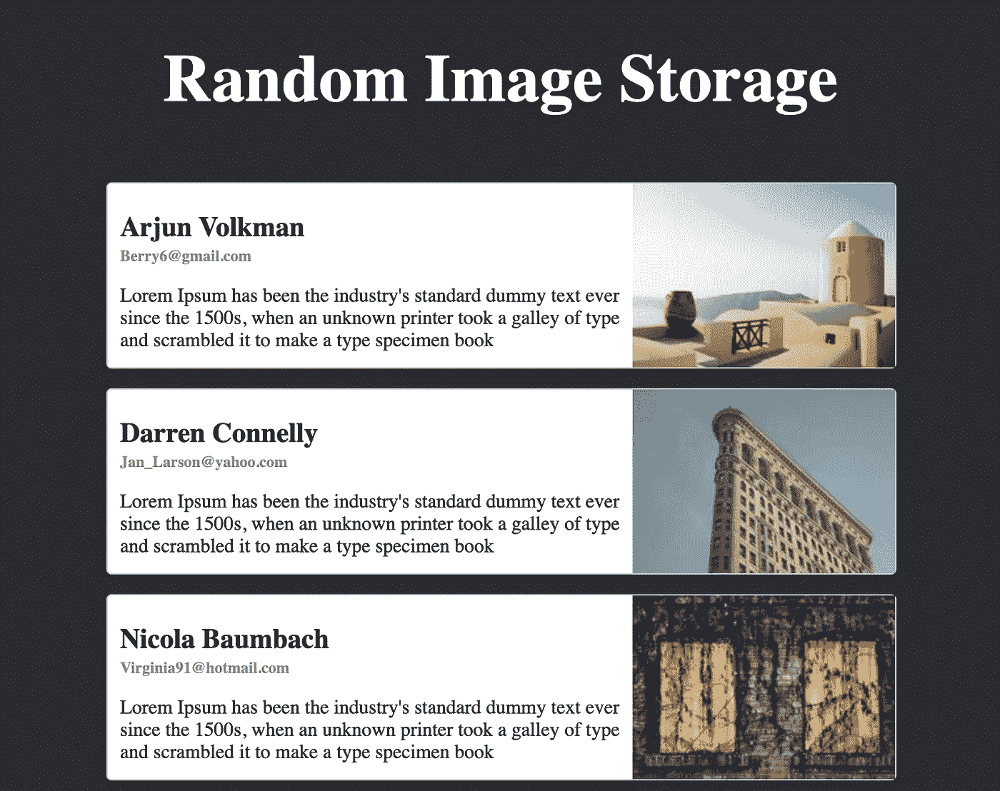
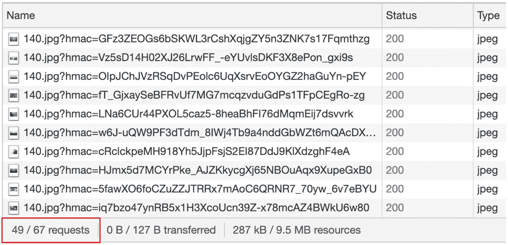
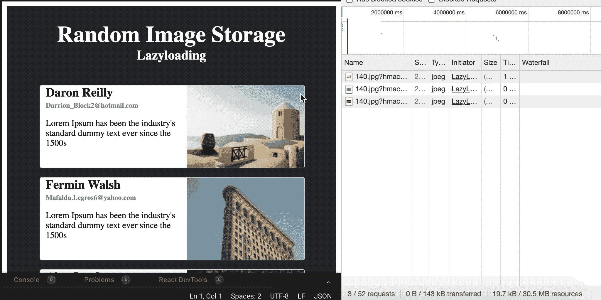
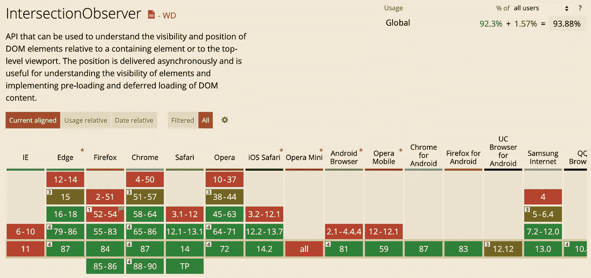

# 如何在 React with Intersection Observer 中实现延迟加载

> 原文：<https://levelup.gitconnected.com/how-to-implement-lazy-loading-in-react-with-intersection-observer-61c0e53ec8d>

## 关于如何延迟加载图像的解释

当你创建一个需要在屏幕上加载大量图片的网站时，你应该注意在浏览器上渲染图片的性能。

如果你在项目代码中使用 React，你可以通过 [NPM](https://www.npmjs.com/) 或[线程](https://yarnpkg.com/)安装 [*react-lazyload*](https://www.npmjs.com/package/react-lazyload) 包。它不同的图像加载，所以你可以期待更好的性能时，使用这个软件包。但是这个包需要大约 40KB 的存储空间。所以你可能会认为这对于缓慢加载图像来说太重了。

在这篇文章中，我将向您展示一种不同的惰性加载方式，使用交叉点观察器。

# 什么是 IntersectionObserver

Intersection Observer 是一个新的 API，与几年前相比，它可以更好地检测元素，原因如下。

*   页面滚动时图像或其他内容的延迟加载
*   实现“无限滚动”网站，当你滚动的时候，越来越多的内容被加载和呈现，这样用户就不需要翻页了
*   报告广告的可见性，以便计算广告收入
*   根据用户是否会看到结果来决定是否执行任务或动画过程

在看了如何使用这个 API 的例子之后，让我们更深入地讨论这个 API。

这个例子与您可以从 [MDN 文档](https://developer.mozilla.org/en-US/docs/Web/API/Intersection_Observer_API#Thresholds)中检查到的一样，但是是在 React 环境中。

交叉点观察器是两个 arity 构造函数。它需要一个回调函数，每当它监视的元素出现在浏览器中时，该函数就会被触发，它还需要一个可选对象，该对象包含您可以在这里查看的信息。

## 为什么路口观察者比较好？

当过去需要无限滚动时，它会强制页面回流，因为检查滚动条当前位置所需的`getClientBoundingRect`会强制回流。

随着时间的推移，新的强大功能，交叉点观察器，被创造出来，并建议用于无限滚动。但是，它仍然使用`getClientBoundingRect`来获取它所观察的元素的位置。那为什么认为更好呢？

交叉点观察器使用`requestIdleCallback`调用回调函数，当当前时钟周期内没有任务运行时触发该函数。因此，尽管使用交叉点观察器的新旧方法都可能导致回流，但是交叉点观察器在性能方面更好，因为它只在空闲期间运行回调函数。

# 普通卡片视图

我使用了随机图像选择器网站来获取随机图像，这是这个项目的基本结构。

这个页面一次加载大约 50 张物品卡片**，在第一次渲染时也加载了大约 50 张图片。**

****

**您可以从开发工具检查“网络”选项卡上加载了多少图像。在这种情况下，从 67 个网络请求中加载了 49 个图像。幸运的是，网络请求的瀑布并不太长，但是你不应该想“哦，我不必关心这个”。**

**如果需要在屏幕上渲染的图像超过数千个怎么办？容易理解我的观点的最好例子是思考 Pinterest 是如何工作的。它们在你第一次看到的时候，以及每当你向下滚动到底部的时候，向你展示各种各样的图像——惰性加载。**

**那么如何用交集观察者实现延迟加载呢？这很简单。设置触发回调函数的阈值，让交集观察器 API 一直观察元素。**

**以下是您可以传递给交叉点观察器的属性列表。**

*   **root-intersect observer 将跟踪的根元素所属的根元素。如果省略，根将设置为视口**
*   **rootMargin 根元素的边距值。该规则与 CSS 边距相同。例如，如果 rootMargin 设置为“50px 0px 0px 0px”，则根元素的区域将更改为不可见元素，其顶部偏移量为原始根元素的 50px。**
*   **threshold —数组中的值，每当跟踪元素超过阈值时就会触发回调。如果阈值设置为[0，0.5，1]，那么当跟踪元素通过 0%、50%和 100%的点时，将触发回调，这是指它在根元素上显示了多少。**

# **惰性加载卡片视图**

**在这个延迟加载的例子中，每张图片只有在屏幕上出现超过 50%时才会被加载。**

**现在让我们看看图像加载状态。**

****

**看到了吗？当滚动条向下滚动时，加载的图像数量在增加。因为有了 IntersectionObserver，它让浏览器只在合适的时候加载图片。**

# **浏览器支持**

****

**[我可以使用 intersect observer](https://caniuse.com/intersectionobserver)**

**浏览器支持范围还不错，但也没那么好，因为 IE 根本不支持这个 API。**

**但是不用担心！W3C 为项目中需要的人分发了 IntersectionObserver 的 polyfill。**

# **NPM 著名的懒人包**

**正如我在本文前面演示的那样，使用 IntersectionObserver 实现延迟加载组件非常简单。但是，您可能不想从头到尾实现它。有时您可能只想安装一个包。所以我要介绍一些有很多明星的 NPM 套餐。**

## **反应迟缓装载**

** [## 反应迟缓装载

### React Lazy Load 是一个易于使用的 React 组件，它可以帮助您以可预测的方式延迟加载内容。很快…

www.npmjs.com](https://www.npmjs.com/package/react-lazy-load) 

## 香草冰淇淋

 [## 香草冰淇淋

### LazyLoad 是一个轻量级(2.4 kB)和灵活的脚本，它通过延迟加载…

www.npmjs.com](https://www.npmjs.com/package/vanilla-lazyload) 

## jquery-懒惰

 [## jquery-懒惰

### 这个项目得到了 JetBrains & PhpStorm 的友好支持！Lazy 是一个快速、功能丰富、轻量级的延迟…

www.npmjs.com](https://www.npmjs.com/package/jquery-lazy) 

# 结论

IntersectionObserver 是一个浏览器独有的特性，可以让您实现延迟加载。您可以延迟加载图像或大量内容，以减少用户等待查看内容的总时间。

然而，IntersectionObserver 并不是所有的浏览器都完全支持的，所以一定要检查 polyfill，或者你可以考虑安装一个已经制作好的包。

# 参考

*   [https://developer . Mozilla . org/en-US/docs/Web/API/Intersection _ Observer _ API](https://developer.mozilla.org/en-US/docs/Web/API/Intersection_Observer_API)
*   [https://developer . Mozilla . org/en-US/docs/Web/API/Window/requestIdleCallback](https://developer.mozilla.org/en-US/docs/Web/API/Window/requestIdleCallback)
*   [https://developers . Google . com/web/updates/2016/04/intersection observer](https://developers.google.com/web/updates/2016/04/intersectionobserver)**