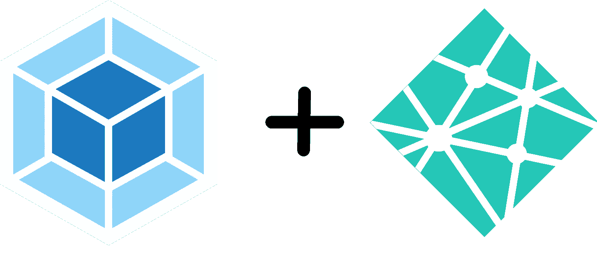
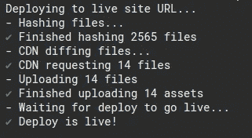

# 如何用 Webpack 和 Netlify 实现延迟加载

> 原文：<https://levelup.gitconnected.com/how-to-implement-lazy-loading-with-webpack-and-netlify-808d88081485>



=潜在陷阱

# 牵手蜜月

第一次用 Netlify 部署单页 app，惊喜之余。在那之前，我通常使用 Heroku 来部署应用程序，这意味着从 Heroku 提供我的`index.html`文件，并配置我的 Heroku 构建过程以将我编译的资产上传到 CDN。虽然设置起来并不太困难，但是这个过程也有一些缺点。从 Heroku 提供`index.html`文件意味着在将更改部署到用户之前可能需要额外的时间，并且性能并不理想。另一方面，Netlify 几乎是瞬间部署你的`index.html`文件和你的资产，它是自动完成的。非常好。然而，这可能会有一些问题:Netlify 将只在您指定的域中提供您的资产的当前版本。

在很多情况下，这并不重要。您进行了更改，您的应用程序得到了重新绑定，下一次用户访问您的应用程序的 url 时，他们会获得您的应用程序的最新版本。当你的应用程序被设计成用户在最初的`index.html`获取时不一定得到所有需要的资产时，这种情况就会出现。发生这种情况的一个常见情况是当您延迟加载应用程序的一部分时。点击这里查看 webpack 文档[以获得关于延迟加载的更全面的解释和例子。](https://webpack.js.org/guides/lazy-loading/)

# 困惑的悬崖

这不起作用的原因是因为用户可能在不确定的时间要求您的某个资产的旧版本。举个极端的例子，假设一个用户访问了你的网站，`anatomypark.com`。他们得到了包含对`shell-abcdef.js`的引用的`index.html`文件。该文件有一个动态的`import()`语句，当点击一个按钮时，该语句加载`pirates-of-the-pancreas-abcdef.js`。现在假设用户没有点击那个按钮，让他们的浏览器打开一个星期。在那一周的过程中，你可能已经发布了许多不同的网站变更。这意味着您的包的名称已经改变，现在是`shell-012345.js`和`pirates-of-the-pancreas-012345.js`。事实上,`shell-012345.js`已经改变并不重要，因为当`index.html`被提供给用户时，该文件被加载。但是假设用户返回到他们打开的浏览器窗口，并试图点击上述按钮。他们的浏览器将尝试向`anatomypark.com/pirates-of-the-pancreas-abcdef.js`发出请求，因为 Netlify 不再提供该文件。

这是一个相当做作的例子，但是你可以想象如果你编写了一个应用程序，为了性能原因或者按照用户类型来延迟加载一些不同的文件，这种情况会比你想象的更经常发生。如果您一天部署几十次，就像我们在 [Resource](https://www.resource.io/) 所做的那样，这一点尤其正确。这基本上意味着如果没有一些额外的步骤，你就不能在 Netlify 中使用延迟加载。

# 绝望的沙漠

有几种方法可以解决这个问题。您可以放弃 Netlify，但我们已经开始欣赏它的即时缓存失效和轻松回滚，所以我们想看看是否有一种方法可以在不切换到不同平台的情况下工作。另一种选择是设置 Netlify，将这些对旧资产的请求代理到其他需要存储它们的地方，比如 S3 存储桶。设置这一点将需要在我们的构建过程中增加一些额外的步骤，以始终将我们的资产存储在 S3 桶中，并且我们会因为这些请求而获得更差的性能，因为它们必须从 Netlify 的 CDN 重定向到 S3 桶。我们提出并选择的最后一个选项是找到一种方法来继续为 Netlify 的旧资产提供服务。如果我们只是在 Netlify 中保留以前构建的资产的副本，这些旧的请求将会工作得很好。

我们不想让旧资产永远可用，而是希望保留大约 1 周的旧捆绑包数据，以便旧的捆绑包数据可供我们的用户使用。我们研究了两种不同的方法来实现这一点:1)将我们的包提交到我们的存储库，或者 2)使用我们的构建环境中可用的持久性机制。我们不喜欢将构建工件提交给我们的 repo 的想法，所以我们开始研究 CircleCI 中可用的持久性。它的一个持久性选项是它的[缓存](https://circleci.com/docs/2.0/caching/)，通常用于缓存依赖项。经过一些实验后，我们找到了一种滥用其缓存机制的方法，以便保留旧的包。虽然这些步骤描述了如何使用 CircleCI 实现这一点，但是您可以根据您所处的任何构建环境对它们进行调整，假设它具有一些持久性，您可以使用它来保存旧的包文件。

# Awesome 的上升

通过显示 CircleCI 配置的一点无序，可以更容易地解释这一切是如何工作的，因为单个构建作业需要访问来自前一个构建作业的包数据。别担心。下面有一个完整的例子。

首先，我们有自己的构建步骤。现在我们假设我们正在做一些简单的事情，比如运行一个 npm 脚本，比如`npm run build`，我们期望它将我们构建的`index.html`和`js`文件输出到`~/build`。我们还假设我们的包文件是用文件名的唯一散列创建的。

其次，一旦我们完成构建，我们需要将构建的数据保存到我们的 CircleCI 缓存中。我们通过如下所示的步骤来实现:

```
- save_cache:
    key: bundles-{{ epoch }}
    paths:
      - ~/build
```

这一步告诉 CircleCI 缓存我们的整个`~/build`文件夹，并用密钥`bundles-{{ epoch }}`存储它，这意味着我们应该使用从 epoch 开始的秒数得到一个严格递增的密钥。我们真的不在乎钥匙本身。重要的是，每组包数据都有一个惟一的键。

我们需要做的最后一件事是，确保下一次构建包时，我们包含了在之前的构建中构建的包数据。这一步实际上会发生在配置文件中的构建步骤之前。我们将通过使用 CircleCI 提供的缓存恢复功能来实现这一点。缓存恢复是通过缓存关键字前缀完成的，所以我们可以使用关键字`bundles`查找所有的捆绑包缓存。这样做的一个重要原因是，当 CircleCI 遇到一个缓存前缀的多个匹配时(在这种情况下，它将匹配所有以前的缓存)，它会使用最近创建的匹配缓存。在我们的例子中，这意味着我们将获得最近构建的包。通过调用`restore_cache`，我们将把最近创建的包数据复制到`~/build`文件夹中。该步骤将如下所示。

```
- restore_cache:
    keys:
      - bundles
```

将所有这些步骤结合在一起，我们应该有一个工作操作集，使得我们在每次运行构建作业时都可以恢复以前的包文件。该文件在组合在一起时应该如下所示:

```
job:
  steps:
    # Dependency installation and source code fetching omitted
    # for brevity
    ... # Restore the most recently cached set of previously built
    # bundle files
    - restore_cache:
      keys:
        - bundles # Build our current bundle files
    - run:
      name: Build Bundle
      command: >
        yarn build # After we've built our bundles we need to save them to
    # the cache so they can be restored during the next build run
    - save_cache:
      key: bundles-{{ epoch }}
      paths:
        - ~/build # Deploy to Netlify
    - run:
      name: Deploy to Netlify
      command: >
        netlify-cli deploy --prod --dir=./build 
```

重要的是，我们在恢复之前的包文件后执行构建步骤，以便我们的构建步骤覆盖任何已更改的文件，但没有唯一的文件名，即`index.html`。

重要提示:在创建新的包文件之前，我们需要确保我们的构建步骤不会清除`~/build`目录。否则，我们将删除所有以前创建的从缓存中恢复的包文件。这是 create-react-app 的默认行为，所以我们必须解决这个问题。不幸的是，没有简单的方法来禁用它。在我们的例子中，我们已经从 create-react-app 中退出，所以我们可以直接修改`build.js`脚本。否则你可能需要像文档[中描述的那样分叉`react-scripts`到这里](https://create-react-app.dev/docs/alternatives-to-ejecting/)，以便修改`build.js`脚本。

一旦所有这些都完成了，我们就应该让延迟加载在 Netlify 上正常工作了。

除了……



这有很多捆绑文件…

# 又绝望了？

几天后，我们注意到我们部署到 Netlify 的资产数量持续上升。啊哦。我们总是将以前的包文件全部添加到新的文件集中，这意味着我们的缓存会不断增长。

我们决定通过删除`~/build`中超过 1 周的所有文件来解决这个问题。同样，因为我们已经弹出了，所以对我们的构建脚本进行这种更改是相当容易的。我们刚刚添加了一个名为`find-remove`的小 npm 包，它通过一个名为`findRemoveSync`的函数来提供该功能，但是您可以自己轻松实现它。我们弹出的构建脚本的相关部分如下所示:

```
const { checkBrowsers } = require('react-dev-utils/browsersHelper');checkBrowsers(paths.appPath, isInteractive)
  .then(()) => {
    // Remove any files that haven't been modified in the last week
    const weekInSeconds = 60 * 60 * 24 * 7;
    const results = findRemoveSync(paths.appBuild, {
      age: {
        seconds: weekInSeconds
      },
      files: '*.*'
    });
    console.log(`Removed ${Object.keys(results).length}                                                                   files/directories`); // Merge with the public folder
    copyPublicFolder();
    // Start the webpack build
    return build();
  })
```

# 工作就绪

这应该可以了。只需一点点配置，您现在就可以在部署到 Netlify 时利用 webpack 的延迟加载。这应该允许您更容易地分解您的应用程序，这将有助于减少包的大小，并为您的用户提供更好的性能。往前走，偷懒吧！