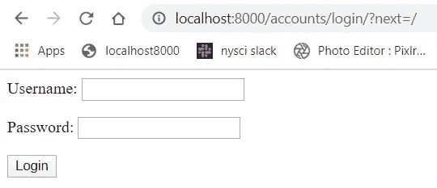

# 如何用 Django 的用户模型实现登录、注销和注册？

> 原文：<https://levelup.gitconnected.com/how-to-implement-login-logout-and-registration-with-djangos-user-model-59442164db73>

使用 Django 的内置用户模型创建注册和登录页面。


# 你会学到什么

*   Django 的内置用户模型
*   如何用 Django 内置的 UserCreationForm 创建用户
*   Django 的内置认证 URL 路径
*   如何使用 Django 的认证 URL 登录和注销用户
*   如何使用 decorators 设置 Django 视图的权限
*   Django 认证系统的文档
*   Django 中用户认证的工作模板

# Django 的用户模型

Django 预建了一些特性，因此程序员可以专注于构建 web 应用程序。任何网站的一个重要方面是存储用户信息，Django 为我们提供了一个`User`模型。文档可以在:[https://docs.djangoproject.com/en/3.0/ref/contrib/auth/](https://docs.djangoproject.com/en/3.0/ref/contrib/auth/)找到，为了访问这个模型，我们可以添加这个导入:

```
from django.contrib.auth.models import User
```

现在我们可以使用用户模型的所有便利设施，而不需要编写太多代码。`User`模型允许我们存储诸如用户名、密码、名字、姓氏等信息，甚至提供字段来检查那个`User`上的权限。

如果默认字段对您的应用程序来说不够用，或者您想自己定制，Django 允许您通过创建一个模型并从`AbstractBaseUser`继承来这样做。关于创建自定义用户的文档可以在这里找到:[https://docs . django project . com/en/3.0/topics/auth/customizing/# reusable-apps-and-auth-user-model](https://docs.djangoproject.com/en/3.0/topics/auth/customizing/#reusable-apps-and-auth-user-model)。

# 使用 UserCreationForm 进行用户注册

Django 内置了`ModelForms`，允许我们用几行代码直接从我们的模型创建表单，我们可以对称为`UserCreationForm`的`User`模型做同样的事情。

默认情况下，该表单将包括三个字段:用户名、密码 1 和密码 2。这种形式的美妙之处在于它附带的所有代码。该表单将散列数据库的密码，处理验证密码，确保不会创建重复的用户和生成表单错误。我知道这看起来好得不像是真的，但它会变得更好，这些表格是高度可定制的。您可以添加更多的字段，您可以向 forms `save()`方法添加自定义逻辑，您可以为表单字段验证添加自定义逻辑，当然还有更多，因为我个人刚刚开始接触 Django 模型表单的表面。

我们可以使用以下方式导入`UserCreationForm`及其所有优点:

```
from django.contrib.auth.forms import UserCreationForm
```

该模块包含许多其他表单，如`PasswordChangeForm`、`UserChangeForm`以及更多可以在文档中找到的表单，[https://docs . django project . com/en/3.0/topics/auth/default/# creating-users](https://docs.djangoproject.com/en/3.0/topics/auth/default/#creating-users)。

让我们运行一个示例项目来展示这种形式的强大和易用。

# 姜戈样板文件

我创建了一个名为`example`的 Django 项目和一个名为`accounts`的应用程序。我建议为您的 Django 项目重新创建这个结构，因为它将把与`User`模型相关的逻辑和代码分离到一个地方。


Django 账户样板

> **确保应用迁移来创建存储** `**User**` **信息的表。**

接下来我们将把`accounts`添加到我们的项目`example`中，并在`accounts`应用程序中创建一个 urls.py 文件，最后我们需要在`example.urls`中包含一些 URL 路径:

```
*example/urls.py*from django.contrib import adminfrom django.urls import path,includeurlpatterns = [ path('admin/', admin.site.urls), path('',include("accounts.urls")), path('accounts/',include('django.contrib.auth.urls'))]
```

> T 他最后的 URL 路径非常重要！Django 为我们提供了身份验证视图来处理许多特性，包括用户的登录和注销。他们没有为我们提供这些视图的模板，我们稍后会添加这些视图，因为 Django 会在一个非常具体的目录中搜索它们。

现在我们已经完成了项目的配置，让我们创建一些视图。

在`accounts.views`中添加以下进口:

```
*accounts/views.py*from django.contrib.auth.models import User
from django.contrib.auth.forms import UserCreationForm
from django.contrib.auth import login
from django.contrib.auth.decorators import login_required
```

前两行导入我们的`User`模型和模型表单`UserCreationForm`。第三行导入 login 函数，我们将在用户创建帐户后使用它来验证用户，第四行导入一个装饰器，如果用户没有通过验证，它将把用户重定向到登录表单。

我们将创建两个视图:

1.  要渲染的视图`UserCreationForm`

2.用户通过身份验证后显示的视图

登录和注销视图将由 Django 的认证系统处理。

让我们将以下代码添加到`accounts.views`文件中:

```
*accounts/views.py*@login_required
def index(request):
    return render(request,'accounts/index.html')def sign_up(request):
    context = {}
    form = UserCreationForm(request.POST or None)
    if request.method == "POST":
        if form.is_valid():
            user = form.save()
            login(request,user)
            return render(request,'accounts/index.html')
    context['form']=form
    return render(request,'registration/sign_up.html',context)
```

`@login_required`装饰器将检查我们的用户是否通过了身份验证，如果没有，它会将他们重定向到“accounts/login ”,这是我们之前包含的`django.contrib.auth.urls`的一部分。`sign_up`视图用空信息或请求生成我们的表单。如果有的话贴数据。如果我们的`UserCreationForm`被提交到这个视图，那么我们必须检查字段是否有效。`form.is_valid()`通过调用`validate_password()`来验证这两个密码是否相同，然后 T5 调用`set_password()`散列并保存我们的密码到数据库中。

最后，如果一切顺利，我们用`login`让用户登录，然后重定向到主页。现在我们已经创建了视图，我们需要创建认证模板和 URL 路径。

# 身份验证 URL 路径

现在我们已经创建了一些视图，我们需要将它们添加到我们的`accounts`应用程序中的`urls.py`文件中。`urls.py`文件应该是这样的:

```
*accounts/urls.py*from django.contrib import adminfrom django.urls import pathfrom . import views urlpatterns = [ path('',views.index,name="home"), path('accounts/sign_up/',views.sign_up,name="sign-up")]
```

我们已经创建了视图并正确配置了 URL，这意味着最后要做的事情是创建模板。

# 认证模板

我们需要在`accounts`中创建一个`templates`目录，其中包含两个子目录，`accounts`用于在用户登录后呈现内容，而`registration`用于处理所有认证模板。

> W 当使用 Django 的认证视图时，在你的模板中创建一个`registration`目录是非常重要的，因为它将在那里搜索模板！认证视图的文档可以在这里找到，[https://docs . django project . com/en/3.0/topics/auth/default/# module-django . contrib . auth . views](https://docs.djangoproject.com/en/3.0/topics/auth/default/#module-django.contrib.auth.views)。

我的`accounts`应用程序目录现在的结构是:


包括模板的帐户目录

在`templates`中，我创建了子目录`accounts`和`registration`。模板`logged_out.html`和`login.html`是 Django 默认使用的两个模板，分别用于 URL“帐户/注销”和“帐户/登录”。您可以随时定制这些模板，如何定制可以在文档中找到。

让我们将以下代码放入模板中:

index.html:

```
*index.html*<h1> Welcome {{user}} </h1>
```

login.html:

```
*login.html*<form method="post">
     {{form.as_p}} <input type="submit" value="Login"></form>
```

logged_out.html:

```
*logged_out.html*<h1> You are now logged out {{ user }} </h1>
```

注册. html:

```
*sign_up.html*<form method="post">
     {{form.as_p}} <input type="submit" value="Sign up"></form>
```

``是一种安全措施，有助于防止跨站点请求伪造攻击，是 Django 中每个表单所必需的。

我们不需要在表单中包含动作，因为 Django 会根据表单自动传递这些参数。如果您需要一个特定的重定向 URL，您可以在我们将包含的`settings.py` 文件中进行配置。

在`settings.py`文件的底部包含以下内容:

```
*example/settings.py*...LOGIN_REDIRECT_URL = 'home'
```

这将告诉 Django 在成功登录后重定向到 URL 名称“home”。一切都准备好了，让我们启动我们的服务器，尝试一切！

# 我们的 Django 用户认证应用程序

首先，让我们访问`localhost:8000/accounts/sign_up`的注册页面，您应该会看到类似于以下内容的内容:


用户创建表单

我们向这个 URL 发出了一个 GET 请求，这将呈现一个空的`UserCreationForm`。它看起来不是很好，但是你可以给它添加定制的样式，所有这些都由我们的`UserCreationForm`处理。创建一个帐户，你应该被重定向到主页。


index.html 成功签到后

这成功地创建了一个用户，并将其存储在数据库中。如果你愿意，你可以在管理面板中查看。`UserCreationForm`将处理任何表单输入错误，以防止用户重复并验证密码。

让我们退出这个应用程序，只需转到 URL `localhost:8000/accounts/logout`就可以了。

老实说，我没有预料到这个结果，但看起来我们的 URL 路径可能与管理站点冲突，因为当我访问注销 URL 时，我看到了以下内容:


这不是一个大问题，因为我们总是可以直接更改注销 URL。我们可以确认我们已经注销，因为如果我们试图在`localhost:8000`访问主页，我们应该被重定向到登录页面。



从主页重定向到登录页面

由于`@login_required`装饰，当我们不是认证用户时访问主页会将我们重定向到登录页面。您可以在 URL 中看到`?next=/`参数，它告诉我们在成功登录后我们将被重定向到哪里，我们将其配置为主页。

正如所料，当我成功登录后，我被重定向到主页。


登录后重定向

# 包裹

现在您已经有了一个带有基本用户认证的 Django 应用程序！您可以创建新用户，让用户登录和退出，并保护某些视图不被没有使用 decorators 登录的用户看到。

这个帐户应用程序的模板几乎可以在任何地方重用，我建议学习如何定制`UserCreationForm`和登录表单，为您创建的任何应用程序定制外观。

我很快会写另一篇关于使用 Django REST 框架认证的文章，它将允许你把 Django 的认证和 React 这样的前端框架结合起来。