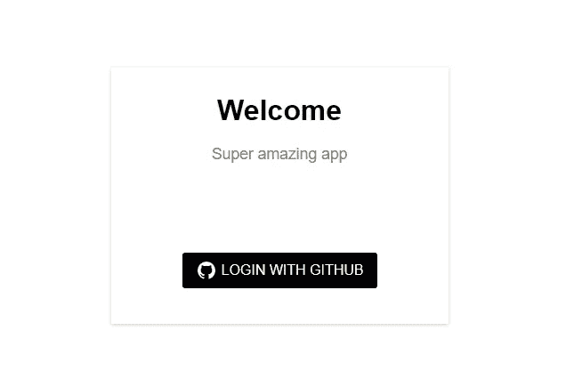

# 如何在 React App 中实现“用 GitHub 登录”

> 原文：<https://levelup.gitconnected.com/how-to-implement-login-with-github-in-a-react-app-bd3d704c64fc>



登录屏幕

我遇到过一个场景，我需要使用 Create React App 在 React 应用中实现“使用 Github 登录”功能。虽然这听起来很简单，但在尝试做这件事时，你可能会遇到一些麻烦。所以这篇文章的目的是提供一个指南来帮助你在你的应用中实现这样一个特性。让我们现在就开始吧！

# **第一步:在 Github 上创建 OAuth 应用**

登录你的 Github 账户，按照[这里](https://developer.github.com/apps/building-oauth-apps/creating-an-oauth-app/)提供的步骤创建一个 OAuth 应用。**注意:**对于这个例子，在创建 OAuth 应用程序时，如果您在本地运行您的应用程序，您可以将您的**主页 URL** 设置为 [http://localhost:3000/](http://localhost:3000/) 并将**授权回调 URL** 设置为[http://localhost:3000/log in](http://localhost:3000/login)。创建一个**。env** 文件并设置这些变量:

REACT _ APP _ CLIENT _ ID =您的客户端 ID
REACT _ APP _ CLIENT _ SECRET =您的客户端机密
REACT _ APP _ REDIRECT _ URI =[http://localhost:3000/log in](http://localhost:3000/login)

**注意:**在制作 app 时，请确保将您的客户端 ID 和客户端机密放在更安全的地方。您可以将它们放在服务器端应用程序中，并在后端进行整个身份验证，以防止伪造您的身份验证密钥。

# **第二步:创建 React 应用**

继续使用您的首选创建您的 react 应用程序，在本例中，我们将使用[**Create-React-App**](https://reactjs.org/docs/create-a-new-react-app.html)**。如果你使用这种模式，你必须删除 index.css、App.css、App.test.js 和 serviceWorker.js 等文件，编辑 index.js 并确保它看起来像[这个](https://github.com/PrincewillIroka/login-with-github/blob/master/src/index.js)。另外，编辑 App.js，使其看起来像[这个](https://github.com/PrincewillIroka/login-with-github/blob/master/src/App.js)。**

在 App.js 文件中，导入 2 个组件( **Home.js** 和 **Login.js** )。要创建这两个组件，请转到 **src** 文件夹，创建一个名为 **components** 的文件夹，其中包含两个文件(Home.js 和 Login.js)。从根文件夹中，您可以运行下面的命令来创建它们。

```
mkdir -p src/components && cd src/components && touch Home.js Login.js
```

接下来，您将看到我们从存储中导入了状态和 reducer。继续设置一个简单的存储来保存应用程序的状态。为此，导航到 src 文件夹，创建一个名为 **store** 的文件夹，在其中创建一个名为 **reducer** 的子文件夹，并在 reducer 文件夹中创建一个 **index.js** 文件。从根文件夹中，您可以运行下面的命令来创建它们。

```
mkdir -p src/store/reducer && cd src/store/reducer && touch index.js
```

商店中 index.js 文件的内容应该是这样的。

它包含 **initialState** 对象和一个 **reducer** 函数，该函数包含被调度来改变状态的动作。

在这一点上，这将是很好的工作对我们的组件。让我们来研究一下 [**Login.js**](https://github.com/PrincewillIroka/login-with-github/blob/master/src/components/Login.js) ，这将是一个简单的组件，它有一个按钮来触发对 Github API 的登录请求。

在 **Login.js** 组件中，请注意以下重要事项:

1.  我们导入并利用了 **AuthContext** 来使我们的商店中的全局状态和动作在这个组件中可用。
2.  当用户点击*“使用 Github 登录”*按钮时，会向 Github API 请求授权我们的应用程序。如果成功，Github 将重定向回我们的应用程序(授权回调 URL **)** ，URL 中带有 *"code"* 。
3.  我们利用 useEffect 钩子来监听这个*【代码】*何时可用。然后，我们从 url 收集它，使用代码和其他数据，如:client_id、redirect_uri、client_secret，通过我们的 [**代理服务器**](https://github.com/PrincewillIroka/login-with-github/blob/master/server/index.js) (一个简单的快速应用程序，帮助我们绕过 CORS 错误)继续向 Github APIs 发出请求。我将在下一步中详细讨论代理服务器。
4.  如果通过代理服务器的身份验证返回一个有效的响应，我们将调度“LOGIN”事件来设置存储中的用户数据和 isLoggedIn 有效负载。

让我们更新 [**Home.js**](https://github.com/PrincewillIroka/login-with-github/blob/master/src/components/Home.js) 组件，以显示一些用户数据，如(头像、姓名、追随者数量等)

# 步骤 3:创建代理服务器

最后一步是创建一个代理服务器来帮助我们绕过 CORS 错误。这将是一个简单的快速应用程序，我们将启用标题中的*“访问控制-允许-起源”*。我们将利用它来转发请求和接收来自 Github API 的响应，并将所需的响应发送回客户端(我们的 React 应用程序)。将这些变量添加到**中。env** 文件:

REACT _ APP _ PROXY _ URL =[http://localhost:5000/authenticate](http://localhost:5000/authenticate)SERVER _ PORT = 5000

在根文件夹中，创建一个名为 **server** 的文件夹，并在其中创建一个 [**index.js**](https://github.com/PrincewillIroka/login-with-github/blob/master/server/index.js) 文件。

其他链接:

[*https://developer . github . com/apps/building-oauth-apps/authoring-oauth-apps/*](https://developer.github.com/apps/building-oauth-apps/authorizing-oauth-apps/)

[*https://www . graph QL . college/implementing-github-oauth-flow/*](https://www.graphql.college/implementing-github-oauth-flow/)

**结论**

如果你遵循上面列出的几个步骤，你将能够在你的应用中无缝集成*“使用 Github 登录”*功能。

在这里获取源代码: [Github](https://github.com/PrincewillIroka/login-with-github)

谢谢大家！

你也可以在推特上关注我。