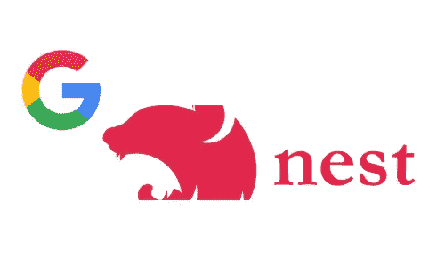
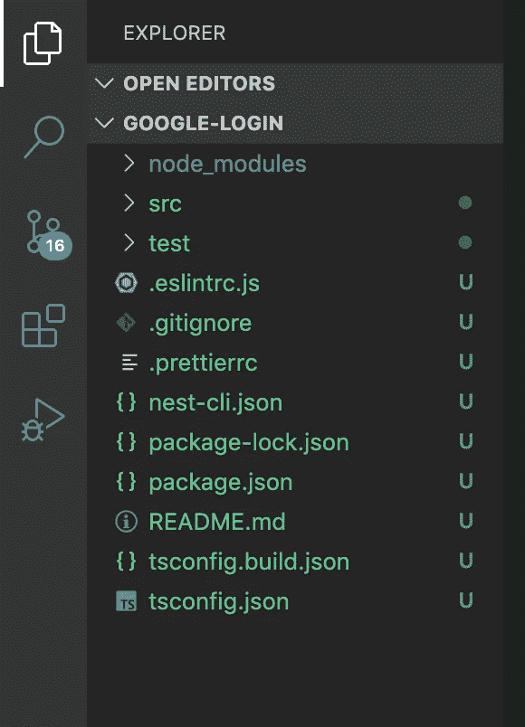
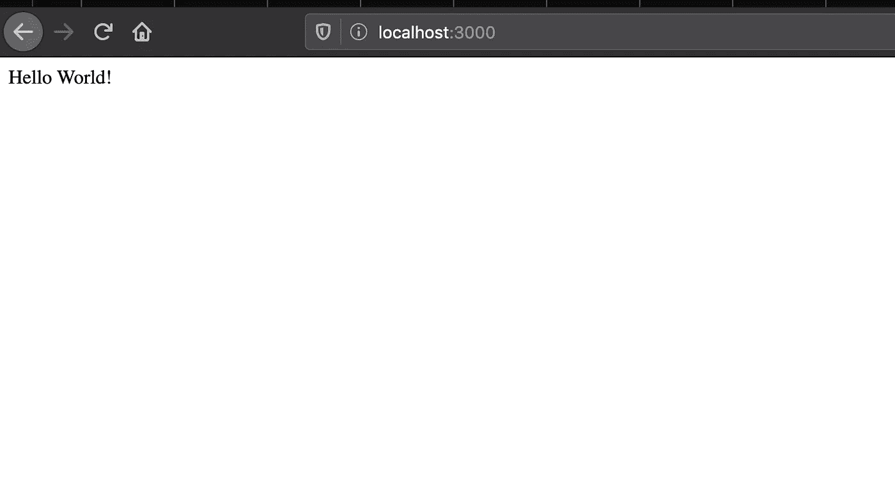
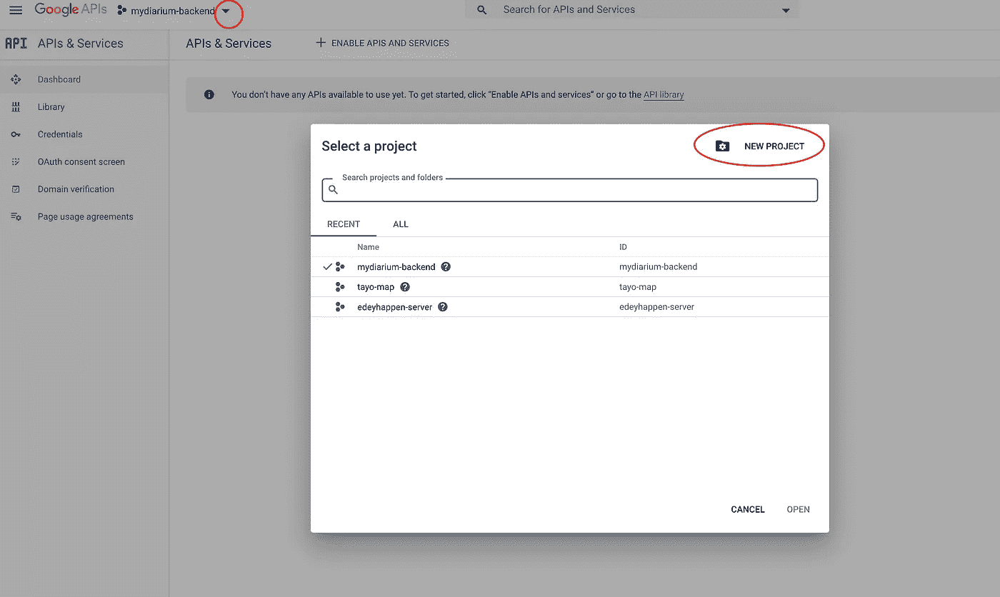
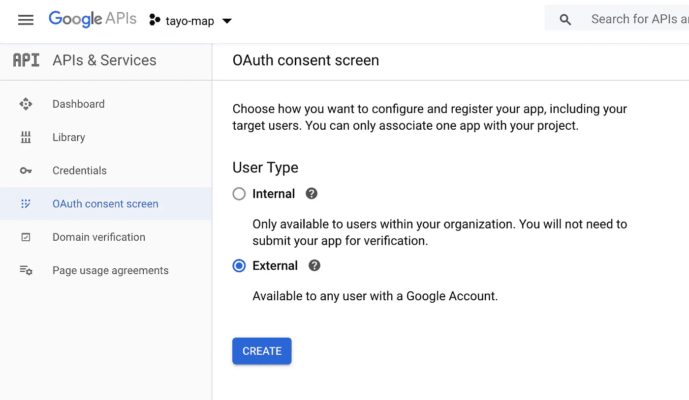
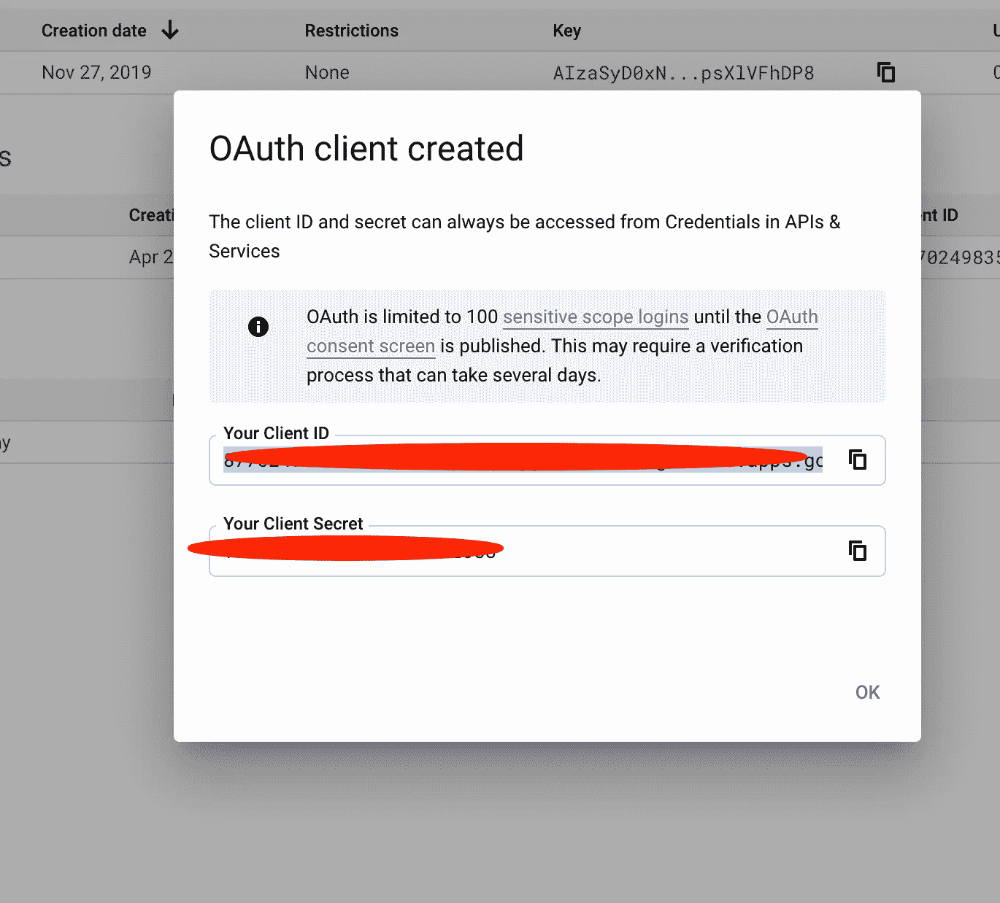
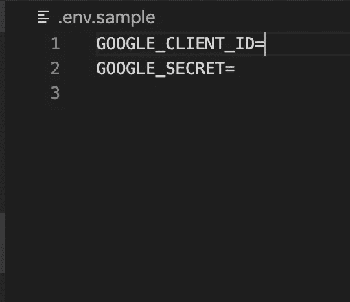
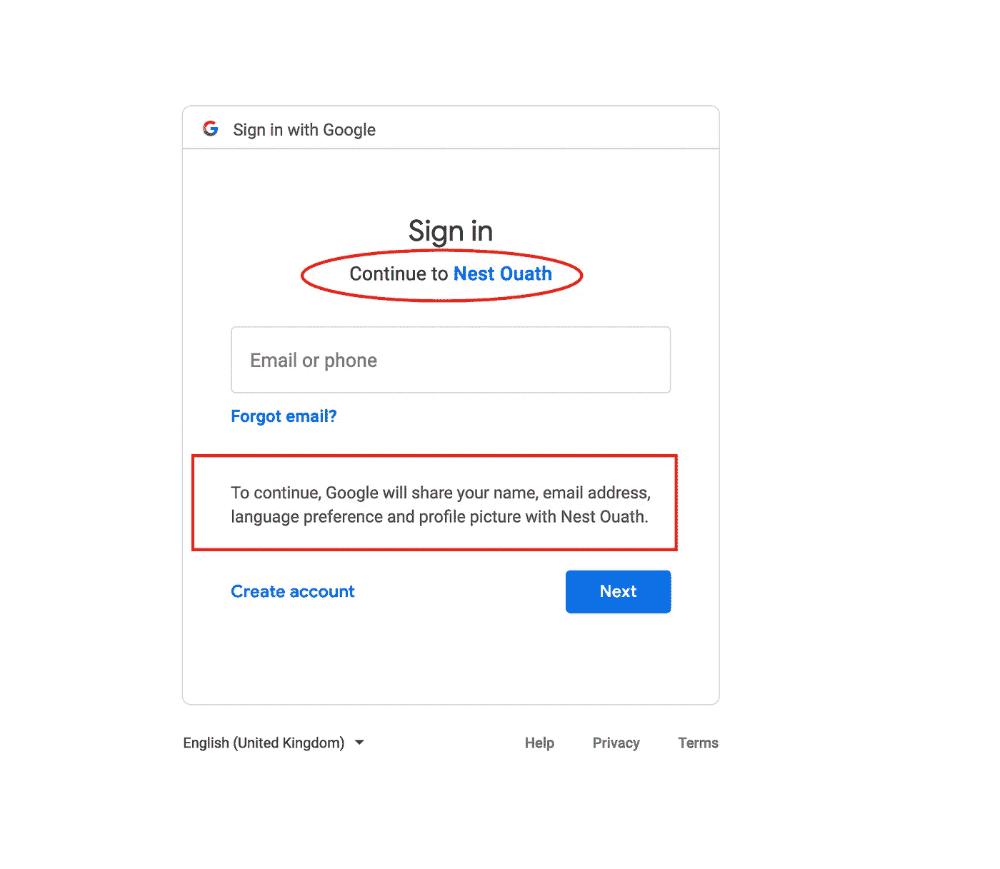
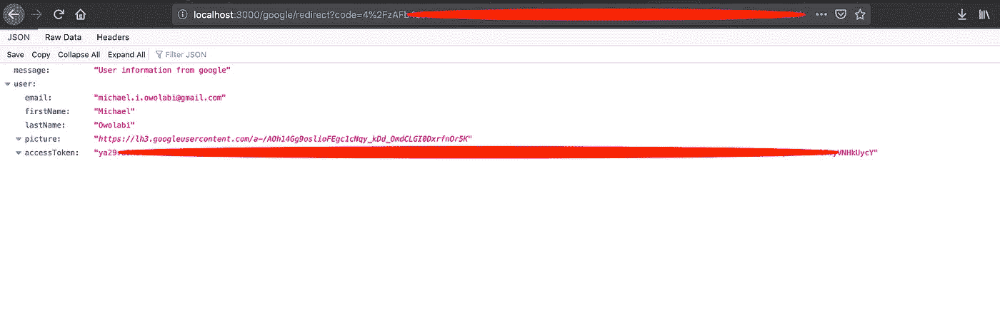

# 如何在 NestJS 中实现用 Google 登录

> 原文：<https://levelup.gitconnected.com/how-to-implement-login-with-google-in-nest-js-81b0c584c987>



在本文中，我们将在 NestJS 中使用 google 实现(OAuth)登录。从 Express 来看，在 NestJS 中实现 OAuth 可能看起来不那么直接，尤其是在使用通用 passport 模块时，因为在 NestJS 中，已经实现了许多东西，并且包装在各种 nest 模块中，开发人员可以在这个令人敬畏的框架中开箱即用。虽然这是一件非常好的事情，但你必须花时间弄清楚一些常规的东西在 Nest 中是如何不同地工作的。

NestJS 使用 typescript，但允许使用普通的 JS，所以它并不真正强迫开发人员用 Typescript 编写。

Nest 是基于流行的 Express 框架构建的，有些概念非常熟悉，但是如果您从未使用过 Nest，并且希望从本文中获得更多信息，那么我建议您花几分钟时间熟悉这个框架[这里](https://docs.nestjs.com/)，概述部分肯定会让您快速入门。

# 先决条件

要完成本教程，您必须具备以下条件:

*   节点 JS
*   NPM
*   网页浏览器
*   代码编辑器(VsCode)
*   Gmail 帐户

如果你还没有安装 Node.js，直接登陆官方 [Node.js](https://nodejs.org/en/) 网站，为你的平台下载一份 Node.js。一旦安装了 Node.js，就自动安装了 npm。

# 入门指南

首先，我们将使用 nest cli 搭建一个新的 nest 项目，因此我们将通过在终端上运行以下命令来全局安装它:

```
npm i -g @nestjs/cli
```

**创建新的嵌套项目**

由于我们刚刚在全局范围内安装了 nest cli，我们可以通过运行以下命令使用它来设置新的 nest 项目服务器:

```
cd desktop && nest new google-login && cd google-login
```

在您选择的编辑器中打开生成的项目文件夹，看起来应该如下所示:



**安装依赖关系**

对于这个项目，我们将使用 passport、dotenv 来管理我们的环境变量，所以让我们通过运行以下命令来安装它们:

```
npm install --save @nestjs/passport passport passport-google-oauth20 dotenv
npm install -D @types/passport-google-oauth20
```

运行

`npm run start:dev`测试服务器

现在打开你的浏览器，输入运行 Nest 的本地主机 URL**‘localhost:3000/’**你应该得到 **Hello world** ，如下所示:



现在我们可以走了🚀

# 创建 Google 应用程序

要使用 google OAuth，我们必须在 google 开发者控制台上创建一个应用程序，因此需要 Gmail 帐户。访问[https://console.developers.google.com/](https://console.developers.google.com/)并创建一个应用程序，我们将使用它在 NestJS 中设置认证。因此，当你访问谷歌开发者控制台的网址时，你应该会看到类似下面的屏幕



点击**“新项目”**，填写您想要的名称，然后点击创建按钮。

**设置项目同意画面**

每当用户想要使用我们的 google 应用程序登录我们的系统时，都会显示项目同意屏幕。要设置同意屏幕
,点击侧边栏的“OAuth 同意屏幕”菜单



选择外部，以便该应用程序可以被任何谷歌账户使用，然后点击**创建**。

在同意屏幕上，确保您只填写“应用程序名称”,而不填写其他内容，因为这只是为了测试目的。如果我们正在创建一个实时应用程序，那么可以填写其他字段，然后需要通过审批流程。完成后，单击保存。

**获取应用凭证**

要获得我们的应用程序证书，这将被用来验证谷歌应用程序接口点击“证书”在侧边栏菜单。

*   单击创建凭据并选择 OAuth 客户端 ID
*   在下一个屏幕上选择 Web 应用程序，然后填写授权的 JavaScript 源和重定向 URI。

授权的 JavaScript 源是指我们的请求将来自哪里，在本例中是 localhost，所以输入[**http://localhost:3000**](http://localhost:3000)和授权的重定向 URIs 输入[**http://localhost:3000/Google/redirect**](http://localhost:3000/google/redirect)。

请注意，重定向 URI 只是指我们的应用程序中的特定端点，谷歌将在认证用户后返回响应。
完成后点击保存。您应该可以从下面的屏幕中获得您的应用凭据



复制凭据并将其保存在某个地方，因为我们将在应用程序中使用它。

# 设置 Google 登录(OAuth)

首先要做的是设置 google 策略，这是我们 google 登录实现的核心。在 src 文件夹中创建一个名为 google.strategy.ts 的文件，并将以下代码添加到该文件中。

在上面的代码中，我们加载了所有需要的依赖项，然后创建了一个 **GoogleStrategy** 类，作为 **PassportStrategy** 类的子类。我们定义的每个使用 passport 的类都必须扩展 PassportStrategy 类，它是来自 **'@nestjs/passport'** 的一个专用模块。

然后，我们传入 google 策略所需的所有参数。
**CLIENT_ID** 和 **CLIENT SECRET** 是我们在创建应用程序时从 google 获得的应用程序 ID 和 SECRET，它是通过环境变量加载的。

CallbackURL 是我们的应用程序中的一个特殊端点，谷歌将在认证用户后将控制权归还给它。请记住，我们在创建应用程序时也在 google 上定义了这一点。

**范围**指的是我们的应用程序需要的一组用户信息。在这种情况下，在配置文件和用户电子邮件中捕获的基本用户信息。

**validate 方法**指的是验证回调函数，将在 google 返回给我们所请求的用户信息后执行。这是我们决定如何处理用户信息的地方，在这种情况下，我们只是从返回的用户配置文件中提取并格式化我们需要的信息，并将其添加到全局请求对象上可用的用户对象中。这是通过调用 done 并向其传递 null(这意味着没有错误)和用户对象来实现的。

不要忘记添加环境变量，如下面的**所示。项目根目录下的 env** 文件:



**注意:**
我们可以轻松地对策略文件中的用户信息做我们想做的一切，但 NestJS 在单一责任原则上非常重要，因为通常在一个实时应用程序中，我们很可能希望将用户信息保存在数据库中，这种操作专用于 NestJS 中称为服务的东西。

**设置控制器、路线和服务**

为了能够登录 google，我们必须在应用程序中设置适当的端点，这是 NestJS 中控制器的工作。为此，请打开 src 文件夹中的 app.controller.ts 文件，并用以下代码替换其内容:

在 NestJS 中，可以在控制器级别和/或请求方法级别设置路由，所以在上面的代码中，我们在控制器装饰器级别设置了 google 登录路由，这意味着控制器中的每个请求都将通过 google 端点。你可以在 NestJS [这里](https://docs.nestjs.com/controllers#routing)阅读更多关于路由的内容

第一个 Get 请求是端点通过“@nestjs/passport”模块中的特殊保护激活 google 身份验证，该模块位于端点上，名为**“AuthGaurd”**。我们将“google”作为参数传递给这个 AuthGuard，以表示我们希望使用 passport 模块中的 google 策略来验证这个端点上的请求。

第二个 Get 请求指的是第二个端点，在对用户进行身份验证之后，google 将重定向到这个端点(redirec URL)。这个端点也使用特殊的 AuthGuard。在调用了 google strategy 文件的 validate 方法中的 done 函数之后，控制权返回给这个控制器上的 googleLogin 函数。让我们创建 googleLogin 函数。

打开 src 文件夹中的 app.service.ts 文件，并添加以下代码:

这里我们只是从 google 返回用户信息，这些信息是从 google 策略文件中的 validate 方法添加到请求对象中的。

**汇聚一切**

到目前为止，我们的应用程序仍然不知道设置的 google 策略，所以我们需要在使用它之前在 app 模块中提供它。
打开 app.module.ts 文件，在 provider 数组中添加 google strategy as a service。您的应用程序模块文件应该如下所示:

# 测试我们的应用

运行

`npm run start:dev`启动 app

在你的电脑上启动任何浏览器，然后访问位于 **localhost:3000/google** 的 google 端点

您应该会看到类似以下屏幕的内容:



登录后来自 google 的用户信息如下所示:



**恭喜你！您刚刚在一个 NestJS 应用程序中成功实现了 Google OAuth(使用 Google 登录)。**

完整的代码可以在这里找到:[https://github.com/iMichaelOwolabi/google-oauth-nestjs](https://github.com/iMichaelOwolabi/google-oauth-nestjs)

你可以在这里留下你的评论，如果你有进一步的约定，我总是可以在 Twitter[@ iMichaelOwolabi](https://twitter.com/iMichaelOwolabi)上找到