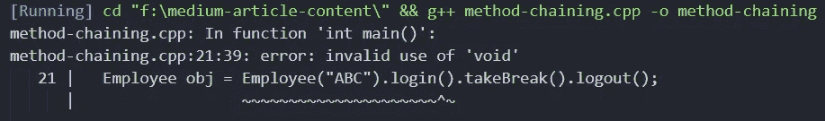
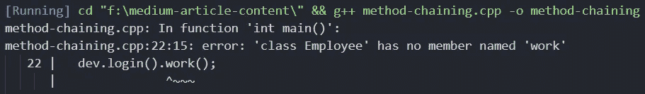

# 如何在 C++中实现方法链

> 原文：<https://levelup.gitconnected.com/how-to-implement-method-chaining-in-c-3ec9f255972a>

## C++基础

## 🖇Chain🖇Your🖇Methods🖇


照片由 [Hush Naidoo Jade 摄影](https://unsplash.com/@hush52?utm_source=medium&utm_medium=referral)在 [Unsplash](https://unsplash.com?utm_source=medium&utm_medium=referral) 上拍摄

# 介绍

**方法链接**是使用 OOPs 原理设计软件的众多优点之一。这是一种一次性调用多个函数而不是分别调用它们的做法。也被称为**参数习语**。如果方法链接实现得当，它会使代码看起来更优雅，更容易阅读。本文关注的是 C++，但是方法链接可以在任何基于 OOPs 的编程语言中实现。

如前所述，方法链是一种一次性调用多个函数的实践。在我们继续下一步之前，让我们深入了解类和对象的基础知识。假设有一个`**class List**`，它有两个功能`**append**` 和`**print**` 。所以要调用这些函数，我们首先需要创建一个 *List* 类的对象。没有这个类的引用，我们将无法访问这些函数。

下面给出的代码片段展示了使用对象调用类方法的传统方式。

```
List obj;
obj.append(10);
obj.append(20);
obj.print();
```

下面给出的代码片段是我们的最终目标。

```
List obj;
obj.append(10).append(20).print();
```

## 先决条件:

为了理解这篇文章，读者应该熟悉以下主题。

*   类别和对象
*   遗产
*   **c++中的这个**关键字(是指向当前对象实例的指针)
*   构造器
*   模板
*   铅字铸造

# 如果没有遗产

在这种情况下，实现方法链接非常简单。如前所述，要访问成员函数，我们需要一个该类的对象。所以如果我们从成员函数返回***这个**，我们就实现了方法链接。

在下面给出的例子中，有一个单独的类(`**class Employee**`)。在类 *Employee* 、***的每个函数中都返回这个**指针。

不涉及继承时的方法链接。

当运行上述代码片段时，获得的输出为:

```
ABC logged in
ABC taking a break
ABC logged out
```

如果我们**不**返回 ***this，**编译器会抛出下面的错误。



当函数返回**而不是** *this 执行方法链接时，编译器发出的错误消息。

# 在多级遗传的情况下

当涉及到遗传时，事情就变得棘手了。假设我们有两个类:`class Employee`和`class Developer`，其中*开发者*派生自*雇员*。

现在，如果我们遵循前面的方法(return ***this** )，编译器将抛出下面的错误消息。



当类的函数返回 ***this** 时编译器给出的错误信息。

这里的主要问题是返回类型。`class Employee`的`login`函数返回一个`Employee`类型的引用，它没有任何名为 work 的成员函数。为了链接函数`work`，我们需要类型`Developer`的引用。

为了解决这个问题，我们引入了**模板**。这里的想法是使基类成为泛型类，派生类在继承基类的同时使用自己作为模板参数。请参阅代码片段以获得更好的理解。

```
template <class BaseImpl>
class Base {};class Derived : public Base<Derived> {};
```

但是工作并没有在这里完成。在基类的方法中，我们需要将引用`using static_cast`转换为派生类的类型，以毫不费力地链接这些方法。

> static_cast 可以在指向相关类的指针之间执行转换，不仅是从派生类到其基类，还可以从基类到其派生类。

```
template <class BaseImpl>
class Base {
  public:
  BaseImpl &funcBase() {
    // do your stuff
    return static_cast<BaseImpl&>(*this);
  }
};class Derived : public Base <Derived> {
  public:
  Derived &funcDerived() {
    // do your stuff
    return *this;
  }
};
```

在下面给出的这个例子中，有 3 个类:`**class Employee**`、`**class Developer**`和`**class HR**`、**、**。

*   `class Employee`是通用基类。
*   `class Developer`和`class HR`都将从*雇员*继承，并将自己作为模板参数*传递。*

具有继承的方法链接

以上代码的输出:

```
Name 1 logged in
Name 1 writing code
Name 1 taking a break
Name 1 writing code
Name 1 logged outName 2 logged in
Name 2 organizing hiring drive
Name 2 organizing company event
Name 2 logged out
```

**第 51 行**也可以写成:

```
Developer dev("Name 1");
dev.login().work().takeBreak().work().logout();
```

在具有 3 个或更多类的多级继承的情况下:

```
template <class Base1Impl>
class Base1 {
  Base1Impl &fun1() {
    return static_cast<Base1Impl&>(*this);
  }
};template <class Base2Impl>
class Base2 : public Base1 <Base2Impl> {
  Base2Impl &fun2() {
    return static_cast<Base2Impl&>(*this);
  }
};class Derived : public Base2 <Derived> {
  Base2Impl &fun3() {
    return *this;
  }
};
```

感谢您阅读这篇文章。希望这对你有帮助。在 [LinkedIn](https://www.linkedin.com/in/ashish-yoel-585a6116a/) 上和我联系。干杯🤜。

## 阅读更多

[](https://en.wikipedia.org/wiki/Method_chaining) [## 方法链接-维基百科

### 方法链，也称为命名参数习语，是调用多个方法调用的常用语法

en.wikipedia.org](https://en.wikipedia.org/wiki/Method_chaining) [](https://www.geeksforgeeks.org/this-pointer-in-c/) [## C++中的 this 指针

### 要理解“this”指针，了解对象如何看待类的函数和数据成员是很重要的。每个…

www.geeksforgeeks.org](https://www.geeksforgeeks.org/this-pointer-in-c/) [](https://www.geeksforgeeks.org/static_cast-in-c-type-casting-operators/) [## C++中的 static _ cast |类型转换运算符- GeeksforGeeks

### 转换运算符是一元运算符，它强制将一种数据类型转换为另一种数据类型。C++支持…

www.geeksforgeeks.org](https://www.geeksforgeeks.org/static_cast-in-c-type-casting-operators/)