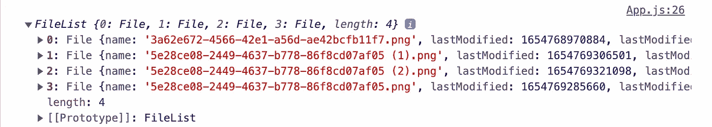
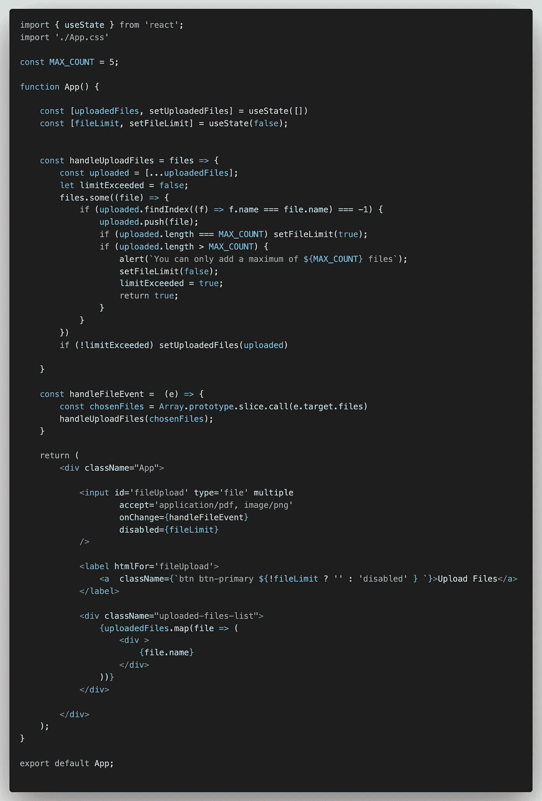

# 如何在 React 中实现多个文件上传？

> 原文：<https://levelup.gitconnected.com/how-to-implement-multiple-file-uploads-in-react-4cdcaadd0f6e>


[西格蒙德](https://unsplash.com/@sigmund?utm_source=medium&utm_medium=referral)在 [Unsplash](https://unsplash.com?utm_source=medium&utm_medium=referral) 上拍照

今天，很多网站都有上传文件的选项，大多是通过表单。如果你想在你的网站上增加这样的功能，你来对地方了。在这篇文章中，我将向你展示如何在 React 中实现多个文件上传。

对于本文，我假设您对 React 有基本的了解。如果没有，那么前往 [React Docs](https://reactjs.org/docs/getting-started.html) 开始。

# 安装

首先，用下面的命令创建 React 应用程序。

```
create-react-app multiple-file-upload
```

我在项目中使用了 Bootstrap，所以将这个 CDN 添加到*index.html*文件中。

```
<link href="https://cdn.jsdelivr.net/npm/bootstrap@5.1.3/dist/css/bootstrap.min.css" rel="stylesheet" integrity="sha384-1BmE4kWBq78iYhFldvKuhfTAU6auU8tT94WrHftjDbrCEXSU1oBoqyl2QvZ6jIW3" crossorigin="anonymous">
```

或者，您可以从[这里](https://getbootstrap.com/docs/5.1/getting-started/download/)下载引导源文件。

# 创建上传按钮

首先，创建一个*类型的`input`文件*，它可以接受多次上传。如果您想只允许某些文件类型，您可以使用`accept`属性并指定您想允许的文件类型。

```
<input id='fileUpload' type='file' multiple accept='application/pdf, image/png'/>
```


类型文件的输入

但是如果有一个按钮有你自己的风格和你自己显示文件的方式会更好。因此，将属性`display: none`添加到输入中，并将属性`htmlFor`(HTML 中`for`属性的替代属性)的标签设置为输入的 id。由此，`label`被绑定到`input`并且能够复制其功能。

```
<label htmlFor='fileUpload'> <a className='btn btn-primary'> Upload Files </a></label>
```

在这个`label`里面，你可以显示任何你想要的东西，在这里，我使用了一个简单的按钮。请注意，我使用了`a`而不是`button`，并对其应用了引导类。

现在，隐藏`input`并以你自己的方式显示文件的原因是默认功能有一些限制。上传多个文件时，只能看到文件的数量，当您再次尝试上传时，已上传的文件将被替换。

# 处理多个文件上传

到目前为止，您有一个静态上传按钮，您可以在上面提到的限制下上传多个文件。

在某些情况下，这不是问题，但是如果用户不能一次选择所有文件呢？如果所有的文件都在不同的文件夹里呢？

由于上述限制，用户首先必须将所有文件放入同一个文件夹，然后一次性上传。这将是乏味的，我们的工作是让最终用户更容易。让我们看看我们能做些什么。

## 处理文件上传事件

为了处理文件上传事件，向采用回调函数`handleFileEvent`的`input`添加一个`onChange`属性。

```
const handleFileEvent =  (e) => { --- HANDLE FILE UPLOAD EVENT HERE ---}
```

该函数将事件对象作为包含事件各种属性的参数。它还包含事件中上传的文件。使用`e.target.files`可以访问这些文件。

这些文件以类似数组的对象的形式存储。



控制台记录文件

## 将上传的文件存储为状态

创建一个状态`uploadedFiles`来存储当前上传的文件列表。最初，它是空的。

```
const [uploadedFiles, setUploadedFiles] = useState([])
```

我们的状态`uploadedFiles`是一个数组，但是`event.target.files`是一个对象，所以你需要把它转换成一个数组。有一种方法可以将类似数组的对象转换为数组。在你的`handleFileEvent`方法中这样做。

```
const chosenFiles = Array.prototype.slice.call(e.target.files)handleUploadFiles(chosenFiles);
```

`chosenFiles`包含在*当前*事件中正在上传的文件。

现在，将这些文件添加到将所选文件作为参数的`handleUploadFiles`方法的状态中。

```
const handleUploadFiles = files => { --- ADD FILES TO STATE ---}
```

首先，创建状态数组的副本，并将所有当前选择的文件添加到该数组中。我使用了`some()`方法而不是`forEach`方法，原因我很快会解释。

```
const uploaded = [...uploadedFiles];files.some((file) => { uploaded.push(file);})
```

当循环结束时，更新状态数组。状态更新在最后完成，因为它是异步操作。

```
setUploadedFiles(uploaded);
```

## 检查文件是否已经存在

你不希望用户多次上传完全相同的文件。因此，在将文件添加到`uploaded`列表时，添加以下条件。

```
if (uploaded.findIndex((f) => f.name === file.name) === -1) { uploaded.push(file);}
```

`findIndex`方法在`uploaded`中搜索与当前添加的文件同名的文件。

## 限制要上传的文件数量

有时，您可能需要限制用户可以上传的文件数量。可以在上传事件期间或提交表单时检查所选文件的数量。我将向您展示如何在上传活动中做到这一点。

首先，创建一个状态变量，指示用户是否达到了文件上传限制。默认值为`false`。

```
const [fileLimit, setFileLimit] = useState(false);
```

现在，在`handleUploadFiles`函数中创建一个局部变量`limitExceeded`，并将其初始化为 false。

在将文件推送到`uploaded`数组时，添加以下检查。

```
if (uploaded.length === MAX_COUNT) setFileLimit(true);if (uploaded.length > MAX_COUNT) { --- WHEN THE LIMIT IS EXCEEDED ---}
```

目前最大限制是`MAX_COUNT = 5`。当上传的文件数量达到此限制时，相应地更新状态。但是这还不够，您还需要添加超过限制的条件，因为用户仍然可以在任何阶段上传多个文件。

以下逻辑适用于已经上传的文件和当前选择的文件数量超出限制的情况。

```
setFileLimit(false);limitExceeded = true;return true;
```

如果超过限制，不允许用户添加单个文件。因为我们回到了之前没有达到极限的状态，所以将`fileLimit`设置为 false。

现在，我使用`some`而不是`forEach`的原因是，如果用户上传的文件数量超过限制，我不想让用户上传。为此，我需要在这一点上打破循环。因为跳出`forEach`循环几乎是不可能的，所以我使用了`some`方法。

`some()`方法实际上是用来检查数组中的一个元素是否满足某个条件。如果是，则返回 true 并结束循环。所以，我从函数中返回了`true`来打破循环。

如果你能想到任何其他阻止上传多余文件的逻辑，请在下面评论。

更新`uploadedFiles`状态时，检查是否超过极限。

```
if (!limitExceeded) setUploadedFiles(uploaded)
```

要在达到限制时禁用按钮，请为`input`设置`disabled = {fileLimit}`，并为按钮添加一个`disabled`类。

```
<a  className={`btn btn-primary ${!fileLimit ? '' : 'disabled' } `}>

    Upload Files</a>
```

# 显示上传的文件

这部分很简单。只需在上传按钮后显示文件名。

```
<div className="uploaded-files-list"> {uploadedFiles.map(file => ( <div> {file.name} </div> ))} </div>
```

您可以通过使用图标和样式化文本以各种方式显示文件。现在，我只显示了文件名列表。另外，我还没有给`div`元素添加一个关键道具。React 会给出一个警告，所以请确保在呈现元素列表时添加它。

# 包扎

最后，这是 App 组件的样子。



App.jsx

你可以在 [GitHub](https://github.com/KunalN25/multiple-file-uploads) 上找到这个项目。以上实现是对[这个](https://stackblitz.com/edit/react-file-dropzone)的修改。一定要去看看。

# 结论

在实现表单时，您的网站可能还需要接受来自用户的文件。有时，默认功能无法满足您的需求。所以，你需要添加你自己的功能。

在这篇文章中，我向你展示了如何在 React 中实现同样的功能。我已经解释了实现的每一步。希望这对你以后的项目有所帮助。当然，可能有许多其他方法来实现这一功能。如果可以对此实现进行任何改进，请在下面留言。

如果您无法理解内容或对解释不满意，请在下面评论您的想法。新想法总是受欢迎的！如果你喜欢这篇文章，请鼓掌。**订阅**、**关注**我获取每周内容。如果你想讨论什么，可以在[推特](https://twitter.com/nkunal25)上联系我。到那时，再见！！