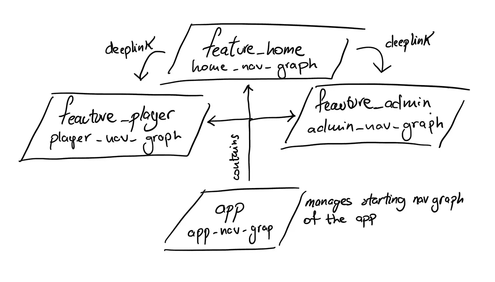

# 如何在 Android 多模块项目中实现导航

> 原文：<https://levelup.gitconnected.com/how-to-implement-navigation-in-multimodule-projects-for-android-32f7731c4384>

## 为每个模块保留一个导航图，使项目内部的导航更加直观


由[万花筒](https://unsplash.com/@kaleidico?utm_source=medium&utm_medium=referral)在 [Unsplash](https://unsplash.com?utm_source=medium&utm_medium=referral) 上拍摄的照片

Android 的导航组件允许管理应用程序内的导航，这比以前在 Android 中更容易，以前我们在每个屏幕上都有一个`Activity`。

导航组件假设[单个活动模式](/modernize-your-android-app-with-the-single-activity-pattern-1526407a7d4)正在被实现，因此应用程序中的每个屏幕现在都是一个`Fragment`。

它附带了一个图形工具，让开发人员可以鸟瞰导航逻辑是如何定义的，并方便添加新的`Fragments`和动作来导航，而无需使用代码(如果您愿意，也可以选择使用代码)。

对于较小或寿命较短的应用程序，保持单一导航图是一个好主意，也是最佳选择。然而，如果您计划构建更大的东西，多模块项目是一个不错的选择。

> 如果您是多模块项目的新手，我建议您在阅读本文之前先阅读本[官方指南](https://developer.android.com/topic/modularization)。

在这篇文章中，我们将学习如何在每个模块中使用一个图表来实现导航，如何将它们相互连接，同时也添加条件导航，例如，为登录屏幕添加条件导航。

# 如何构建导航图

对于多模块项目，我们将遵循接下来的模块。



多模块导航图

这个想法是有一个父导航图作为容器，每个模块有更小的包含导航图。

`app`模块将负责创建父导航图并决定应用程序的起始点，我们将在下一节添加条件导航时看到这一点。

现在，让我们想象一下，我们的应用程序总是有相同的起点，在一个名为 home 的功能模块中。

首先，我们需要创建我们的父导航图，它将存储在`app`模块的文件夹`res/navigation`中。

由于起始目的地现在是固定的，我们可以通过`app:startDestination`属性来设置它。

如前所述，父导航图将包含三个导航图，每个功能模块一个。在其他模块中，我们创建了其他导航图，只有一个简单的`Fragment`。

```
<?xml version="1.0" encoding="utf-8"?>
<navigation xmlns:android="http://schemas.android.com/apk/res/android"
    xmlns:app="http://schemas.android.com/apk/res-auto"
    app:startDestination="@id/home_nav_graph" >

    <include
        android:id="@+id/homeNav"
        app:graph="@navigation/home_nav_graph" />

    <include
        android:id="@+id/adminNav"
        app:graph="@navigation/admin_nav_graph" />

    <include
        android:id="@+id/playerNav"
        app:graph="@navigation/player_nav_graph" />

</navigation>
```

在 XML 中，我们需要一个这样的`FragmentContainerView`,它膨胀了应用程序将要使用的唯一的`Activity`。

```
<androidx.fragment.app.FragmentContainerView
        android:id="@+id/navHostFragment"
        android:name="androidx.navigation.fragment.NavHostFragment"
        android:layout_width="match_parent"
        android:layout_height="match_parent"
        app:defaultNavHost="true"
        app:layout_constraintBottom_toBottomOf="parent"
        app:layout_constraintEnd_toEndOf="parent"
        app:layout_constraintStart_toStartOf="parent"
        app:layout_constraintTop_toBottomOf="parent" />
```

为了完成初始设置，我们现在需要转到`Activity`类并设置`navController`。

```
val navHostFragment = supportFragmentManager
  .findFragmentById(R.id.navHostFragment) as? NavHostFragment

navHostFragment?.apply {
  this@MainActivity.navController = navController
}
```

只需这些代码，我们就可以启动应用程序，并开始使用在 feature home 模块中实现的导航。

# 在模块间导航

为了在两个模块之间导航，我们需要一个**深度链接。**每个子导航图都是相互隔离的，因此我们无法在不同导航图的片段之间进行导航。

要使用一个深度链接，我们需要为它创建一个标识符，你可以把它存储在核心模块中，因为至少有两个模块要使用它。这里我还添加了一个参数，比如一个字符串形式的标识符。

如果不需要传递参数，就不要把最后那部分加在括号里。

```
<string name="admin_deep_link" translatable="false">myProject://com.molidev8.myProject/admin/{adminId}</string>
```

然后，在我们将要导航的子导航图中，我们需要像这样在到具体的`Fragment`的深度链接处，使用一个与我们之前在深度链接的 URL 中指定的参数相匹配的参数。

```
<fragment
  android:id="@+id/admin_fragment"
  android:name="presentation.admin.AdminFragment"
  android:label="AdminFragment"
  tools:layout="@layout/admin_fragment">

  <argument
    android:name="adminId"
    app:argType="string" />

  <deepLink app:uri="@string/admin_deep_link" />

</fragment>
```

现在，为了使用深度链接和导航，我们需要下面的代码，其中我们用一个实际值替换了管理员标识符的占位符。

```
val deeplink =
    NavDeepLinkRequest.Builder.fromUri(
        Uri.parse(
            getString(R.string.admin_deep_link).replace(
                "{adminId}",
                "123456abc"
            )
        )
    )
        .build()
findNavController().navigate(deeplink)
```

在我们导航到的`Fragment`中，我们可以使用[安全参数](https://developer.android.com/guide/navigation/navigation-pass-data#Safe-args)读取参数。

如果你打算不止一次地使用它们，我建议你将每个深度链接导航动作作为`NavController`的扩展功能来实现。

```
fun NavController.navigateToAdmin(adminId: String) {
    val deeplink =
        NavDeepLinkRequest.Builder.fromUri(
            Uri.parse(
                getString(R.string.player_deep_link).replace(
                    "{adminId}",
                    adminId
                )
            )
        )
            .build()
    findNavController().navigate(deeplink)
}

// Then call
findNavController().navigateToAdmin("1234556abc")
```

# 添加条件导航

现在，让我们假设 home 模块的职责是管理认证。在这种情况下，如果用户以前从未登录过，应用程序将加载主页模块，如果用户登录过，则加载管理员或玩家模块。

首先，我们需要从父导航图中移除`app:startDestination`属性，因为现在我们需要它是动态的。

在我们在`Activity`中的`NavController`之前创建的地方，我们现在还需要设置导航图，它将是应用程序的入口点，这取决于用户认证状态。

为此，我为每个认证状态创建了一个**密封类**，并且已经为每个状态设置了目的地。对于每个目的地，需要对每个图的引用，如下例所示。

```
sealed class StartDestination(val destination: Int) {
    object Login : StartDestination(com.molidev8.feature_home.R.id.home_nav_graph)
    object Admin : StartDestination(com.molidev8.feature_admin.R.id.admin_nav_graph)
    object Player : StartDestination(com.molidev8.feature_player.R.id.player_nav_graph)
}
```

最后，我们像这样设置图形，其中`startDestination`变量是我们之前创建的密封类中的一个对象。

```
navController.graph = navController.navInflater.inflate(R.navigation.app_nav_graph).apply {
    setStartDestination(startDestination.destination)
}
```

# 结论

现在，每个模块都有一个导航图，更容易看到导航在应用程序中的工作方式。通过这种方式，新开发人员可以更容易地理解导航，并且您可以保持所有东西的内聚性和模块的解耦性。

如果你想阅读更多这样的内容，并支持我，不要忘记检查我的个人资料，或给媒体一个机会，成为会员，以获得我和其他作家的无限故事。每月只有 5 美元，如果你使用这个[链接](https://medium.com/@molidev8/membership)，我会得到一小笔佣金。

[](https://medium.com/@molidev8/membership) [## 通过我的推荐链接加入 Medium—Miguel

### 阅读米格尔的每一个故事(以及媒体上成千上万的其他作家)。你的会员费直接支持米盖尔…

medium.com](https://medium.com/@molidev8/membership)