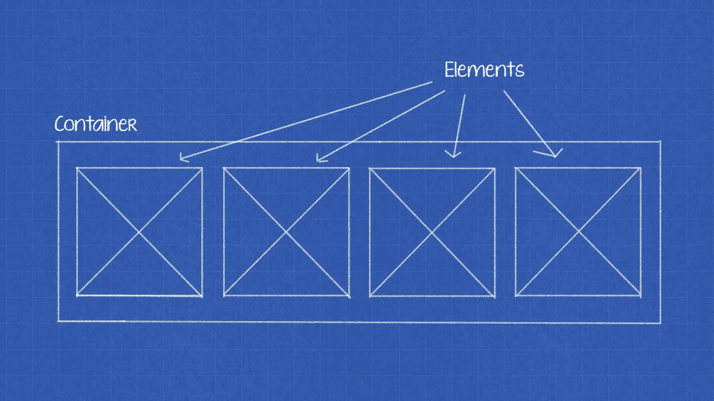
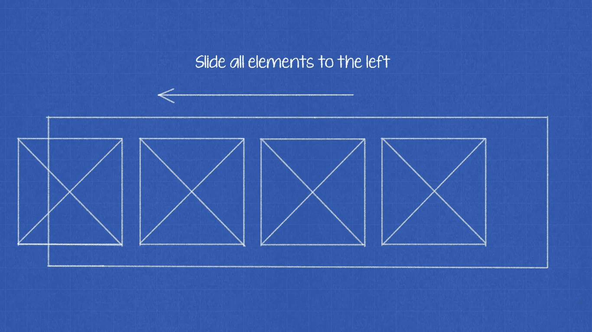
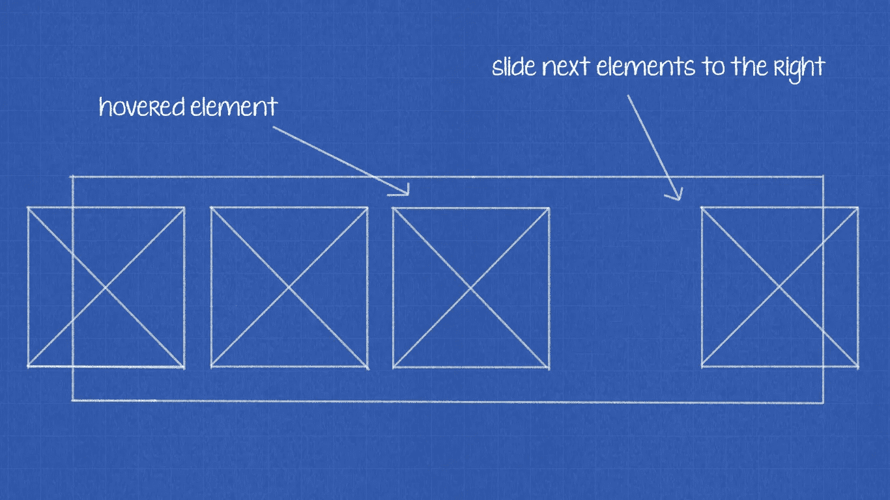
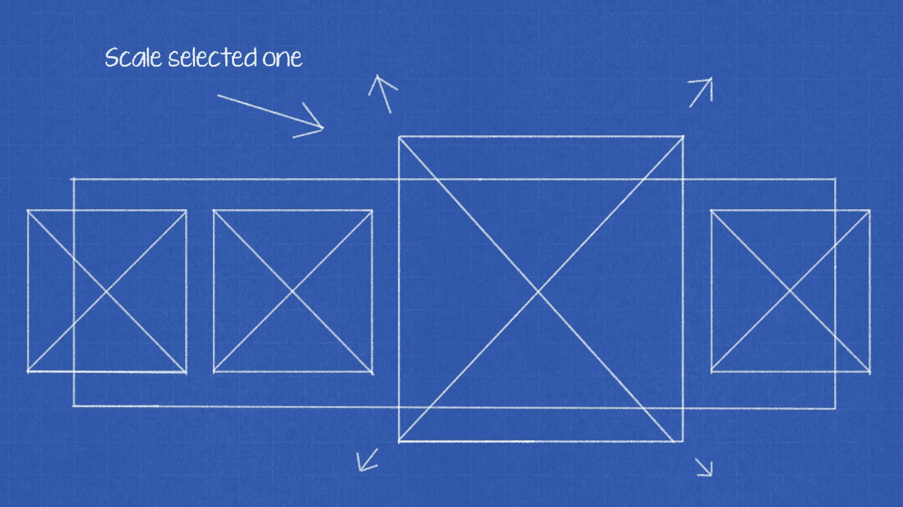
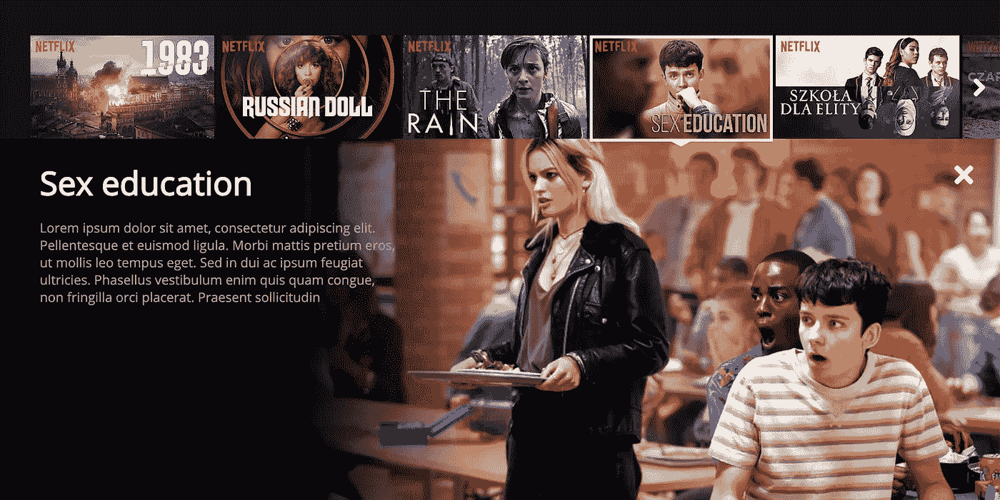
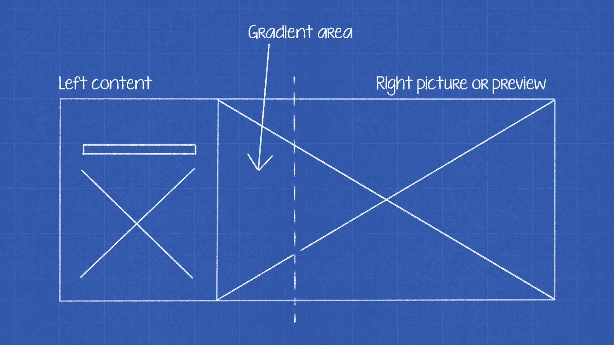

# 如何用 React 和钩子实现网飞滑块

> 原文：<https://levelup.gitconnected.com/how-to-implement-netflix-slider-with-react-and-hooks-bdb9b99d1ce4>

## 一些关于网飞 UI 的东西，用 React 写的，用 CSS 制作动画。

你可能已经看过网飞的用户界面。这个界面的大部分由大滑块组成，具有富于表情的悬停效果，用于显示电影和相关信息。每个元素都包含一个电影的缩略图，但是当你*悬停*时，它会被缩放，其余的元素会横向平移——这就是它的基本工作方式。

今天我想向你们展示，没有魔法，只需几个步骤就可以做到。

# 💡从容器开始

开始时，让我们试着写一个滑块，但是没有任何悬停或滑动效果。这将是下一步的基础。

起点:所有的元素都在容器中

没有什么复杂的——它只是一个内部包含元素的容器。

*CSS* 也很短——容器有*flex*display 并且所有的项目都属于他，大小不变。

# 💡把他们推到左边！

该算法从简单的*翻译*开始。我们必须将所有元素移动到容器的左侧。所以当我们将鼠标悬停在容器上时，所有的元素都应该向左移动。

步骤 1:向左移动所有元素

有一段代码可以做到这一点:

我们在这里使用的翻译值为 *25%，*我将在文章的后面解释这个推理。

# 💡嗯，现在向右！

下一步和上一步非常相似。基本上，我们必须做同样的翻译，但是在另一边，并且…不移动前面的元素。这意味着我们必须只滑动在*悬停的*元素之后的元素。

步骤 2:向右移动元素

下面的代码代表它:

还是那句话，可以看 *25%* ，耐心点！

# 💡应用悬停效果

现在，我们可以散开了！我们需要做的最后一件事是扩展。我们必须使用另一个`transform`也就是`scale`。缩放的值是`1.5` —这就是我们使用*翻译*和 *25%* 的原因。通过使用 1.5 值来缩放该元素，它会将大小增加 *150%，*并且这 50%被分割成每一侧的 25%平移。你可以改变这些值，当然，只是要确保数学是正确的。

第三步:放大特定的一个

*缩放*代码:

# 💡给我看看你有什么！

我们有*悬停*效果，但是当你点击底部箭头时，这个滑块也显示内容。除了后面的背景没什么特别的，它有左(暗)边的 *30%* 和预览/图片的 *70%* 。此外，这两个元素之间是渐变，使左侧边缘更平滑。

所选电影的内容

梯度在哪里

如何实现后台？简单来说，*在*之前，`:before` …

现在所有的内容必须在`position: absolute`(相对于容器)上，因为它需要覆盖背景。

# 💡反应从何而来

是时候把这个和*反应*联系起来了。让我们试着用滑动功能扩展这个想法，就像在网飞网站上一样。 [*那里*](https://github.com/andrzejewsky/netflix-slider) 有一个完整的 *React* 这个滑块的代码，但是我想解释一下达到最终效果最重要的东西，所以让我们把重点放在这两个文件上:

## 通过使用上下文 API 共享逻辑

如你所见，在这两个文件中，我都使用了*上下文* *API* 。这是因为我想在父组件和子组件之间共享事件处理程序。显然，你可以用`render-props`做同样的事情，但是用上下文 API *，*我不需要记住如何传递处理程序给条目——我可以使用条目组件而不用考虑它在内部是如何完成的。

## 使用钩子做一些计算

为了实现滑动功能，我写了两个钩子。第一个用于读取容器的宽度(`useSizeElement`)，第二个用于实现滑动逻辑本身(`useSliding`)。我在下面附上两个代码示例:

它们是如何工作的？我使用了`refs`来获取关于尺寸的信息(`width`)，并共享了处理上一次和下一次点击的函数。

# 寥寥数语…

下面，您可以看到最终的结果和到存储库的链接。当然，这只是一小段文字，展示了如何实现主要功能，如悬停或滑动。**没有完成滑块库——很少边缘案例也需要实现！**

GitHub:[https://github.com/andrzejewsky/netflix-slider](https://github.com/andrzejewsky/netflix-slider)

干杯！

PS。React 挂钩很棒，但它需要一些时间来适应和发展最佳实践。

 [## 学习 React -最佳 React 教程(2019) | gitconnected

### 排名前 49 的 React 教程-免费学习 React。课程由开发人员提交并投票，使您能够…

gitconnected.com](https://gitconnected.com/learn/react)