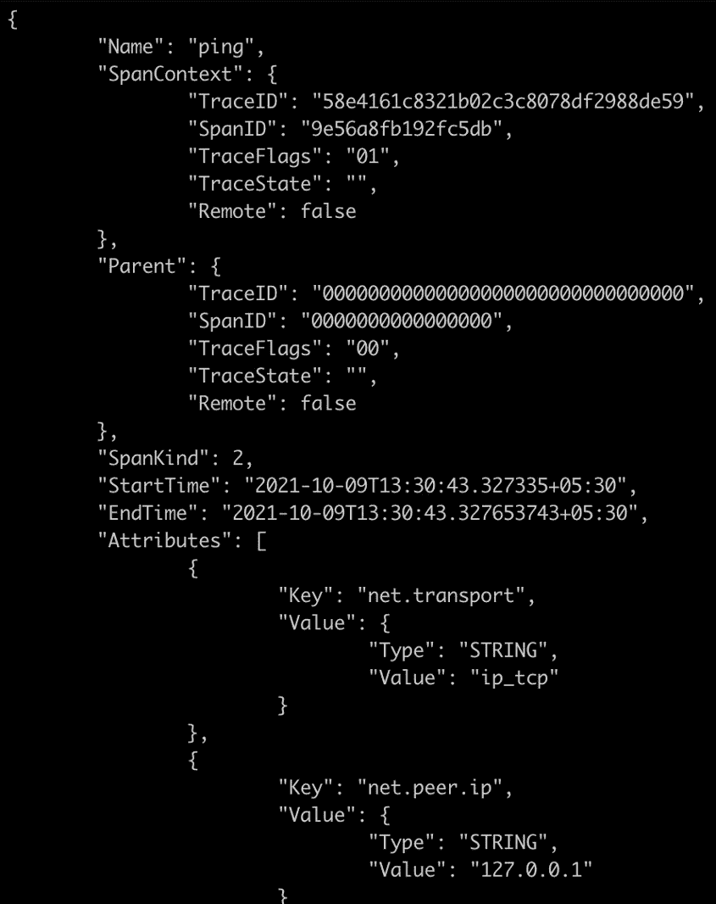

# 如何实现 OpenTelemetry 并在微服务间传播轨迹

> 原文：<https://levelup.gitconnected.com/how-to-implement-opentelemetry-and-propagate-trace-among-microservices-dfa1a1a14865>

## 如何用 GoLang 和微服务做基本的 OpenTelemetry


OpenTelemetry 和 Go 微服务

原生云成为设计和开发应用程序的事实标准。根据 **CNCF 的说法，** cloud-native 被定义为在“现代动态环境”中运行的“可扩展应用程序”，这些应用程序使用了诸如*容器、微服务和声明式 API 等技术。*

当遵循上述设计时，您倾向于将您的应用程序划分为多个微服务。通过遵循*单一责任原则，*每个微服务将只有一个责任。这些微服务中的每一个最终都会自己变成一个容器。这很棒，因为你可以根据需求增加每个微服务的实例数量；例如，如果您需要购物应用程序中更多的*结账服务*实例来处理需求/负载，您可以在不影响其他微服务的情况下这样做。这可以再次缩减以将资源归还给池。即 CPU、存储器。

但问题是。作为一名开发人员，如果应用程序是单一的，您可以有意地将请求流从一个模块指向另一个模块。但是在动态伸缩的微服务的情况下，我们如何确定哪些请求由哪些服务呢？

这就是***open telemetry***发挥作用的地方。另一个 *CNCF* 孵化项目(2021 年 12 月撰写本文时的孵化状态)用于*仪器化、生成、收集和输出*遥测数据，即。、指标、日志和跟踪，帮助分析微服务架构。

*OpenTelemetry* 简称为 *otel* ，是一个工具、API 和 SDK 的集合，通过您选择的编程语言实现的微服务来执行上述任务。

> *OpenTelemetry* 拥有几乎所有语言的 SDK。在本文中，我们将使用 GoLang 编程语言。尽管所有语言的实现方面几乎是相同的。

让我们开始创建微服务，并集成 *OpenTelemetry* 以从中提取度量数据。

# 简单 Web 服务器

在任何语言中，Web 服务器都是相对容易建立和运行的。即使在围棋中，也没有什么不同。使用`net/http`包，创建一个如下所示的包非常简单。但在此之前，让我们创建一个目录，并使用命令`go mod init <mod_name>.`在其中初始化一个模块

在 Go 中建立一个简单的 web 服务器

通过运行上面的代码，您应该已经启动了简单的 web 服务器并监听端口号 8080。点击浏览器中的 URL `http://localhost:8080/ping`,确保它的运行没有任何问题。您应该会看到来自服务器的响应文本`pong`。

现在，让我们添加 *OpenTelemetry* 的依赖项。由于 Go 使用模块作为管理依赖项的方式，让我们使用`go get`命令将 OpenTelemetry 模块添加到项目中，如下所示。

```
go get go.opentelemetry.io/otel/sdk/tracego get go.opentelemetry.io/otel/exporters/stdout/stdouttracego get go.opentelemetry.io/otel/propagationgo get go.opentelemetry.io/otel/semconv
```

逐一查看我们添加到项目中的模块

*   `trace`包包含对 OpenTelemetry 分布式跟踪的支持。
*   `stdout`包包含一个 OpenTelemetry 导出器，用于跟踪要作为 JSON 写入输出目的地的遥测。仅为了本文/演示的目的，我们正在写入一个 JSON 文件。在现实世界中，数据被导出到 Jager、Prometheus、Zipkin 等工具中。
*   `propagation`包包含 OpenTelemetry 上下文传播器。这些传播器非常重要，因为这些传播器用于从应用程序交换的消息中注入和提取上下文数据。这就是 OpenTelemetry 如何支持任何数量的不同编程语言，用于为单个应用实现各种微服务。
*   `semconv`包实现 OpenTelemetry 语义约定。

# 创建追踪器

现在我们已经将相关模块添加到项目中，让我们创建一个*跟踪程序。*要创建一个跟踪器，您需要为服务命名。姑且称之为 *service-1。*跟踪创建方法非常标准，如下所示。

创建导出器并向 tracer 注册

在上面的代码片段中，我们创建了一个导出器作为*标准输出*导出器和一个注册导出器的跟踪提供者。

然后我们使用 *trace* 包中的函数`WithResource`来配置额外的资源属性，比如这个代码片段中的模式 URL 和服务名。

即使导出器是附加到跟踪器上创建的，微服务仍然不能发出跟踪数据。这需要附加到 web 服务器的主要功能，只要 web 服务器在运行，就应该继续运行。因此，让我们稍微修改一下运行简单 web 服务器的主函数。

让我们调用主函数中的`initTracer`函数，并将返回的`traceProvider`赋值给一个变量，如下所示:`tp := initTracer()`。现在，追踪器必须拦截所有传入 web 服务器的请求，以便能够提取和/或注入遥测数据。因为对于服务器将要公开的所有端点来说，情况都是一样的，所以我们将创建`otel handler`作为一个单独的函数。就像下面的。

打开遥测 HTTP 处理程序来拦截请求

既然我们有了一个新的`httphandler`，现在让我们将它添加到主函数中，并通过新的处理程序公开`ping`端点。修改后的主函数如下所示。

端点通过 otel 的 HTTP 处理程序来处理

有了上面的设置，如果我们执行这个并点击 URL `http://localhost:8080/ping`，我们将得到类似下面的输出。这将加载所有细节，如`TraceID, SpanID`等。



显示轨迹的终端输出

现在，让我们给这个 web 服务器增加一点功能。让我们列出 Kubernetes 集群中部署的所有单元。为了与 K8s 集群交互，我们将使用 [k8s-discovery](https://pkg.go.dev/github.com/gkarthiks/k8s-discovery) 包。我已经在下面的帖子中解释了*为什么以及如何*使用这个包，请参考它以获得更多的细节。

[](https://medium.com/swlh/clientset-module-for-in-cluster-and-out-cluster-3f0d80af79ed) [## 集群内和集群外的客户端集模块

### 大多数时候，当我们基于 Kubernetes 编写云原生 GoLang 代码时，我们最终会做一些事情…

medium.com](https://medium.com/swlh/clientset-module-for-in-cluster-and-out-cluster-3f0d80af79ed) 

现在让我们使用`go get`命令作为`go get github.com/gkarthiks/k8s-discovery`将这个模块添加到项目中。在添加了 pod 清单函数并附加了端点之后，主文件将如下所示。

所有补丁后的主函数文件

运行上述代码并点击 URL `http://localhost:8080/pods`后，将会给出与之前类似的跟踪数据，但名称为“list pods ”,作为*操作字符串*传递，当然会列出在本地`kubeconfig`文件中配置的集群中运行的 pods。

# 让我们创建一个子服务

到目前为止，我们已经在单个服务中配置和创建了 OpenTelemtry 跟踪器。要看到跟踪程序遍历微服务和/或应用程序，我们至少还需要一个微服务。让我们为上面创建的 service-1 创建一个名为`service-2`的父服务。

我们将复制 service-1 中的所有内容，并将`ServiceNameKey`更改为`service-2`，并将监听端口更改为 8091。对于 *service-1，*中的`listPods`方法，让我们也稍微改变一下。我们不会点击 Kubernetes 集群来列出 pod，而是要求`service-2`列出 pod。这意味着`service-2`的反应有了变化。因此完成后的新`service-2`文件将如下所示。

儿童服务:服务-2

现在，我们的父服务中的`listPods`函数需要被修改以调用这个新服务的端点，如下所示。

修改了父服务中的`listPods`函数

在本地运行这些服务时，首先启动 service-2，然后启动 service-1，并在本地配置 Kubernetes 集群。命中以下端点:`http://localhost:8091/pods`。这将在浏览器中显示窗格列表。但是，如果您仔细观察终端中两个服务正在写入的跟踪数据，您将观察到父服务的 *TraceID* 被传播到子服务的跟踪数据，如下所示。


父服务的 TraceID 从服务 1 传播到服务 2 的子服务

这个完整的示例项目可以在我的 GitHub repo 中找到，供您查看和学习。

[](https://github.com/gkarthiks/otel-demo-svc-1) [## GitHub-gkarthiks/otel-demo-SVC-1:开放式遥测演示服务 1

### 此时您不能执行该操作。您已使用另一个标签页或窗口登录。您已在另一个选项卡中注销，或者…

github.com](https://github.com/gkarthiks/otel-demo-svc-1) [](https://github.com/gkarthiks/otel-demo-svc-2) [## GitHub-gkarthiks/otel-demo-SVC-2:开放式遥测演示服务 2

### 此时您不能执行该操作。您已使用另一个标签页或窗口登录。您已在另一个选项卡中注销，或者…

github.com](https://github.com/gkarthiks/otel-demo-svc-2) 

因此，我们通过 OpenTelemetry 为我们的微服务实现了分布式跟踪。在生产环境中，您将使用标准的 OpenTelemetry 导出器，这里的[是可用的](https://github.com/open-telemetry/opentelemetry-go/tree/main/exporters/)。

如果你喜欢这篇文章，请通过拍手帮助其他人找到它，并在这里和 Twitter 上关注我以获取更多更新。

# 参考资料:

*   [打开遥测文档](https://opentelemetry.io/docs/)
*   [K8s 发现](https://pkg.go.dev/github.com/gkarthiks/k8s-discovery)